```mermaid
flowchart TD
    subgraph TestScenario["Тестовый сценарий (t.Run)"]
        Init["Инициализация мока:<br/>mock.SendFunc = func(...) error"]
        Exec["Вызов тестируемой функции:<br/>NotifyUser(ctx, mock, email)"]
        Assert["Проверка инвариантов:<br/>len(mock.Calls) == 1"]
    end
    
    subgraph MockStructure["EmailSenderMock"]
        Calls["Слайс Calls: []SendCall<br/>(История вызовов для Spying)"]
        FuncField["Поле SendFunc: func(...)<br/>(Поведение для Stubbing)"]
        Method["Метод Send(ctx, to, ...) error<br/>1. append в Calls<br/>2. вызов SendFunc"]
    end
    
    Init --> FuncField
    Exec --> Method
    Method --> Calls
    Method --> FuncField
    Exec --> Assert
    Calls --> Assert
    
    style TestScenario fill:#0f172a,stroke:#38bdf8,stroke-width:2px
    style MockStructure fill:#1e1b4b,stroke:#a855f7,stroke-width:2px
    style Method fill:#064e3b,stroke:#10b981,stroke-width:2px,color:#6ee7b7
```

Многие инженеры, только начав знакомство с языком Go, по привычке из других экосистем сразу же тянутся к тяжеловесным генераторам кода (`gomock`, `mockery`), как только в их поле зрения появляется новый интерфейс. Однако в культуре опытных Go-разработчиков исторически сформировалось глубокое уважение к **ручным мокам (Hand-written Mocks)**.

Для Senior-инженера умение быстро и лаконично сконструировать мок своими руками — это не академическое упражнение, а способ держать проект быстрым, архитектурно чистым и независимым от внешних сборочных пайплайнов. Ручной мок на 20 строк прозрачен, лишен скрытой магии и не требует бесконечного перезапуска кодогенерации при каждой правке контракта.

---

## Структура идеального ручного мока

Качественный рукотворный тестовый дублер решает две фундаментальные задачи:
1. **Stubbing (Поставка ответов):** Возвращает детерминированные данные или ошибки для управления потоком исполнения.
2. **Spying (Шпионаж):** Протоколирует каждый входящий вызов (аргументы, порядок, число обращений) для последующей верификации в ассертах.

Рассмотрим проектирование мока для интерфейса почтового транспорта:

```go
type EmailSender interface {
    Send(ctx context.Context, to, subject, body string) error
}
```

### Паттерн "Функциональный мок"

Самый гибкий и элегантный способ ручной реализации в Go основан на использовании полей-функций первого класса. Вместо того чтобы жестко фиксировать возвращаемые значения в полях структуры или создавать десятки специализированных структур под каждый случай, мы объявляем функциональные поля. Это дает возможность конфигурировать поведение мока прямо «на лету» внутри подтестов `t.Run`.

```go
// email_mock_test.go

type EmailSenderMock struct {
    // Поле-функция позволяет переопределять поведение в конкретном тест-кейсе
    SendFunc func(ctx context.Context, to, subject, body string) error

    // Поля для сбора улик и шпионажа (Spying)
    Calls []SendCall
}

type SendCall struct {
    To, Subject, Body string
}

func (m *EmailSenderMock) Send(ctx context.Context, to, subject, body string) error {
    // 1. Протоколируем факт и аргументы вызова
    m.Calls = append(m.Calls, SendCall{to, subject, body})

    // 2. Делегируем исполнение пользовательской функции, если она задана
    if m.SendFunc != nil {
        return m.SendFunc(ctx, to, subject, body)
    }
    return nil // Дефолтное безопасное поведение
}
```



---

## Использование в тестах

Благодаря функциональному паттерну один и тот же мок безупречно обслуживает любые ветвления логики:

```go
func TestNotifyUser(t *testing.T) {
    t.Run("success", func(t *testing.T) {
        mock := &EmailSenderMock{
            SendFunc: func(ctx context.Context, to, subject, body string) error {
                return nil
            },
        }

        err := NotifyUser(context.Background(), mock, "test@test.com")
        if err != nil {
            t.Errorf("unexpected error: %v", err)
        }

        // Проверяем инвариант шпионажа: ровно один вызов
        if len(mock.Calls) != 1 {
            t.Errorf("expected 1 call, got %d", len(mock.Calls))
        }
    })

    t.Run("gateway error", func(t *testing.T) {
        mock := &EmailSenderMock{
            SendFunc: func(ctx context.Context, to, subject, body string) error {
                return errors.New("network error")
            },
        }

        err := NotifyUser(context.Background(), mock, "test@test.com")
        if err == nil {
            t.Error("expected error, got nil")
        }
    })
}
```

---

## Mechanical Sympathy: Слайсы и конкурентность

При проектировании моков для конкурентных подсистем инженер обязан помнить о физическом устройстве динамических массивов и памяти в Go:

1. **Утечки памяти в долгоживущих моках:** Если экземпляр мока сохраняется на протяжении всего тестового цикла (например, объявлен в пакете или инициализирован в функции `TestMain`), слайс `Calls` будет непрерывно аккумулировать структуры с аргументами, не позволяя сборщику мусора освободить память. В коротких Unit-тестах это несущественно, но в масштабных интеграционных сьютах может вызвать существенное раздувание RSS-памяти процесса.
2. **Гонки данных (Data Races):** Срез в Go — это заголовок из трех машинных слов (`Data`, `Len`, `Cap`). Если тестируемый код вызывает метод мока параллельно из нескольких горутин, операция `m.Calls = append(...)` приведет к разрушению структуры заголовка и падению с Data Race.

> [!warning] Ловушка / Gotcha
> Если тестируемый сценарий предусматривает конкурентные вызовы методов дублера, в обязательном порядке защитите поля состояния мьютексом:
> ```go
> func (m *EmailSenderMock) Send(ctx context.Context, to, subject, body string) error {
>     m.mu.Lock()
>     m.Calls = append(m.Calls, SendCall{to, subject, body})
>     m.mu.Unlock()
> 
>     if m.SendFunc != nil {
>         return m.SendFunc(ctx, to, subject, body)
>     }
>     return nil
> }
> ```

---

## Преимущества ручных моков перед генераторами

1. **Кристальная ясность (Zero Magic):** Любой член команды может нажать клавишу `F12` в IDE и мгновенно прочитать три строчки реализации. Сгенерированные файлы на 500 строк с дебрями пакета `reflect` и строковыми сопоставлениями параметров превращают чтение тестов в тяжелый труд.
2. **Мгновенная компиляция:** Отсутствуют промежуточные шаги генерации в Makefile или CI-пайплайне.
3. **Статическая типобезопасность на этапе компиляции:** Если вы измените сигнатуру интерфейса, компилятор Go сразу укажет на несоответствие методов в вашем ручном моке. При использовании генераторов моков несоответствие вскроется лишь в рантайме или после ручного повторного запуска команды `go generate`.

---

## Когда ручные моки НЕ нужны?

Если вы столкнулись с устаревшим или чужим интерфейсом, насчитывающим 15 и более методов, ручная реализация каждого из них превратится в монотонное перепечатывание шаблонного кода. Это единственный сценарий, когда привлечение внешних генераторов становится неизбежным злом.

Однако, как мы помним из главы [[2. Интерфейсы как инструмент тестирования]], существование раздутого интерфейса — это прежде всего сигнал о нарушении принципа ISP и повод для проведения архитектурного рефакторинга.

---

## Итог

1. Ручной мок — это простая структура, реализующая доменный интерфейс через функциональные поля и слайсы шпионажа.
2. Паттерн «Функциональный мок» позволяет гибко конфигурировать поведение прямо в подтестах `t.Run` без создания новых типов.
3. При параллельном тестировании горутин всегда защищайте слайс `Calls` мьютексом от состояния гонки.
4. Ручные дублеры обеспечивают 100% контроль компилятора, прозрачную навигацию по `F12` и избавляют проект от нестабильных генераторов.

Когда интерфейсы системы действительно велики, а ручное написание кода становится экономически нецелесообразным, на помощь приходит официальный инструментарий кодогенерации Go. 

О том, как работает флагман генерации моков, мы поговорим в следующей главе: [[4. gomock. Генерация моков]].