По мере того как бэкенд-проект масштабируется, а доменные интерфейсы обрастают новыми методами, создание рукотворных дублеров (о которых шла речь в главе [[3. Ручные моки]]) рискует превратиться в рутинную механическую повинность. Когда вам требуется смоделировать контракт из десятка методов для сотни тестовых сценариев, ручной набор шаблонных структур начинает отнимать слишком много продуктивного инженерного времени.

Для автоматизации этой рутины в экосистеме Go исторически утвердился признанный золотой стандарт — **GoMock** (изначально разработанный Google, а ныне поддерживаемый Uber как `go.uber.org/mock`).

Фреймворк `gomock` состоит из двух сбалансированных подсистем:
1. **Кодогенератор `mockgen`:** Внешняя консольная утилита, анализирующая синтаксические деревья (AST) исходного кода и генерирующая полностью типизированные структуры дублеров.
2. **Рантайм-библиотека:** Набор механизмов для регистрации ожиданий (Expectations), матчинга аргументов и строгой валидации протоколов взаимодействия.

---

## Почему gomock?

В отличие от инструментов, целиком опирающихся на динамическую рефлексию во время выполнения, `gomock` генерирует полноценный исходный код на Go. Это обеспечивает три ключевых преимущества:

1. **Строгая статическая типизация:** Вы физически не сможете передать строку `string` туда, где интерфейсный метод ожидает целочисленный идентификатор `int` или `int64`. Компилятор пресечет ошибку до запуска тестов.
2. **Детерминированный контроль порядка вызовов:** Фреймворк позволяет легко и строго зафиксировать, что вызов `MethodA` обязан произойти строго *до* вызова `MethodB`.
3. **Бесшовная интеграция с IDE:** Разработчик получает полноценный автокомплит и подсветку типов для всех методов сгенерированного мока.

---

## Установка и генерация

Инсталляция утилиты генерации выполняется штатным менеджером пакетов Go:

```bash
go install go.uber.org/mock/mockgen@latest
```

Идиоматичный подход к организации кодогенерации в Go заключается в размещении директивы `go:generate` непосредственно в том исходном файле, где объявлен целевой интерфейс:

```go
// internal/storage/repo.go
package storage

import "context"

//go:generate mockgen -source=$GOFILE -destination=mocks/mock_repo.go -package=mocks
type Repository interface {
    Get(ctx context.Context, id int64) (string, error)
    Save(ctx context.Context, data string) error
}
```

Запуск стандартной команды:

```bash
go generate ./...
```

просканирует проект, запустит `mockgen` и сформирует новый файл `.go` в поддиректории `mocks`, полностью готовый к компиляции и интеграции в тестовый сьют.

```mermaid
flowchart TD
    subgraph Codegen["Фаза кодогенерации (go generate)"]
        Interface["Интерфейс Go<br/>Repository"] --> Mockgen["mockgen утилита"]
        Mockgen --> GenFile["Сгенерированный файл .go<br/>(mocks/mock_repo.go)"]
    end
    
    subgraph Runtime["Фаза выполнения теста"]
        Ctrl["gomock.Controller<br/>(Управление жизненным циклом)"]
        Mock["MockRepository<br/>(Реализует интерфейс)"]
        Expect["EXPECT(): цепочка условий<br/>Get().Return().Times(1)"]
        Svc["Тестируемый сервис<br/>FetchData(42)"]
        Verify["Авто-проверка инвариантов<br/>t.Cleanup(ctrl.Finish)"]
        
        Ctrl --> Mock
        Mock --> Expect
        Svc --> Mock
        Ctrl --> Verify
    end
    
    GenFile -.-> Mock
    
    style Codegen fill:#0f172a,stroke:#38bdf8,stroke-width:2px
    style Runtime fill:#1e1b4b,stroke:#a855f7,stroke-width:2px
    style Ctrl fill:#064e3b,stroke:#10b981,stroke-width:2px,color:#6ee7b7
```



---

## Анатомия теста с gomock

Архитектура сценария с `gomock` строится вокруг центрального координирующего объекта — **Контроллера** (`gomock.Controller`). Контроллер управляет жизненным циклом всех порожденных им моков и протоколирует выполнение всех заданных ожиданий.

```go
package service_test

import (
    "testing"

    "github.com/stretchr/testify/assert"
    "github.com/stretchr/testify/require"
    "go.uber.org/mock/gomock"

    "myproject/internal/storage/mocks"
)

func TestService_DataFlow(t *testing.T) {
    // 1. Создаем контроллер жизненного цикла
    ctrl := gomock.NewController(t)
    // В современных версиях регистрация t.Cleanup(ctrl.Finish) происходит
    // автоматически при передаче дескриптора t в конструктор

    // 2. Инстанцируем сгенерированный мок-объект
    mockRepo := mocks.NewMockRepository(ctrl)

    // 3. Формируем декларативные ожидания (Expectations)
    // Ожидаем вызов Get с аргументом 42 ровно один раз
    mockRepo.EXPECT().
        Get(gomock.Any(), int64(42)).
        Return("gold", nil).
        Times(1)

    // Строго декларируем: метод Save вызван быть НЕ должен
    mockRepo.EXPECT().
        Save(gomock.Any(), gomock.Any()).
        Times(0)

    // 4. Внедряем дублер в доменный сервис
    svc := NewService(mockRepo)
    res, err := svc.FetchData(42)

    // 5. Проверяем доменные результаты
    require.NoError(t, err)
    assert.Equal(t, "gold", res)
}
```

> [!info] Под капотом
> В момент завершения теста срабатывает хук `ctrl.Finish()` (автоматически вызванный через механизм `Cleanup` в `testing.T`). Контроллер сверяет журнал фактически произошедших обращений с деревом зарегистрированных ожиданий `EXPECT()`.  
> Если для метода было задекларировано условие `.Times(1)`, но тестируемый сервис ни разу к нему не обратился, контроллер формирует детальный отчет, вызывает `t.Errorf` и помечает тест как упавший. Именно эта верификация протокола превращает дублер из пассивного **Stub** в строгий **Mock**.

---

## Продвинутые возможности

### Matchers (Матчеры)

Когда точные значения параметров несущественны для бизнес-сценария, используются предикаты-матчеры:
* `gomock.Any()` — принимает абсолютно любой аргумент любого типа.
* `gomock.Eq(x)` — проверяет строгое равенство переданного аргумента значению `x`.
* `gomock.Len(n)` — валидирует, что длина переданного слайса, строки или мапы равна `n`.
* `gomock.Not(x)` — инвертирует совпадение: аргумент обязан не равняться `x`.

### Call Order (Порядок вызовов)

В критических транзакционных операциях (например, инициализация транзакции строго *до* записи в журнал аудита) последовательность вызовов критична. Механизм `gomock.InOrder` гарантирует хронологическую дисциплину:

```go
gomock.InOrder(
    mockRepo.EXPECT().Get(gomock.Any(), int64(1)),
    mockRepo.EXPECT().Save(gomock.Any(), gomock.Any()),
)
```

Если код попытается вызвать `Save` раньше, чем `Get`, тест немедленно завершится с паникой нарушения протокола.

### Do и DoAndReturn

Если требуется произвести побочный эффект (мутировать объект, переданный по указателю, или вычислить ответ динамически), применяются замыкания:

```go
mockRepo.EXPECT().Get(gomock.Any(), gomock.Any()).
    Do(func(ctx context.Context, id int64) {
        fmt.Printf("Logging call for id: %d\n", id)
    }).
    Return("data", nil)
```

---

## Mechanical Sympathy: Кодогенерация vs Рефлексия

Почему создатели GoMock выбрали путь предварительной генерации файлов на диске вместо создания виртуальных прокси-объектов в оперативной памяти?

> [!warning] Ловушка / Gotcha
> В динамических языках и на платформе JVM (фреймворк Mockito) дублеры легко синтезируются на лету манипуляциями с байткодом или механизмами CGLIB. В Go такая магия невозможна: это строго компилируемый в машинный код язык. Чтобы структура удовлетворяла интерфейсу, ее таблица методов `itab` обязана быть скомпонована линкером.
> 
> Утилита `mockgen` анализирует синтаксис Go, генерирует исходный код и сохраняет его на диск. В результате вызовы мока превращаются в обычные вызовы скомпилированных функций без катастрофических накладных расходов на постоянную упаковку типов через `reflect.ValueOf`.

---

## Минусы и критика

Несмотря на функциональную мощь, промышленное использование `gomock` сопряжено с архитектурными рисками:

1. **Хрупкость тестов (Brittleness):** Злоупотребление жесткими счетчиками вызовов вида `Times(1)` приводит к тому, что внутренняя оптимизация кода, не меняющая внешнего контракта, ломает десятки тестов.
2. **Зашумление сценариев:** Огромные блоки вызовов `EXPECT()` часто раздуваются сильнее, чем сама бизнес-логика теста, затрудняя чтение.
3. **Синхронизация генерации:** Разработчики нередко забывают запустить команду `go generate ./...` после редактирования интерфейса, в результате чего тесты продолжают компилироваться со старыми сгенерированными сигнатурами.

> [!tip] Собеседование
> **Вопрос:** В чем принципиальная разница между `gomock` и популярным пакетом `testify/mock`?  
> **Ответ:** `gomock` опирается на статическую кодогенерацию (`mockgen`), обеспечивая строгую типизацию ожиданий на этапе компиляции. Напротив, библиотека `testify/mock` построена вокруг рантайм-рефлексии (хотя для нее также существует генератор `mockery`) и оперирует строковыми именами методов: `m.On("Get", 42)`. В крупных корпоративных системах `gomock` считается более надежным, поскольку опечатки в именах методов и расхождения в типах аргументов выявляются компилятором еще до запуска тестов.

---

## Итог

1. `gomock` — индустриальный инструмент для построения типизированных моков с проверкой протокола взаимодействий.
2. Автоматизация создания дублеров осуществляется с помощью директивы `//go:generate` и утилиты `mockgen`.
3. Центральный компонент теста — `gomock.Controller`, который проверяет выполнение всех условий `EXPECT()` при завершении теста.
4. Не перегружайте сценарии проверками внутреннего порядка и количества вызовов, если это не продиктовано строгими бизнес-инвариантами.

Если строгая кодогенерация GoMock кажется вам чрезмерно тяжеловесной, а кодовая база уже активно использует семейство библиотек `testify`, существует популярная альтернатива. О том, как устроен мокинг в экосистеме Testify, мы поговорим в следующей главе: [[5. testify mock]].