```mermaid
flowchart TD
    subgraph Setup["Настройка ожиданий"]
        RepoInit["repo := new(RepositoryMock)"]
        OnCall["repo.On('Get', 42).Return('success', nil).Once()"]
        RepoInit --> OnCall
    end
    
    subgraph Execution["Выполнение метода"]
        ServiceCall["MyService(repo, 42)"] --> Method["m.Called(id)"]
        Method --> Matcher{"Поиск в ExpectedCalls<br/>по имени и reflect.DeepEqual"}
        Matcher -->|Найдено| Found["Возврат Arguments:<br/>args.String(0), args.Error(1)"]
        Matcher -->|Не найдено| Panic["Фатальный panic:<br/>Unexpected method call"]
    end
    
    subgraph Teardown["Верификация контракта"]
        Assert["repo.AssertExpectations(t)"]
    end
    
    OnCall --> ServiceCall
    Found --> Assert
    
    style Setup fill:#0f172a,stroke:#38bdf8,stroke-width:2px
    style Execution fill:#1e1b4b,stroke:#a855f7,stroke-width:2px
    style Panic fill:#1e1b4b,stroke:#ef4444,stroke-width:2px,color:#fca5a5
    style Teardown fill:#064e3b,stroke:#10b981,stroke-width:2px,color:#6ee7b7
```

Если фреймворк `gomock` (подробно рассмотренный в главе [[4. gomock. Генерация моков]]) представляет собой строгую, академическую парадигму с принудительной кодогенерацией и жесткой типизацией, то пакет **testify/mock** олицетворяет прагматичный и лаконичный подход. Он является органичной частью вселенной `testify`, благодаря чему естественно сочетается с привычными инструментами утверждений `assert` и `require`.

Фундаментальное преимущество `testify/mock` заключается в его гибкости: он не обязывает разработчика выстраивать сложный конвейер кодогенерации (хотя при желании она легко подключается через утилиту `mockery`) и предоставляет интуитивно понятный, человекочитаемый API для регистрации ожиданий.

---

## Анатомия теста с testify/mock

Архитектурным ядром библиотеки является встроенная структура `mock.Mock`. Вы внедряете ее посредством композиции в свой тестовый дублер. Вместо генерации сотен строк машинного кода вы просто связываете вызов метода с центральным диспетчером через строковые идентификаторы:

```go
package store_test

import (
    "testing"

    "github.com/stretchr/testify/assert"
    "github.com/stretchr/testify/mock"
    "github.com/stretchr/testify/require"
)

// 1. Описываем структуру мока вручную (или генерируем через mockery)
type RepositoryMock struct {
    mock.Mock
}

func (m *RepositoryMock) Get(id int) (string, error) {
    // Метод Called регистрирует факт обращения, упаковывает аргумент id
    // и отыскивает подходящее ожидание в таблице вызовов
    args := m.Called(id)

    // Извлекаем возвращаемые значения через вспомогательные кастеры типов
    return args.String(0), args.Error(1)
}

func TestService(t *testing.T) {
    repo := new(RepositoryMock)

    // 2. Декларативная регистрация ожиданий (On)
    // Ожидаем вызов Get с аргументом 42 ровно один раз
    repo.On("Get", 42).Return("success", nil).Once()

    // 3. Вызов тестируемого бизнес-компонента
    result, err := MyService(repo, 42)

    // 4. Проверка результатов доменного слоя
    require.NoError(t, err)
    assert.Equal(t, "success", result)

    // 5. Верификация: все ли ожидания, зарегистрированные в On, были удовлетворены
    repo.AssertExpectations(t)
}
```



---

## Гибкость матчеров и аргументов

Библиотека `testify/mock` позволяет игнорировать малозначительные для конкретного теста параметры или валидировать сложные вложенные структуры с помощью функциональных предикатов:

* `mock.Anything`: всеядный матчер, выступающий полным семантическим аналогом `gomock.Any()`.
* `mock.MatchedBy(func)`: мощнейший инструмент точечной фильтрации, позволяющий передать предикат и проинспектировать конкретное поле переданного объекта.

```go
// Проверяем, что в репозиторий уходит пользователь с непустым Email
repo.On("Save", mock.MatchedBy(func(u *User) bool {
    return u != nil && u.Email != ""
})).Return(nil)
```

---

## Автоматизация через Mockery

Если ваш проект насчитывает десятки многометодных интерфейсов, выписывать `m.Called(id)` и вспомогательные функции руками становится обременительно. Для автоматизации генерации дублеров в стиле `testify` сообщество создало превосходную утилиту — **mockery**.

**Преимущества mockery перед mockgen:**
1. Генерируемый код лаконичен и легко читается человеком.
2. Поддерживается пакетная генерация одной командой без необходимости расставлять директивы в каждом файле:
   ```bash
   mockery --all
   ```
   Утилита самостоятельно просканирует все пакеты репозитория и создаст чистые моки в изолированных каталогах.

> [!tip] Собеседование
> **Вопрос:** Что произойдет в `testify/mock`, если тестируемый код выполнит вызов метода с аргументами, которые не были заранее задекларированы через `On(...)`?  
> **Ответ:** Библиотека немедленно выбросит аварийный `panic` с сообщением `Unexpected method call`. В этом проявляется фундаментальная природа строгого **Mock**: любой незапланированный контакт с внешним миром расценивается как нарушение контракта.  
> Если же вы намеренно строите гибкую заглушку (Stub) и хотите разрешить произвольные вызовы без падения теста, необходимо явно пометить ожидание как опциональное:  
> `repo.On("Method", mock.Anything).Maybe()`

---

## Mechanical Sympathy: Цена рефлексии в testify

В отличие от `gomock`, где сгенерированный код компилируется в жестко типизированные машинные инструкции, `testify/mock` функционирует за счет **динамической рефлексии и пустых интерфейсов**.

> [!info] Под капотом
> При выполнении инструкции `args := m.Called(id)` рантайм производит цепочку скрытых действий:
> 1. **Boxing и аллокация в куче:** Значение `id` упаковывается в `interface{}` (в современном Go — `any`), заставляя компилятор аллоцировать память на Heap.
> 2. **Линейный поиск в реестре:** Через пакет `reflect` библиотека обходит слайс зарегистрированных ожиданий `ExpectedCalls`, сличая строковое имя метода и побайтово проверяя эквивалентность аргументов.
> 3. **Срез результатов:** Возвращаемые значения хранятся в виде нетипизированного среза `[]interface{}` и динамически приводятся к целевым типам через методы-хелперы `String(0)`, `Int(1)` и другие.
> 
> На микроуровне это делает `testify/mock` несколько медленнее, чем прямой вызов сгенерированного кода `gomock`. Тем не менее, для классических Unit-тестов веб-сервисов эти микросекунды неощутимы.

---

## Сравнение с gomock

| Архитектурный критерий | gomock (`mockgen`) | testify/mock (`mockery`) |
| :--- | :--- | :--- |
| **Контроль типов** | Строгий (ошибки ловятся компилятором) | Мягкий (проверка строк и типов в рантайме) |
| **Кодогенерация** | Обязательна (`mockgen`) | Опциональна (легко пишется вручную или через `mockery`) |
| **Читаемость кода** | Многословная, громоздкая цепочка `EXPECT()` | Лаконичный, декларативный стиль `On().Return()` |
| **Интеграция** | Автономный фреймворк Google/Uber | Нативная часть монолитной экосистемы `testify` |

---

## Итог

1. `testify/mock` — великолепный инструмент для проектов, где стандартный стек тестирования уже опирается на `testify/assert` и `testify/require`.
2. Финальный вызов `repo.AssertExpectations(t)` обязателен: именно он проверяет, что все запланированные сценарии взаимодействия действительно состоялись.
3. Для снижения рутины комбинируйте библиотеку с генератором `mockery`, чтобы не писать вызовы `Called()` и `Return()` руками.
4. Помните об архитектурной цене рефлексии: параметры упаковываются в `interface{}`, что провоцирует работу сборщика мусора и переносит ошибки опечаток в строках из компилятора в рантайм.

В мире тестирования легко утонуть в многообразии понятий. Используя `testify/mock`, мы создаем полноценный интеллектуальный Mock. Но нередко для чистоты сценария нам требуется более простая или, напротив, более функциональная конструкция.

Чтобы разложить по полочкам классические категории дублеров и навсегда исключить путаницу на собеседованиях, переходим к следующей главе: [[6. Fake vs mock vs stub]].