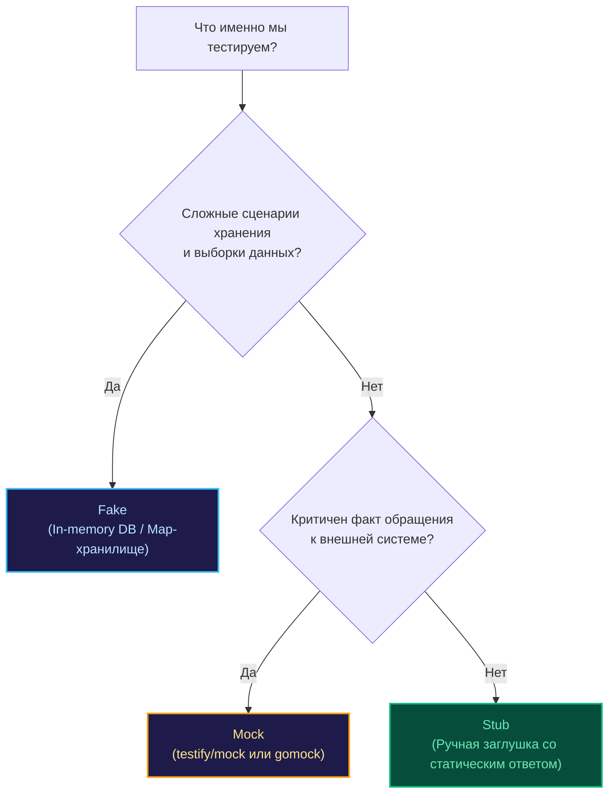

В инженерном фольклоре короткое слово «мок» давно превратилось в неформальный зонтичный термин для любого заменителя внешних зависимостей. Нередко можно услышать: «Замокай базу данных», «Замокай таймер», «Замокай почтовый сервис». Однако на уровне Senior-инженера и системного архитектора терминологическая небрежность неизбежно ведет к концептуальным ошибкам в проектировании тестовых наборов.

В фундаментальной монографии Джерарда Месароша *«xUnit Test Patterns»* (позже популяризированной Мартином Фаулером) введено строгое понятие **Test Double (Тестовый дублер)** по аналогии с дублерами и каскадерами в кинематографе. В реальной бэкенд-разработке на Go мы непрерывно оперируем тремя главными категориями: **Stubs**, **Mocks** и **Fakes**. 

Принципиальная разница между ними заключается не в синтаксисе написания, а в **способе верификации и направлении потока данных**.

---

## 1. Stub (Заглушка): Состояние важнее поведения

**Stub** — это пассивный дублер, единственная миссия которого — поставлять в тестируемый алгоритм предопределенные входные данные (Indirect Inputs). Заглушка не интересуется тем, сколько раз к ней обратились, в каком порядке и с какими аргументами: ее задача — просто вернуть то, что требуется вызывающему коду для продолжения работы.

* **Архитектурный фокус:** Подготовка входящего контекста.
* **Методика проверки (Assert):** Мы проверяем исключительно *состояние целевого сервиса* или возвращенный им результат. Заглушка не содержит ассертов.
* **Пример в Go:** Лаконичная структура, где метод безусловно выполняет `return 100, nil`.

```go
// Это классический Stub. Мы не проверяем факт или частоту его вызова.
// Нам необходимо лишь гарантировать наличие баланса для тестирования списания.
stubRepo := &MyRepoStub{balance: 100}
service := NewService(stubRepo)

err := service.Transfer(42, 10) // Тестируем доменную логику перевода средств

require.NoError(t, err)
// Верифицируем состояние бизнес-объекта, а не поведение дублера!
```

---

## 2. Mock (Мок): Поведение важнее состояния

**Mock** — это активный дублер с запрограммированным протоколом ожиданий (Expectations). В отличие от стаба, мок ориентирован на контроль исходящих воздействий (Indirect Outputs). Он строго фиксирует, какие методы были вызваны, сколько раз, с какими аргументами и в какой хронологической последовательности.

* **Архитектурный фокус:** Проверка сайд-эффектов и контракта взаимодействия.
* **Методика проверки (Assert):** Тест завершается сбоем, если реальные вызовы отклонились от зарегистрированных ожиданий.
* **Пример в Go:** Использование генераторов `gomock` или библиотеки `testify/mock` с методами `EXPECT()` или `On().Once()`.

```go
// Это строгий Mock. Наша цель — убедиться, что событие реально ушло во внешний шлюз.
mockEmail := new(MockEmailService)
mockEmail.On("Send", "admin@test.com", mock.Anything).Return(nil).Once()

service := NewService(mockEmail)
service.NotifyAdmin()

mockEmail.AssertExpectations(t) // Верификация строгого протокола взаимодействия
```

---

## 3. Fake (Фейк): Упрощенная реальность

**Fake** — это полноценно функционирующий компонент, обладающий реальной внутренней логикой сохранения и обработки состояния, но реализованный по упрощенной схеме и непригодный для промышленной эксплуатации.

* **Архитектурный фокус:** Имитация сложной подсистемы целиком в оперативной памяти без сетевого и дискового оверхеда.
* **Пример в Go:** Легковесный репозиторий на базе конкурентной мапы вместо кластера `PostgreSQL` или встраиваемая `SQLite` вместо промышленной СУБД `Oracle`.

```go
// Это Fake. Внутри него крутится реальная логика добавления и поиска,
// но данные сохраняются в оперативной памяти процесса (RAM).
fakeRepo := NewInMemoryUserRepo()
service := NewService(fakeRepo)

service.Register("alice")
user, err := fakeRepo.Find("alice") // Фейк реально сохранил запись и вернул ее

require.NoError(t, err)
assert.Equal(t, "alice", user.Name)
```

> [!tip] Собеседование
> **Вопрос:** В чем заключается главный архитектурный риск активного использования Fakes (фейковых реализаций) в тестах?  
> **Ответ:** Фундаментальная угроза — **рассинхронизация логики (Implementation Drift)**. Если бизнес-логика вашего `InMemoryRepo` со временем начнет вести себя иначе, чем реальный сервер `PostgreSQL` (например, при обработке уникальных составных индексов, каскадных удалений, коллизий транзакций или регистрозависимого поиска), ваши тесты останутся безупречно «зелеными», однако в продакшне сервис упадет с фатальной ошибкой. Поддержание фейков требует высокой дисциплины и регулярной сверки с интеграционными тестами.

---

## Сравнительная таблица

| Тип дублера | Первичная задача | Предмет проверки (Assert) | Сложность поддержки |
| :--- | :--- | :--- | :--- |
| **Stub** | Подставить входящие данные | Результат вызова бизнес-функции | Минимальная |
| **Mock** | Проконтролировать исходящий вызов | Протокол и параметры самого дублера | Средняя (требует тулинга) |
| **Fake** | Эмулировать поведение системы | Финальное состояние хранилища в памяти | Высокая (своя реализация) |
| **Spy** | Протоколировать факты вызовов | Сохраненный лог вызовов постфактум | Средняя |

---

## Mechanical Sympathy: Когда что выбирать?

Для проектировщика распределенных систем выбор категории дублера — это всегда осознанный компромисс между **скоростью прогона**, **детерминизмом** и **хрупкостью к рефакторингу**:

1. **Выбирайте Stubs**, когда тестируете чистые вычислительные алгоритмы, пайплайны обработки данных и бизнес-правила, которым просто необходим исходный контекст. Это самые быстрые, надежные и устойчивые к рефакторингу тесты.
2. **Выбирайте Mocks**, когда ключевой смысл тестируемого сценария заключается в обязательном порождении внешнего побочного эффекта (публикация платежа в Kafka, отправка SMS через внешний шлюз, сброс кэша). Однако помните: избыток моков ведет к эффекту хрупких тестов (Fragile Tests) — любая оптимизация порядка вызовов ломает ассерты.
3. **Выбирайте Fakes**, когда сценарий охватывает сложный жизненный цикл доменных сущностей (создание заказа, смена статусов, выборка с фильтрацией). Фейк позволяет писать тесты, которые выглядят как обычный выразительный Go-код без бесконечных цепочек `On(...).Return(...)`.



> [!warning] Ловушка / Gotcha: Mocking Fakes
> Категорически избегайте попыток мокировать фейки. Если вы передали в тест полноценный `InMemoryRepo`, никогда не пишите над ним конструкции вида `mock.On("Save").Return(nil)`. Фейк самодостаточен: он обязан выполнять реальные операции над своими внутренними структурами. Попытка скрестить мок и фейк порождает неподдерживаемого архитектурного мутанта.

---

## Итог

1. **Stub** поставляет данные в систему (Indirect Inputs) — мы проверяем результат работы функции, а не саму заглушку.
2. **Mock** верифицирует протокол взаимодействия (Indirect Outputs) — тест проверяет сам факт, частоту и аргументы вызовов.
3. **Fake** моделирует рабочее состояние в памяти (In-Memory) — обеспечивает реалистичное окружение без сетевого оверхеда.
4. Применяйте подходящий инструмент под конкретный сценарий: не забивайте простые гвозди (Stubs) сложными фреймворками кодогенерации (Mocks).

Чрезмерное увлечение моками и дотошная проверка каждого внутреннего шага приводят к тому, что тесты перестают верифицировать поведение системы и начинают парализовать любой рефакторинг.

О том, как вовремя распознать эту патологию и уберечь проект от деградации, мы поговорим в следующей главе: [[7. Overmocking как анти паттерн]].