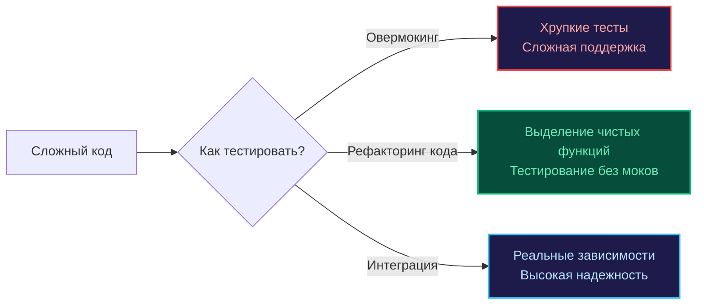

Завершая детальный разбор моков, мы обязаны остановиться перед самым коварным психологическим и архитектурным капканом, в который с завидной регулярностью попадают даже опытные разработчики. 

Этот синдром называется **Overmocking (избыточное мокирование)**. Это патологическое состояние кодовой базы, когда тесты настолько жестко и детально привязываются к внутреннему устройству дублеров и приватным вызовам, что полностью утрачивают свое первоначальное предназначение — давать уверенность в корректности и надежности функционирования системы.

Если вы ловите себя на мысли, что малейшее косметическое переименование метода, оптимизация цикла или изменение порядка двух независимых инструкций (при абсолютно неизменном бизнес-результате функции) ведут к каскадному падению десятков тестов — вы столкнулись с классическим синдромом «хрупких тестов» (Fragile Tests).

---

## Суть проблемы: Тестирование реализации вместо поведения

Фундаментальный постулат надежного тестирования гласит: **качественный тест обязан рассматривать тестируемый модуль как «черный ящик»**. Мы передаем входные параметры через публичный интерфейс и верифицируем результирующее состояние или возвращенное значение.

Овермокинг превращает тест в назойливого контролера («прозрачный ящик»), который неотрывно следит за каждым внутренним шагом функции, проверяя не *что* сделано, а *каким именно способом*.

### Признаки Overmocking

1. **Раздутый Setup:** Блок предварительной конфигурации моков (`On().Return()`) занимает от 70% до 80% всего текста теста, заслоняя саму суть бизнес-сценария.
2. **Искусственная завязка на порядок:** Тест падает, если вы поменяли местами вызов логгера и сборщика метрик, хотя для доменной логики их взаимный порядок абсолютно индифферентен.
3. **Мокирование собственных внутренних компонентов:** Разработчик начинает мокать структуры и хелперы, расположенные в том же самом пакете, вместо их естественного совместного тестирования.
4. **Мокирование простых структур данных:** Вместо прямого создания экземпляра DTO, структуры конфигурации или Value Object в памяти, программист конструирует для них интерфейс и генерирует мок.

---

## Почему это плохо? (Engineering Impact)

### 1. Ложное чувство безопасности

Моки всегда покорно возвращают ровно те байты, которые вы в них запрограммировали. Если вы превратно поняли спецификацию сторонней платежной системы и заложили эту ошибку в ожидания мока, ваш CI-пайплайн будет сиять успокаивающим зеленым цветом, в то время как боевой сервис в продакшне начнет терять транзакции клиентов.

### 2. Препятствие для рефакторинга

Каноническое определение рефакторинга по Мартину Фаулеру — это изменение *внутренней структуры* программного обеспечения без изменения его *наблюдаемого внешнего поведения*. Тесты с овермокингом намертво цементируют реализацию. В результате инженеры панически боятся оптимизировать или упрощать код, осознавая, что малейшая правка заставит их полдня переписывать сотни хрупких моков. Тесты из союзника превращаются в тормоз развития проекта.

### 3. Потеря смысла (Tautological Tests)

Тест превращается в бессмысленную тавтологию:
* **Рабочий код:** Вызвать функцию `A()`, затем вызвать функцию `B()`.
* **Тест:** Проверить, что код вызвал функцию `A()`, а затем вызвал функцию `B()`.

Такой тест не выявляет логических дефектов. Он лишь подтверждает тривиальный факт: программист способен скопировать последовательность вызовов из файла `.go` в файл `_test.go`.

---

## Как бороться с овермокингом: Стратегии Senior-инженера

### 1. Используйте реальные объекты для простых данных

Если зависимость представляет собой простую структуру (DTO, Value Object, конфигурационную мапу), ее категорически не нужно прятать за интерфейсом и мокать. Создайте реальный экземпляр структуры. В Go создание структуры на стеке или в куче происходит за единицы наносекунд — процессор выполнит эту операцию в тысячи раз быстрее, чем сработает рефлексия мок-фреймворка.

### 2. Фокус на результатах, а не на вызовах

Вместо маниакальной проверки того, что метод `repo.Save()` был вызван с определенными аргументами, сфокусируйтесь на наблюдаемом результате через публичный API. Если вместо моков вы используете архитектурный паттерн **Fake** (о котором мы говорили в главе [[6. Fake vs mock vs stub]]), вы можете напрямую проверить, что сущность действительно сохранилась во внутреннем слайсе памяти фейка.

### 3. Интеграционные тесты как альтернатива

Вместо попыток воспроизвести сложное поведение СУБД (транзакции, блокировки строк, каскадные внешние ключи) через паутину моков, поднимите реальный временный экземпляр базы данных в легковесном Docker-контейнере через библиотеку [[4. testcontainers go]]. Это обеспечит 100% уверенность в работоспособности SQL-запросов, которую никакой искусственный мок дать не способен.

### 4. Мокайте только "границы" (I/O)

Строгому мокированию подлежат исключительно те элементы системы, которые находятся за пределами вашего прямого контроля либо вносят недетерминированные задержки:
* Сторонние внешние HTTP/gRPC API (платежные шлюзы, внешние провайдеры аутентификации).
* Физическая отправка Email и SMS через внешние транспорты.
* Крупные распределенные платформы (очереди Kafka, объектные хранилища S3).

> [!tip] Собеседование
> **Вопрос:** Как на архитектурном ревью безошибочно определить, что интерфейс был создан искусственно исключительно «ради тестов», ухудшая дизайн системы?  
> **Ответ:** Классический маркер плохого дизайна — интерфейс, имеющий в проекте ровно одну рабочую реализацию и ровно одну тестовую (мок), при этом не служащий границей модулей и не обеспечивающий расширение архитектуры плагинами. В Go канонический подход формулируется так: начинайте с конкретных типов и структур данных, а интерфейс выделяйте лишь тогда, когда возникает физическая потребность в полиморфизме или изоляции тяжелого сетевого ввода-вывода.

---

## Mechanical Sympathy: Рефлексия и когнитивная нагрузка

С точки зрения рантайма, каждый вызов мока — это косвенная адресация, промах мимо оптимизаций инлайнинга и накладные расходы рефлексии. Но куда страшнее цена, которую платит оперативная память человеческого мозга.

> [!info] Под капотом
> При чтении теста с избыточным мокированием мозг инженера вынужден удерживать в оперативной памяти сложнейший направленный граф зарегистрированных ожиданий (`Expectations`). Когда этот ментальный граф перегружается десятками инструкций `mock.On()`, разработчик полностью теряет способность видеть саму доменную логику функции за частоколом тестовых настроек. В такой среде баги начинают гнездиться в самих тестах.

---

## Итог

1. **Мок — это хирургический инструмент изоляции**, а не универсальный строительный блок по умолчанию.
2. Верифицируйте **наблюдаемое бизнес-поведение**, а не сиюминутную последовательность приватных вызовов.
3. Необходимость настраивать 10–15 моков для одного теста — это не проблема фреймворка тестирования, а сигнал архитектурного дефекта: компонент перегружен обязанностями и требует декомпозиции на чистые функции.
4. Помните о балансе пирамиды тестирования: один честный интеграционный тест на Testcontainers часто надежнее десятка хрупких Unit-тестов с моками.

Однако в микросервисной архитектуре возникает сценарий, когда даже идеальные моки бессильны: если команда сервиса-поставщика изменила формат JSON-ответа, ваш мок останется зеленым, а интеграция на проде сломается. 

Для решения этой межсервисной дилеммы был изобретен отдельный класс тестирования. О том, как подружить распределенные сервисы без ручных моков, мы поговорим в финальной главе раздела: [[8. Contract testing]].