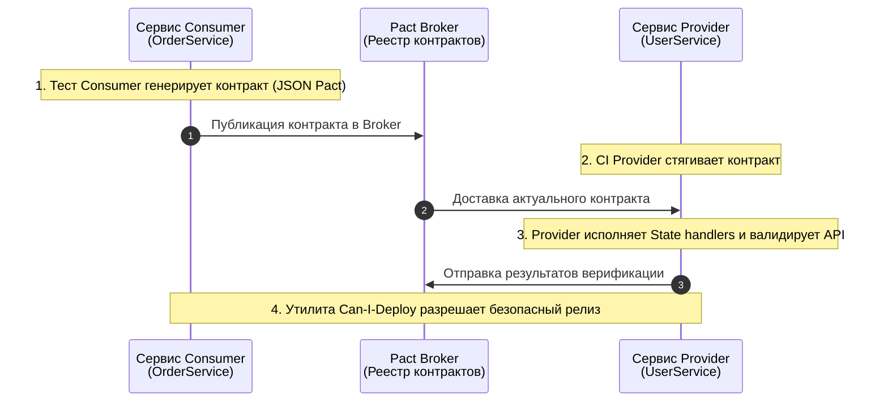

В предыдущих главах мы подробно изучили искусство изоляции программных компонентов: от рукотворных шпионов в [[3. Ручные моки]] до строгих генераторов в [[4. gomock. Генерация моков]], а в главе [[7. Overmocking как анти паттерн]] предостерегли от превращения тестов в хрупкую тавтологию.

Однако в распределенной микросервисной архитектуре существует коварная фундаментальная проблема, перед которой классические Unit-тесты с моками оказываются бессильны: **проблема согласованности контрактов и рассинхронизации дублеров (Mock Drift)**.

Представьте два независимых микросервиса: `OrderService` (Потребитель, Consumer) и `UserService` (Поставщик данных, Provider). Команда `OrderService` написала образцовые модульные тесты, замокав HTTP-ответы `UserService`. Но однажды разработчики `UserService` выпускают новую версию API, переименовывая поле `user_id` в `uuid`. 

Что произойдет в CI-пайплайне? Тесты `OrderService` останутся безупречно «зелеными», ведь зашитый в мок JSON по-прежнему содержит старое поле! Но как только сервис выкатится в production, реальные HTTP-запросы начнут отвечать ошибками десериализации. 

**Contract Testing (Контрактное тестирование)** — это архитектурная методология, гарантирующая, что взаимодействующие сервисы «говорят на одном языке» и сохраняют бинарную и семантическую совместимость без необходимости развертывать тяжелые, медленные и нестабильные сквозные (End-to-End) стенды.

---

## Что такое Контрактное тестирование?

Контрактное тестирование проверяет не внутреннюю бизнес-логику сервиса, а **строгое соблюдение границы взаимодействия**. В основе лежит формализованное цифровое соглашение (контракт) между взаимодействующими сторонами:

* **Consumer (Потребитель):** Клиентский микросервис, инициирующий запросы к внешнему API.
* **Provider (Поставщик):** Сервис-сервер, обрабатывающий входящие запросы и поставляющий данные.
* **Contract (Pact):** Машиночитаемый документ (обычно в формате JSON), содержащий строгие спецификации ожидаемых HTTP-запросов (пути, заголовки, тела) и эталонных ответов.

В отличие от сквозных тестов (E2E), требующих одновременного запуска десятков сервисов и баз данных, контрактные тесты верифицируют совместимость участников изолированно друг от друга.

---

## Consumer-Driven Contracts (CDC)

Наиболее зрелым и надежным подходом в микросервисной индустрии является парадигма **Consumer-Driven Contracts** (контракты, управляемые потребителем). Ее философия лаконична: потребности того, кто потребляет данные, первичны.

### Как это работает:

1. **Генерация контракта на стороне Consumer:** Разработчик потребителя пишет тест, фиксирующий минимальные ожидания: «Если сервис отправит запрос `GET /user/1`, он рассчитывает получить HTTP-статус 200, где в теле обязательно присутствует строковое поле `name`». Тестовый фреймворк формирует артефакт контракта (Pact-файл).
2. **Публикация в репозитории контрактов:** Сгенерированный контракт загружается в централизованный реестр (например, Pact Broker) или фиксируется в Git.
3. **Верификация на стороне Provider:** На этапе CI поставщика специальный раннер считывает опубликованный контракт, отправляет реальные HTTP-запросы к локально поднятому сервису Provider и верифицирует, что возвращаемые структуры в точности удовлетворяют ожиданиям потребителя.



---

## Инструментарий для Go: Pact

Общепризнанным индустриальным стандартом для контрактного тестирования в экосистеме Go является библиотека **Pact** (`github.com/pact-foundation/pact-go`).

### Пример на стороне Consumer:

```go
package client_test

import (
    "fmt"
    "testing"

    "github.com/pact-foundation/pact-go/dsl"
    "github.com/stretchr/testify/assert"
)

type User struct {
    Name string `json:"name"`
}

func TestConsumer(t *testing.T) {
    // 1. Инициализируем спецификацию контракта
    pact := dsl.Pact{
        Consumer: "OrderService",
        Provider: "UserService",
    }
    defer pact.Teardown()

    // 2. Декларируем контракт взаимодействия
    pact.
        AddInteraction().
        Given("User 1 exists").
        UponReceiving("A request for User 1").
        WithRequest(dsl.Request{
            Method: "GET",
            Path:   dsl.String("/user/1"),
        }).
        WillRespondWith(dsl.Response{
            Status: 200,
            // Метод Like валидирует соответствие типов, а не точное совпадение строковых литералов
            Body: dsl.Like(User{Name: "Alice"}),
        })

    // 3. Запускаем локальный тестовый HTTP-сервер Pact и валидируем код клиента
    err := pact.Verify(func() error {
        client := NewClient(fmt.Sprintf("http://localhost:%d", pact.Server.Port))
        user, err := client.GetUser("1")
        if err != nil {
            return err
        }
        assert.Equal(t, "Alice", user.Name)
        return nil
    })
    assert.NoError(t, err)
}
```

---

## Почему это лучше интеграционных тестов?

| Архитектурный критерий | Сквозные тесты (E2E) | Контрактные тесты (Pact) |
| :--- | :--- | :--- |
| **Скорость выполнения** | Медленные (минуты и часы на поднятие стендов) | Сверхбыстрые (секунды, скорость Unit-тестов) |
| **Стабильность прогона** | Хрупкие (падения из-за сетевых флуктуаций) | Абсолютно детерминированные и изолированные |
| **Локализация дефекта** | Мучительный поиск: в каком из 20 сервисов сбой | Мгновенная улика: точно указано нарушенное поле |
| **Масштабирование сложности** | Экспоненциальный рост ($O(N^2)$ от числа сервисов) | Линейный рост ($O(N)$ контрактов) |

---

## Mechanical Sympathy: Типизация в Go и контракты

Язык Go славится строгой статической типизацией, защищающей программиста от ошибок несоответствия типов на этапе компиляции. Однако эта защита работает лишь в пределах памяти **одного скомпилированного бинарника**. 

Как только данные сериализуются в JSON и улетают по TCP-сокету в другой процесс, строгая типизация растворяется.

> [!info] Под капотом
> Фреймворк Pact внутри Go активно использует пакет `reflect` для рекурсивного анализа структур и динамической генерации промежуточных JSON-схем.  
> При верификации на стороне сервиса Provider библиотека не просто сравнивает текстовые строки, а выполняет математическую валидацию типов на уровне абстрактного синтаксиса: она гарантирует, что поле, ожидаемое потребителем как `string`, физически не придет в виде числового значения `int` или массива.

---

## Ловушки контрактного тестирования

Контрактное тестирование требует от команды зрелой культуры:

1. **Попытка тестировать бизнес-логику:** Контракт не должен проверять, правильно ли банковский калькулятор начислил проценты по кредиту. Контракт верифицирует исключительно **форму и протокол данных**: статус-коды, маршруты, наличие обязательных ключей и их разрядность.
2. **Дисциплина версионирования и релизов:** Если вы изменили контракт, вы не имеете права вслепую выкатывать обновленный Provider в production. Для оркестрации релизов в CI/CD внедряется CLI-утилита **Can-I-Deploy**, проверяющая по матрице в Pact Broker, что абсолютно *все* зависимые потребители уже совместимы с новой версией.
3. **Управление предусловиями через State handlers:** Чтобы поставщик мог успешно ответить на контрактный запрос (например, для сценария `Given("User 1 exists")`), его тестовый контур обязан уметь приводить себя в требуемое состояние. Для этого в коде Provider конфигурируются специализированные обработчики состояний (`State handlers`), подготавливающие тестовые записи в базе данных перед каждым прогоном.

> [!tip] Собеседование
> **Вопрос:** В чем принципиальная разница между Контрактным тестированием (Pact) и валидацией через статические спецификации OpenAPI / JSON Schema?  
> **Ответ:** Спецификация JSON Schema или схема OpenAPI является статическим документом, описывающим *потенциально возможную* форму данных. Она ничего не знает о том, какие именно эндпоинты и поля фактически использует конкретный клиент.  
> Контрактное тестирование проверяет **живое поведение в контексте конкретного пользовательского сценария**: точный URL, заголовки, параметры и тело. Но главное отличие — двусторонняя обратная связь: Pact Broker формирует строгую матрицу совместимости, физически блокируя деплой поставщика в CI, если его изменения ломают хотя бы одного активного потребителя.

---

## Итог

1. **Contract Testing** окончательно устраняет проблему «дрейфа моков», при которой изолированные тесты остаются зелеными при сломанной реальной интеграции.
2. Подход **Consumer-Driven Contracts** позволяет сервисам-потребителям открыто декларировать свои минимально необходимые ожидания от поставщиков.
3. Библиотека **Pact** для Go переносит преимущества строгой типизации `string` и `int` через границы сетевых интерфейсов JSON.
4. Контракт верифицирует не сложную бизнес-логику, а совместимость интерфейсов взаимодействия, открывая путь к независимому и безопасному развертыванию микросервисов.

Мы полностью завершили масштабный раздел, посвященный мокам, дублерам и интерфейсным контрактам. Теперь в нашем арсенале есть весь спектр средств изоляции программных компонентов.

Но как быть, когда нам требуется проверить сервис в реальных боевых условиях — с настоящей базой данных, живыми транзакциями и дисковым хранилищем?

Мы открываем фундаментальный блок реального тестирования бэкенда. 

Следующая глава: [[1. Что такое integration тесты]].