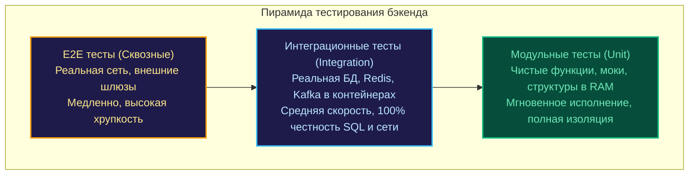

## Интеграционные тесты: Когда Unit-тесты начинают лгать

Представьте знакомую каждому практикующему инженеру драму: вы написали безупречный набор модульных тестов. Все моки и дублеры настроены до миллиметра, тестовое покрытие перевалило за 95%, а CI-пайплайн радостно переливается изумрудным светом. Вы нажимаете заветную кнопку деплоя в production, и... спустя три секунды мониторинг вспыхивает багровыми алертами.

Почему система потерпела крушение, если все тесты были «зелеными»?

Причина проста и безжалостна: ваша SQL-инструкция `ON CONFLICT` при реальном выполнении в PostgreSQL столкнулась с тонкостями составного уникального индекса, о которых вы даже не подозревали при конфигурировании мока. Или пул соединений базы данных исчерпал лимит дескрипторов сокетов под первой же минимальной нагрузкой.

**Интеграционное тестирование** — это процесс верификации того, как разнородные подсистемы (доменные модули, транзакционные хранилища данных, кэши, брокеры сообщений и внешние сетевые шлюзы) взаимодействуют в реальной физической среде. Если Unit-тесты инспектируют отдельные «клетки» программного организма в лабораторном вакууме, то интеграционные тесты проверяют его «нервную систему» и «кровоток».



---

## Unit vs. Integration: В чем разница?

В промышленном бэкенде на Go грань между типами тестов порой кажется размытой, однако с инженерной точки зрения фундаментальные различия носят качественный характер:

| Архитектурная характеристика | Unit-тесты | Интеграционные тесты |
| :--- | :--- | :--- |
| **Степень изоляции** | Полная (внешний мир отсечен через интерфейсы и моки) | Минимальная (подключаются реальные системные зависимости) |
| **Скорость выполнения** | Микросекунды и миллисекунды (такты CPU) | Секунды или десятки секунд (сетевой стек, диск, ОС) |
| **Первопричина сбоя** | Ошибка в чистой алгоритмической логике функции | Ошибка в SQL-диалекте, миграциях, сетевом контракте или ОС |
| **Сложность инфраструктуры** | Нулевая (запуск локального бинарника компилятором) | Высокая (требуется поднятие окружения и контейнеров) |

---

## Зачем они нужны, если есть моки?

Как мы подробно разбирали в разделе [[1. Mocking. Основы]], любые моки — это лишь наши **субъективные ментальные модели** того, как устроена внешняя среда. Однако реальные сервисы и операционная система обладают неприятным свойством опровергать наши иллюзии:

* **Реляционные базы данных:** Каскадные внешние ключи, транзакционные уровни изоляции, блокировки строк, поведение триггеров и специфические особенности диалектов (например, радикальные различия в обработке блокировок и синтаксисе между MySQL и PostgreSQL).
* **Сетевой стек операционной системы:** Настройки TLS-рукопожатий, парсинг заголовков HTTP, таймауты TCP Keep-Alive и лимиты буферов на размер тела запроса.
* **Файловая система и ядро Linux:** Права доступа к сокетам, лимиты дескрипторов файлов (`ulimit -n`), поведение системных вызовов `fsync`.

Интеграционные тесты превращают шаткие гипотезы разработчика в железобетонную инженерную уверенность.

---

## Стратегии интеграционного тестирования в Go

В практике проектирования Go-сервисов выделяют три ключевых паттерна организации интеграционных проверок:

### 1. Тестирование "Швов" (Persistence Integration)

Верификация корректности взаимодействия уровня доступа к данным (Repository / DAO) с реальной СУБД. Это самый массовый и востребованный класс тестов в бэкенде. Здесь мы принципиально не мокаем `sql.DB`, а подключаемся к реальной изолированной базе данных, запущенной в Docker-контейнере через библиотеку [[4. testcontainers-go]].

### 2. Внутрисистемная интеграция

Проверка согласованной совместной работы нескольких доменных слоев одного монолита или сервиса без внешних сетевых границ. Например, сценарий верифицирует, что вызывающий сервис `ServiceA` корректно обращается к транзакционному менеджеру `ServiceB`, корректно пробрасывая контекст с таймаутом и доменные ошибки.

### 3. Межсистемная интеграция (Contract-based)

Проверка сетевого взаимодействия вашего сервиса со сторонними веб-службами или микросервисами по протоколам HTTP/REST или gRPC. Вместо грубого мокирования сетевых сокетов на стороне клиента поднимается легковесный HTTP-сервер, воспроизводящий контрактные ответы и задержки внешней системы.

---

> [!info] Mechanical Sympathy: Время запуска (Boot time)
> Почему инженеры Go так трепетно относятся к Unit-тестам и порой с опаской смотрят на интеграционные сьюты?  
> Причина кроется в психологии обратной связи (Feedback Loop). Компилятор Go компилирует код со скоростью мысли, и пакетный запуск тысячи модульных проверок через `go test` занимает считанные доли секунды.  
> Интеграционный тест неизбежно требует времени: инициализация сокетов ядра Linux, запуск демона Docker, старт контейнера, применение файлов миграций схемы и прогрев пула соединений. Это увеличивает время прогона до десятков секунд. Задача архитектора качества — минимизировать время старта интеграционных тестов за счет пулинга контейнеров, параллельных подтестов и оптимизации миграций в памяти.

---

## Как Go понимает, что тест — интеграционный?

Стандартный раннер `testing` не навязывает жестких соглашений о разделении тестов на быстрые и медленные. Чтобы тяжелые инфраструктурные тесты не тормозили локальную разработку при каждой компиляции, в Go-сообществе каноническим стандартом стало использование **тегов сборки (Build Tags)**.

Тег сборки указывает компилятору Go полностью игнорировать файл при стандартном запуске `go test ./...`.

**Пример структуры файла `postgres_test.go`:**

```go
//go:build integration
// +build integration

package db_test

import "testing"

func TestRealPostgres(t *testing.T) {
    // Этот тест физически не будет скомпилирован и запущен,
    // пока разработчик или CI-пайплайн явно не передаст флаг:
    // go test -tags=integration ./...
}
```

Благодаря тегам сборки разработчик на локальном ноутбуке получает мгновенный отклик от быстрых Unit-тестов за 300 миллисекунд, а полный интеграционный контур разворачивается автоматически в CI-пайплайне или по специальной команде Makefile.

---

## Итог

1. **Интеграционные тесты** исследуют целостность взаимодействия модулей и внешних систем, защищая от фатальных ошибок в SQL-запросах, сетевых таймаутах и межсервисных контрактах.
2. Моки моделируют лишь наши предположения о поведении зависимостей; интеграционные тесты верифицируют физическую реальность.
3. Это стратегический фундамент пирамиды тестирования: они требуют больше вычислительных ресурсов, чем юниты, но устраняют пропасть между кодом и продакшном.
4. Разделяйте быстрые и медленные тесты с помощью директив **Build Tags** (`//go:build integration`), сохраняя мгновенную скорость итераций локальной разработки.

Интеграция с реляционными СУБД — это сердце бэкенда. О том, как профессионально организовать взаимодействие с базой данных в тестах, не превратив базу в свалку мусорных записей, мы поговорим в следующей главе: [[2. Работа с базой данных в тестах]].