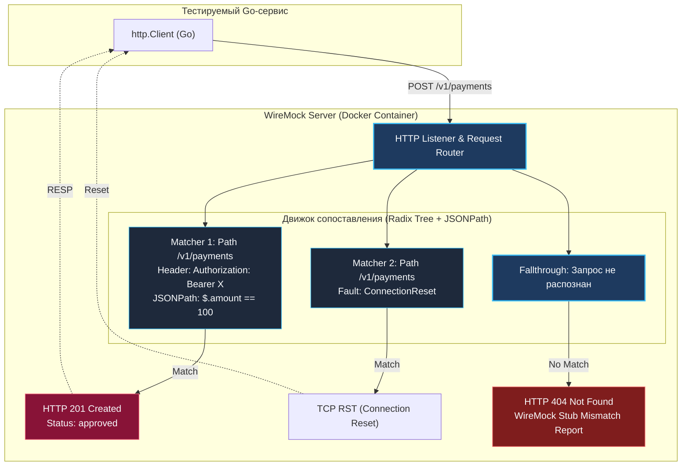

## Управление хаосом: Когда httptest.Server уже недостаточно

В предыдущей главе [[9. Тестирование внешних API]] мы сформулировали фундаментальный принцип: мокирование интерфейсов сетевых клиентов маскирует ошибки сериализации и протокола, поэтому идиоматичный подход в Go — запуск локального веб-сервера через `httptest.NewServer` с переопределением базового адреса (`BaseURL`).

Этот подход безупречно справляется со своей задачей, пока ваш сервис взаимодействует с одним или двумя простыми эндпоинтами. Однако в реальной enterprise-архитектуре сервисы редко бывают столь компактными. 

Представьте типичный оркестратор заказов в электронной коммерции:
1. Он проверяет JWT-токен в сервисе авторизации (`/oauth/verify`).
2. Запрашивает резервирование товаров на складе (`/inventory/reserve`).
3. Обращается к платежному шлюзу для холдирования средств (`/v1/payments`).
4. Формирует накладную в CRM-системе.
5. Инициирует отправку уведомления клиенту через внешний шлюз рассылок.

Если попытаться сымитировать все эти интеграции через один самописный `httptest.Server`, функция `http.HandlerFunc` стремительно деградирует в гигантский, трудноподдерживаемый лабиринт из громоздких конструкций `switch-case` по путям запросов, ручного парсинга заголовков и сопоставления JSON-схем. Разработчик перестает писать тесты и начинает с нуля изобретать собственный несовершенный mock-сервер.

Для управления подобной сложностью в индустрии выработан стандарт **декларативного мокирования протокола HTTP (Declarative HTTP Mocking)**, лидером которого является **WireMock**.

---

## Что такое WireMock?

**WireMock** — это автономный, промышленный HTTP-сервер, поведение которого описывается не императивным процедурным кодом, а декларативными правилами соответствия (**Stubs & Matchers**) в формате JSON или через типизированный программный API.

Вместо написания логики роутинга инженер формулирует четкое правило-контракт:  
*«Если на сервер поступает запрос с методом POST на путь `/v1/payments`, в заголовках присутствует `Authorization: Bearer X`, а внутри тела запроса JSONPath-выражение `$.amount` равно числу `100` — ответь со статусом `201 Created`, задержкой в 200 миллисекунд и строго определенным JSON-телом ответа»*.

> [!info] Под капотом: Движок матчинга
> В отличие от легковесного `httptest`, где сетевой запрос сразу передается в скомпилированную функцию Go в оперативной памяти, WireMock (работающий на платформе JVM) устроен как высокопроизводительный конечный автомат:
> 
> При получении HTTP-фрейма входящий запрос прогоняется через префиксное дерево (**Radix Tree**) зарегистрированных заглушек (Stubs). Для анализа структуры тела запроса движок на лету компилирует регулярные выражения и пути **JSONPath**.
> 
> **Mechanical Sympathy:** Из-за сетевого взаимодействия с контейнером и затрат на разбор JSONPath WireMock имеет больший накладной расход по задержкам (единицы миллисекунд на запрос против десятков микросекунд у `httptest.NewServer`). Но взамен мы получаем колоссальный выигрыш в скорости проектирования тестов и читаемости тестового кода (Developer Velocity).



---

## Интеграция WireMock в Go через Testcontainers

Идиоматичный способ интеграции WireMock в Go-проектах — запуск контейнера с помощью официального модуля из `testcontainers-go` в комбинации с клиентом управления `github.com/wiremock/go-wiremock`.

Создадим изолированную тестовую среду:

```go
package integration_test

import (
	"context"
	"net/http"
	"testing"

	"github.com/stretchr/testify/require"
	"github.com/testcontainers/testcontainers-go"
	"github.com/testcontainers/testcontainers-go/modules/wiremock"
	wiremock_client "github.com/wiremock/go-wiremock"
)

// setupWireMock разворачивает контейнер WireMock и инициализирует управляющий REST-клиент
func setupWireMock(t *testing.T) (*wiremock_client.Client, string) {
	t.Helper()
	ctx := context.Background()

	// Поднимаем официальный легковесный контейнер WireMock
	container, err := wiremock.RunContainer(ctx,
		testcontainers.WithImage("wiremock/wiremock:3.3.1"),
	)
	require.NoError(t, err, "не удалось запустить контейнер WireMock")

	// Регистрируем гарантированную остановку и удаление контейнера
	t.Cleanup(func() {
		_ = container.Terminate(ctx)
	})

	// Извлекаем динамический HTTP endpoint, назначенный Docker-демоном
	url, err := container.PortEndpoint(ctx, "8080", "http")
	require.NoError(t, err)

	// Создаем Go-клиент для декларативной отправки стабов по HTTP API
	client := wiremock_client.NewClient(url)

	return client, url
}
```

А теперь напишем выразительный интеграционный тест, проверяющий обработку платежа с валидацией полезной нагрузки:

```go
func TestBillingService_ProcessPayment_Success(t *testing.T) {
	t.Parallel()

	// Поднимаем инфраструктуру WireMock
	wmClient, wmURL := setupWireMock(t)

	// 1. Arrange: Декларативно конфигурируем ожидание внешнего запроса
	stub := wiremock_client.Post(wiremock_client.URLPathEqualTo("/v1/payments")).
		WithHeader("Authorization", wiremock_client.EqualTo("Bearer X")).
		// Проверяем тело запроса через точечное JSONPath выражение
		WithBodyPattern(wiremock_client.MatchesJsonPath("$.amount", wiremock_client.EqualTo("100"))).
		WillReturn(
			`{"id": "pay_987", "status": "approved"}`,
			map[string]string{"Content-Type": "application/json"},
			http.StatusCreated,
		)

	// Регистрируем стаб в движке WireMock
	err := wmClient.StubFor(stub)
	require.NoError(t, err)

	// 2. Act: Инициализируем наш боевой платежный сервис с адресом мок-сервера
	billingService := billing.NewService(wmURL, "Bearer X")
	paymentID, err := billingService.CreatePayment(context.Background(), 100)

	// 3. Assert: Верифицируем бизнес-результат
	require.NoError(t, err)
	require.Equal(t, "pay_987", paymentID)

	// 4. Verification: WireMock позволяет строго проверить, что запрос действительно ушел по сети
	verified, err := wmClient.Verify(stub.Request(), 1)
	require.NoError(t, err)
	require.True(t, verified, "Сервис обязан был совершить ровно один HTTP-вызов к /v1/payments")
}
```

---

## Stateful сценарии: Тестирование ретраев

Одна из сложнейших задач при проверке распределенной логики — тестирование механизмов повторных попыток (**Retries with Exponential Backoff**). 

Как надежно проверить, что клиент при первом вызове сталкивается с временной недоступностью шлюза (`HTTP 503 Service Unavailable`), выдерживает паузу, повторяет попытку и успешно получает результат со статусом `200 OK`? 

Написание такого сценария на базе стандартного `httptest` требует создания глобальных потокобезопасных счетчиков и мьютексов. В WireMock для этого существует нативная машина состояний — **Scenarios**.

```go
func TestService_RetryOnTransientFailure(t *testing.T) {
	t.Parallel()
	wmClient, wmURL := setupWireMock(t)

	// Шаг 1: Начальное состояние. Первый запрос завершается ошибкой 503
	// и автоматически переключает сценарий в состояние "Retry_Success"
	stubFail := wiremock_client.Get(wiremock_client.URLEqualTo("/api/data")).
		InScenario("Retry_Scenario").
		WhenScenarioStateIs(wiremock_client.ScenarioStateStarted).
		WillSetStateTo("Retry_Success").
		WillReturn("", nil, http.StatusServiceUnavailable)

	// Шаг 2: Повторный запрос в состоянии "Retry_Success" отдает 200 OK
	stubSuccess := wiremock_client.Get(wiremock_client.URLEqualTo("/api/data")).
		InScenario("Retry_Scenario").
		WhenScenarioStateIs("Retry_Success").
		WillReturn(`{"data": "ok"}`, map[string]string{"Content-Type": "application/json"}, http.StatusOK)

	require.NoError(t, wmClient.StubFor(stubFail))
	require.NoError(t, wmClient.StubFor(stubSuccess))

	// Исполняем клиентский код, снабженный логикой повторных попыток
	service := client.NewDataService(wmURL)
	data, err := service.FetchDataWithRetry(context.Background())

	// Тест будет зеленым только в том случае, если клиент пережил 503 и повторил вызов!
	require.NoError(t, err)
	require.Equal(t, "ok", data.Status)
}
```

---

## Fault Injection: Инженерия хаоса

В боевом окружении под управлением Linux и Kubernetes серверы не просто возвращают красивые HTTP-ошибки. Сеть ненадежна: сокеты сбрасываются ядром, оптоволокно переживают экскаваторы, а буферы переполняются.

WireMock поддерживает внедрение низкоуровневых транспортных аномалий (**Fault Injection**):

> [!warning] Ловушка / Gotcha: Тестирование таймаутов
> Банальная эмуляция долгого ответа через задержку сервера — недостаточная проверка сетевой устойчивости. 
> Внешний сервер может вести себя изощренно:
> 1. **Empty Response (Connection Reset):** сервер резко рвет соединение сразу после получения заголовков (пакет TCP RST).
> 2. **Malformed Response (Garbage Bytes):** сервер присылает случайный мусор вместо HTTP-заголовков, что приводит к системной ошибке `net/http: server closed idle connection` или сбою парсинга протокола.
> 3. **Chunked Dribble Delay (Атака типа Slowloris):** сервер отдает статус-код немедленно, но тело ответа пересылает по одному байту каждые несколько секунд. Если ваш HTTP-клиент настроил только `ResponseHeaderTimeout`, он будет обманут: заголовки получены вовремя, а чтение тела зависнет на минуты! Защититься от этого позволяет только полный таймаут контекста `context.WithTimeout`, оборачивающий весь процесс чтения `io.ReadAll(resp.Body)`.

Эмуляция сетевого обрыва (Connection Reset by Peer):

```go
// Настраиваем WireMock на мгновенный сброс TCP-соединения
stubChaos := wiremock_client.Get(wiremock_client.URLEqualTo("/api/unstable")).
	WillReturnFault(wiremock_client.FaultConnectionResetByPeer)

require.NoError(t, wmClient.StubFor(stubChaos))

service := client.NewDataService(wmURL)
_, err := service.FetchData(context.Background())

// Наш клиент должен перехватить ошибку транспортного уровня и корректно вернуть ошибку
require.Error(t, err)
require.Contains(t, err.Error(), "connection reset by peer")
```

> [!tip] Собеседование
> **Вопрос:** Мы написали десятки интеграционных тестов с использованием WireMock. Тесты проходят мгновенно, все сценарии зеленые. В чем заключается фундаментальный архитектурный риск такого подхода при выводе системы в Production?
> 
> **Ответ:** Риск называется **Contract Drift (Дрейф или рассинхронизация контрактов)**. 
> 
> WireMock проверяет работу системы исключительно на основе *наших собственных представлений* о внешнем сервисе. Если разработчики Stripe или смежная команда в компании завтра изменят формат ответа — например, переименуют поле `amount` или изменят формат дат с Unix timestamp на ISO 8601 — наши тесты с WireMock продолжат победно светиться зеленым, в то время как в продакшене сервис начнет сыпать пятисотыми ошибками.
> 
> Чтобы исключить дрейф контрактов, мокирование HTTP дополняют парадигмой **Consumer-Driven Contract Testing** (инструменты вроде **Pact**), где контракты проверяются и публикуются поставщиком API автоматически.

---

## Итог раздела

Этой лекцией мы подводим черту под фундаментальным разделом **«05. Интеграционные тесты»**.

За десять глав мы проделали колоссальный путь:
1. Разобрали границы и философию интеграционного тестирования.
2. Подчинили реляционные базы данных и транзакционную изоляцию через `ROLLBACK`.
3. Освоили управление контейнерами в Go через `testcontainers-go` для PostgreSQL, Redis и шины сообщений Redpanda/Kafka.
4. Научились избегать гонок ребалансировки и отказались от хрупких пауз `time.Sleep` в пользу детерминированного асинхронного поллинга (`Eventually`).
5. Протестировали сквозной вертикальный срез системы с реальными сетевыми сокетами ядра Linux через `httptest.NewServer`.
6. Освоили декларативное мокирование распределенных микросервисов и инженерию хаоса с помощью WireMock.

Теперь в нашем арсенале есть все необходимые инструменты для тестирования сложнейших интеграций бэкенда. Но как устроена магия самого сетевого стека Go изнутри? Как работают мультиплексоры, хэндлеры и низкоуровневые хуки тестирования?

В следующем подразделе мы погрузимся в детальное анатомирование сетевого тестирования стандартной библиотеки: [[1. net_http_httptest пакет]].