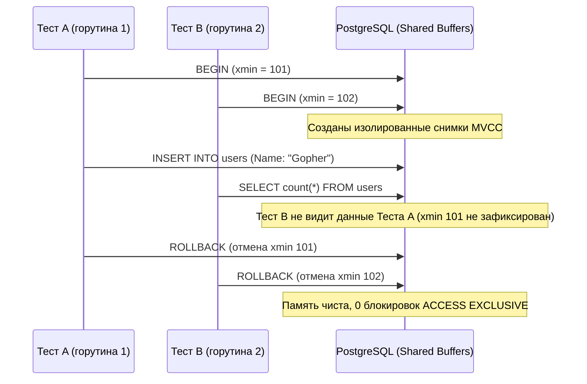

## Иллюзия стерильности: почему очистка базы работает плохо

В предыдущей главе [[2. Работа с базой данных в тестах]] мы столкнулись с суровой реальностью: прямолинейная очистка таблиц через `TRUNCATE` или `DELETE` накладывает фатальные ограничения на производительность. Команда `TRUNCATE` блокирует всю таблицу целиком, делая невозможным запуск тестов через `t.Parallel()`. Создание же уникальных баз данных под каждый сценарий великолепно изолирует данные, но сжигает драгоценные процессорные циклы и ресурсы диска на этапе многократного прогона DDL-миграций.

В высоконагруженной enterprise-разработке на Go золотым стандартом для тестирования уровня доступа к данным (Repository Layer) стал **транзакционный подход (Rollback подход)**.

Его архитектурная идея подкупает изяществом:
1. Перед началом каждого теста мы стартуем изолированную транзакцию (`BEGIN`).
2. Вместо глобального пула соединений мы передаем объект активной транзакции внутрь тестируемого репозитория.
3. Код исполняет запросы и проверяет состояние строк в рамках этой же транзакции.
4. В блоке завершения теста мы принудительно вызываем `ROLLBACK`.

База данных возвращается в исходное состояние мгновенно, не оставив на диске ни единого следа.

---

## Mechanical Sympathy: Как база прощает нам ошибки

Чтобы в полной мере оценить, почему откат транзакции `ROLLBACK` работает на два порядка быстрее операции `TRUNCATE`, необходимо заглянуть под капот ядра реляционной СУБД (на примере PostgreSQL).

> [!info] Под капотом: MVCC и WAL
> Когда вы выполняете модификацию данных через `INSERT` или `UPDATE` внутри активной транзакции, PostgreSQL не производит немедленной записи в основные файлы таблиц на диске (Heap):
> 1. **Последовательный лог WAL:** Сначала дельта изменений фиксируется в **WAL (Write-Ahead Log)** — журнале предзаписи. Это строго последовательная запись на диск (Sequential I/O), отличающаяся предельной скоростью.
> 2. **Буферный пул в памяти:** Модифицированные страницы данных (tuples) оседают в оперативной памяти сервера (Shared Buffers).
> 3. **Многоверсионность (MVCC):** Механизм **Multi-Version Concurrency Control** помечает созданные версии строк системным полем `xmin` (идентификатор текущей транзакции). Для любых других параллельно выполняющихся транзакций (то есть других тестов в соседних горутинах) эти строки физически невидимы, поскольку транзакция еще не зафиксирована через `COMMIT`.
> 
> Когда тестовый сценарий завершается и вызывается `ROLLBACK`, сервер СУБД не тратит ресурсы на поштучное стирание строк. Он лишь выставляет битовый флаг отмены транзакции в журнале статусов (`pg_xact`). Память объявляется свободной, а фоновый процесс Autovacuum позже утилизирует «мертвые» строки. Никаких тяжелых табличных блокировок уровня `ACCESS EXCLUSIVE` не возникает.

Благодаря механике MVCC сотни параллельных тестов могут одновременно вставлять, изменять и читать записи в одной и той же таблице `users`, оставаясь в полной взаимной изоляции!



---

## Архитектура кода для транзакционных тестов

Чтобы реализовать этот подход на практике, архитектура сервиса обязана соответствовать принципам внедрения зависимостей, о которых мы говорили в главе [[8. Dependency injection для тестируемости]].

Однако здесь разработчиков подстерегает классическая проблема строгой типизации Go: типы `*sql.DB` (пул соединений) и `*sql.Tx` (одиночная транзакция) в пакете `database/sql` — это абсолютно разные, несовместимые структуры данных. Если конструктор вашего репозитория жестко требует указатель `*sql.DB`, передать в него транзакцию `*sql.Tx` в тесте не удастся без дублирования методов.

### Решение: Интерфейс DBTX

В идиоматичном Go эта проблема элегантно разрешается через выделение минимального интерфейса абстракции выполнения запросов (этот паттерн положен в основу архитектуры популярного генератора кода `sqlc`):

```go
package repository

import (
	"context"
	"database/sql"
)

// DBTX декларирует базовый контракт, общий как для *sql.DB, так и для *sql.Tx
type DBTX interface {
	ExecContext(ctx context.Context, query string, args ...any) (sql.Result, error)
	QueryContext(ctx context.Context, query string, args ...any) (*sql.Rows, error)
	QueryRowContext(ctx context.Context, query string, args ...any) *sql.Row
}

type UserRepo struct {
	db DBTX
}

// Конструктор принимает универсальный интерфейс DBTX
func NewUserRepo(db DBTX) *UserRepo {
	return &UserRepo{db: db}
}

// Рабочий метод репозитория
func (r *UserRepo) Create(ctx context.Context, name string) error {
	_, err := r.db.ExecContext(ctx, "INSERT INTO users (name) VALUES ($1)", name)
	return err
}
```

В рабочей среде приложение передает в репозиторий глобальный пул соединений `*sql.DB`. А в интеграционном тесте мы без единой правки передаем свежесозданную транзакцию `*sql.Tx`!

### Идиоматичный тест с rollback

Соберем эталонный сценарий тестирования с автоматической регистрацией отката через `t.Cleanup`:

```go
package repository_test

import (
	"context"
	"testing"

	"github.com/stretchr/testify/require"
	"yourproject/internal/repository"
)

func TestUserRepository_Create(t *testing.T) {
	// Теперь мы можем смело и безопасно запускать тесты в параллель!
	t.Parallel()

	ctx := context.Background()
	db := getTestDB(t) // Инициализация пула соединений

	// 1. Открываем изолированную транзакцию под текущий тест
	tx, err := db.BeginTx(ctx, nil)
	require.NoError(t, err, "не удалось стартовать транзакцию")

	// 2. Гарантируем обязательный откат после завершения сценария
	t.Cleanup(func() {
		// Ошибка sql.ErrTxDone игнорируется, если транзакция
		// была закрыта внутри теста, что является корректным поведением
		_ = tx.Rollback()
	})

	// 3. Внедряем транзакцию вместо глобального пула
	repo := repository.NewUserRepo(tx)

	// Act: выполняем доменную операцию
	err = repo.Create(ctx, "Gopher")
	require.NoError(t, err)

	// Assert: проверяем появление строки внутри нашей же транзакции
	var count int
	err = tx.QueryRowContext(ctx, "SELECT count(*) FROM users WHERE name = $1", "Gopher").Scan(&count)
	require.NoError(t, err)
	require.Equal(t, 1, count)
}
```

> [!tip] Собеседование
> **Вопрос:** Что физически происходит в пуле соединений `database/sql` при вызове `db.BeginTx()`?  
> **Ответ:** Рантайм пакета `database/sql` захватывает внутренний мьютекс `sync.Mutex`, извлекает из пула одно свободное сетевое TCP-соединение (`*driverConn`) и **монопольно закрепляет** его за объектом транзакции `*sql.Tx`.  
> До тех пор пока на этой транзакции не будут явно вызваны методы `Rollback()` или `Commit()`, это физическое соединение остается заблокированным и недоступным для других горутин. Если инженер забудет завершить транзакцию, соединение безвозвратно «утечет» (Connection Leak). При параллельном прогоне тестов лимит соединений `MaxOpenConns` быстро исчерпается, что вызовет взаимную блокировку (Deadlock) и зависание всего тестового сьюта. Именно поэтому регистрация `Rollback` внутри `t.Cleanup()` является критически важной гарантией стабильности.

---

## Ловушка: Вложенные транзакции (Nested Transactions)

Паттерн Rollback безупречен для атомарных операций уровня репозитория. Однако архитектурная сложность резко возрастает, когда мы поднимаемся на уровень бизнес-логики (Usecase / Application Service) и пытаемся протестировать метод, который **сам управляет собственными транзакциями**.

Рассмотрим классический сервис денежных переводов:

```go
func (s *TransferService) Transfer(ctx context.Context, from, to int, amount float64) error {
	tx, err := s.db.BeginTx(ctx, nil)
	if err != nil {
		return err
	}
	defer tx.Rollback()

	// ... бизнес-логика списания и начисления ...

	return tx.Commit()
}
```

> [!warning] Ловушка / Gotcha
> Если вы попытаетесь обернуть вызов сервиса `Transfer` в тестовую транзакцию, вы столкнетесь с фундаментальным ограничением: СУБД PostgreSQL **не поддерживает вложенные транзакции на уровне протокола SQL**. Попытка выполнить инструкцию `BEGIN` внутри уже открытого блока вызовет предупреждение `WARNING: there is already a transaction in progress`.  
> 
> Хуже того: когда внутренний код сервиса выполнит вызов `tx.Commit()`, он физически зафиксирует изменения в общей базе данных на диске, нарушив изоляцию соседних тестов, а последующий тестовый `ROLLBACK` в блоке `t.Cleanup` завершится ошибкой `sql.ErrTxDone`.

**Инженерные стратегии решения проблемы:**

1. **Точки сохранения (SAVEPOINT):** Вы можете сконструировать специализированную обертку над интерфейсом `DBTX`, которая перехватывает внутренние вызовы `BeginTx` и транслирует их в SQL-команду точки сохранения: `SAVEPOINT sub_tx`. Вложенный откат при этом транслируется в инструкцию `ROLLBACK TO SAVEPOINT sub_tx`. Это мощный прием, однако он требует нетривиальной реализации и аккуратной синхронизации.
2. **Разделение тестов по пирамиде:** Тесты атомарных репозиториев выполняются через быстрый Rollback (сотни тестов в секунду под `t.Parallel()`). А для комплексных транзакционных сценариев бизнес-сервисов формируется отдельный тестовый пакет `test/integration`. В нем тесты работают либо в изолированных схемах базы данных, либо применяют стратегию `TRUNCATE` с последовательным выполнением.

---

## Итог

1. Использование транзакций и `ROLLBACK` — основополагающий архитектурный паттерн для построения быстрых, детерминированных и конкурентных интеграционных тестов базы данных в Go.
2. Механизмы MVCC и журнала WAL гарантируют, что незафиксированные мутации остаются невидимыми для параллельных горутин и не требуют блокировок уровня `ACCESS EXCLUSIVE`.
3. Применение интерфейса `DBTX` устраняет несовместимость между пулом `*sql.DB` и транзакцией `*sql.Tx`, делая репозитории гибкими и открытыми для тестирования.
4. Всегда освобождайте транзакционные соединения через `t.Cleanup()`, чтобы избежать утечки дескрипторов `*driverConn` и исчерпания пула `MaxOpenConns`.
5. Для сервисов с внутренней транзакционной логикой используйте эмуляцию точек сохранения (`SAVEPOINT sub_tx`) либо выносите их в выделенный интеграционный сьют.

Откат транзакций дает колоссальную скорость, однако нам по-прежнему необходима надежная среда запуска самой СУБД. Ручное управление контейнерами через `docker-compose` давно уступило место программному оркестрированию зависимостей.

О том, как поднимать полноценные изолированные базы данных прямо из кода на Go, мы поговорим в следующей главе: [[4. testcontainers go]].