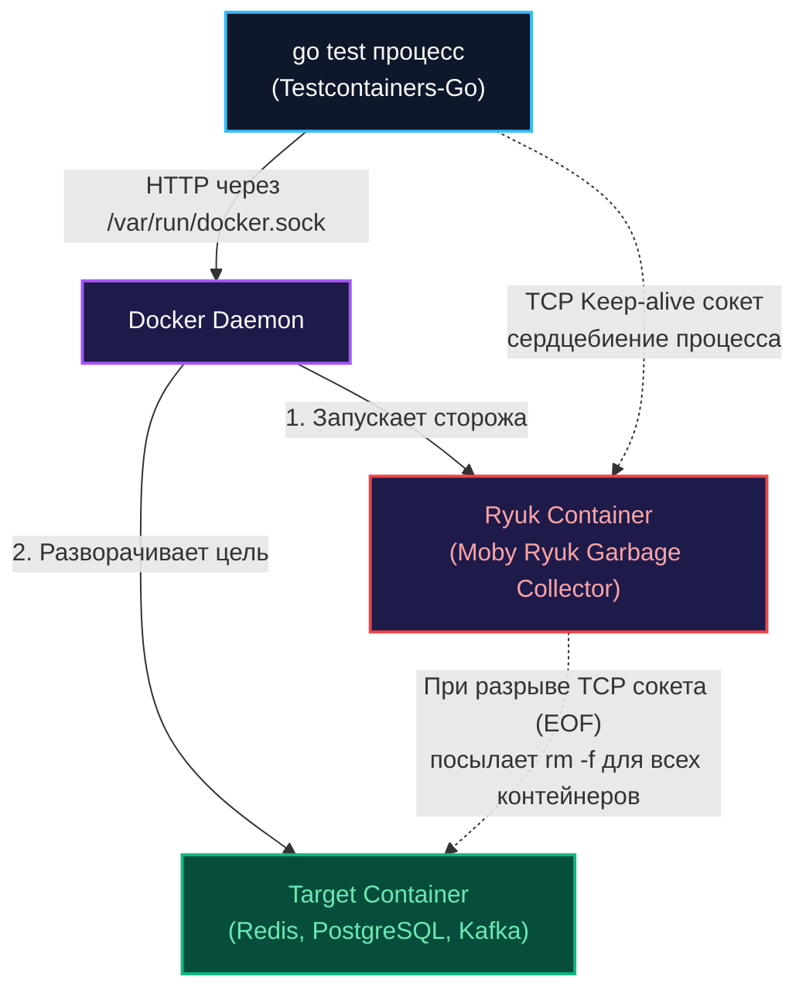

## Инфраструктура как код прямо в тестах

В предыдущей главе мы детально разобрали [[3. Транзакции и rollback подход]], который позволяет молниеносно исполнять сценарии на реальной реляционной СУБД, сохраняя идеальную изоляцию данных. Однако за скобками остался главный практический вопрос: **откуда именно берется эта база данных на рабочем месте инженера и в CI-раннере?**

Исторически индустрия бэкенда прошла через три эволюционных этапа организации тестовой инфраструктуры:

1. **Локально установленный инстанс:** Каждый разработчик обязан вручную установить PostgreSQL, Redis или Kafka на свою рабочую станцию. Этот путь гарантированно разрушает воспроизводимость: разные операционные системы (macOS, Ubuntu, Arch, Windows), расхождения в минорных версиях, специфические локали и кастомные системные конфигураторы.
2. **Общая тестовая база данных (Shared Database):** Выделенный удаленный сервер СУБД, общий для всей команды. Это приводит к постоянным блокировкам, порче тестовых данных коллегами и полной невозможности запускать деструктивные интеграционные тесты.
3. **Статический манифест docker-compose.yml в корне проекта:** Шаг вперед, однако разработчик вынужден постоянно помнить о необходимости выполнить команду `docker-compose up` перед запуском `go test`. А в сборочных CI/CD пайплайнах приходится громоздить хрупкие bash-скрипты с циклами `sleep` и проверками доступности портов.

Библиотека **`testcontainers-go`** разрешает эту дилемму радикально. Она наделяет Go-код способностью напрямую управлять демоном контейнеризации Docker и на лету поднимать любые необходимые сервисы непосредственно в процессе выполнения тестов. Когда тесты завершаются — контейнеры бесследно уничтожаются. Инфраструктура превращается в обычный код на Go.

---

## Под капотом: Как Testcontainers общается с Docker

Чтобы проектировать отказоустойчивые интеграционные тесты, необходимо понимать архитектуру библиотеки на уровне межпроцессного взаимодействия (IPC) операционной системы. 

Библиотека `testcontainers-go` лишена какой-либо магии: это специализированный HTTP-клиент, взаимодействующий с **Docker Engine API**.

> [!info] Под капотом: Unix Domain Sockets и Docker API
> По умолчанию в операционных системах семейства Linux демон Docker не открывает сетевые TCP-порты в целях безопасности. Вместо этого он слушает локальный сокет ядра: `/var/run/docker.sock`.
> 
> Когда тестовый сценарий запрашивает создание инстанса, библиотека формирует стандартный HTTP-запрос (например, `POST /v1.41/containers/create`), но передает его не через сетевой стек, а через локальный Unix Domain Socket операционной системы. Это означает, что для успешного запуска тестов процесс `go test` обязан обладать правами на чтение и запись в сокет (пользователь должен входить в системную группу `docker` либо обладать соответствующими правами).

### Проблема "Осиротевших" контейнеров и Ryuk

Представьте типичную внештатную ситуацию: тестовый сценарий развернул тяжелый кластер базы данных, но в процессе выполнения возникла непредвиденная `panic`, либо разработчик принудительно прервал исполнение комбинацией клавиш `Ctrl+C` (системный сигнал `SIGINT`). 

Зарегистрированный хук `t.Cleanup(terminate)` физически не успевает сработать. В результате тяжелый контейнер зависает в памяти операционной системы «сиротой» (orphaned container), продолжая удерживать TCP-порты и расходовать оперативную память.

Инженеры Testcontainers элегантно решили эту системную проблему с помощью архитектурного паттерна **Sidecar-надсмотрщика**.



Перед инициализацией целевого окружения библиотека первым делом прозрачно поднимает компактный служебный контейнер **Ryuk** (названный в честь бога смерти из японской мифологии).

Процесс Go открывает сетевое TCP-соединение с Ryuk и удерживает его на протяжении всей сессии. Если процесс `go test` внезапно погибает от `SIGINT` или фатального сбоя рантайма, ядро операционной системы автоматически закрывает файловые дескрипторы мертвого процесса. Ryuk моментально получает сигнал закрытия сокета `EOF`, активизируется и отправляет демону Docker команду на принудительную зачистку (`rm -f`) всех контейнеров, виртуальных сетей и томов, созданных в рамках упавшего сеанса.

---

## Идиоматичный запуск контейнера

Посмотрим, как выглядит надежный запуск in-memory хранилища Redis в изолированном интеграционном тесте:

```go
package integration_test

import (
	"context"
	"testing"

	"github.com/stretchr/testify/require"
	"github.com/testcontainers/testcontainers-go"
	"github.com/testcontainers/testcontainers-go/wait"
)

func setupRedisContainer(t *testing.T) (string, func()) {
	t.Helper()
	ctx := context.Background()

	// Описываем декларативную спецификацию контейнера
	req := testcontainers.ContainerRequest{
		Image:        "redis:7.2-alpine",
		ExposedPorts: []string{"6379/tcp"},
		// Критически важная фаза: проверка реальной готовности сокета к работе
		WaitingFor: wait.ForLog("Ready to accept connections"),
	}

	// Отправляем вызов в Docker Daemon
	redisC, err := testcontainers.GenericContainer(ctx, testcontainers.GenericContainerRequest{
		ContainerRequest: req,
		Started:          true, // Создать и немедленно запустить инстанс
	})
	require.NoError(t, err, "не удалось запустить контейнер Redis")

	// Считываем динамически выделенный порт хоста
	mappedPort, err := redisC.MappedPort(ctx, "6379")
	require.NoError(t, err)

	host, err := redisC.Host(ctx)
	require.NoError(t, err)

	dsn := host + ":" + mappedPort.Port()

	// Формируем безопасный финализатор очистки
	cleanup := func() {
		if err := redisC.Terminate(context.Background()); err != nil {
			t.Logf("Ошибка при штатной остановке контейнера: %s", err)
		}
	}

	return dsn, cleanup
}

func TestRedisCache(t *testing.T) {
	// Безопасный параллельный запуск
	t.Parallel()

	dsn, cleanup := setupRedisContainer(t)
	t.Cleanup(cleanup)

	t.Logf("Redis успешно развернут по адресу: %s", dsn)
	// Исполнение бизнес-сценария с проверкой кэша...
}
```

---

## Главная ловушка: Статические порты и t.Parallel

Самая распространенная ошибка инженеров, привыкших к статическим конфигурациям `docker-compose`, — попытка зафиксировать порт на хосте.

> [!warning] Ловушка / Gotcha
> Если в спецификации Testcontainers вы укажете статический биндинг: `ExposedPorts: []string{"6379:6379/tcp"}`, ваши тесты мгновенно потерпят крах при первой же попытке включить `t.Parallel()`.  
> Первый параллельный тест успешно захватит порт 6379 на сетевом интерфейсе хост-машины. Второй тест, стартующий на долю миллисекунды позже, получит от сетевой подсистемы ядра ОС жесткий отказ: `bind: address already in use`. Это прямая дорога к случайным падениям сборок и необходимости ликвидировать последствия [[6. Flaky тесты и их причины]].

**Инженерный принцип динамических портов (Mechanical Sympathy):**  
Мы делегируем распределение сетевых портов сетевому стеку ядра Linux. Указывая строку `"6379/tcp"`, мы сообщаем: «Внутри виртуальной сети контейнера сервис слушает порт 6379. Снаружи, на сетевом интерфейсе хоста, выдели *любой свободный эфемерный порт* (из стандартного пула 32768–60999)».

Затем метод `MappedPort()` обращается к API Docker и запрашивает фактически выделенный номер. Демон отвечает, например: `54391`. Именно этот порт динамически передается в строку подключения клиента. В итоге сотни параллельных тестов могут бесконфликтно поднимать сотни изолированных контейнеров на одной и той же физической машине.

---

## Стратегии ожидания (Wait Strategies)

Переход контейнера в статус `Running` на уровне демона Docker отнюдь не означает, что служба внутри него уже способна принимать пользовательский трафик. Тяжелые распределенные платформы (например, Kafka на JVM или PostgreSQL с прогревом буферов) могут тратить 5–15 секунд на инициализацию подсистем памяти и выполнение встроенных скриптов. 

Если Go-клиент попытается подключиться раньше времени, операционная система вернет сетевой отказ `connection refused`.

Пакет `testcontainers-go` предоставляет гибкий арсенал стратегий ожидания (Wait Strategies):

1. **`wait.ForLog("...")`:** Построчно сканирует системный вывод `stdout/stderr` контейнера и ждет появления маркерной строки. Это наиболее надежный и быстрый способ для сервисов, логирующих факт готовности сокетов.
2. **`wait.ForListeningPort("...")`:** Периодически пытается установить физическое TCP-соединение с открытым портом. Быстрый способ, однако коварный: базы данных часто открывают порт задолго до завершения процессов восстановления транзакций.
3. **`wait.ForSQL(...)`:** Прецизионная стратегия для реляционных баз данных. Она в цикле выполняет проверочный запрос `SELECT 1` или метод `Ping` через реальный Go-драйвер до тех пор, пока сервер не вернет утвердительный ответ.

> [!tip] Собеседование
> **Вопрос:** В чем заключается главная архитектурная опасность поднятия нового контейнера на каждый тест-кейс в CI/CD пайплайне?  
> **Ответ:** Колоссальный накладной расход времени (Overhead). Запуск и прогрев контейнера PostgreSQL занимает от двух до четырех секунд. Если тестовый сьют микросервиса насчитывает 300 интеграционных тестов, запуск изолированного контейнера под каждый сценарий растянет выполнение пайплайна на 15–20 минут.  
> **Оптимальное решение:** Вместо старта контейнера на каждый `t.Run` поднимается **один общий контейнер** на уровне функции `TestMain` (или пакета), а изоляция данных между параллельными тестами достигается транзакционным откатом `ROLLBACK` либо созданием изолированных баз данных из шаблона.

---

## Итог

1. `testcontainers-go` переносит декларацию инфраструктуры непосредственно в исходный код тестов, обеспечивая 100% воспроизводимость окружения.
2. Взаимодействие с Docker Daemon осуществляется по протоколу HTTP через локальный сокет `/var/run/docker.sock`.
3. Контейнер-надсмотрщик **Ryuk** гарантирует автоматическую зачистку «осиротевших» контейнеров даже при аварийных падениях тестов и обрывах по сигналу `SIGINT`.
4. Для обеспечения параллелизма через `t.Parallel()` используйте динамический маппинг эфемерных портов вместо жестких статических биндингов.
5. Применяйте адекватные стратегии ожидания (`wait.ForLog`, `wait.ForSQL`), защищающие тесты от ошибок `connection refused`.

Теперь мы вооружены фундаментальным пониманием того, как устроен жизненный цикл контейнеров в Go. Пришло время применить эту мощь к главному транзакционному хранилищу современного бэкенда.

В следующей главе мы разберем все тонкости поднятия и настройки PostgreSQL: [[5. Поднятие PostgreSQL в тестах]].