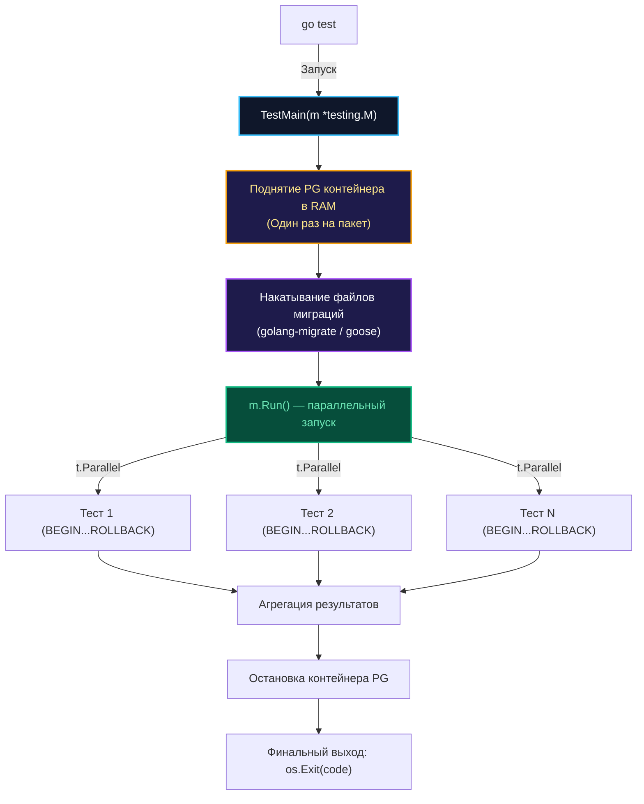

## Прагматичный подход к тяжелым СУБД

В предыдущей главе [[4. testcontainers go]] мы изучили фундаментальные механизмы взаимодействия с демоном Docker напрямую из Go-кода через системные сокеты операционной системы. Теперь пришло время применить эту мощь к главной транзакционной рабочей лошадке современного бэкенда — реляционной СУБД PostgreSQL.

PostgreSQL — это монументальный, сложный и тяжеловесный C-процесс с развитой подсистемой буферов и фоновых процессов. Он изначально спроектирован для бескомпромиссной надежности хранения данных — той самой буквы **D (Durability)** в аксиоме ACID. 

Однако в интеграционных тестах долговечность данных нам абсолютно не нужна! Если тестовый сценарий упадет, контейнер всё равно будет бесследно уничтожен сборщиком мусора. В тестах нам требуется единственное качество — **максимальная скорость выполнения**.

---

## Идиоматичный запуск через postgres module

Разработчики библиотеки `testcontainers-go` благоразумно выделили инфраструктуру для популярных баз данных в готовые специализированные модули. Вместо ручной низкоуровневой настройки `GenericContainer` мы подключаем официальный пакет:

```bash
go get github.com/testcontainers/testcontainers-go/modules/postgres
```

> [!info] Под капотом: Модули Testcontainers
> Модуль `postgres` избавляет инженера от рутины: он автоматически транслирует стандартный порт 5432, пробрасывает переменные окружения `POSTGRES_USER` и `POSTGRES_PASSWORD` и использует специализированную стратегию ожидания.  
> Модуль не просто проверяет доступность TCP-сокета (который открывается задолго до готовности базы), а парсит поток логов на предмет строки `ready to accept connections`, защищая Go-клиент от классической ошибки `connection refused`.

### Mechanical Sympathy: Тюнинг PostgreSQL для тестов

В штатном режиме при выполнении инструкции `COMMIT` ядро PostgreSQL выполняет блокирующий системный вызов `fsync()` (или `fdatasync()`), приказывая ядру Linux немедленно сбросить «грязные» страницы из дискового кэша (Page Cache) на физический накопитель. На механических дисках или виртуальных дисках облачных раннеров это занимает ощутимые миллисекунды. Для тысячи тестов это выливается в минуты бесполезного ожидания.

В тестовом окружении мы полностью отключаем дисковую синхронизацию и переносим таблицы в оперативную память (RAM):

```go
package integration_test

import (
	"context"
	"testing"
	"time"

	"github.com/jackc/pgx/v5/pgxpool"
	"github.com/stretchr/testify/require"
	"github.com/testcontainers/testcontainers-go"
	"github.com/testcontainers/testcontainers-go/modules/postgres"
	"github.com/testcontainers/testcontainers-go/wait"
)

func setupPostgres(t *testing.T) *pgxpool.Pool {
	t.Helper()
	ctx := context.Background()

	// Конфигурируем контейнер с экстремальными оптимизациями скорости
	pgContainer, err := postgres.RunContainer(ctx,
		testcontainers.WithImage("postgres:16-alpine"),
		postgres.WithDatabase("test_db"),
		postgres.WithUsername("postgres"),
		postgres.WithPassword("postgres"),
		// Ждем именно второе вхождение готовности!
		wait.ForLog("database system is ready to accept connections").
			WithOccurrence(2).
			WithStartupTimeout(15*time.Second),

		// 1. Полностью отключаем сброс страниц на диск (fsync)
		testcontainers.WithCommand("-c", "fsync=off", "-c", "full_page_writes=off"),

		// 2. Размещаем директорию хранения данных в оперативной памяти (RAM-диск tmpfs)
		testcontainers.WithTmpfs(map[string]string{"/var/lib/postgresql/data": "rw"}),
	)
	require.NoError(t, err, "не удалось поднять контейнер PostgreSQL")

	// Регистрируем обязательную зачистку контейнера
	t.Cleanup(func() {
		if err := pgContainer.Terminate(context.Background()); err != nil {
			t.Logf("Ошибка при остановке контейнера PostgreSQL: %v", err)
		}
	})

	// Извлекаем динамический DSN для подключения
	connStr, err := pgContainer.ConnectionString(ctx, "sslmode=disable")
	require.NoError(t, err)

	// Инициализируем высокопроизводительный пул pgxpool
	pool, err := pgxpool.New(ctx, connStr)
	require.NoError(t, err)

	return pool
}
```

> [!warning] Ловушка / Gotcha
> Обратите особое внимание на параметр `WithOccurrence(2)` в стратегии ожидания логов.  
> При первой инициализации пустой базы данных утилита `initdb` запускает временный инстанс PostgreSQL, выполняет создание системных каталогов, выводит строку `ready to accept connections`, а затем **принудительно перезапускает процесс**. И лишь после второго появления этой записи СУБД реально готова обслуживать пользовательские соединения. Если по ошибке ожидать только первое появление, тесты будут случайным образом падать при подключении.

---

## Архитектура: TestMain vs t.Run

Запуск легковесного контейнера PostgreSQL в оперативной памяти занимает около полутора секунд. Но если в пакете `repository` содержится сотня тестов, и каждый тест будет поднимать собственный изолированный контейнер, суммарное время выполнения сьюта растянется на долгие минуты.

Для интеграционных тестов уровня пакета (Package-level tests) каноническим стандартом стал паттерн **TestMain**.

Функция `TestMain(m *testing.M)` перехватывает управление раннером Go, позволяя выполнить единую фазу инициализации до старта тестов и гарантированную зачистку после их завершения.



### Реализация TestMain с миграциями

В `TestMain` мы однократно стартуем СУБД, накатываем актуальные DDL-миграции и сохраняем дескриптор пула в глобальную переменную пакета. А взаимная изоляция параллельных тестов достигается через [[3. Транзакции и rollback подход]]:

```go
package repository_test

import (
	"context"
	"log"
	"os"
	"testing"

	"github.com/jackc/pgx/v5/pgxpool"
	// импорты драйвера, testcontainers и библиотеки миграций
)

// Глобальный пул соединений для тестов текущего пакета
var testDB *pgxpool.Pool

func TestMain(m *testing.M) {
	ctx := context.Background()

	// 1. Поднимаем инстанс PostgreSQL (один на весь пакет)
	pgContainer, err := startOptimizedPostgres(ctx)
	if err != nil {
		log.Fatalf("Не удалось запустить PostgreSQL: %v", err)
	}

	dsn, _ := pgContainer.ConnectionString(ctx, "sslmode=disable")
	testDB, err = pgxpool.New(ctx, dsn)
	if err != nil {
		log.Fatalf("Не удалось инициализировать пул pgx: %v", err)
	}

	// 2. Однократно применяем файлы миграций схемы
	if err := applyMigrations(dsn, "../../migrations"); err != nil {
		log.Fatalf("Ошибка наката миграций: %v", err)
	}

	// 3. Запускаем параллельные тесты пакета
	code := m.Run()

	// 4. Финальная уборка инфраструктуры
	testDB.Close()
	_ = pgContainer.Terminate(ctx)

	os.Exit(code)
}
```

> [!tip] Собеседование
> **Вопрос:** В чем заключается главный недостаток использования глобальной переменной `testDB` в `TestMain` при масштабировании тестов?  
> **Ответ:** Функция `TestMain` изолирована строго в рамках конкретного Go-пакета. Если вы запустите тесты по всей кодовой базе в параллельном режиме (`go test ./... -p 4`), раннер Go запустит четыре независимых процесса, и каждый пакет поднимет собственный контейнер PostgreSQL. На нагруженном CI-сервере с десятками пакетов это мгновенно приведет к исчерпанию оперативной памяти (OOM Killer).  
> **Архитектурное решение:** В масштабных монорепозиториях создают централизованный скрипт инициализации окружения, который поднимает единый инстанс PostgreSQL перед стартом `go test`, передавая DSN через стандартные переменные окружения.

---

## Практика: Инжектирование транзакций

Теперь, когда схема базы данных прогрета и готова к работе, любой интеграционный тест в пакете `repository` превращается в компактный и полностью изолированный сценарий:

```go
func TestUserRepo_FindByID(t *testing.T) {
	// Безопасный запуск на всех доступных ядрах процессора!
	t.Parallel()

	// 1. Открываем изолированную транзакцию из глобального пула
	tx, err := testDB.Begin(context.Background())
	require.NoError(t, err)

	// 2. Гарантированный откат изменений в финале
	t.Cleanup(func() {
		_ = tx.Rollback(context.Background())
	})

	// 3. Внедряем транзакцию в репозиторий
	repo := repository.NewUserRepo(tx)

	// 4. Наполняем базу фикстурами прямо внутри транзакции
	_, err = tx.Exec(context.Background(), "INSERT INTO users (id, name) VALUES (1, 'Gopher')")
	require.NoError(t, err)

	// 5. Исполняем и верифицируем доменный метод
	user, err := repo.FindByID(context.Background(), 1)
	require.NoError(t, err)
	require.Equal(t, "Gopher", user.Name)
}
```

Мы достигли высшего пилотажа инженерного дизайна: стопроцентная достоверность промышленного PostgreSQL, идеальная изоляция данных на базе MVCC и предельная утилизация вычислительных ядер процессора через `t.Parallel()`.

Реляционные базы данных — надежный фундамент бэкенда. Однако в распределенных системах реляционную СУБД практически всегда сопровождает распределенный in-memory кэш.

О том, как профессионально тестировать хранилища ключей и значений, мы поговорим в следующей главе: [[6. Тестирование Redis]].