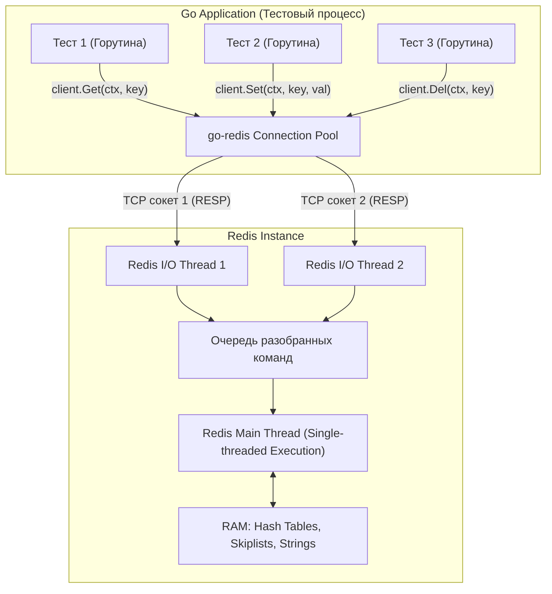

## Специфика in-memory хранилищ

В предыдущих главах мы научились подчинять тяжеловесный PostgreSQL, разворачивая его в эфемерных окружениях через [[4. testcontainers go]] и изолируя параллельные запуски тестов с помощью транзакционного `ROLLBACK`. Реляционная СУБД с её журналом упреждающей записи (WAL) и многоверсионным управлением конкурентным доступом (MVCC) предоставляет нам идеальную иллюзию: каждый тест может делать вид, что он один на свете, а в конце — просто отменить свои следы.

Однако современный серверный стек редко исчерпывается одной лишь реляционной базой данных. Быстрый кэш ответов, скользящие окна для rate limiting, распределенные мьютексы и сессии пользователей ложатся на плечи сетевого in-memory хранилища — **Redis**. И как только инженер пытается применить к Redis привычные шаблоны интеграционного тестирования, он немедленно наталкивается на фундаментальные архитектурные различия.

Главная загвоздка заключается в том, что **в Redis нет транзакций с поддержкой MVCC и привычных откатов (`ROLLBACK`)**. 

Команды `MULTI` и `EXEC` в протоколе Redis — это вовсе не ACID-транзакции в реляционном понимании. Это лишь механизм буферизации: клиент собирает пачку инструкций в очередь, после чего сервер последовательно и непрерывно исполняет их в едином контексте, не допуская вклинивания команд от других клиентов. Вы не можете выполнить условный `BEGIN`, записать тестовые ключи, проверить состояние сервиса и затем нажать волшебную кнопку `ROLLBACK`. Если ключ записан в память Redis, он останется там до явного удаления или истечения срока жизни (TTL).

```
Реляционная БД (PostgreSQL):
[BEGIN] -> [INSERT/UPDATE (в рамках снимка MVCC)] -> [ROLLBACK] => состояние не тронуто

Ключ-значение (Redis):
[MULTI] -> [SET/INCR (буферизация команд)] -> [EXEC] => данные уже в RAM!
```

Как же организовать интеграционное тестирование сервисов, опирающихся на Redis, не скатываясь в последовательное медленное исполнение и сохраняя возможность вызова `t.Parallel()`? Для этого инженеру необходимо заглянуть под капот протокола взаимодействия и разделить тестовые сценарии на две принципиальные категории.

---

## Под капотом: Redis и go-redis

Прежде чем проектировать тест-сьюты, разберем механику взаимодействия приложения на Go с сервером Redis. В подавляющем большинстве проектов де-факто стандартом выступает клиентская библиотека `github.com/redis/go-redis/v9`.

> [!info] Под капотом
> Драйвер `go-redis` управляет внутренним пулом соединений (`Connection Pool`), построенным на базе потокобезопасных структур данных и атомиков. 
> 
> Когда десятки параллельных тестов или горутин вызывают `client.Get(ctx, key)`, клиент не создает новое TCP-соединение на каждый чих. Он извлекает свободный сокет из пула, сериализует запрос в текстовый протокол RESP (REdis Serialization Protocol), передает системному вызову `write()` и блокируется на чтении ответа через сетевой поллер Go (`netpoller`).
> 
> На стороне сервера Redis архитектура исторически однопоточна. Начиная с версии 6.0, в Redis появился многопоточный ввод-вывод (I/O threads парсят байты из сокетов), однако **непосредственное исполнение команд** над структурами данных в оперативной памяти по-прежнему происходит строго в главном цикле событий (Main Thread). Это гарантирует строгую сериализацию всех поступающих команд: даже если параллельные тесты шлют запросы одновременно, ядро Redis выполняет их строго по очереди.

Следующая диаграмма наглядно иллюстрирует этот путь:



Понимание этой модели определяет две фундаментальные стратегии тестирования:
1. **Чистая in-memory эмуляция в адресном пространстве Go-процесса (`miniredis`):** когда нам важна предельная скорость и независимость от внешнего окружения.
2. **Реальный контейнер через Testcontainers с пространством имен (Key Namespacing):** когда логика завязана на специфику рантайма Redis (Lua-скрипты, модули, транзакции `WATCH`/`MULTI`/`EXEC`, Redis Streams).

---

## Стратегия 1: miniredis (Ультимативная скорость)

Для подавляющего большинства интеграционных тестов (до 90% типовых сценариев кэширования, хранения сессий и счетчиков) поднимать настоящий образ Docker через Testcontainers — неоправданная роскошь. 

В экосистеме Go существует превосходный инструмент: библиотека `github.com/alicebob/miniredis`. 

Это чистая реализация сервера Redis, написанная на языке Go. Она компилируется прямо в бинарник ваших тестов и запускается за доли миллисекунды в оперативной памяти тестового процесса, открывая настоящий сетевой слушатель (TCP listener) на случайном локальном порту.

### Архитектурные достоинства miniredis:
1. **Полная независимость от Docker:** тесты выполняются на любой машине разработчика и в легковесных CI-контейнерах без проброса docker-сокета.
2. **Мгновенный старт:** инициализация занимает меньше одной миллисекунды (против 2–4 секунд у Docker-контейнера).
3. **Бескомпромиссная изоляция:** каждый отдельный тест `t.Run` может поднять свой собственный изолированный сервер `miniredis` с нулевым состоянием, гарантируя абсолютную чистоту экспериментов в режиме `t.Parallel()`.
4. **Управление временем:** `miniredis` позволяет программно перематывать серверное время с помощью метода `FastForward()`, что делает тестирование устаревания ключей (TTL) мгновенным и детерминированным — без вызовов `time.Sleep()`.

Рассмотрим идиоматичный пример организации теста с инкапсуляцией жизненного цикла через `t.Cleanup`:

```go
package cache_test

import (
	"context"
	"testing"
	"time"

	"github.com/alicebob/miniredis/v2"
	"github.com/redis/go-redis/v9"
	"github.com/stretchr/testify/require"
)

// SessionCache — прикладной компонент, управляющий сессиями
type SessionCache struct {
	client *redis.Client
}

func NewSessionCache(client *redis.Client) *SessionCache {
	return &SessionCache{client: client}
}

func (s *SessionCache) Set(ctx context.Context, key, val string, ttl time.Duration) error {
	return s.client.Set(ctx, key, val, ttl).Err()
}

func (s *SessionCache) Get(ctx context.Context, key string) (string, error) {
	return s.client.Get(ctx, key).Result()
}

// setupMiniredis поднимает персональный in-memory сервер под конкретный тест
func setupMiniredis(t *testing.T) (*miniredis.Miniredis, *redis.Client) {
	t.Helper()

	// Запускаем in-memory эмулятор Redis
	mr, err := miniredis.Run()
	require.NoError(t, err, "не удалось инициализировать miniredis")

	// Останавливаем сервер после завершения теста
	t.Cleanup(func() {
		mr.Close()
	})

	// Подключаем стандартный боевой клиент go-redis к локальному адресу miniredis
	client := redis.NewClient(&redis.Options{
		Addr: mr.Addr(),
	})

	// Закрываем пул TCP-соединений клиента
	t.Cleanup(func() {
		_ = client.Close()
	})

	return mr, client
}

func TestSessionCache_SetGetAndTTL(t *testing.T) {
	t.Parallel()

	mr, rdb := setupMiniredis(t)
	cache := NewSessionCache(rdb)
	ctx := context.Background()

	t.Run("успешное сохранение и извлечение данных", func(t *testing.T) {
		err := cache.Set(ctx, "session:user_101", "jwt_token_payload", 10*time.Minute)
		require.NoError(t, err)

		val, err := cache.Get(ctx, "session:user_101")
		require.NoError(t, err)
		require.Equal(t, "jwt_token_payload", val)
	})

	t.Run("истечение времени жизни ключа без ожидания time.Sleep", func(t *testing.T) {
		err := cache.Set(ctx, "temp_key", "temporary_data", 5*time.Second)
		require.NoError(t, err)

		// Магия miniredis: мгновенно перематываем виртуальное время вперед
		mr.FastForward(6 * time.Second)

		_, err = cache.Get(ctx, "temp_key")
		require.ErrorIs(t, err, redis.Nil, "ключ должен был испариться по истечении TTL")
	})
}
```

> [!warning] Ловушка / Gotcha: Ограничения miniredis
> `miniredis` великолепен своей скоростью, однако это не побитовая копия официального C-исходника Redis. 
> 
> Если ваша бизнес-логика опирается на сложные скрипты Lua, модули (такие как RedisJSON, RediSearch, RedisBloom), команды кластеризации или специфичное поведение потоков (Redis Streams), `miniredis` может повести себя некорректно либо выдать фатальную ошибку `ERR unknown command`. В таких ситуациях попытка сэкономить на Docker приводит к ложноположительным тестам. Здесь вступает в игру полноценный контейнер.

---

## Стратегия 2: Testcontainers + Изоляция ключей

Когда тестируемая подсистема использует возможности, специфичные для нативного сервера Redis (например, атомарный скрипт скользящего окна rate limiter на языке Lua), компромиссы недопустимы. Мы поднимаем честный контейнер с помощью библиотеки `testcontainers-go`.

Однако создание отдельного Docker-контейнера на каждый запуск функции `t.Run` приведет к колоссальным временным задержкам: сьют из ста тестов будет выполняться несколько минут. Поэтому применяется паттерн **общего долгоживущего контейнера на пакет** с инициализацией внутри `TestMain`.

Здесь мы возвращаемся к начальной проблеме: если контейнер один, а тесты работают конкурентно с `t.Parallel()`, как предотвратить взаимное повреждение данных?

Очищать базу командой `FLUSHALL` или `FLUSHDB` в `t.Cleanup` категорически запрещено. Вызов `FLUSHALL` в одном тесте мгновенно сметет ключи, с которыми прямо в эту наносекунду работает соседняя горутина, порождая трудноуловимые [[6. Flaky тесты и их причины]].

**Единственно надежное решение: Пространство имен (Key Prefixes).**

Каждый тестовый сценарий генерирует уникальный случайный префикс (например, с помощью UUID или имени теста) и использует только свои собственные изолированные ключи.

```go
package limiter_test

import (
	"context"
	"fmt"
	"os"
	"testing"
	"time"

	"github.com/google/uuid"
	"github.com/redis/go-redis/v9"
	"github.com/stretchr/testify/require"
	"github.com/testcontainers/testcontainers-go"
	rediscontainer "github.com/testcontainers/testcontainers-go/modules/redis"
)

var sharedClient *redis.Client

func TestMain(m *testing.M) {
	ctx := context.Background()

	// Запускаем один официальный контейнер Redis на весь тестовый пакет
	container, err := rediscontainer.Run(ctx, "redis:7-alpine")
	if err != nil {
		fmt.Printf("Не удалось поднять Redis контейнер: %v\n", err)
		os.Exit(1)
	}

	connStr, err := container.ConnectionString(ctx)
	if err != nil {
		fmt.Printf("Ошибка получения ConnectionString: %v\n", err)
		os.Exit(1)
	}

	opt, err := redis.ParseURL(connStr)
	if err != nil {
		fmt.Printf("Ошибка парсинга URL: %v\n", err)
		os.Exit(1)
	}

	sharedClient = redis.NewClient(opt)

	// Запускаем тесты
	code := m.Run()

	// Корректно сворачиваем окружение
	_ = sharedClient.Close()
	_ = container.Terminate(ctx)

	os.Exit(code)
}

// RateLimiter реализует алгоритм ограничения запросов поверх Redis
type RateLimiter struct {
	client *redis.Client
	prefix string
}

func NewRateLimiter(client *redis.Client, prefix string) *RateLimiter {
	return &RateLimiter{client: client, prefix: prefix}
}

func (r *RateLimiter) Allow(ctx context.Context, userID string) (bool, error) {
	key := fmt.Sprintf("%s:%s", r.prefix, userID)
	// Атомарно увеличиваем счетчик обращений
	count, err := r.client.Incr(ctx, key).Result()
	if err != nil {
		return false, err
	}
	if count == 1 {
		_ = r.client.Expire(ctx, key, time.Minute).Err()
	}
	return count <= 5, nil
}

func TestRateLimiter_RealRedis(t *testing.T) {
	t.Parallel()

	ctx := context.Background()

	// Генерируем уникальный префикс для полной изоляции ключей данного теста
	testPrefix := "test_limit:" + uuid.NewString()

	// Внедряем изолированный префикс в создаваемый экземпляр сервиса
	limiter := NewRateLimiter(sharedClient, testPrefix)

	// Гарантируем подчистку за собой после завершения теста
	t.Cleanup(func() {
		// Очищаем исключительно собственные ключи, не трогая соседей
		keys, err := sharedClient.Keys(ctx, testPrefix+"*").Result()
		if err == nil && len(keys) > 0 {
			_ = sharedClient.Del(ctx, keys...).Err()
		}
	})

	// Тест работает строго в изолированном пространстве ключей
	allowed, err := limiter.Allow(ctx, "user_1")
	require.NoError(t, err)
	require.True(t, allowed)
}
```

---

## Ловушки при работе с Redis в Go

### Ошибка отсутствия ключа: redis.Nil

На технических собеседованиях и во время код-ревью регулярно всплывает классическая ошибка обработки краевых условий при чтении из кэша.

> [!tip] Собеседование
> **Вопрос:** Как в драйвере `go-redis` отличить сетевой сбой (или падение сервера) от штатной ситуации, когда запрашиваемый ключ просто отсутствует в базе?
> 
> **Ответ:** По протоколу RESP при отсутствии ключа сервер Redis возвращает специальное пустое значение `(nil)`. Библиотека `go-redis` транслирует этот ответ в константную ошибку `redis.Nil`. 
> 
> Это классическая ловушка для начинающих: если программист пишет наивное `if err != nil { return err }`, приложение расценивает штатный промах кэша (Cache Miss) как тяжелую ошибку и завершает обработку запроса с кодом 500. 
> 
> Идиоматичная обработка строится через сопоставление ошибок:
> ```go
> val, err := client.Get(ctx, key).Result()
> switch {
> case err == redis.Nil:
>     // Штатная ситуация: кэш пуст, обращаемся к источнику истины (БД)
>     return fetchFromDatabase(ctx, key)
> case err != nil:
>     // Сетевой таймаут, сбой десериализации или отказ сокета
>     return "", fmt.Errorf("redis connection failure: %w", err)
> default:
>     // Ключ найден в оперативной памяти
>     return val, nil
> }
> ```
> В ваших юнит- и интеграционных тестах поведение системы при возврате `redis.Nil` обязательно должно проверяться отдельным тест-кейсом!

---

### Тестирование атомарности (Pipelines и Lua)

Если сервису требуется обновить несколько связанных ключей или выполнить операцию «проверить и изменить» (Check-and-Set), наивная реализация на стороне приложения приводит к фатальным состояниям гонки (Race Conditions).

Представим счетчик просмотров, в котором инженер сначала выполняет `GET`, затем инкрементирует число в Go-коде (`+1`), а затем отправляет результат через `SET`. При высокой нагрузке параллельные горутины будут читать одно и то же значение и перетирать данные друг друга (Lost Updates).

Интеграционный тест обязан выявлять такие архитектурные просчеты за счет создания искусственной конкуренции:

```go
package stats_test

import (
	"context"
	"sync"
	"testing"

	"github.com/alicebob/miniredis/v2"
	"github.com/redis/go-redis/v9"
	"github.com/stretchr/testify/require"
)

type CounterService struct {
	client *redis.Client
}

func NewCounterService(client *redis.Client) *CounterService {
	return &CounterService{client: client}
}

// Increment обязан использовать атомарную команду INCR на стороне Redis
func (c *CounterService) Increment(ctx context.Context, key string) error {
	// Правильная реализация: c.client.Incr(ctx, key).Err()
	// Ошибочная реализация: GET -> +1 в памяти Go -> SET
	return c.client.Incr(ctx, key).Err()
}

func TestCounter_ConcurrentIncrement(t *testing.T) {
	t.Parallel()

	mr, err := miniredis.Run()
	require.NoError(t, err)
	t.Cleanup(func() { mr.Close() })

	rdb := redis.NewClient(&redis.Options{Addr: mr.Addr()})
	t.Cleanup(func() { _ = rdb.Close() })

	counter := NewCounterService(rdb)

	const totalGoroutines = 100
	var wg sync.WaitGroup
	wg.Add(totalGoroutines)

	// Запускаем 100 горутин, одновременно увеличивающих общий счетчик
	for i := 0; i < totalGoroutines; i++ {
		go func() {
			defer wg.Done()
			// Внутри инкремент должен использовать INCR, а не связку GET+SET
			_ = counter.Increment(context.Background(), "page_views")
		}()
	}
	wg.Wait()

	val, err := rdb.Get(context.Background(), "page_views").Int()
	require.NoError(t, err)
	require.Equal(t, 100, val, "Счетчик должен быть равен ровно 100; потерянные обновления недопустимы")
}
```

Если внутри `counter.Increment` разработчик допустит ошибку, реализовав неатомарный `GET` с последующим сложением `+1` и вызовом `SET`, тест с высокой вероятностью завершится падением, продемонстрировав итоговое значение 20 или 30 вместо ожидаемых 100.

---

## Итог

Тестирование интеграций с Redis в экосистеме Go требует трезвого инженерного баланса между скоростью обратной связи и абсолютной реалистичностью окружения:

1. **Для 90% задач повседневной разработки** (кэширование DTO, валидация сессий, скользящие окна с TTL) безальтернативным лидером является `miniredis`. Он разворачивается за доли миллисекунды, не требует Docker, позволяет мгновенно манипулировать временем (`FastForward`) и обеспечивает честный `t.Parallel()` для всех тестов.
2. **Для 10% специализированных сценариев** (сложные транзакции с `WATCH`, скрипты Lua, структуры Redis Streams, модули RedisJSON) используйте связку `testcontainers-go` с глобальным жизненным циклом в `TestMain` и изоляцией на основе префиксов ключей. Команда `FLUSHALL` в многопоточном сьюте — абсолютное табу.

Разобравшись с хранилищами состояния и кэшами, мы вплотную подходим к наиболее сложному и коварному элементу распределенных систем — шинам сообщений и асинхронным очередям. В следующей лекции мы детально разберем организацию тестирования брокеров событий: [[7. Тестирование Kafka и очередей]].