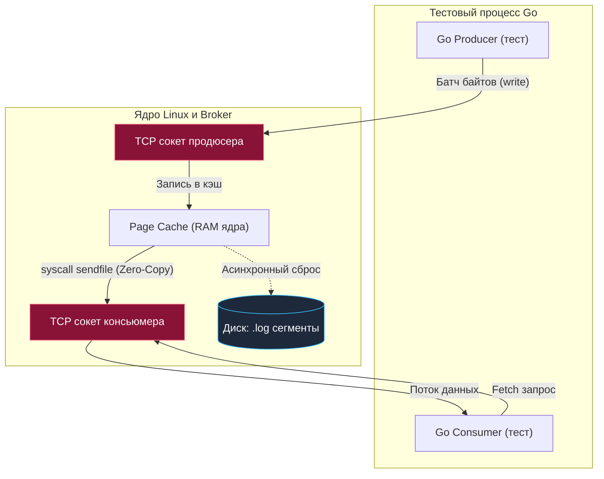

## Смена парадигмы: от Синхронности к Событиям

В предыдущих главах мы исследовали понятный синхронный мир: клиентская горутина отправляет сетевой запрос в PostgreSQL или Redis, приостанавливает свое выполнение в планировщике Go, а после получения ответа немедленно узнает вердикт — успешно записаны данные или произошла ошибка. Жизненный цикл операции строго детерминирован и привязан к конкретному контексту вызова.

Однако переход к событийно-ориентированной архитектуре (Event-Driven Architecture, EDA) с брокерами сообщений вроде Apache Kafka, RabbitMQ или NATS разрушает привычные ментальные паттерны. 

Представьте типичный обработчик: сервис регистрирует пользователя и генерирует доменное событие `UserCreated`. Функция отправки продюсера завершает свою работу за пару миллисекунд и возвращает `nil`. Но значит ли это, что бизнес-процесс завершен? Отнюдь нет. Событие лишь упаковано в байтовый пакет и отправлено по сети. Чтобы бизнес-сценарий увенчался успехом, другой микросервис (или изолированный фоновый воркер) должен вычитать эти байты из брокера, распарсить полезную нагрузку, применить логику биллинга и сохранить результат в базе данных.

Главный вызов интеграционного тестирования очередей и брокеров — **согласованность в конечном счете (Eventual Consistency)**. Между моментом отправки и моментом реальной материализации эффекта лежит непреодолимая дистанция: сетевые задержки, системные буферы ядра, дисковый ввод-вывод и конкурентный поллинг (polling) со стороны консьюмеров.

---

## Mechanical Sympathy: Kafka — это не очередь

Чтобы проектировать детерминированные тесты, инженер обязан понимать физическую модель хранилища, с которым работает.

Распространенная ошибка разработчиков, пришедших из классического enterprise-стека — перенос ментальной модели брокеров очередей (вроде RabbitMQ) на Apache Kafka. В RabbitMQ сообщения хранятся в оперативной памяти как элементы связного списка или кольцевого буфера: как только консьюмер прочитал и подтвердил (ACK) сообщение, оно физически удаляется из очереди.

Kafka устроена принципиально иначе. **Kafka — это распределенный распределяемый лог с последовательной записью (Append-Only Commit Log).** Брокер не удаляет прочитанные записи; он лишь последовательно дописывает новые байты в конец сегментных файлов на диске, а консьюмеры независимо передвигают собственные курсоры смещений (Offsets).

> [!info] Под капотом: Zero-Copy и Page Cache
> Когда ваш Go-продюсер публикует пачку записей, брокер Kafka не складирует их в динамической памяти Java (JVM Heap). Он записывает входящие байты напрямую в системный кэш страниц операционной системы Linux (**Page Cache**), после чего ядро ОС асинхронно сбрасывает грязные страницы на постоянный накопитель (SSD/NVMe).
> 
> Когда консьюмер запрашивает очередную порцию данных (Fetch Request), брокер обращается к системному вызову `sendfile(2)`. Ядро Linux передает байты напрямую из Page Cache в сетевой сокет, минуя промежуточное копирование в адресное пространство процесса пользователя (Zero-Copy). Контроллер сетевой карты (NIC) забирает данные через прямой доступ к памяти (DMA).
> 
> Что это означает для тестового стенда? Скорость передачи полезных данных в Kafka невероятно высока, однако **операции с метаданными** (создание топиков, выборы лидеров партиций, координация консьюмер-групп через KRaft) требуют согласования по протоколам распределенного консенсуса. На эти операции уходят сотни миллисекунд и даже секунды.



---

## Инфраструктура: Kafka vs Redpanda в Testcontainers

Оригинальный брокер Apache Kafka исторически работает поверх виртуальной машины Java (JVM). Инициализация JVM, разогрев JIT-компилятора и стабилизация метаданных занимают от 8 до 20 секунд. Если в вашем CI-пайплайне или локальном сьюте тестов на каждый прогон тратится столько времени, инженер перестает запускать тесты локально.

В современной экосистеме Go стандартом де-факто для интеграционного тестирования стала **Redpanda**. 

Redpanda — это брокер следующего поколения, полностью написанный на C++ поверх реактивного фреймворка Seastar с архитектурой thread-per-core. Он на 100% совместим с бинарным протоколом Kafka API, но полностью лишен JVM-оверхеда и внешних координаторов. Контейнер с Redpanda стартует за 1–2 секунды, потребляет считанные мегабайты памяти и идеально вписывается в инфраструктуру `testcontainers-go`.

Пример создания вспомогательного метода (fixture) для поднятия брокера:

```go
package integration_test

import (
	"context"
	"testing"

	"github.com/stretchr/testify/require"
	"github.com/testcontainers/testcontainers-go"
	"github.com/testcontainers/testcontainers-go/modules/redpanda"
)

// setupRedpandaBroker поднимает легковесный контейнер Redpanda для тестов
func setupRedpandaBroker(t *testing.T) string {
	t.Helper()
	ctx := context.Background()

	// Используем Redpanda вместо тяжеловесной JVM Kafka для мгновенного старта
	container, err := redpanda.RunContainer(ctx,
		testcontainers.WithImage("docker.redpanda.com/redpandadata/redpanda:v23.2.2"),
	)
	require.NoError(t, err, "не удалось развернуть контейнер Redpanda/Kafka")

	// Регистрируем обязательное завершение контейнера
	t.Cleanup(func() {
		if err := container.Terminate(ctx); err != nil {
			t.Logf("Ошибка при остановке брокера: %v", err)
		}
	})

	// Извлекаем адрес bootstrap-серверов для подключения Go-клиентов
	seedBrokers, err := container.KafkaSeedBroker(ctx)
	require.NoError(t, err, "не удалось получить адреса брокеров Kafka")

	return seedBrokers
}
```

---

## Три ловушки асинхронного тестирования

### 1. time.Sleep() — Антипаттерн номер один

Самая распространенная ошибка при переходе к асинхронным системам — использование фиксированных пауз:

```go
// АНТИПАТТЕРН: Хрупкий, ненадежный код
producer.SendMessage(msg)
time.Sleep(2 * time.Second) // "Надеемся, что за 2 секунды консьюмер всё сделает"
require.Equal(t, expected, db.GetResult())
```

Это прямой путь к созданию мигающих проверок ([[6. Flaky тесты и их причины]]). 

На локальном мощном ноутбуке двух секунд всегда хватает с избытком. Но как только тесты запускаются в нагруженном CI-раннере (где параллельно компилируются другие проекты и виртуализованные vCPU делят физические ядра), процессорная задержка или дисковый троттлинг приводят к тому, что консьюмер среагирует за 2.05 секунды. Тест аварийно завершится. Если же разработчик в попытке починить флапание увеличит задержку до 10 секунд, сьют превратится в мучительно медленное болото.

**Идиоматичное решение: Асинхронный опрос (Polling) с предельным тайм-аутом (`Eventually`).**

В библиотеке `testify/require` и смежных инструментах тестирование асинхронных условий строится через паттерн `Eventually`. Мы проверяем состояние с коротким интервалом (например, каждые 50–100 мс) вплоть до достижения дедлайна:

```go
package testutils

import (
	"testing"
	"time"
)

// Eventually опрашивает условие condition с интервалом tick вплоть до timeout
func Eventually(t *testing.T, timeout time.Duration, tick time.Duration, condition func() bool) {
	t.Helper()
	deadline := time.Now().Add(timeout)

	for time.Now().Before(deadline) {
		if condition() {
			return // Условие выполнено, мгновенно продолжаем!
		}
		time.Sleep(tick)
	}

	t.Fatalf("Условие не было удовлетворено за отведенный таймаут: %v", timeout)
}
```

В сценарии теста вызов выглядит лаконично и надежно:

```go
// Отправляем событие в брокер
producer.SendMessage(msg)

// Ожидаем материализации эффекта в базе данных
Eventually(t, 5*time.Second, 100*time.Millisecond, func() bool {
	result, err := db.FindOrder(ctx, orderID)
	return err == nil && result.Status == "PROCESSED"
})
```
Если система работает быстро, тест пройдет всего за 80 миллисекунд. Если CI перегружен — тест терпеливо дождется завершения в пределах щедрых 5 секунд, сохранив стабильность пайплайна.

---

### 2. Гонка ребалансировки (Consumer Group Rebalance)

Вторая фундаментальная проблема кроется в протоколе координации групп консьюмеров Kafka.

> [!warning] Ловушка / Gotcha: Проклятие auto.offset.reset
> Большинство клиентских конфигураций по умолчанию выставляют параметр `auto.offset.reset = latest`.
> 
> Разберем хронику катастрофы:
> 1. Тест поднимает консьюмер в отдельной горутине.
> 2. Сразу на следующей строке тест публикует проверочное событие в топик.
> 3. В это же время клиентский драйвер консьюмера только начинает сетевой диалог с Group Coordinator: фазы `FindCoordinator`, `JoinGroup`, `SyncGroup` и согласование распределения партиций (Partition Assignment). Этот процесс занимает от 200 миллисекунд до нескольких секунд.
> 4. Тестовое сообщение уже лежит в партиции брокера!
> 5. Консьюмер наконец-то завершает ребалансировку, видит политику `latest` и выставляет свой указатель смещения на *текущий конец лога* — **пропуская только что опубликованное сообщение**.
> 6. В итоге консьюмер зависает в ожидании новых событий, а тест падает по таймауту.

**Идиоматичное решение в Go: Явная синхронизация готовности через каналы.**

Работая с драйвером `IBM/sarama` (или аналогичными клиентами), необходимо перехватывать жизненный цикл назначения партиций. Интерфейс `sarama.ConsumerGroupHandler` содержит callback-метод `Setup`, который гарантированно вызывается брокером в тот момент, когда ребалансировка завершена и воркеру физически назначены конкретные разделы топика:

```go
package kafka_test

import (
	"sync"

	"github.com/IBM/sarama"
)

// ConsumerReadyHandler информирует тест о завершении ребалансировки
type ConsumerReadyHandler struct {
	ready     chan struct{}
	once      sync.Once
	processed chan *sarama.ConsumerMessage
}

func NewConsumerReadyHandler() *ConsumerReadyHandler {
	return &ConsumerReadyHandler{
		ready:     make(chan struct{}),
		processed: make(chan *sarama.ConsumerMessage, 100),
	}
}

// Setup вызывается ядром Sarama, когда консьюмеру выделены партиции
func (h *ConsumerReadyHandler) Setup(sarama.ConsumerGroupSession) error {
	h.once.Do(func() {
		// Безопасно закрываем канал, сигнализируя: мы готовы читать сообщения!
		close(h.ready)
	})
	return nil
}

func (h *ConsumerReadyHandler) Cleanup(sarama.ConsumerGroupSession) error {
	return nil
}

func (h *ConsumerReadyHandler) ConsumeClaim(session sarama.ConsumerGroupSession, claim sarama.ConsumerGroupClaim) error {
	for msg := range claim.Messages() {
		h.processed <- msg
		session.MarkMessage(msg, "")
	}
	return nil
}
```

В самом тесте отправка сообщений откладывается до подтверждения готовности консьюмера:

```go
handler := NewConsumerReadyHandler()

// Запускаем вычитку топика в фоновой горутине
go func() {
	_ = consumerGroup.Consume(ctx, []string{"orders"}, handler)
}()

// БЛОКИРУЕМСЯ до тех пор, пока консьюмер не пройдет ребалансировку!
<-handler.ready

// ТЕПЕРЬ и только теперь безопасно публиковать тестовые данные
err := producer.SendMessage("orders", testPayload)
require.NoError(t, err)
```

---

### 3. Изоляция данных в параллельных тестах

Как и при работе с реляционными базами данных (рассмотренными в [[3. Транзакции и rollback подход]]), мы стремимся запускать наши интеграционные сьюты с включенным флагом `t.Parallel()`.

Однако в архитектуре лога Kafka транзакционный откат `ROLLBACK` отсутствует как класс. Если десять параллельных тестов будут отправлять сообщения в один общий топик `orders`, то консьюмер первого теста перехватит сообщение второго, нарушая предсказуемость вычислений.

Для обеспечения надежной изоляции применяются две стратегии:

1. **Динамические топики на каждый сценарий:**  
   Каждый запуск функции `t.Run` генерирует собственное уникальное имя топика (например, `orders_test_uuid`). Консьюмер и продюсер настраиваются строго на этот изолированный канал. Это гарантирует 100% изоляцию, но требует, чтобы ваши сервисы поддерживали конфигурирование имен топиков через аргументы или переменные окружения.
2. **Маршрутизация по ключам и корреляция по сущностям:**  
   Все тесты пишут в единый топик `orders`, но каждое сообщение снабжается уникальным идентификатором бизнес-сущности — например, сгенерированным UUID для `OrderID`. В теле теста консьюмер фильтрует поток событий, игнорируя чужие заказы и реагируя исключительно на свой собственный `OrderID`.

> [!tip] Собеседование
> **Вопрос:** Имеет ли смысл мокать интерфейсы брокера (`Producer` / `Consumer`) в интеграционных тестах, чтобы не поднимать Redpanda/Kafka?
> 
> **Ответ:** Для быстрых юнит-тестов бизнес-логики (например, чтобы проверить, что сервис сериализует структуру в корректный JSON и передает в абстрактный интерфейс `Producer`) использование моков абсолютно оправдано. 
> 
> Однако называть такие тесты **интеграционными — грубая ошибка**. Никакой мок в памяти не воспроизведет поведение реального брокера:
> - Специфику десериализации «отравленных сообщений» (Poison Pills), способных намертво заблокировать партицию.
> - Поведение при ребалансировке консьюмер-группы и потере heartbeat-пакетов.
> - Семантику доставки: At-Least-Once дублирование сообщений при сетевых сбоях и необходимость идемпотентной обработки.
> 
> Настоящий интеграционный тест обязан взаимодействовать с реальным бинарным протоколом через контейнер.

---

## Итог

Тестирование событийно-ориентированных систем кардинально меняет подход к проверкам: синхронная парадигма «вызвал функцию — проверил результат» уступает место асинхронному принципу «отправил команду — дождался стабилизации распределенного состояния».

1. Для локальной разработки и быстрых CI-пайплайнов используйте образы `Redpanda` в `testcontainers-go`. Это сократит время ожидания брокера с десятков секунд до полутора секунд.
2. Категорически откажитесь от фиксированных пауз `time.Sleep()`. Асинхронные проверки должны строиться через гибкий поллинг с предельным таймаутом (`Eventually`).
3. Всегда учитывайте лаг ребалансировки консьюмер-групп. Синхронизируйте старт публикации событий через хук `Setup` интерфейса `sarama.ConsumerGroupHandler`.
4. Изолируйте конкурентные запуски в `t.Parallel()`, используя динамические имена топиков (`orders_test_uuid`) или фильтрацию по уникальным ключам сущностей (`OrderID`).

Освоив базы данных, кэширующие прослойки и асинхронные шины сообщений, мы завершили рассмотрение внутренней кухни бэкенда. Теперь настало время перейти к точке входа в наше приложение — сетевым фасадам и транспортным протоколам. В следующей главе мы разберем проектирование надежных и быстрых сетевых интеграционных проверок: [[8. HTTP integration тесты]].