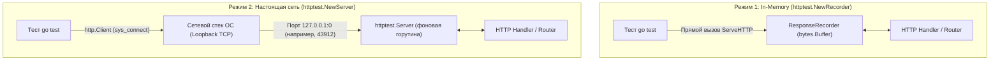

## Вертикальный срез: Тестирование системы целиком

Юнит-тесты проверяют отдельные шестеренки механизма в изоляции. Тесты репозиториев — например, разобранные нами в [[3. Транзакции и rollback подход]] — гарантируют, что шестеренки корректно передают вращение на вал базы данных. Однако конечный пользователь или сторонний сервис никогда не вызывает ваши Go-функции напрямую через структуры и интерфейсы. Клиент взаимодействует с системой через сетевой фасад — HTTP REST API.

HTTP интеграционные тесты (в литературе их часто называют сквозными компонентными тестами или тестированием подсистем) верифицируют **вертикальный срез (Vertical Slice)** приложения. 

В таком тесте мы моделируем реальное поведение внешнего мира: отправляем HTTP-запрос по сети, наблюдаем, как он проходит через всю цепочку обработки — сетевой стек ядра Linux $\rightarrow$ мультиплексор маршрутизатора $\rightarrow$ промежуточные слои (Middleware: трассировка, аутентификация, сжатие) $\rightarrow$ контроллер $\rightarrow$ валидация DTO $\rightarrow$ доменная бизнес-логика $\rightarrow$ репозиторий $\rightarrow$ реальная база данных, — а затем возвращается обратно в виде сформированного HTTP-ответа и обновленного состояния на диске.

```
Сетевой запрос (HTTP POST) 
   │
   ▼
[Сетевой стек ОС (TCP)] ──> [Middleware цепочка] ──> [Router / Handler]
                                                           │
                                                           ▼
                                                    [Service / UseCase]
                                                           │
                                                           ▼
[Клиентский HTTP Ответ] <── [JSON Сериализация] <── [БД: PostgreSQL/WAL]
```

Это тесты с наивысшим коэффициентом доверия (High Confidence). Вы можете полностью переписать внутреннюю структуру пакетов, оптимизировать запросы или заменить библиотеки валидации — если вертикальный HTTP-тест проходит успешно, система работает в строгом соответствии с бизнес-требованиями.

---

## In-Memory (Recorder) vs TCP (Server)

В стандартной библиотеке Go заложен эталонный инструмент для сетевого тестирования — пакет `net/http/httptest` (детальное исследование его внутренностей ожидает нас в [[1. net_http_httptest пакет]]). При проектировании интеграционных проверок инженер неизменно сталкивается с выбором между двумя фундаментальными подходами: `httptest.NewRecorder` и `httptest.NewServer`.

> [!info] Под капотом: Mechanical Sympathy
> **`httptest.NewRecorder()`** конструирует в оперативной памяти легковесную структуру `ResponseRecorder`, удовлетворяющую интерфейсу `http.ResponseWriter`. 
> 
> Когда вы передаете эту структуру в обработчик, сетевого обмена не происходит вовсе. Вызов метода `ServeHTTP(recorder, req)` — это обыкновенный синхронный вызов функции в текущем стеке горутины. Никаких системных вызовов (syscalls), никаких сокетов и буферов ядра. Байты ответа просто дописываются в слайс `bytes.Buffer`. Это работает со скоростью сотен тысяч вызовов в секунду, но абсолютно слепо к сетевым аномалиям.
> 
> **`httptest.NewServer()`** запускает полноценный боевой HTTP-сервер в фоновой горутине. 
> На уровне ядра операционной системы выполняется системный вызов `bind` к адресу `127.0.0.1:0`. Указание порта `0` — это стандартная инструкция для Linux: «выдели любой свободный эфемерный порт (ephemeral port) из диапазона `/proc/sys/net/ipv4/ip_local_port_range`». Ядро резервирует свободный порт (например, `43912`), после чего сервер открывает сокет и переходит в режим `listen`. Тестовый HTTP-клиент подключается к нему через честное TCP-соединение с полным циклом трехстороннего рукопожатия (Three-Way Handshake: SYN, SYN-ACK, ACK).

Наглядно сопоставим эти два пути:



Для полноценных интеграционных проверок архитектурно правильнее отдавать предпочтение **`httptest.NewServer()`**. 

Хотя накладные расходы на сокеты составляют дополнительные доли миллисекунды, реальный сервер проверяет жизненно важные аспекты: корректность заголовков управления соединением `Connection: keep-alive` или `close`, работу потоковой передачи данных (Chunked Transfer Encoding), поведение потоков сжатия gzip, обработку обрыва соединения клиентом (`http.CloseNotifier` / отмена контекста запроса) и лимиты на размер заголовков. 

Благодаря динамическому выделению случайных портов ядром, `httptest.NewServer()` безупречно масштабируется и поддерживает запуск параллельных тестов с флагом `t.Parallel()`.

---

## Архитектура теста: Паттерн "Test Application"

В зрелых проектах интеграционные тесты не должны тонуть в рутине ручного создания соединений с базой данных, сборки графа зависимостей и конфигурирования серверов. Для этого проектируется специальный фасад окружения — паттерн **Test Application** (или `TestEnv` / `TestApp`).

Структура `TestApp` объединяет все компоненты запущенного стенда и инкапсулирует аккуратную очистку ресурсов через `t.Cleanup`:

```go
package integration_test

import (
	"context"
	"net/http"
	"net/http/httptest"
	"testing"

	"github.com/jackc/pgx/v5/pgxpool"
	"github.com/stretchr/testify/require"
	"yourproject/internal/api"
	"yourproject/internal/repository"
	"yourproject/internal/service"
)

// TestApp агрегирует запущенные подсистемы для сквозного тестирования
type TestApp struct {
	Server *httptest.Server
	DB     *pgxpool.Pool
	Client *http.Client
}

// setupTestApp поднимает боевой граф зависимостей с тестовыми хранилищами
func setupTestApp(t *testing.T) *TestApp {
	t.Helper()

	// 1. Извлекаем пул тестовой базы данных (например, поднятой через Testcontainers)
	dbPool := getTestDBPool(t)

	// 2. Инициализируем реальные слои доменной логики
	userRepo := repository.NewUserRepo(dbPool)
	userSvc := service.NewUserService(userRepo)

	// 3. Собираем реальный HTTP-роутер приложения со всеми middleware
	router := api.NewRouter(userSvc)

	// 4. Поднимаем реальный тестовый HTTP-сервер на эфемерном порту
	server := httptest.NewServer(router)

	// 5. Регистрируем гарантированное закрытие сетевого сокета
	t.Cleanup(func() {
		server.Close()
	})

	return &TestApp{
		Server: server,
		DB:     dbPool,
		// server.Client() возвращает готовый *http.Client, преднастроенный под сетевой адрес сервера
		Client: server.Client(),
	}
}
```

---

## Полный цикл: От JSON до базы и обратно

Напишем эталонный интеграционный тест, проверяющий создание учетной записи пользователя. Тест выполнит полный оборот:
1. Сериализует JSON и отправит его методом POST на динамический URL нашего `httptest.Server`.
2. Проверит заголовки, HTTP статус-код и структуру возвращенного JSON-тела.
3. **Напрямую обратится в PostgreSQL**, минуя HTTP-слой, чтобы убедиться: транзакция зафиксирована, и записи физически присутствуют в таблице.

```go
package integration_test

import (
	"context"
	"encoding/json"
	"net/http"
	"strings"
	"testing"

	"github.com/stretchr/testify/require"
)

func TestAPI_CreateUser_Success(t *testing.T) {
	t.Parallel()

	// Поднимаем изолированное тестовое приложение
	app := setupTestApp(t)

	// 1. Arrange: Формируем полезную нагрузку
	reqBody := `{"name": "Gopher", "email": "gopher@golang.org"}`

	// Формируем целевой URL (app.Server.URL хранит адрес вроде "http://127.0.0.1:43912")
	req, err := http.NewRequest(http.MethodPost, app.Server.URL+"/api/v1/users", strings.NewReader(reqBody))
	require.NoError(t, err)
	req.Header.Set("Content-Type", "application/json")

	// 2. Act: Выполняем сетевой запрос через реальный сокет
	resp, err := app.Client.Do(req)
	require.NoError(t, err)
	defer resp.Body.Close()

	// 3. Assert HTTP Layer: Проверяем транспортный контракт
	require.Equal(t, http.StatusCreated, resp.StatusCode)
	require.Equal(t, "application/json", resp.Header.Get("Content-Type"))

	var respPayload struct {
		ID    int64  `json:"id"`
		Name  string `json:"name"`
		Email string `json:"email"`
	}
	err = json.NewDecoder(resp.Body).Decode(&respPayload)
	require.NoError(t, err)
	require.Greater(t, respPayload.ID, int64(0), "Идентификатор созданной сущности должен быть положительным")
	require.Equal(t, "Gopher", respPayload.Name)
	require.Equal(t, "gopher@golang.org", respPayload.Email)

	// 4. Assert Database Layer: Проверяем состояние на диске
	// Идем напрямую в базу данных, проверяя отсутствие транзакционных аномалий
	var dbName, dbEmail string
	err = app.DB.QueryRow(context.Background(),
		"SELECT name, email FROM users WHERE id = $1", respPayload.ID,
	).Scan(&dbName, &dbEmail)

	require.NoError(t, err, "Созданная запись обязана существовать в таблице users")
	require.Equal(t, "Gopher", dbName)
	require.Equal(t, "gopher@golang.org", dbEmail)
}
```

> [!warning] Ловушка / Gotcha: Внешние системы в E2E
> Если обработчик создания пользователя в рамках бизнес-транзакции обращается к внешнему провайдеру (например, шлет запрос в Stripe API для регистрации банковской карты или в SendGrid для отправки письма с подтверждением), то без изоляции интеграционный тест попытается совершить реальный запрос в публичный интернет. 
> 
> Это приведет к катастрофе: исчерпанию лимитов (Rate Limiting), падениям из-за отсутствия боевых API-ключей в CI и чудовищной медлительности. 
> В интеграционных тестах вашего сервиса **все внешние исходящие HTTP-вызовы должны быть изолированы и детерминированы**.

> [!tip] Собеседование
> **Вопрос:** Почему при тестировании HTTP-клиентов и хэндлеров критически важно обязательно вызывать `defer resp.Body.Close()`, даже если тест проверяет только код статуса (например, `404 Not Found`)?
> 
> **Ответ:** Это вопрос на понимание пула соединений в структуре `http.Transport`. 
> 
> Клиент Go поддерживает повторное использование TCP-сокетов (HTTP Keep-Alive). Сокет может вернуться в свободный пул (`Connection Pool`) только в том случае, если входящий буфер ответа был полностью прочитан до конца (`EOF`) и явно закрыт методом `Close()`. 
> 
> Если тело ответа `resp.Body` не закрыто, базовое TCP-соединение зависает в неопределенном состоянии. В сьюте из сотен параллельных тестов это быстро исчерпывает таблицу дескрипторов ядра, порождая фатальную ошибку операционной системы: `too many open files` (EMFILE). 
> 
> Правило хорошего тона: если тело вам не нужно, сбросьте его в пустоту и закройте:
> ```go
> io.Copy(io.Discard, resp.Body)
> resp.Body.Close()
> ```

---

## Резюме

1. **HTTP интеграционные тесты** проверяют полный вертикальный срез сервиса: от сырых сетевых байтов на сокете до коммита транзакции в постоянное хранилище.
2. Для тестирования сквозных сценариев выбирайте **`httptest.NewServer()`** вместо `httptest.NewRecorder()`. Реальный системный вызов `bind` на адрес `127.0.0.1:0` с выделением эфемерного порта проверяет работу сетевого стека ядра, заголовков и пулов соединений.
3. Инкапсулируйте окружение в паттерн **Test Application** (`TestApp`), делегируя очистку ресурсов механизму `t.Cleanup`.
4. Всегда проверяйте побочные эффекты (Side Effects): успешного HTTP-статуса `200 OK` недостаточно — необходимо верифицировать физическое состояние базы данных.

Но как быть, если наш сервис вынужден делать исходящие HTTP-запросы во внешние сторонние системы (платежные шлюзы, CRM, внешние микросервисы)? Как эмулировать их поведение локально, быстро и без обращения в интернет? Об этом пойдет речь в следующей главе: [[9. Тестирование внешних API]].