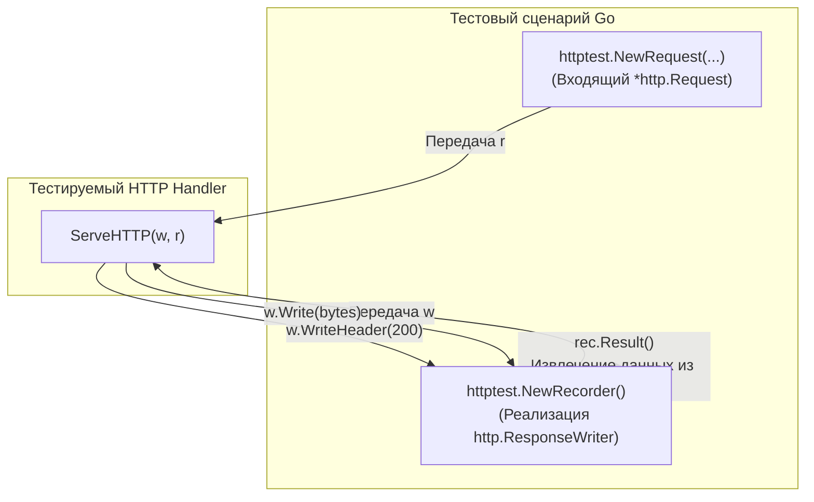

## Стандарт, опередивший индустрию

В большинстве популярных стеков веб-разработки (будь то Java со Spring Boot, C# с ASP.NET Core или Python с Django) тестирование HTTP-слоя традиционно сопряжено с немалыми накладными расходами. Инженеру приходится либо поднимать тяжеловесный контейнер внедрения зависимостей с прогоном сотен рефлексивных аннотаций, либо задействовать сторонние фреймворки мокирования, подменяющие глобальный контекст приложения.

В экосистеме Go изначально был выбран принципиально иной путь. Поскольку Go проектировался инженерами Bell Labs и Google специально для сетевых распределенных служб, первоклассные инструменты для тестирования HTTP были заложены непосредственно в стандартную библиотеку — в пакет `net/http/httptest`.

Триумф дизайна `httptest` кроется в элегантной простоте фундаментального интерфейса `http.ResponseWriter`. Бизнес-код обработчика оперирует абстракцией: ему нет никакого дела до того, куда физически направляются байты — в реальный сетевой сокет ядра операционной системы или в простой динамический слайс оперативной памяти.

Пакет `net/http/httptest` предлагает два взаимодополняющих инструмента:
1. `httptest.ResponseRecorder` — для молниеносного «in-memory» тестирования функций-обработчиков (максимальная изоляция, нулевой сетевой оверхед).
2. `httptest.Server` — для сквозного тестирования через реальный TCP-сокет операционной системы (подробно разобранный нами в [[8. HTTP integration тесты]]).

В этой главе мы сосредоточимся на тонкостях in-memory тестирования контрактов API с использованием `ResponseRecorder` и `NewRequest`.

---

## httptest.ResponseRecorder: Иллюзия сети

Когда боевой веб-сервер Go (`http.Server`) принимает входящее сетевое соединение, рантайм создает неэкспортируемую структуру `*http.response`. 

Эта структура реализует интерфейс `http.ResponseWriter` и неразрывно связана с дескриптором сетевого сокета (`net.Conn`). Любой вызов метода `w.Write()` запускает цепочку буферизованной записи, переходящую в системный вызов ядра `write` или `send`. Процессор вынужден совершать дорогостоящее переключение контекста (Context Switch) из пользовательского пространства (User Space) в пространство ядра (Kernel Space), помещая сформированные TCP-сегменты в кольцевой буфер сетевого адаптера.

`httptest.ResponseRecorder` заменяет эту сложную системную машинерию чистой работой с памятью текущего процесса.

> [!info] Под капотом: Устройство ResponseRecorder
> Обратимся к исходному коду стандартной библиотеки Go (`net/http/httptest/recorder.go`):
> ```go
> type ResponseRecorder struct {
>     Code      int           // Зафиксированный HTTP статус-код
>     HeaderMap http.Header   // Ассоциативный массив HTTP-заголовков
>     Body      *bytes.Buffer // Буфер для записи тела ответа в оперативной памяти
>     Flushed   bool          // Флаг принудительного сброса буфера
>     // ... внутренние поля состояния
> }
> ```
> Когда тестируемый хэндлер вызывает `w.Write([]byte("ok"))`, данные тривиально дописываются в слайс байтов внутреннего `bytes.Buffer`. 
> 
> Никаких системных вызовов, никакой возни с сокетами, TCP-окнами и сетевыми тайм-аутами. Процессор исполняет операции исключительно в пределах L1/L2 кэша. Это позволяет прогонять сотни тысяч таких тестов за секунду на единственном ядре процессора в параллельном режиме.



---

## httptest.NewRequest vs http.NewRequest

Для непосредственного вызова сигнатуры `ServeHTTP(w http.ResponseWriter, r *http.Request)` нам необходим экземпляр `*http.Request`. 

Начинающие разработчики часто конструируют его через стандартный `http.NewRequest` из пакета `net/http`. Однако этот путь чреват скрытыми дефектами.

> [!warning] Ловушка / Gotcha: Входящий vs Исходящий запрос
> Функция `http.NewRequest` предназначена для создания **исходящего** клиентского запроса — того, который клиент собирается отправить по сети наружу.
> 
> Функция `httptest.NewRequest` конструирует **входящий** запрос — структуру, которая с точки зрения сервера имитирует уже полученный из сокета HTTP-пакет.
> 
> Разница фундаментальна:
> 1. `httptest.NewRequest` автоматически инициализирует системные поля, которые сервер ожидает увидеть заполненными, например `RemoteAddr` (по умолчанию выставляется фиктивный IP-адрес `192.0.2.1:1234`) и `RequestURI`. Если в вашем хэндлере или слое middleware присутствует логирование клиентского адреса через `r.RemoteAddr` или аудит IP-адресов, вызов через обычный `http.NewRequest` оставит поле пустым. Попытка распарсить пустую строку в коде приведет к неожиданной аварийной остановке (`panic`).
> 2. `httptest.NewRequest` намеренно не возвращает ошибку (`error`). При передаче заведомо некорректного URL функция сразу провоцирует `panic`. Для тестового кода это благо: мы избавляемся от шаблонных проверок `if err != nil`, сохраняя тест лаконичным и читаемым.

---

## Идиоматичный тест In-Memory

Спроектируем эталонный тест для обработчика проверки работоспособности сервиса (`HealthCheckHandler`), используя возможности `ResponseRecorder`:

```go
package api_test

import (
	"encoding/json"
	"net/http"
	"net/http/httptest"
	"testing"

	"github.com/stretchr/testify/require"
)

// HealthCheckHandler — тестируемый обработчик состояния сервиса
func HealthCheckHandler(w http.ResponseWriter, r *http.Request) {
	if r.Method != http.MethodGet {
		http.Error(w, "Method Not Allowed", http.StatusMethodNotAllowed)
		return
	}

	w.Header().Set("Content-Type", "application/json")
	w.WriteHeader(http.StatusOK)
	_ = json.NewEncoder(w).Encode(map[string]string{
		"status": "pass",
	})
}

func TestHealthCheckHandler(t *testing.T) {
	t.Parallel()

	// 1. Arrange: Создаем фиктивный входящий запрос и перехватчик ответа
	req := httptest.NewRequest(http.MethodGet, "/health", nil)
	rec := httptest.NewRecorder()

	// 2. Act: Вызываем обработчик напрямую как обычную функцию в текущем стеке
	HealthCheckHandler(rec, req)

	// 3. Assert: Извлекаем снимок сформированного HTTP-ответа
	res := rec.Result()
	defer res.Body.Close()

	// Проверяем корректность статус-кода
	require.Equal(t, http.StatusOK, res.StatusCode)

	// Проверяем транспортные заголовки
	require.Equal(t, "application/json", res.Header.Get("Content-Type"))

	// Десериализуем и валидируем тело ответа
	var payload map[string]string
	err := json.NewDecoder(res.Body).Decode(&payload)
	require.NoError(t, err)
	require.Equal(t, "pass", payload["status"])
}
```

> [!tip] Собеседование
> **Вопрос:** Почему в тестах с `ResponseRecorder` настоятельно рекомендуется обращаться к методу `rec.Result()`, а не читать свойства `rec.Code` и строковое представление `rec.Body.String()` напрямую?
> 
> **Ответ:** Чтение полей структуры напрямую — устаревший паттерн времен Go 1.6. Метод `rec.Result()`, возвращающий канонический `*http.Response`, производит симуляцию неявного поведения реального рантайма `http.Server`.
> 
> В боевом сервере Go, если хэндлер начал писать данные через `w.Write()`, но забыл предварительно вызвать `w.WriteHeader()`, сервер автоматически:
> 1. Выставляет код ответа `200 OK`.
> 2. Определяет тип содержимого по первым 512 байтам данных через алгоритм `http.DetectContentType`.
> 
> Если вы прочитаете сырое поле `rec.Code` напрямую, там останется нулевое значение `0`, и ваш тест упадет ложноположительно. Вызов же `rec.Result()` аккуратно применит эти правила по умолчанию, обеспечивая стопроцентное совпадение с поведением продакшена.

---

## Тестирование контекста (Context Cancellation)

В современных высоконагруженных микросервисах на Go обработчики обязаны бережно расходовать ресурсы и мгновенно прекращать тяжелые вычисления, если клиент разорвал соединение (закрыл вкладку браузера или сработал внешний тайм-аут).

Оповещение об отмене сетевого соединения поступает через канал закрытия `r.Context().Done()`. Но как протестировать эту реакцию в рамках in-memory теста, где нет реального сетевого сокета?

Функция `httptest.NewRequest` инициализирует запрос с корневым контекстом `context.Background()`. Чтобы смоделировать обрыв, мы создаем отменяемый контекст и внедряем его в запрос через метод `req.WithContext()`:

```go
func TestHeavyJobHandler_ClientDisconnect(t *testing.T) {
	t.Parallel()

	// Создаем контекст с явным управлением отменой
	ctx, cancel := context.WithCancel(context.Background())

	req := httptest.NewRequest(http.MethodGet, "/api/heavy-computation", nil)
	// Внедряем отменяемый контекст во входящий запрос
	req = req.WithContext(ctx)

	rec := httptest.NewRecorder()

	// Имитируем ситуацию: клиент разорвал соединение до завершения работы обработчика
	cancel()

	// Вызываем наш хэндлер
	HeavyComputationHandler(rec, req)

	res := rec.Result()
	defer res.Body.Close()

	// Убеждаемся, что хэндлер не стал тратить ресурсы CPU,
	// а корректно отреагировал на закрытие ctx.Done()
	require.Equal(t, 499, res.StatusCode) // 499 Client Closed Request (Nginx-style)
}
```

---

## Итог

Пакет `net/http/httptest` воплощает в себе лучшие инженерные принципы языка Go:
1. Использование полиморфизма интерфейса `http.ResponseWriter` позволяет выполнять сквозные проверки обработчиков прямо в оперативной памяти с помощью `httptest.ResponseRecorder`.
2. Конструктор `httptest.NewRequest` формирует семантически корректный входящий запрос с заполненными системными метаданными (`RemoteAddr`, `RequestURI`).
3. Метод `rec.Result()` воспроизводит неявное поведение сетевого сервера, гарантируя детерминированность проверок.
4. Механизм контекста запроса (`r.Context().Done()`) легко поддается проверке без создания реальных задержек и сокетов.

Освоив фундамент `httptest`, мы можем перейти к следующему уровню: проектированию модульных тестов для сложных обработчиков с внедрением доменных зависимостей, валидацией параметров путей и защитой от утечек памяти: [[2. Тестирование handler функций]].