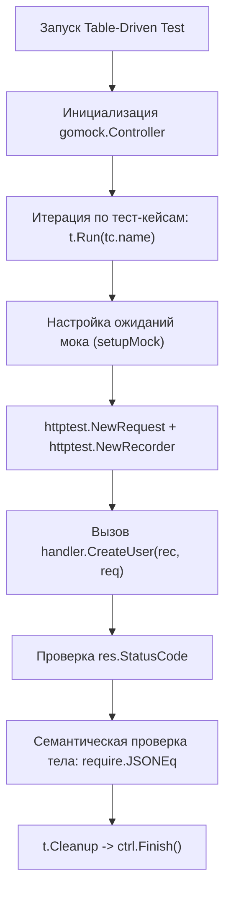

## Граница между HTTP и Бизнес-логикой

В предыдущей главе [[1. net_http_httptest пакет]] мы исследовали низкоуровневые строительные блоки пакета `net/http/httptest`, научившись порождать входящие сетевые запросы и собирать ответы в буферах оперативной памяти. Теперь настало время подняться на следующий архитектурный ярус — к уровню **HTTP-обработчиков (Handlers)**, которые в классической терминологии MVC и Clean Architecture часто называют контроллерами или первичными адаптерами.

Главная ошибка начинающих разработчиков при тестировании хэндлеров — попытка возложить на них проверку всей бизнес-логики сервиса. 

Опытный инженер четко осознает границы ответственности: **HTTP-хэндлер — это всего лишь транспортный переводчик**. Его задача сводится к четырем базовым операциям:
1. Десериализовать и валидировать входящие транспортные данные (разобрать параметры URL-пути, query-параметры, заголовки, тело JSON).
2. Перевести транспортные структуры (DTO) в доменные типы и передать их в сервисный слой (Use Case / Service Layer).
3. Принять результат или доменную ошибку и транслировать её в семантически корректный HTTP-статус (например, доменная ошибка `ErrNotFound` трансформируется в статус `404 Not Found`, а `ErrConflict` — в `409 Conflict`).
4. Сериализовать ответ в байты нужного формата (JSON, XML или Protocol Buffers) и выставить необходимые HTTP-заголовки (`Content-Type: application/json`).

Юнит-тест хэндлера обязан тестировать **только этот транспортный шлюз**. Бизнес-логика, транзакции базы данных и обращение к дискам должны оставаться за пределами его внимания.

---

## Архитектура: Инъекция зависимостей (DI)

Чтобы обработчик можно было тестировать в строгой изоляции за микросекунды, код обязан следовать принципам [[8. Dependency injection для тестируемости]]. Если обработчик обращается к глобальным переменным базы данных или напрямую создает экземпляры клиентов внешних служб внутри тела функции, изолированное тестирование становится невозможным.

Идиоматичный подход в Go заключается в определении минимального интерфейса потребителя и передаче зависимости в конструктор структуры хэндлера:

```go
package api

import (
	"context"
	"encoding/json"
	"errors"
	"net/http"
)

// Ошибки предметной области
var (
	ErrNotFound      = errors.New("пользователь не найден")
	ErrAlreadyExists = errors.New("пользователь с таким email уже зарегистрирован")
)

// UserService — узкий интерфейс бизнес-логики, необходимый хэндлеру
type UserService interface {
	Create(ctx context.Context, email string) (int, error)
}

// UserHandler инкапсулирует зависимость от бизнес-сервиса
type UserHandler struct {
	service UserService
}

func NewUserHandler(s UserService) *UserHandler {
	return &UserHandler{service: s}
}

// CreateUser обрабатывает запрос на создание пользователя
func (h *UserHandler) CreateUser(w http.ResponseWriter, r *http.Request) {
	var req struct {
		Email string `json:"email"`
	}

	// 1. Потоковое чтение и парсинг входящего JSON
	if err := json.NewDecoder(r.Body).Decode(&req); err != nil {
		w.Header().Set("Content-Type", "application/json")
		w.WriteHeader(http.StatusBadRequest)
		_, _ = w.Write([]byte(`{"error": "bad request"}`))
		return
	}

	// 2. Вызов бизнес-логики с пробросом контекста запроса
	id, err := h.service.Create(r.Context(), req.Email)
	if err != nil {
		w.Header().Set("Content-Type", "application/json")
		switch {
		case errors.Is(err, ErrAlreadyExists):
			w.WriteHeader(http.StatusConflict)
			_, _ = w.Write([]byte(`{"error": "conflict"}`))
		default:
			w.WriteHeader(http.StatusInternalServerError)
			_, _ = w.Write([]byte(`{"error": "internal"}`))
		}
		return
	}

	// 3. Формирование успешного ответа
	w.Header().Set("Content-Type", "application/json")
	w.WriteHeader(http.StatusCreated)
	_ = json.NewEncoder(w).Encode(map[string]int{"id": id})
}
```

---

## Анатомия Table-Driven Теста

Один HTTP-эндпоинт всегда обладает разветвленной сетью граничных сценариев: успешное создание (Happy Path), битый JSON-пакет, дубликат email, падение нижележащего хранилища. Это делает хэндлеры идеальными кандидатами для паттерна табличных тестов — [[4. Table driven tests]].



Для генерации мок-реализации интерфейса `UserService` воспользуемся `gomock` (актуальная библиотека: `go.uber.org/mock/gomock`):

```go
package api_test

import (
	"bytes"
	"context"
	"net/http"
	"net/http/httptest"
	"testing"

	"github.com/stretchr/testify/require"
	"go.uber.org/mock/gomock"

	"yourproject/internal/api"
	"yourproject/internal/mocks" // Пакет со сгенерированным MockUserService
)

func TestUserHandler_CreateUser(t *testing.T) {
	t.Parallel()

	// 1. Декларативное описание схемы сценария
	type testCase struct {
		name           string
		requestBody    string
		setupMock      func(m *mocks.MockUserService)
		expectedStatus int
		expectedJSON   string
	}

	// 2. Набор тест-кейсов
	testCases := []testCase{
		{
			name:        "Happy Path: Успешное создание",
			requestBody: `{"email": "test@example.com"}`,
			setupMock: func(m *mocks.MockUserService) {
				// Проверяем факт вызова метода с ожидаемым аргументом ровно 1 раз
				m.EXPECT().
					Create(gomock.Any(), "test@example.com").
					Return(42, nil).
					Times(1)
			},
			expectedStatus: http.StatusCreated,
			expectedJSON:   `{"id": 42}`,
		},
		{
			name:        "Bad Request: Невалидный JSON",
			requestBody: `{"email": "test...`, // Синтаксически сломанный JSON
			setupMock: func(m *mocks.MockUserService) {
				// При ошибке парсинга сервис НЕ должен вызываться вовсе
			},
			expectedStatus: http.StatusBadRequest,
			expectedJSON:   `{"error": "bad request"}`,
		},
		{
			name:        "Conflict: Пользователь уже зарегистрирован",
			requestBody: `{"email": "exist@example.com"}`,
			setupMock: func(m *mocks.MockUserService) {
				m.EXPECT().
					Create(gomock.Any(), "exist@example.com").
					Return(0, api.ErrAlreadyExists).
					Times(1)
			},
			expectedStatus: http.StatusConflict,
			expectedJSON:   `{"error": "conflict"}`,
		},
		{
			name:        "Internal Error: Сбой сервисного слоя",
			requestBody: `{"email": "crash@example.com"}`,
			setupMock: func(m *mocks.MockUserService) {
				m.EXPECT().
					Create(gomock.Any(), "crash@example.com").
					Return(0, api.ErrNotFound).
					Times(1)
			},
			expectedStatus: http.StatusInternalServerError,
			expectedJSON:   `{"error": "internal"}`,
		},
	}

	// 3. Параллельное исполнение сценариев
	for _, tc := range testCases {
		tc := tc // Защитный захват переменной замыкания (актуально для Go < 1.22)
		t.Run(tc.name, func(t *testing.T) {
			t.Parallel()

			// Инициализируем контроллер моков
			ctrl := gomock.NewController(t)

			mockSvc := mocks.NewMockUserService(ctrl)
			tc.setupMock(mockSvc)

			handler := api.NewUserHandler(mockSvc)

			// Создаем искусственный входящий запрос и перехватчик ответа
			req := httptest.NewRequest(http.MethodPost, "/users", bytes.NewBufferString(tc.requestBody))
			rec := httptest.NewRecorder()

			// Act: Прямой вызов обработчика в памяти
			handler.CreateUser(rec, req)

			// Assert: Проверяем транспортный контракт
			res := rec.Result()
			defer res.Body.Close()

			require.Equal(t, tc.expectedStatus, res.StatusCode)

			// Семантическая валидация JSON-ответа
			require.JSONEq(t, tc.expectedJSON, rec.Body.String())
		})
	}
}
```

---

## Ловушки и лучшие практики

### 1. require.JSONEq вместо require.Equal

> [!tip] Собеседование
> **Вопрос:** Почему при сравнении тел HTTP-ответов в Go категорически не рекомендуется использовать посимвольное сравнение строк через `require.Equal(t, expectedStr, actualStr)`?
> 
> **Ответ:** По трем фундаментальным причинам:
> 1. Метод `json.NewEncoder(w).Encode(...)` по спецификации всегда дописывает символ перевода строки `\n` в конец потока байтов. Сравнение строк через `Equal` гарантированно сломается из-за невидимого `\n`.
> 2. Порядок сериализации ключей в типах `map` в языке Go намеренно рандомизирован рантаймом. Один и тот же словарь `{"a": 1, "b": 2}` может превратиться в `{"b": 2, "a": 1}`.
> 3. Различия в пробелах и отступах (pretty print vs compact) не должны приводить к падению тестов.
> 
> Метод `require.JSONEq` десериализует обе строки во внутреннее AST-дерево и производит семантическое сравнение структуры данных независимо от форматирования.

---

### 2. Передача Контекста (Mechanical Sympathy)

В строке `m.EXPECT().Create(gomock.Any(), "test@example.com")` мы использовали обобщенный матчер `gomock.Any()` для проверки контекста. В простых тестах это допустимо, но в критических компонентах это скрывает опасную ошибку: потерю контекста.

Если невнимательный разработчик внутри хэндлера передаст в сервис `context.Background()` вместо `r.Context()`, то при обрыве HTTP-соединения клиентом дорогостоящий SQL-запрос в базе данных продолжит выполняться, растрачивая процессорные ресурсы сервера впустую.

Для строгой верификации проброса контекста запроса используется проверка типов или инспекция значений:

```go
m.EXPECT().
	Create(gomock.AssignableToTypeOf(context.Background()), "test@example.com").
	DoAndReturn(func(ctx context.Context, email string) (int, error) {
		// Убеждаемся, что контекст не был подменен на пустой Background
		require.NotNil(t, ctx.Done(), "Контекст обязан быть отменяемым контекстом HTTP-запроса")
		return 42, nil
	})
```

---

### 3. Производительность: Decoder vs Unmarshal

В теле обработчика мы применили конструкцию:
```go
json.NewDecoder(r.Body).Decode(&req)
```

> [!info] Под капотом
> Тело запроса `r.Body` реализует потоковый интерфейс `io.ReadCloser`.
> 
> Вызов `json.NewDecoder` считывает байты порциями напрямую из сетевого буфера сокета (или внутреннего буфера памяти в `httptest`) по мере синтаксического разбора токенов JSON. Это исключает необходимость предварительного выделения единого непрерывного блока памяти в куче (Heap).
> 
> Альтернативный подход, часто встречающийся в любительском коде:
> ```go
> bodyBytes, _ := io.ReadAll(r.Body)
> json.Unmarshal(bodyBytes, &req)
> ```
> Функция `io.ReadAll` принудительно вычитывает весь входящий поток целиком в непрерывный слайс байтов. Если злоумышленник или невнимательный клиент пришлет полезную нагрузку размером в 50 мегабайт, `io.ReadAll` мгновенно выделит 50 МБ в оперативной памяти, вызвав аллокационный всплеск и внеочередную паузу сборщика мусора (Garbage Collector Stop-the-World).
> 
> В тестах мы эмулируем входящий поток `r.Body` через структуру `bytes.NewBufferString`, проверяя корректность именно потокового разбора данных.

---

## Итог

Тестирование хэндлеров — это самый быстрый, дешевый и точный способ верификации контрактов API на уровне модульных тестов:
1. Хэндлеры не должны тестировать бизнес-логику; их задача — адаптация транспортного протокола HTTP.
2. Внедрение зависимостей через интерфейсы позволяет изолировать транспортный слой с помощью моков `gomock`.
3. Подход **Table-Driven Tests** дает возможность компактно выразить десятки граничных сценариев в единой декларативной таблице.
4. Сравнение JSON-ответов обязано производиться через семантический `require.JSONEq`, а не через посимвольный `require.Equal`.

Однако в реальных приложениях входящий запрос редко попадает в хэндлер напрямую: путь ему преграждает цепочка промежуточных перехватчиков (Middleware), отвечающих за авторизацию, аудит, сжатие и защиту от перегрузок. В следующей главе мы разберем, как элегантно тестировать этот критически важный слой: [[3. Middleware тестирование]].