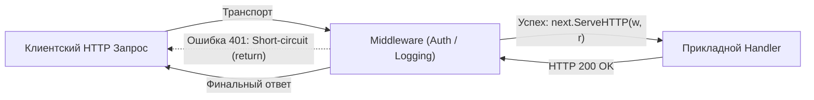

## Первая линия обороны

В предыдущей главе [[2. Тестирование handler функций]] мы рассматривали тестирование прикладных обработчиков в предположении, что входящий запрос уже благополучно преодолел сетевой периметр и доставлен прямо к порогу бизнес-логики. Однако в архитектуре реальных production-систем хэндлер — это лишь внутренняя сердцевина слоеной луковицы. Прежде чем поток управления коснется контроллера, входящий HTTP-пакет проходит через эшелонированную цепочку промежуточного программного обеспечения — **Middleware**.

Мидлвари реализуют классический архитектурный паттерн *Chain of Responsibility* (Цепочка обязанностей). На их плечи ложится вся сквозная инфраструктурная забота:
- Проверка аутентификации и декодирование JWT-токенов.
- Авторизация и разграничение прав доступа (RBAC).
- Структурированное логирование и распределенный трейсинг (OpenTelemetry / W3C TraceContext).
- Защита от перегрузок и атак типа DDoS (Rate Limiting).
- Восстановление после аварийных ситуаций (Panic Recovery).
- Обогащение контекста запроса метаданными (Correlation ID, профиль пользователя).

Масштаб ответственности колоссален: ошибка в прикладном хэндлере затронет один конкретный сценарий одного пользователя. Ошибка в слое Auth-мидлвари приведет к катастрофической утечке конфиденциальных данных или полному отказу (Downtime) всей платформы. Поэтому изоляция и строгое модульное тестирование каждого звена этой цепочки — первостепенная инженерная обязанность.

---

## Архитектура Middleware в Go

Канонический мидлварь в стандартной библиотеке Go представляет собой функцию высшего порядка с предельно выразительной сигнатурой: она принимает следующий по цепочке интерфейс `http.Handler` и возвращает новый обернутый `http.Handler` (как правило, используя адаптер `http.HandlerFunc`):

```go
type Middleware func(http.Handler) http.Handler
```



Любой промежуточный обработчик реализует один из двух сценариев поведения:
1. **Сквозной пропуск (Pass-through):** Запрос полностью валиден. Мидлварь обогащает контекст (`r.WithContext(ctx)`) и делегирует выполнение следующему звену вызовом `next.ServeHTTP(w, r)`.
2. **Короткое замыкание (Short-circuit):** Запрос не прошел проверку (отсутствует токен, превышена квота запросов). Мидлварь фиксирует код ошибки в объекте `w`, отправляет ответ клиенту и **немедленно прерывает исполнение оператором `return`**, не позволяя запросу дойти до бизнес-кода.

---

## Стратегия тестирования: Dummy Handler

Как протестировать отдельный мидлварь в строгой изоляции — без подключения реальной базы данных, без развертывания роутера и без вызова тяжелых прикладных сервисов?

Для этого применяется проверенный паттерн **Dummy Handler (Фиктивный обработчик-шпион)**.

Идея заключается в создании минимальной заглушки для аргумента `next`. Этот фиктивный хэндлер выполняет единственную задачу: он фиксирует факт своего вызова, изменяя булеву переменную (`wasCalled = true`), и при необходимости сохраняет данные из контекста для последующей проверки. 

Обернув эту тестовую заглушку в наш мидлварь, мы запускаем его через `httptest` и математически строго проверяем:
- Был ли передан контроль дальше при валидных данных?
- Была ли цепочка жестко разорвана при ошибочном запросе?

---

### Реализация: Auth Middleware

Спроектируем компактный, но строгий мидлварь проверки Bearer-токена:

```go
package api

import (
	"context"
	"net/http"
	"strings"
)

// Кастомный строковый тип для ключа контекста исключает коллизии в сторонних пакетах
type contextKey string

const UserIDKey contextKey = "userID"

// AuthMiddleware проверяет авторизационный заголовок и внедряет UserID в контекст
func AuthMiddleware(next http.Handler) http.Handler {
	return http.HandlerFunc(func(w http.ResponseWriter, r *http.Request) {
		authHeader := r.Header.Get("Authorization")
		if authHeader == "" {
			http.Error(w, "missing token", http.StatusUnauthorized)
			return // КРИТИЧЕСКИ ВАЖНО: немедленный возврат!
		}

		parts := strings.Split(authHeader, " ")
		if len(parts) != 2 || parts[0] != "Bearer" || parts[1] != "secret-token" {
			http.Error(w, "invalid token", http.StatusUnauthorized)
			return // Прерываем цепочку
		}

		// Создаем новый контекст, содержащий извлеченный идентификатор
		ctx := context.WithValue(r.Context(), UserIDKey, 42)

		// Делегируем выполнение дальше, передавая запрос с обновленным контекстом
		next.ServeHTTP(w, r.WithContext(ctx))
	})
}
```

> [!info] Под капотом: r.WithContext и Escape Analysis
> Что в действительности происходит в оперативной памяти при вызове метода `r.WithContext(ctx)`?
> 
> Поскольку структура `http.Request` передается по указателю и может одновременно читаться другими горутинами, прямой мутации полей допускать нельзя (это немедленно спровоцировало бы Data Race). Поэтому метод `WithContext` производит **поверхностное копирование (Shallow Copy)** структуры `Request`, заменяя в новой копии лишь внутренний указатель `ctx`.
> 
> Так как функция возвращает указатель на новый экземпляр структуры, компилятор Go в процессе анализа побега (Escape Analysis) вынужден аллоцировать этот дубликат в динамической памяти (Heap). 
> 
> Из этого следует важный вывод в рамках **Mechanical Sympathy**: цепочка из двадцати мидлварей, каждый из которых вызывает `WithContext`, создает двадцать аллокаций в куче на один-единственный входящий запрос. В высоконагруженных системах метаданные стараются агрегировать в единую структуру перед внедрением в контекст.

---

### Пишем Table-Driven Test

Воспользуемся инструментарием `httptest` (детально изученным в [[1. net_http_httptest пакет]]) и организуем исчерпывающий табличный сьют ([[4. Table driven tests]]):

```go
package api_test

import (
	"net/http"
	"net/http/httptest"
	"testing"

	"github.com/stretchr/testify/require"
	"yourproject/internal/api"
)

func TestAuthMiddleware(t *testing.T) {
	t.Parallel()

	// 1. Описание таблицы тестовых сценариев
	type testCase struct {
		name           string
		authHeader     string
		expectedStatus int
		expectedNext   bool // Ожидается ли передача управления следующему звену?
	}

	testCases := []testCase{
		{
			name:           "Успешная авторизация по валидному Bearer токену",
			authHeader:     "Bearer secret-token",
			expectedStatus: http.StatusOK,
			expectedNext:   true,
		},
		{
			name:           "Отказ: Заголовок Authorization полностью отсутствует",
			authHeader:     "",
			expectedStatus: http.StatusUnauthorized,
			expectedNext:   false,
		},
		{
			name:           "Отказ: Передан некорректный секретный токен",
			authHeader:     "Bearer hacker-token",
			expectedStatus: http.StatusUnauthorized,
			expectedNext:   false,
		},
		{
			name:           "Отказ: Неверная схема авторизации (Basic вместо Bearer)",
			authHeader:     "Basic secret",
			expectedStatus: http.StatusUnauthorized,
			expectedNext:   false,
		},
	}

	for _, tc := range testCases {
		tc := tc // Захват переменной цикла для параллельного запуска
		t.Run(tc.name, func(t *testing.T) {
			t.Parallel()

			// 1. Инициализируем Dummy Handler-шпион
			var nextCalled bool
			var contextUserID any

			nextHandler := http.HandlerFunc(func(w http.ResponseWriter, r *http.Request) {
				nextCalled = true
				// Извлекаем значение из контекста для строгой верификации
				contextUserID = r.Context().Value(api.UserIDKey)
				w.WriteHeader(http.StatusOK)
			})

			// 2. Оборачиваем шпиона в тестируемый мидлварь
			handlerToTest := api.AuthMiddleware(nextHandler)

			// 3. Формируем входящий запрос и рекордер
			req := httptest.NewRequest(http.MethodGet, "/secure-resource", nil)
			if tc.authHeader != "" {
				req.Header.Set("Authorization", tc.authHeader)
			}
			rec := httptest.NewRecorder()

			// 4. Act: Запускаем исполнение цепочки в памяти
			handlerToTest.ServeHTTP(rec, req)

			// 5. Assert: Верифицируем сетевой контракт
			res := rec.Result()
			defer res.Body.Close()

			require.Equal(t, tc.expectedStatus, res.StatusCode)

			// КЛЮЧЕВАЯ ПРОВЕРКА: сработал ли Short-circuit?
			require.Equal(t, tc.expectedNext, nextCalled,
				"Поведение передачи управления в next.ServeHTTP не соответствует спецификации")

			// Проверяем корректность инъекции контекста при успешном сценарии
			if tc.expectedNext {
				require.NotNil(t, contextUserID, "UserID обязан присутствовать в контексте")
				require.Equal(t, 42, contextUserID)
			}
		})
	}
}
```

> [!warning] Ловушка / Gotcha: Утечка управления (Leak of control)
> Самая опасная уязвимость при реализации мидлварей — пропущенный оператор `return` после отправки сообщения об ошибке:
> ```go
> if !isValid {
>     http.Error(w, "forbidden", http.StatusForbidden)
>     // ЗАБЫЛИ НАПИСАТЬ return!
> }
> next.ServeHTTP(w, r)
> ```
> В этом сценарии клиент получит заголовок `403 Forbidden`, однако **код целевого хэндлера всё равно будет выполнен**! 
> 
> Если хэндлер выполняет необратимое действие (например, списывает деньги со счета или удаляет запись из базы данных), катастрофа неизбежна. Кроме того, когда последующий хэндлер попытается вызвать `w.WriteHeader(200)`, рантайм Go зафиксирует ошибку протокола: `multiple response.WriteHeader calls`.
> 
> Именно строгая проверка условия `nextCalled == false` в негативных тест-кейсах гарантирует защиту от утечек управления.

---

## Порядок мидлварей (Chain Ordering)

В реальных приложениях мидлвари собираются в длинные конвейеры с помощью мультиплексоров (например, метод `chi.Use` в роутере Chi) или вложенных функциональных композиций вида `Log(Recover(Auth(handler)))`.

> [!tip] Собеседование
> **Вопрос:** Предположим, в сервисе используются три базовых мидлвари: `Logger`, `Recoverer` (перехват паник) и `Auth`. В каком строгом порядке их необходимо регистрировать в HTTP-пайплайне и почему?
> 
> **Ответ:** Порядок регистрации имеет решающее значение для отказоустойчивости:
> 1. `Recoverer` обязан стоять **самым первым (внешним)**. Внутри него регистрируется отложенный вызов `defer recover()`. Если любая мидлварь или хэндлер ниже по стеку спровоцирует `panic`, внешний `Recoverer` перехватит её, вернет клиенту HTTP 500 и спасет серверный процесс от аварийного падения.
> 2. `Logger` идет **вторым**. Чтобы замерить суммарную задержку обработки (через фиксацию `time.Now()` до передачи вызова в `next.ServeHTTP` и расчет `time.Since` после), логгер должен охватывать весь внутренний конвейер, регистрируя длительность аутентификации и код ответа.
> 3. `Auth` идет **третьим (ближе к бизнес-коду)**. Проверка авторизации может требовать обращения к кэшу или БД. Если запрос отсекается на уровне проверки структуры или вызывает панику, лишняя нагрузка на систему аутентификации не должна создаваться.

Хотя юнит-тесты изолированных мидлварей подтверждают надежность каждого блока по отдельности, они не гарантируют целостности собранной воедино цепочки. Чтобы убедиться, что роутер, стек мидлварей и контроллеры взаимодействуют гармонично, необходимо переходить к тестированию всего REST API в сборе.

В следующей лекции мы объединим все компоненты воедино и разберем сквозное тестирование контрактов: [[4. Тестирование REST API]].