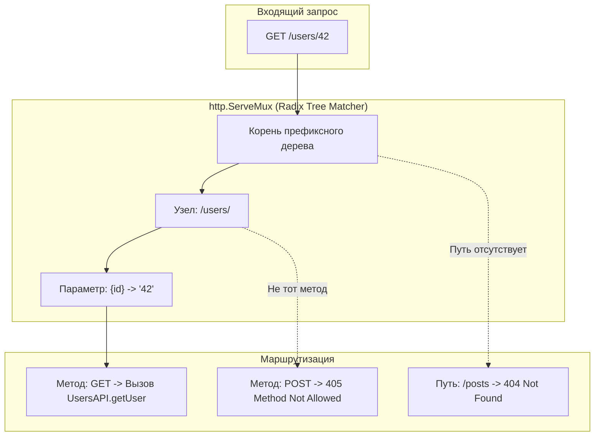

## Сборка пазла: Тестирование REST-ресурсов

В предыдущих главах [[2. Тестирование handler функций]] и [[3. Middleware тестирование]] мы исследовали архитектуру веб-приложения под микроскопом: изолированно препарировали отдельные функции-обработчики и цепочки промежуточного ПО. Однако архитектурный стиль REST (Representational State Transfer) мыслит не разрозненными функциями, а целостными **Ресурсами**, доступ к которым организуется через пересечение канонических URL-путей и семантических глаголов HTTP (`GET`, `POST`, `PUT`, `DELETE`).

Главная опасность модульного тестирования хэндлеров в вакууме заключается в том, что оно **полностью исключает из уравнения маршрутизатор (Router / Multiplexer)**.

Представьте типичную драму: ваш модульный тест напрямую вызывает функцию `GetUserHandler`. Тест триумфально зеленеет. Но в конфигурационном коде роутера разработчик допустил банальную опечатку:
```go
mux.HandleFunc("GET /user/{id}", ...) // Написали "user" в единственном числе вместо "users"
```
В результате клиент, отправляющий запрос на канонический путь `/users/{id}`, наталкивается в продакшене на холодную стену статуса `404 Not Found`. Модульный тест был безупречен, но система сломана. 

Чтобы исключить подобные аварии, мы обязаны тестировать **весь REST-ресурс в связке с маршрутизатором**, направляя синтетические запросы непосредственно в сетевой мультиплексор.

---

## Mechanical Sympathy: Как работает роутер

На протяжении многих лет стандартный мультиплексор `http.ServeMux` в Go обладал спартанской функциональностью: он умел сопоставлять лишь префиксы путей. Из-за этого индустрия была вынуждена повсеместно прибегать к сторонним библиотекам маршрутизации — `chi` или `gorilla/mux`. 

Начиная с версии Go 1.22, стандартная библиотека совершила долгожданный технологический скачок: `http.ServeMux` получил нативную поддержку HTTP-глаголов (`GET`, `POST`) и подстановочных параметров пути (Wildcards).

> [!info] Под капотом: Radix Tree
> Современные высокопроизводительные роутеры (включая библиотеку `chi` и обновленный `http.ServeMux` в Go 1.22+) строятся на базе структуры данных **Radix Tree (Компактное префиксное дерево)**.
> 
> При обработке входящего запроса ядро роутера не производит медленный последовательный перебор регулярных выражений с алгоритмической сложностью $O(N)$. Вместо этого алгоритм спускается по узлам дерева побайтово, обеспечивая предельное быстродействие $O(K)$, где $K$ — длина входящей строки URL.
> 
> В процессе обхода Radix Tree движок вычленяет значения динамических параметров (например, подстроку `123` из пути `/users/123`). В Go 1.22 эти значения бережно размещаются во внутренних массивах структуры `http.Request`, откуда они мгновенно извлекаются без лишних строковых аллокаций через метод `r.PathValue("id")`. 
> Тестирование через мультиплексор гарантирует, что дерево маршрутов построено без конфликтов, а параметры пути корректно извлекаются рантаймом.



---

## Паттерн "Resource Controller"

Для поддержания высокой читаемости и удобства тестирования обработчики ресурсов объединяют в структуры-контроллеры (часто именуемые Resource API), инкапсулирующие регистрацию связанных маршрутов:

```go
package api

import (
	"encoding/json"
	"net/http"
)

// UserService изолирует бизнес-логику работы с пользователями
type UserService interface {
	GetByID(id string) (string, error)
	Delete(id string) error
}

// UsersAPI группирует эндпоинты ресурса пользователей
type UsersAPI struct {
	svc UserService
}

func NewUsersAPI(svc UserService) *UsersAPI {
	return &UsersAPI{svc: svc}
}

// RegisterRoutes регистрирует маршруты ресурса в мультиплексоре (синтаксис Go 1.22+)
func (api *UsersAPI) RegisterRoutes(mux *http.ServeMux) {
	mux.HandleFunc("GET /users/{id}", api.getUser)
	mux.HandleFunc("DELETE /users/{id}", api.deleteUser)
}

func (api *UsersAPI) getUser(w http.ResponseWriter, r *http.Request) {
	// Извлекаем wildcard-параметр из контекста маршрута
	id := r.PathValue("id")
	if id == "" {
		http.Error(w, "missing id", http.StatusBadRequest)
		return
	}

	name, err := api.svc.GetByID(id)
	if err != nil {
		http.Error(w, "not found", http.StatusNotFound)
		return
	}

	w.Header().Set("Content-Type", "application/json")
	_ = json.NewEncoder(w).Encode(map[string]string{
		"id":   id,
		"name": name,
	})
}

func (api *UsersAPI) deleteUser(w http.ResponseWriter, r *http.Request) {
	id := r.PathValue("id")
	if err := api.svc.Delete(id); err != nil {
		http.Error(w, "internal error", http.StatusInternalServerError)
		return
	}

	// 204 No Content по стандарту не содержит тела ответа
	w.WriteHeader(http.StatusNoContent)
}
```

---

## Тестирование маршрутизатора через ResponseRecorder

Напишем исчерпывающий компонентный тест для REST-ресурса. Мы инициализируем реальный экземпляр `http.ServeMux`, регистрируем в нем наш `UsersAPI` с моком сервисного слоя и направляем запросы `httptest.NewRequest` **напрямую в мультиплексор**.

```go
package api_test

import (
	"net/http"
	"net/http/httptest"
	"testing"

	"github.com/stretchr/testify/require"
	"go.uber.org/mock/gomock"

	"yourproject/internal/api"
	"yourproject/internal/mocks"
)

// setupRouter конструирует изолированный роутер для теста
func setupRouter(t *testing.T) (*http.ServeMux, *mocks.MockUserService) {
	t.Helper()
	ctrl := gomock.NewController(t)
	mockSvc := mocks.NewMockUserService(ctrl)

	mux := http.NewServeMux()
	usersAPI := api.NewUsersAPI(mockSvc)
	usersAPI.RegisterRoutes(mux) // Регистрируем маршруты в реальном роутере!

	return mux, mockSvc
}

func TestUsersAPI_REST(t *testing.T) {
	t.Parallel()

	type testCase struct {
		name           string
		method         string
		targetURL      string
		setupMock      func(m *mocks.MockUserService)
		expectedStatus int
		expectedJSON   string
	}

	testCases := []testCase{
		{
			name:      "GET /users/{id} - Успешное получение",
			method:    http.MethodGet,
			targetURL: "/users/42", // Проверяем реальный URL с подстановкой параметра
			setupMock: func(m *mocks.MockUserService) {
				// Убеждаемся, что роутер корректно передал параметр "42" в PathValue
				m.EXPECT().GetByID("42").Return("Gopher", nil).Times(1)
			},
			expectedStatus: http.StatusOK,
			expectedJSON:   `{"id": "42", "name": "Gopher"}`,
		},
		{
			name:      "DELETE /users/{id} - Успешное удаление",
			method:    http.MethodDelete,
			targetURL: "/users/99",
			setupMock: func(m *mocks.MockUserService) {
				m.EXPECT().Delete("99").Return(nil).Times(1)
			},
			expectedStatus: http.StatusNoContent,
			expectedJSON:   "", // Для 204 No Content тело отсутствует
		},
		{
			name:           "GET /users/ - Запрос с завершающим слэшем без ID",
			method:         http.MethodGet,
			targetURL:      "/users/",
			setupMock:      func(m *mocks.MockUserService) {}, // Мок не должен вызываться
			expectedStatus: http.StatusNotFound,               // Маршрутизатор не найдет шаблон
			expectedJSON:   "",
		},
		{
			name:           "POST /users/42 - Неподдерживаемый HTTP-метод",
			method:         http.MethodPost,
			targetURL:      "/users/42",
			setupMock:      func(m *mocks.MockUserService) {},
			expectedStatus: http.StatusMethodNotAllowed, // 405 Method Not Allowed генерируется роутером
			expectedJSON:   "",
		},
	}

	for _, tc := range testCases {
		tc := tc
		t.Run(tc.name, func(t *testing.T) {
			t.Parallel()

			mux, mockSvc := setupRouter(t)
			tc.setupMock(mockSvc)

			// Создаем запрос, адресованный РОУТЕРУ, а не изолированной функции
			req := httptest.NewRequest(tc.method, tc.targetURL, nil)
			rec := httptest.NewRecorder()

			// Передаем управление в ServeMux
			mux.ServeHTTP(rec, req)

			res := rec.Result()
			defer res.Body.Close()

			require.Equal(t, tc.expectedStatus, res.StatusCode)

			if tc.expectedJSON != "" {
				require.JSONEq(t, tc.expectedJSON, rec.Body.String())
			}
		})
	}
}
```

> [!warning] Ловушка / Gotcha: 404 vs 405
> В тест-кейсе выше мы верифицируем возврат статус-кода `405 Method Not Allowed`. 
> Начинающие инженеры часто упускают этот протокольный нюанс: если клиент обращается методом `POST` к ресурсу, который поддерживает исключительно `GET`, качественное REST API обязано вернуть код `405`, а не `404 Not Found`, сопроводив ответ обязательным заголовком `Allow: GET, HEAD`.
> 
> Стандартный `http.ServeMux` в Go 1.22+ (как и роутер `chi`) реализует это требование RFC автоматически. Тестирование через мультиплексор гарантирует соблюдение протокола.

> [!tip] Собеседование
> **Вопрос:** Зачем в тестах необходимо проверять пути со слэшем на конце (Trailing Slash), такие как `/users` против `/users/`?
> 
> **Ответ:** Это классический подводный камень сетевых маршрутизаторов (Strict Slash Behavior). 
> 
> В стандарте HTTP пути `/users` и `/users/` семантически обозначают два абсолютно разных ресурса. Если роутер ожидает шаблон `/users`, а клиент обращается к `/users/`, поведение зависит от настроек: роутер может вернуть `404 Not Found` либо выполнить внутренний 301/307 редирект. 
> Компонентный тест роутера — единственное надежное место, где можно выявить рассинхронизацию поведения до релиза в продакшен.

---

## Сравнение с E2E HTTP тестированием

Может возникнуть закономерный вопрос: чем предложенный подход отличается от интеграционных проверок, рассмотренных нами в [[8. HTTP integration тесты]]?

Различие кроется в **границах изоляции и скорости обратной связи**:

1. **REST API компонентные тесты (текущая глава):**  
   Мы применяем `httptest.NewRecorder` и **мокируем** слой предметной логики (`UserService`). Тест выполняется за микросекунды в оперативной памяти без системных вызовов к сети и базам данных. Это дает возможность протестировать все комбинации HTTP-заголовков, статусы `405`, сбои сериализации и граничные URL-пути.
2. **Сквозные E2E тесты:**  
   Мы разворачиваем реальный сервер `httptest.NewServer`, подключаем контейнеры с PostgreSQL через Testcontainers и проверяем сквозной маршрут сквозь все слои до дисковых транзакций.

Зрелый проект обязан сочетать оба подхода: компонентные тесты роутера закрывают вариативность сетевого протокола, а сквозные тесты подтверждают физическую работоспособность хранилищ данных.

---

## Итог

Тестирование REST-ресурсов должно производиться на уровне **маршрутизатора**, а не изолированных функций-обработчиков:
1. Это исключает опечатки в шаблонах путей и гарантирует корректную работу алгоритмов сопоставления Radix Tree.
2. Проверяется извлечение параметров пути через `r.PathValue("id")`.
3. Валидируется протокольное поведение мультиплексора: возврат `405 Method Not Allowed` с заголовком `Allow: GET, HEAD` и обработка завершающих слэшей (`/users` vs `/users/`).

Однако современная микросервисная разработка давно вышла за рамки одного лишь REST API. В распределенных highload-системах стандартом де-факто межсервисного обмена стал бинарный протокол gRPC. В следующей лекции мы детально разберем организацию тестирования контрактов gRPC: [[5. Тестирование gRPC]].