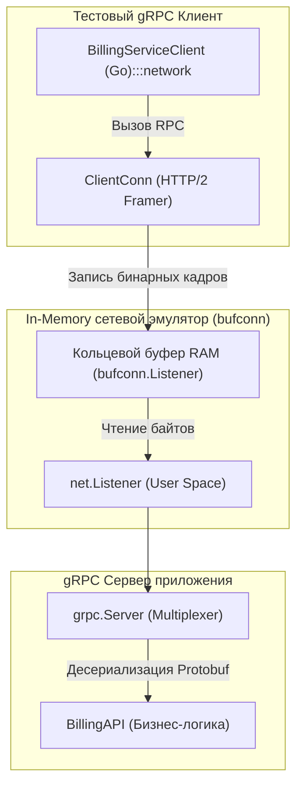

## Бинарный мир: Другие правила игры

В предыдущей главе [[4. Тестирование REST API]] мы собирали веб-маршрутизатор и проверяли обработку текстовых JSON-документов. Однако во внутренних распределенных контурах enterprise-бэкенда передача текстового JSON через HTTP/1.1 создает непозволительные накладные расходы на парсинг строк, раздувание сетевого трафика и постоянное открытие TCP-соединений.

Стандартом де-факто для межсервисного взаимодействия (Server-to-Server) в экосистеме Go является **gRPC** — бинарный фреймворк удаленного вызова процедур от Google, использующий Protocol Buffers (Protobuf) для строгой типизации контрактов.

Когда инженер пытается применить к gRPC привычные подходы сетевого тестирования, его ожидает сюрприз: здесь невозможно использовать стандартный `httptest.NewRecorder`, передав ему сырой массив байтов.

> [!info] Под капотом: Жесткая связка с HTTP/2
> Архитектура gRPC неразрывно связана со спецификацией **HTTP/2**. 
> Протокол опирается на строгую бинарную фреймовую структуру: служебные кадры `HEADERS`, полезную нагрузку `DATA`, управление окнами скольжения `WINDOW_UPDATE` и сброс вызовов `RST_STREAM`. Более того, gRPC мультиплексирует сотни независимых логических потоков (Streams) поверх единственного долгоживущего TCP-соединения с компрессией заголовков HPACK.
> 
> В стандартном пакете Go структура `grpc.Server` принципиально не реализует интерфейс `http.Handler` напрямую (попытки адаптировать её через `grpcweb` — это специализированный костыль для браузеров). 
> Следовательно, мы не можем вызвать RPC-обработчик как простую изолированную функцию в памяти: нам **необходимо** поднять полноценный `grpc.Server` и подключить к нему настоящий gRPC-клиент.

Означает ли это, что тесты gRPC неизбежно обречены на медленное выделение TCP-портов операционной системы? Вовсе нет. В арсенале gRPC есть элегантное решение для молниеносных in-memory проверок.

---

## Иллюзия сети: пакет bufconn

Чтобы избежать сетевого оверхеда ОС (системных вызовов `socket`, `bind`, маршрутизации ядра и межсетевых экранов), официальная команда gRPC предоставляет пакет `google.golang.org/grpc/test/bufconn`.

Пакет `bufconn` реализует стандартные сетевые интерфейсы `net.Listener` и `net.Conn`, которые функционируют исключительно в пространстве пользователя (User Space) оперативной памяти.

Сервер абсолютно уверен, что он слушает сетевой сокет, а клиент — что передает байты по кабелю Ethernet. На физическом же уровне байты бинарных Protobuf-кадров мгновенно перекладываются из одного буфера оперативной памяти в другой:



---

## Идиоматичный сетап gRPC теста

Спроектируем архитектуру тестового стенда для биллингового микросервиса `BillingService`. Мы инкапсулируем запуск in-memory сервера и генерацию клиента во вспомогательную функцию-фикстуру `setupGRPCServer`:

```go
package grpcapi_test

import (
	"context"
	"net"
	"testing"

	"github.com/stretchr/testify/require"
	"go.uber.org/mock/gomock"
	"google.golang.org/grpc"
	"google.golang.org/grpc/credentials/insecure"
	"google.golang.org/grpc/test/bufconn"

	// Сгенерированные Protocol Buffers структуры
	pb "yourproject/internal/generated/billing/v1"
	"yourproject/internal/grpcapi"
	"yourproject/internal/mocks"
)

// Емкость кольцевого буфера в оперативной памяти (1 МБ достаточно для тестов)
const bufSize = 1024 * 1024

// setupGRPCServer разворачивает in-memory gRPC стенд и возвращает готовый клиент
func setupGRPCServer(t *testing.T) (pb.BillingServiceClient, *mocks.MockBillingService) {
	t.Helper()

	// 1. Инициализируем контроллер и мок сервисного слоя
	ctrl := gomock.NewController(t)
	mockSvc := mocks.NewMockBillingService(ctrl)

	// 2. Создаем in-memory слушатель через bufconn
	listener := bufconn.Listen(bufSize)

	// 3. Создаем боевой gRPC сервер
	server := grpc.NewServer()

	// Инициализируем наш контроллер и регистрируем в gRPC сервере
	billingAPI := grpcapi.NewBillingAPI(mockSvc)
	pb.RegisterBillingServiceServer(server, billingAPI)

	// 4. Запускаем сервер в фоновой горутине
	go func() {
		if err := server.Serve(listener); err != nil {
			// Игнорируем штатную ошибку остановки сервера
			if err.Error() != "grpc: the server has been stopped" {
				t.Errorf("Ошибка запуска gRPC сервера: %v", err)
			}
		}
	}()

	// 5. Регистрируем корректную остановку сервера после завершения теста
	t.Cleanup(func() {
		server.Stop()
	})

	// 6. Конфигурируем клиентский диалер на подключение к нашему bufconn слушателю
	ctx := context.Background()
	dialer := func(context.Context, string) (net.Conn, error) {
		return listener.Dial() // Выдаем виртуальное соединение прямо из памяти!
	}

	conn, err := grpc.DialContext(ctx, "bufnet",
		grpc.WithContextDialer(dialer),
		grpc.WithTransportCredentials(insecure.NewCredentials()),
	)
	require.NoError(t, err, "не удалось установить соединение с in-memory gRPC сервером")

	t.Cleanup(func() {
		_ = conn.Close()
	})

	// Возвращаем типизированного сгенерированного клиента
	client := pb.NewBillingServiceClient(conn)

	return client, mockSvc
}
```

---

## Тестирование RPC вызовов

Имея на руках готовую in-memory инфраструктуру, мы пишем тесты взаимодействия так, будто наш код выполняется на реальном удаленном сервере:

```go
func TestBillingAPI_ProcessPayment_Success(t *testing.T) {
	t.Parallel()

	// Arrange: Поднимаем сервер и получаем клиент
	client, mockSvc := setupGRPCServer(t)
	ctx := context.Background()

	req := &pb.ProcessPaymentRequest{
		UserId: "user_123",
		Amount: 500.0,
	}

	// Ожидаем, что API корректно распакует protobuf и вызовет доменную логику
	mockSvc.EXPECT().
		Process(gomock.Any(), "user_123", 500.0).
		Return("tx_999", nil).
		Times(1)

	// Act: Выполняем сетевой RPC-вызов через gRPC-клиент
	resp, err := client.ProcessPayment(ctx, req)

	// Assert: Верифицируем ответ
	require.NoError(t, err)
	require.NotNil(t, resp)
	require.Equal(t, "tx_999", resp.TransactionId)
}
```

---

## Трансляция ошибок (Error Translation)

Одна из ключевых задач транспортного слоя gRPC — трансформация внутренних доменных ошибок сервиса в канонические статус-коды RPC. В мире gRPC не существует привычных HTTP-статусов `404` или `500`. Вместо них используется жестко стандартизированный набор кодов из пакета `google.golang.org/grpc/codes` и обертки `google.golang.org/grpc/status`.

> [!warning] Ловушка / Gotcha: Сравнение ошибок в тестах
> Если ваш серверный обработчик возвращает ошибку вида:
> ```go
> return nil, status.Error(codes.NotFound, "пользователь не найден")
> ```
> вы **не можете** проверить её в клиентском коде через банальный `errors.Is`! 
> 
> Драйвер gRPC сериализует метаданные ошибки в специальные Protobuf-структуры и восстанавливает их на стороне клиента с новым адресом в памяти. Прямое сравнение указателей ошибок завершится провалом.
> 
> Для корректной верификации ошибок в тестах необходимо обращаться к методу `status.FromError(err)`.

Пример надежного тестирования негативного сценария:

```go
func TestBillingAPI_ProcessPayment_InsufficientFunds(t *testing.T) {
	t.Parallel()

	client, mockSvc := setupGRPCServer(t)
	ctx := context.Background()

	// Имитируем ошибку предметной области (недостаточно средств)
	mockSvc.EXPECT().
		Process(gomock.Any(), "user_123", 50000.0).
		Return("", grpcapi.ErrInsufficientFunds).
		Times(1)

	req := &pb.ProcessPaymentRequest{
		UserId: "user_123",
		Amount: 50000.0,
	}

	// Act: Вызываем метод клиента
	_, err := client.ProcessPayment(ctx, req)

	// Assert: Проверяем gRPC статус ошибки
	require.Error(t, err)

	// Извлекаем gRPC-статус из полученной ошибки
	st, ok := status.FromError(err)
	require.True(t, ok, "Возвращенная ошибка обязана быть валидным gRPC статусом")

	// Проверяем корректность трансляции ошибки в код FailedPrecondition
	require.Equal(t, codes.FailedPrecondition, st.Code())
	require.Equal(t, "insufficient funds", st.Message())
}
```

---

## Тестирование Interceptors (Перехватчиков)

Аналогом Middleware в gRPC выступают **Interceptors (Перехватчики)**. Они подразделяются на два типа:
1. `Unary` — для одиночных классических RPC-запросов (Request-Response).
2. `Stream` — для потоковых методов (Streaming RPC).

Интерцепторы берут на себя сквозные задачи: проверку авторизационных токенов, логирование, трассировку и метрики Prometheus. 

Тестировать интерцепторы можно двумя путями:
1. **Модульный путь:** Вызывать функцию перехватчика напрямую в юнит-тесте, передав ей мок-обработчик с сигнатурой `grpc.UnaryHandler`, фиксирующий вызов следующего шага.
2. **Интеграционный путь:** Зарегистрировать интерцептор в сервере при конструировании `grpc.NewServer(grpc.UnaryInterceptor(myInterceptor))` внутри функции `setupGRPCServer`. В этом случае тестовый клиент передает метаданные в контексте, проверяя реальное поведение сквозного конвейера.

> [!tip] Собеседование
> **Вопрос:** Каким образом клиент может передать токен авторизации в gRPC-тесте, если классический заголовок `Authorization` в протоколе HTTP/1.1 отсутствует?
> 
> **Ответ:** В архитектуре gRPC любые транспортные заголовки инкапсулируются понятием **Metadata** (пакет `google.golang.org/grpc/metadata`). 
> 
> Для передачи токена клиент в тестовом коде создает исходящий контекст:
> ```go
> md := metadata.Pairs("authorization", "Bearer test-secret-token")
> ctx = metadata.NewOutgoingContext(ctx, md)
> resp, err := client.ProcessPayment(ctx, req)
> ```
> Серверный перехватчик извлекает эти данные с помощью вызова:
> ```go
> md, ok := metadata.FromIncomingContext(ctx)
> ```

---

## Тестирование Streaming RPC

В архитектурах, требующих непрерывной передачи данных (например, потоковая передача логов, событий телеметрии или котировок), gRPC задействует потоковые вызовы (`stream`).

Стенд на базе `bufconn` безупречно поддерживает тестирование потоков:
```go
func TestLogService_StreamLogs(t *testing.T) {
	t.Parallel()
	client, _ := setupLogServer(t)

	// Получаем интерфейс StreamClient для чтения потока
	stream, err := client.DownloadLogs(context.Background(), &pb.LogRequest{})
	require.NoError(t, err)

	var receivedChunks int
	for {
		// Читаем очередной бинарный чанк из потока
		chunk, err := stream.Recv()
		if err == io.EOF {
			break // Поток корректно завершен сервером!
		}
		require.NoError(t, err)
		require.NotEmpty(t, chunk.Data)
		receivedChunks++
	}

	require.Greater(t, receivedChunks, 0)
}
```
HTTP/2 мультиплексирование и передача управляющих кадров прозрачно исполняются внутри оперативной памяти процесса.

---

## Итог

1. **Не используйте `httptest` для gRPC:** различия в транспорте HTTP/2 и бинарном протоколе Protocol Buffers делают его неприменимым.
2. Пакет **`google.golang.org/grpc/test/bufconn`** — эталонный инструмент тестирования gRPC в памяти. Он имитирует полноценный сетевой стек, избавляя тесты от задержек I/O и конфликтов TCP-портов.
3. Проверяйте ошибки исключительно через пакет **`status`**, так как gRPC сериализует исключения в Protobuf-сообщения.
4. Метаданные (аутентификация, трассировка) передаются через `metadata.NewOutgoingContext` и валидируются интерцепторами `Unary` и `Stream`.

Освоив жесткие бинарные контракты Protobuf, мы возвращаемся к миру динамических веб-интеграций, где по-прежнему доминирует гибкий и коварный формат JSON. Как гарантировать устойчивость системы к отсутствующим полям, неявным типам и структурным изменениям полезной нагрузки? Об этом пойдет речь в следующей главе: [[6. Проверка JSON структур]].