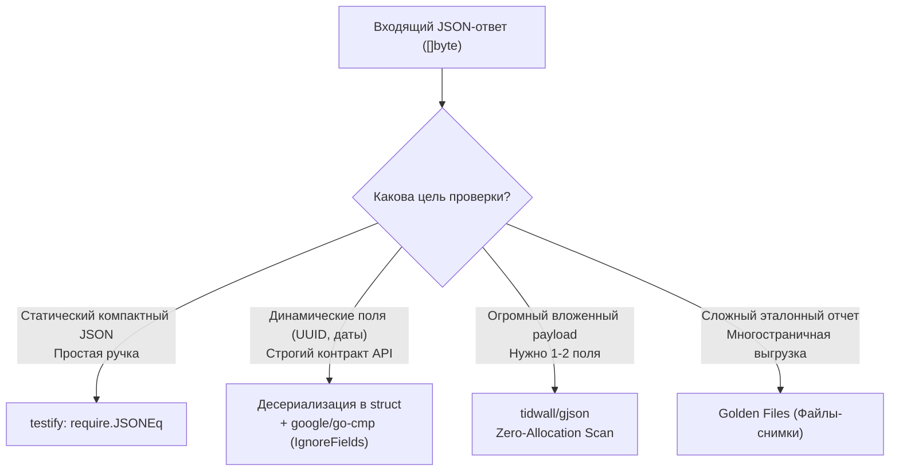

## Иллюзия детерминизма: Почему JSON сложно тестировать

В предыдущих главах (в частности, в [[2. Тестирование handler функций]]) мы не раз прибегали к функции `require.JSONEq`, решая задачу сравнения тел HTTP-ответов. Однако работа с текстовыми JSON-контрактами таит в себе гораздо больше архитектурных и алгоритмических нюансов, чем кажется на первый взгляд.

В языках с динамической типизацией вроде JavaScript или Python формат JSON является «родным»: он мгновенно превращается в обычный хэш-словарь. В Go — языке строгой статической типизации с механическим сочувствием к памяти машины — входящий JSON представляет собой сырой срез байтов (`[]byte`), пересекающий границу прикладной логики через ресурсоемкие механизмы рефлексии (`reflect`).

При попытке верификации JSON в тестах разработчик сталкивается с иллюзией детерминизма:
1. **Пробельные символы и переносы строк:** Документы `{"id": 1}` и `{\n  "id": 1\n}` семантически абсолютно эквивалентны, но побайтово представляют собой две совершенно разные строки.
2. **Отсутствие гарантированного порядка ключей:** Спецификация RFC 8259 подчеркивает, что JSON-объект — это неупорядоченный набор пар «ключ-значение». Более того, рантайм Go при сериализации типов `map[string]any` **намеренно рандомизирует порядок обхода ключей** с помощью псевдослучайного сида, чтобы разработчики не полагались на порядок полей.

Попытка применить наивное сравнение строк через `require.Equal(t, expectedString, actualBody)` неизбежно порождает [[6. Flaky тесты и их причины]]. Тест в CI-пайплайне будет спорадически падать в одном прогоне из десяти только потому, что планировщик рантайма переставил ключи словаря при сериализации.

---

## Базовый уровень: require.JSONEq и его цена

Наиболее распространенный и быстрый способ сравнить два компактных JSON-документа — функция `require.JSONEq` из популярной библиотеки `testify`:

```go
expected := `{"name": "Gopher", "role": "admin"}`
actual := rec.Body.String()

// Семантическое сравнение: игнорирует пробелы, табуляции и порядок ключей
require.JSONEq(t, expected, actual)
```

> [!info] Под капотом: Mechanical Sympathy
> Каким образом `JSONEq` определяет идентичность двух документов?
> 
> Под капотом пакет `testify` выполняет десериализацию обеих текстовых строк через вызов `json.Unmarshal` в пустой интерфейс:
> ```go
> var expectedObj, actualObj any
> ```
> 
> Когда стандартный пакет `encoding/json` сталкивается с типом `any` (или `interface{}`), он не имеет информации о схеме данных. В результате для каждого открывающегося фигурного блока `{}` парсер динамически аллоцирует в куче (Heap) структуру `map[string]any`, а для каждого квадратного массива `[]` — структуру `[]any`. 
> 
> После этого `testify` запускает тяжелый рекурсивный обход структур с помощью `reflect.DeepEqual`.
> 
> **Инженерная цена:** Это создает колоссальную нагрузку на процессор и аллокатор памяти. Если ваш эндпоинт отдает выгрузку аналитики или каталог товаров размером в 5–10 Мегабайт, единственный вызов `require.JSONEq` вызовет миллионы мелких аллокаций в оперативной памяти и спровоцирует масштабную паузу сборщика мусора (Garbage Collector). Для тяжелых ответов `JSONEq` абсолютно неприемлем.

---

## Проблема динамических полей (Timestamps & UUIDs)

Второй фундаментальный вызов — динамическая природа реальных данных. Продакшен-сервер редко возвращает статичные константы: ответы изобилуют автоматически сгенерированными идентификаторами (`id`), случайными хэшами сессий и временными метками (`created_at`):

```json
{
  "id": "123e4567-e89b-12d3-a456-426614174000",
  "name": "Gopher",
  "created_at": "2026-04-27T14:11:05Z"
}
```

Вы не можете жестко зафиксировать поля `id` и `created_at` в ожидаемой строке `expected`, поскольку при каждом запуске теста фабрика UUID или база данных генерируют новые значения.

### Антипаттерн: Мутация актуального объекта

Нередко инженеры пытаются решить проблему «в лоб»: парсят ответ в сырую карту, заменяют динамические поля константами и сериализуют обратно:

```go
// АНТИПАТТЕРН: Нетипизированный и хрупкий код
var actual map[string]any
_ = json.Unmarshal(body, &actual)
actual["id"] = "IGNORE"
actual["created_at"] = "IGNORE"
// ... попытка сериализации обратно в строку и сравнение
```

Такой подход разрушает статическую типизацию, лишает тест информативности при падениях и порождает многословный код.

---

### Идиоматичный подход: google/go-cmp

Золотым стандартом глубокого и управляемого сравнения структур в индустрии Go выступает библиотека `github.com/google/go-cmp/cmp` от команды Google.

Библиотека позволяет строго десериализовать JSON в конкретную типизированную Go-структуру (DTO) и провести поэлементное сравнение, декларативно игнорируя динамические поля:

```go
package api_test

import (
	"encoding/json"
	"testing"
	"time"

	"github.com/google/go-cmp/cmp"
	"github.com/google/go-cmp/cmp/cmpopts"
	"github.com/stretchr/testify/require"
)

// UserResponse декларирует точный контракт HTTP-ответа
type UserResponse struct {
	ID        string    `json:"id"`
	Name      string    `json:"name"`
	CreatedAt time.Time `json:"created_at"`
}

func TestAPI_CreateUser_DeepCompare(t *testing.T) {
	t.Parallel()

	// Сырой ответ от тестируемого обработчика
	actualBody := []byte(`{"id": "uuid-987", "name": "Gopher", "created_at": "2026-04-27T10:00:00Z"}`)

	// 1. Десериализуем ответ в конкретную структуру (быстро и типизировано)
	var actual UserResponse
	err := json.Unmarshal(actualBody, &actual)
	require.NoError(t, err)

	// 2. Формируем эталонный результат (динамические поля оставляем нулевыми)
	expected := UserResponse{
		Name: "Gopher",
	}

	// 3. Сравниваем структуры, явно исключая динамические поля ID и CreatedAt
	diff := cmp.Diff(expected, actual, cmpopts.IgnoreFields(UserResponse{}, "ID", "CreatedAt"))
	if diff != "" {
		// diff содержит элегантный визуальный отчет в формате unified diff (-want +got)
		t.Fatalf("Несоответствие контракта ответа (-want +got):\n%s", diff)
	}

	// 4. Отдельно проверяем инварианты динамических полей
	require.NotEmpty(t, actual.ID, "Идентификатор ID обязан быть заполнен")
	require.False(t, actual.CreatedAt.IsZero(), "Временная метка CreatedAt не должна быть нулевой")
}
```

Этот подход убивает сразу трех зайцев:
1. **Документирование контракта:** структура `UserResponse` прямо в коде теста описывает схему API.
2. **Производительность:** `json.Unmarshal` в конкретную структуру оперирует известными смещениями полей, избегая бесконечных аллокаций `map[string]any`.
3. **Красивые отчеты об ошибках:** при расхождении данных метод `cmp.Diff` выводит точный дифференциал (`-want +got`), мгновенно подсвечивая проблемное свойство.

---

## Частичная проверка JSON: gjson

Бывают ситуации (особенно в сквозных интеграционных или E2E тестах), когда сервер отдает огромный композитный JSON с десятками вложенных списков, а тест интересует лишь одно точечное поле на третьем уровне вложенности. 

Описывать структуру на сотню строк ради проверки одного статуса — контрпродуктивно. Для таких сценариев незаменима библиотека `github.com/tidwall/gjson`.

> [!info] Под капотом: Zero-Allocation Parsing
> Феноменальная скорость `gjson` обусловлена тем, что библиотека **не производит десериализацию** JSON во внутренние структуры языка. 
> 
> Она сканирует исходный слайс байт `[]byte` как линейный текстовый поток, находит требуемый ключ по алгоритму поиска подстрок и возвращает легковесную структуру `gjson.Result`, которая хранит слайс памяти, указывающий прямо в исходный буфер. Это чистый паттерн **Zero-Allocation**.

```go
func TestAPI_ComplexPayload_TargetedCheck(t *testing.T) {
	t.Parallel()

	// Симулируем ответ сложного агрегирующего API
	body := []byte(`{
		"meta": {"trace_id": "abc-123"},
		"data": {
			"items": [
				{"id": 1, "status": "active"},
				{"id": 2, "status": "pending"}
			]
		}
	}`)

	// Точечно извлекаем значение по иерархическому пути
	status := gjson.GetBytes(body, "data.items.0.status")
	require.True(t, status.Exists(), "Поле status первого элемента обязано присутствовать")
	require.Equal(t, "active", status.String())

	// Извлекаем длину вложенного массива
	count := gjson.GetBytes(body, "data.items.#")
	require.Equal(t, int64(2), count.Int())
}
```

---

## Стратегия выбора инструмента



> [!tip] Собеседование
> **Вопрос:** Мы используем в структуре поле времени (`time.Time`, `sql.NullTime` или кастомный тип с методом `UnmarshalJSON`). В тесте сравниваем эталонную и фактическую структуры через `require.Equal`. Почему тест падает, даже если строковые представления дат абсолютно идентичны?
> 
> **Ответ:** Это классическая ловушка внутреннего устройства типа `time.Time` в Go. 
> 
> Структура `time.Time` содержит не только дату и время, но и указатель на часовой пояс (`*Location`), а также поле монотонных часов (**Monotonic Clock**). Время, полученное через `time.Now()`, всегда имеет монотонный компонент для точного замера интервалов. Время же, десериализованное из JSON-строки, монотонного компонента лишено (содержит только Wall Clock).
> 
> Функция `require.Equal` (и `reflect.DeepEqual`) сравнивает внутренние приватные биты структуры побайтово. Из-за отсутствия монотонного счетчика в десериализованном объекте проверка возвращает `false`!
> 
> Правильное решение:
> 1. Использовать `cmpopts.EquateApproxTime(time.Second)` в библиотеке `go-cmp`.
> 2. Либо сравнивать время вручную через специальный метод `expectedTime.Equal(actualTime)`, который сравнивает физические моменты времени, игнорируя монотонные часы и часовые пояса.

---

## Итог

1. Категорически откажитесь от сравнения JSON как сырых строк через `require.Equal`: рандомизация порядка ключей мап в рантайме Go сделает ваши тесты мигающими (Flaky).
2. Метод `require.JSONEq` идеален для небольших статических ответов, однако создает существенную нагрузку на память и непригоден для динамических идентификаторов.
3. В промышленном коде отдавайте предпочтение **десериализации в типизированные структуры** в связке с **`google/go-cmp`** (`cmp.Diff` и `cmpopts.IgnoreFields`).
4. Для точечной инспекции огромных JSON-пакетов используйте безаллокационный парсер **`gjson`**.

Мы научились верифицировать синтаксис и структуру JSON. Однако контракт взаимодействия определяется не только наличием полей и фигурных скобок. В реальных системах действуют строгие бизнес-инварианты (например, возраст пользователя `> 18`, корректный формат email или допустимый диапазон сумм). В следующей главе мы разберем продвинутые техники валидации ответов: [[7. Валидация ответов]].