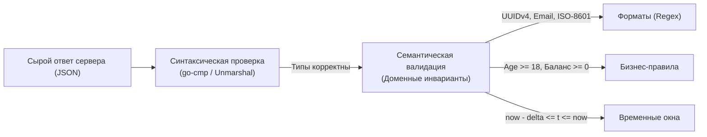

## За пределами синтаксиса: Семантика данных

В предыдущей главе [[6. Проверка JSON структур]] мы научились защищать наши тесты от нестабильности, вызванной случайным порядком ключей в хэш-таблицах Go, и освоили технику точечного игнорирования динамических полей с помощью пакета `go-cmp`.

Однако проверка структурной идентичности — это лишь первый рубеж обороны. Представьте, что эндпоинт регистрации пользователей возвращает следующий ответ:
```json
{
  "id": "123",
  "age": 12,
  "status": "active"
}
```
С точки зрения парсера JSON и статической структуры Go перед нами идеальный документ: поля присутствуют, типы данных совпадают. Но с точки зрения бизнеса и доменных инвариантов — это катастрофический сбой:
- Сервис по регламенту работает только с пользователями старше 18 лет (`age >= 18`).
- Идентификатор `id` обязан быть криптографически стойким UUID v4, а не подозрительно простой строкой `"123"`.
- Статус пользователя должен принадлежать строго фиксированному перечислению (Enum).

Интеграционные проверки API — это финальная граница, на которой мы обязаны верифицировать не только форму представления данных, но и их внутреннее смысловое наполнение. Этот процесс называется **Семантической валидацией (Semantic Validation)**.



---

## Уровни валидации ответов

В зрелой инженерной практике валидация ответов разделяется на три последовательных уровня глубины.

---

### 1. Форматы и Регулярные выражения (Regex)

Значения динамических полей (идентификаторы сущностей, токены сессий, хэши транзакций) невозможно проверить на точное посимвольное совпадение через `require.Equal()`. Однако их **внутренний формат** строго детерминирован спецификацией.

> [!info] Под капотом: Mechanical Sympathy и Регулярки
> В стандартной библиотеке Go функция компиляции регулярного выражения (`regexp.Compile`) представляет собой ресурсоемкую операцию: она производит синтаксический анализ шаблона и строит в оперативной памяти сложный недетерминированный/детерминированный конечный автомат (NFA/DFA State Machine).
> 
> Если разработчик вызывает `regexp.MustCompile` внутри итераций тестовой таблицы `for _, tc := range testCases` или непосредственно в теле подтеста `t.Run`, тестовый процесс растрачивает миллионы тактов процессора на постоянное перестроение автомата и перегружает Garbage Collector лишними аллокациями.
> 
> **Железное правило:** регулярные выражения в тестах обязаны объявляться как предварительно скомпилированные пакетные переменные на уровне файла.

```go
package api_test

import (
	"regexp"
	"testing"

	"github.com/stretchr/testify/require"
)

// Компилируем конечные автоматы ровно один раз при инициализации тестового пакета
var (
	uuidV4Regex = regexp.MustCompile(`^[0-9a-f]{8}-[0-9a-f]{4}-4[0-9a-f]{3}-[89ab][0-9a-f]{3}-[0-9a-f]{12}$`)
	emailRegex  = regexp.MustCompile(`^[a-zA-Z0-9._%+\-]+@[a-zA-Z0-9.\-]+\.[a-zA-Z]{2,}$`)
)

type UserResponse struct {
	ID    string `json:"id"`
	Email string `json:"email"`
	Age   int    `json:"age"`
}

func assertValidResponseFormat(t *testing.T, resp UserResponse) {
	t.Helper()

	// Валидируем структурное соответствие контракту
	require.Regexp(t, uuidV4Regex, resp.ID, "Идентификатор ID обязан соответствовать стандарту UUID v4")
	require.Regexp(t, emailRegex, resp.Email, "Поле Email содержит некорректный адрес электронной почты")
}
```

---

### 2. Бизнес-ограничения (Domain Constraints)

Полезная нагрузка API обязана строго отражать инварианты предметной области. Если ручка возвращает историю платежей, транзакции должны быть упорядочены по времени в нисходящем порядке (DESC). Если сервис отдает банковские реквизиты, дробные числа не должны накапливать погрешности вычислений с плавающей точкой.

Вместо раздувания тела тестов бесконечными конструкциями `if` принято оформлять доменные проверки в виде специализированных вспомогательных assertions-функций:

```go
type Transaction struct {
	ID        string    `json:"id"`
	Amount    float64   `json:"amount"`
	CreatedAt time.Time `json:"created_at"`
}

// assertSortedByDateDesc проверяет строгую сортировку по убыванию
func assertSortedByDateDesc(t *testing.T, items []Transaction) {
	t.Helper()
	for i := 1; i < len(items); i++ {
		prev := items[i-1].CreatedAt
		curr := items[i].CreatedAt

		// Предыдущая запись обязана быть новее или равна текущей
		require.Truef(t, prev.After(curr) || prev.Equal(curr),
			"Нарушена сортировка: элемент [%d] (%v) старее элемента [%d] (%v)",
			i-1, prev, i, curr)
	}
}

func assertValidAgeRule(t *testing.T, resp UserResponse) {
	t.Helper()
	require.GreaterOrEqual(t, resp.Age, 18, "Сервис нарушил бизнес-правило: пользователь моложе 18 лет")
	require.Less(t, resp.Age, 130, "Зафиксировано аномальное значение возраста")
}
```

> [!tip] Собеседование
> **Вопрос:** Мы используем библиотеку `go-playground/validator` (с тегами вроде `validate:"required,email"`) в структурах DTO на стороне сервера. Имеет ли смысл импортировать эти серверные структуры и валидировать ими ответы в тестах?
> 
> **Ответ:** Это частый антипаттерн, приводящий к ложному чувству защищенности. 
> 
> Тесты клиента и код сервера должны быть слабо связаны. Если разработчик в серверном коде случайно удалит или ослабит аннотацию `validate:"required,email"`, тест, переиспользующий ту же самую структуру, промолчит, и дефект беспрепятственно утечет в продакшен. 
> В интеграционных тестах валидация должна быть независимой и опираться на явные проверки через пакет `require` или независимые тестовые схемы.

---

### 3. Валидация Времени (Time Validation)

Временные параметры — наиболее распространенный источник ложноположительных падений в CI.

> [!warning] Ловушка / Gotcha: Проблема Now()
> Если при создании сущности вы попытаетесь проверить поле `created_at` следующим образом:
> ```go
> require.Equal(t, time.Now(), resp.CreatedAt)
> ```
> этот тест будет гарантированно падать всегда. 
> 
> Между вызовом системных часов `time.Now()` в теле сервера, коммитом транзакции в базу данных, сериализацией, сетевым перелетом и выполнением `json.Unmarshal` в тесте неизбежно пройдут сотни микросекунд или десятки миллисекунд.

Единственно надежный инженерный подход — валидация попадания метки времени в допустимый интервал (**Time Tolerance Window**):

```go
func assertRecentTimestamp(t *testing.T, actual time.Time) {
	t.Helper()

	now := time.Now().UTC() // Все проверки времени выполняются строго в UTC!

	// 1. Проверяем, что метка времени не пришла из будущего (с запасом на сетевой рассинхрон)
	require.True(t, actual.Before(now.Add(2*time.Second)),
		"Временная метка created_at опережает текущее время сервера")

	// 2. Проверяем, что событие произошло недавно (в пределах последних 5 секунд)
	require.WithinDuration(t, now, actual, 5*time.Second,
		"Временная метка created_at устарела относительно момента вызова")
}
```

---

## Динамическая валидация JSON Schema

Когда ваш микросервис возвращает развесистые иерархические документы с десятками вложенных коллекций и полиморфных объектов, ручное написание ассертов превращает тест в непролазные заросли кода. В таких масштабах на помощь приходит промышленный стандарт **JSON Schema** (спецификация IETF).

JSON Schema позволяет декларативно описать схему полезной нагрузки: перечень обязательных полей, типы, форматы строк и допустимые диапазоны чисел. 

В экосистеме Go стандартом является библиотека `github.com/santhosh-tekuri/jsonschema/v5` (а также классическая библиотека `github.com/xeipuuv/gojsonschema`).

```go
package api_test

import (
	"encoding/json"
	"testing"

	"github.com/santhosh-tekuri/jsonschema/v5"
	"github.com/stretchr/testify/require"
)

// Компилируем JSON-схему однократно при старте пакета
var userResponseSchema = jsonschema.MustCompileString("user_schema.json", `{
  "$schema": "https://json-schema.org/draft/2020-12/schema",
  "type": "object",
  "required": ["id", "email", "status", "age"],
  "properties": {
    "id": {
      "type": "string",
      "pattern": "^[0-9a-f]{8}-[0-9a-f]{4}-4[0-9a-f]{3}-[89ab][0-9a-f]{3}-[0-9a-f]{12}$"
    },
    "email": {
      "type": "string",
      "format": "email"
    },
    "status": {
      "type": "string",
      "enum": ["active", "pending", "banned"]
    },
    "age": {
      "type": "integer",
      "minimum": 18,
      "maximum": 120
    }
  }
}`)

func TestAPI_CreateUser_JSONSchema(t *testing.T) {
	t.Parallel()

	// Получаем сырые байты ответа от HTTP-рекордера
	bodyBytes := []byte(`{
		"id": "e4eaaaf2-d142-11e1-b3e4-080027620cdd",
		"email": "invalid-email-address",
		"status": "active",
		"age": 16
	}`)

	// Десериализуем в нетипизированный интерфейс для анализатора схемы
	var parsedResponse any
	err := json.Unmarshal(bodyBytes, &parsedResponse)
	require.NoError(t, err)

	// Валидируем документ против скомпилированной схемы
	err = userResponseSchema.Validate(parsedResponse)

	// При нарушении контракта валидатор выдаст исчерпывающий отчет:
	// - "email" is not a valid email address
	// - "age" must be greater than or equal to 18
	require.NoError(t, err, "Полезная нагрузка ответа нарушает утвержденную JSON-схему")
}
```

---

## Итог

1. **Синтаксис не равен смыслу:** структурное совпадение типов `go-cmp` не защищает от нарушения бизнес-правил и утечки поврежденных данных.
2. **Форматы под контролем:** валидируйте строковые форматы (UUID, хэши, email) через пакетные скомпилированные регулярные выражения `regexp.MustCompile`.
3. **Учитывайте природу времени:** никогда не сравнивайте метки времени через прямое равенство; используйте функцию `require.WithinDuration` с разумным окном погрешности в часовом поясе UTC.
4. **Масштабируйтесь через JSON Schema:** для сложных, сильно разветвленных контрактов используйте декларативную валидацию через `github.com/santhosh-tekuri/jsonschema/v5`.

Мы научились всесторонне валидировать ответы собственного сервиса. Но как синхронизировать эти требования с внешним миром? Если фронтенд-команда или соседний микросервис рассчитывают на один формат, а бэкенд втайне обновил правила валидации — возникнет катастрофический рассинхрон. В финальной главе нашего подраздела мы разберем высший пилотаж взаимодействия сервисов — контрактное тестирование: [[8. API contract testing]].