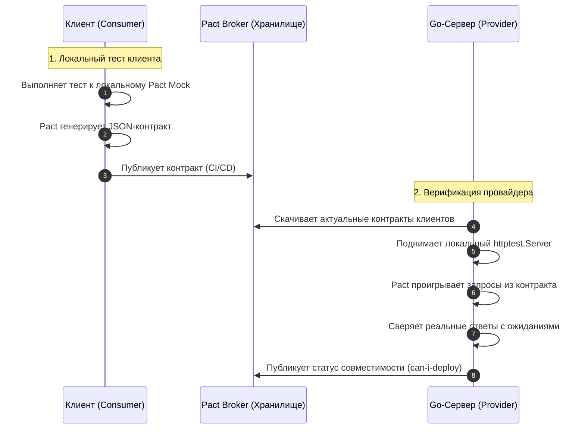

## Рассинхронизация реальностей: Проблема интеграционных тестов

В предыдущих статьях этого подраздела мы последовательно выстроили образцовую систему тестирования сетевого слоя. Мы проверили маршрутизатор ресурса ([[4. Тестирование REST API]]), изолировали внешние вызовы ([[10. Wiremock и HTTP mocking]]) и внедрили глубокую семантическую проверку структур полезной нагрузки ([[7. Валидация ответов]]).

Все тестовые пайплайны сияют зеленым цветом. Команда уверенно раскатывает релиз в продакшен... и спустя минуту каналы поддержки взрываются: мобильное приложение падает с ошибкой десериализации, а партнерский микросервис начинает возвращать шквал пятисотых ошибок.

Добро пожаловать в **Парадокс интеграционного тестирования**. 

Ваши компонентные и интеграционные тесты подтверждают лишь то, что ваш сервис работает в точном соответствии с тем, *как вы его закодировали*. Однако они ничего не знают о том, *чего от сервиса ожидают реальные клиенты и потребители* (Consumers). 

Если инженер в рамках безобидного рефакторинга переименует поле `userId` в `account_id`, его собственные тесты пройдут без сучка и задоринки — ведь он одновременно обновил и обработчик, и тестовые ассерты. Но для мобильного клиента это скрытое ломающее изменение (Breaking Change), которое гарантированно обрушит парсер на миллионах устройств.

Традиционный ответ энтерпрайза на эту беду — создание гигантских E2E-стендов (End-to-End Staging), где одновременно разворачиваются десятки микросервисов. Но этот путь ведет в тупик: E2E-окружения мучительно медленны, сложны в поддержке, зависят от состояния чужих баз данных и порождают бесконечные ложные падения.

Чтобы разорвать этот порочный круг, современная индустрия использует два взаимодополняющих подхода: **OpenAPI Schema Validation** (Provider-Driven) и **Consumer-Driven Contract Testing** (Pact).

---

## 1. OpenAPI / Swagger Validation (Provider-Driven)

В подавляющем большинстве проектов архитектурный контракт взаимодействия фиксируется в форме спецификации OpenAPI (Swagger), оформленной в виде единого файла `openapi.yaml`.

Однако в реальной разработке документация неизбежно деградирует (явление, известное как *Documentation Rot*). Программист добавил обязательное поле в Go-структуру или изменил код ошибки с 400 на 422, но забыл отразить это в YAML-файле. Документация превращается в дезинформацию.

Чтобы превратить спецификацию OpenAPI в живой исполнимый контракт, её валидацию встраивают непосредственно в интеграционные тесты с помощью библиотеки `github.com/getkin/kin-openapi`.

> [!info] Под капотом
> Пакет `kin-openapi` считывает файл `openapi.yaml` и строит в оперативной памяти древовидную модель спецификации. 
> 
> При выполнении теста библиотека берет реальные объекты `http.Request` и `http.Response` (полученные из `httptest.ResponseRecorder`) и сличает их с абстрактным синтаксическим деревом: контролирует обязательные поля (`required`), сопоставляет примитивные типы (`string`, `integer`), проверяет регулярные выражения и соответствие элементам `enum`. 
> 
> Сверка происходит целиком в памяти процесса со скоростью микросекунд, гарантируя стопроцентное соответствие исполняемого Go-кода опубликованной документации.

```go
package api_test

import (
	"context"
	"net/http"
	"net/http/httptest"
	"testing"

	"github.com/getkin/kin-openapi/openapi3"
	"github.com/getkin/kin-openapi/openapi3filter"
	"github.com/getkin/kin-openapi/routers/gorillamux"
	"github.com/stretchr/testify/require"
	"yourproject/internal/api"
)

func TestAPI_MatchesOpenAPI(t *testing.T) {
	t.Parallel()

	// 1. Загружаем и валидируем спецификацию OpenAPI из репозитория
	loader := openapi3.NewLoader()
	doc, err := loader.LoadFromFile("../../api/openapi.yaml")
	require.NoError(t, err, "Файл спецификации openapi.yaml не найден или поврежден")

	err = doc.Validate(context.Background())
	require.NoError(t, err, "Спецификация openapi.yaml содержит синтаксические ошибки")

	// Инициализируем маршрутизатор валидатора контрактов
	router, err := gorillamux.NewRouter(doc)
	require.NoError(t, err)

	// 2. Поднимаем боевой мультиплексор приложения
	mux := http.NewServeMux()
	usersAPI := api.NewUsersAPI(nil) // Слой бизнес-логики закрыт моками
	usersAPI.RegisterRoutes(mux)

	// 3. Выполняем тестовый сетевой запрос через httptest
	req := httptest.NewRequest(http.MethodGet, "/v1/users/42", nil)
	rec := httptest.NewRecorder()
	mux.ServeHTTP(rec, req)

	res := rec.Result()
	defer res.Body.Close()
	require.Equal(t, http.StatusOK, res.StatusCode)

	// 4. КОНТРАКТНАЯ ВАЛИДАЦИЯ ЗАПРОСА И ОТВЕТА
	// Находим соответствующий маршрут в спецификации OpenAPI
	route, pathParams, err := router.FindRoute(req)
	require.NoError(t, err, "Запрошенный URL отсутствует в спецификации OpenAPI")

	// Валидируем параметры входящего запроса (Path, Query, Headers)
	requestValidationInput := &openapi3filter.RequestValidationInput{
		Request:    req,
		PathParams: pathParams,
		Route:      route,
	}
	err = openapi3filter.ValidateRequest(context.Background(), requestValidationInput)
	require.NoError(t, err, "Входящий запрос не удовлетворяет спецификации OpenAPI")

	// Валидируем тело и заголовки сформированного ответа
	responseValidationInput := &openapi3filter.ResponseValidationInput{
		RequestValidationInput: requestValidationInput,
		Status:                 res.StatusCode,
		Header:                 res.Header,
		Body:                   rec.Body,
	}
	err = openapi3filter.ValidateResponse(context.Background(), responseValidationInput)
	require.NoError(t, err, "Сформированный ответ нарушает правила спецификации OpenAPI")
}
```

Подход Provider-Driven гарантирует, что сервер не расходится со своей собственной документацией. Однако он не дает ответа на вопрос: а использует ли клиент актуальную версию схемы?

---

## 2. Consumer-Driven Contract Testing (Pact)

Чтобы полностью исключить рассинхронизацию между независимыми микросервисами, мышление необходимо инвертировать. В методологии **Consumer-Driven Contract Testing (CDCT)** правила диктует не поставщик API, а его потребитель.

Клиент (например, веб-фронтенд или мобильное приложение) формирует контракт своих ожиданий:  
*«Мне от сервиса пользователей для отрисовки профиля требуется эндпоинт `GET /users/42`, который возвращает ответ со статусом `200 OK` и JSON-телом, содержащим обязательное поле `name` строкового типа `string`»*.

Эти ожидания автоматически фиксируются тестовым фреймворком в виде стандартизированного JSON-документа (**Pact-контракт**). Контракт публикуется в централизованный репозиторий (**Pact Broker**). 

Затем серверная команда (Провайдер) запускает собственный билд, скачивает этот контракт и прогоняет его против своего Go-сервера.



---

### Mechanical Sympathy: Почему Pact лучше E2E

В традиционном E2E-тесте вы вынуждены одновременно запускать оба сервиса в Docker-контейнерах и передавать байты через реальный сетевой стек. Это медленно, дорого и ненадежно: сбой в DNS или сетевой таймаут ломает пайплайн.

Pact решает эту проблему за счет **разделения во времени и пространстве**:
1. **На стороне клиента** Pact поднимает легковесный in-memory стаб-сервер. Клиент общается с ним через `localhost`. Сетевой стек практически не нагружается, а тест выполняется за считанные миллисекунды.
2. **На стороне Go-сервера** библиотека `github.com/pact-foundation/pact-go/v3` взаимодействует с бинарным ядром Pact (написанным на Rust). Она считывает контракт и воспроизводит реальные HTTP-запросы в адрес тестового `httptest.Server`.

Интеграция двух микросервисов верифицируется с абсолютной математической гарантией совместимости, но без единого реального сетевого вызова между ними и в абсолютно независимых CI-пайплайнах!

---

### Реализация Провайдера в Go

Реализуем тест верификации контракта на стороне Go-провайдера с использованием `pact-go/v3`:

```go
package contract_test

import (
	"fmt"
	"net/http"
	"net/http/httptest"
	"testing"

	"github.com/pact-foundation/pact-go/v3"
	"github.com/stretchr/testify/require"
	"yourproject/internal/api"
)

func TestProvider_PactVerification(t *testing.T) {
	t.Parallel()

	// 1. Поднимаем реальный HTTP-сервер на эфемерном порту
	mux := http.NewServeMux()
	usersAPI := api.NewUsersAPI(nil) // Бизнес-логика закрыта контролируемыми моками
	usersAPI.RegisterRoutes(mux)

	server := httptest.NewServer(mux)
	t.Cleanup(func() {
		server.Close()
	})

	// 2. Инициализируем верификатор Pact
	verifier := pact.NewVerifier()

	// 3. Запускаем верификацию контрактов, зарегистрированных клиентами
	err := verifier.VerifyProvider(t, pact.VerifyRequest{
		ProviderBaseURL: server.URL,
		Provider:        "UserService",
		// Адрес корпоративного реестра контрактов
		BrokerURL:       "https://your-company.pactflow.io",
		// StateHandlers — ключевой механизм изолированного тестирования состояний.
		// Когда клиент пишет в контракте: "Given user 42 exists",
		// мы перехватываем это состояние и конфигурируем мок сервисного слоя!
		StateHandlers: pact.StateHandlers{
			"user 42 exists": func(setup bool, state pact.ProviderStateV3) (pact.Map, error) {
				if setup {
					fmt.Println("Инициализируем мок сервиса: подготавливаем пользователя 42")
					// Здесь мок настраивается на возврат пользователя 42 со статусом active
				}
				return nil, nil
			},
		},
	})

	require.NoError(t, err, "Сервер нарушил контракт, утвержденный клиентами")
}
```

> [!warning] Ловушка / Gotcha: Бизнес-логика в контрактах
> Распространенная ошибка при внедрении контрактного тестирования — попытка превратить его в функциональное тестирование бизнес-логики (например, проверять, что при переводе денег баланс уменьшился на 100 рублей). 
> 
> Pact создан не для этого. Контрактное тестирование проверяет **исключительно форму и протокол взаимодействия**:
> - Существует ли запрашиваемый маршрут?
> - Возвращаются ли обязательные поля ожидаемых типов?
> - Корректны ли HTTP-статусы и заголовки?
> 
> Проверка сложных расчетных правил — это прерогатива юнит-тестов доменного слоя.

> [!tip] Собеседование
> **Вопрос:** Если в нашей архитектуре микросервисы взаимодействуют по gRPC с контрактами на базе `.proto` файлов, есть ли смысл внедрять контрактное тестирование Pact?
> 
> **Ответ:** Наличие схемы `.proto` само по себе гарантирует строгую бинарную совместимость на уровне компиляции. В монорепозиториях или при использовании реестров схем (Buf Schema Registry) сломать типы сложно.
> 
> Однако Protobuf защищает синтаксис, но не спасает от **семантического дрейфа**:
> 1. Сервер может вернуть пустое значение поля по умолчанию, тогда как клиент ожидает непустую строку.
> 2. Сервер может неожиданно изменить возвращаемый статус `gRPC code` (например, вернуть `FailedPrecondition` вместо `InvalidArgument`).
> 
> В экосистеме Pact для решения этой проблемы разработан специализированный плагин `pact-protobuf`, позволяющий тестировать gRPC-контракты в стиле Consumer-Driven.

---

## Итог раздела

Этой лекцией мы торжественно завершаем фундаментальный подраздел **«06. HTTP и API тестирование»**.

Мы прошли грандиозный путь эволюции сетевого тестирования в Go:
1. Заглянули под капот стандартного пакета `net/http/httptest`, разобрав механику работы `ResponseRecorder` в оперативной памяти.
2. Научились проектировать быстрые Table-Driven тесты для HTTP-обработчиков с внедрением зависимостей через интерфейсы.
3. Исследовали паттерн Dummy Handler для проверки цепочек Middleware и предотвращения утечек управления.
4. Освоили тестирование REST-ресурсов целиком через Radix Tree маршрутизатора `http.ServeMux` с извлечением параметров пути `r.PathValue`.
5. Покорили бинарный мир gRPC с помощью виртуального сетевого слушателя `bufconn`.
6. Разобрали алгоритмические тонкости семантического сравнения JSON-структур с библиотекой `google/go-cmp`.
7. Выстроили многоуровневую семантическую валидацию ответов и JSON-схем.
8. Замкнули архитектурный контур с помощью Consumer-Driven Contract Testing (Pact) и OpenAPI-верификации.

До сих пор все наши сценарии развивались в уютном и предсказуемом однопоточном мире. Однако язык Go создавался не для последовательных вычислений — его истинная стихия заключается в высоконагруженной, многопоточной конкурентности. 

Именно там скрываются самые коварные и разрушительные дефекты: гонки данных (Data Races), взаимоблокировки (Deadlocks) и утечки горутин.

В следующем подразделе мы откроем дверь в мир конкурентного тестирования и научимся подчинять планировщик Go: [[1. Тестирование конкурентного кода]].