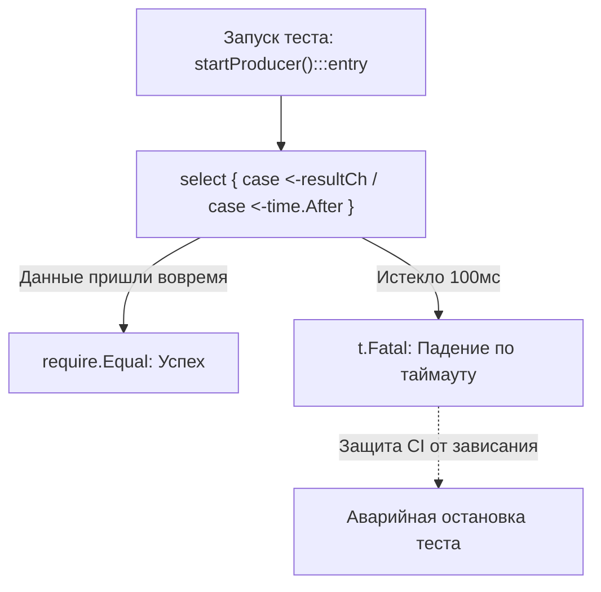

## Переход в нелинейный мир

До сих пор наше знакомство с тестированием развивалось в уютном, однопоточном и строго детерминированном мире. Мы отправляли синхронные сетевые запросы, блокировались в ожидании ответа, сверяли полученный результат с эталоном и вызывали привычный `require.Equal`. Классическая триада **Arrange-Act-Assert** (Подготовка-Действие-Проверка) работала предсказуемо, словно швейцарские часы.

Но стоит в кодовой базе появиться ключевому слову `go` (запуск независимой горутины), как линейное восприятие времени немедленно разрушается.

Поток управления разветвляется. Ваш тестовый раннер больше не является единовластным хозяином процессора. Если инженер пытается тестировать конкурентный код наивными линейными методами, он мгновенно попадает в капкан двух крайностей:
1. **Ложноположительные тесты:** сьют победно рапортует об успехе, в то время как фоновые горутины падают с критическими ошибками или застревают в вечных блокировках.
2. **Мерцающие тесты (Flaky Tests):** проверки то проходят, то падают в CI-пайплайне в зависимости от микросекундных сдвигов в планировщике операционной системы.

Тестирование конкурентности в Go требует глубокого понимания механики рантайма (M:N планировщика), строгой дисциплины синхронизации и трезвого осознания того, как устроена структура `testing.T`.

---

## Главная иллюзия: "Тест прошел успешно"

Самая распространенная ошибка при проверке асинхронной логики — иллюзия завершенности. Тест проверяет лишь то, что видит его собственная горутина.

Взглянем на хрестоматийный антипаттерн «выстрелил и забыл» (Fire-and-Forget). Функция выполняет сохранение данных в фоновом режиме:

```go
func SaveAsync(data string) {
	go func() {
		// Имитация фоновой сетевой активности или дисковой задержки
		time.Sleep(50 * time.Millisecond)
		panic("Фатальный сбой: база данных недоступна!") // Скрытая авария
	}()
}
```

А вот как эту функцию наивно пытается проверить неопытный разработчик:

```go
func TestSaveAsync_Bad(t *testing.T) {
	SaveAsync("test data")
	// Функция отработала мгновенно, тестовая функция завершается
	// В логах: PASS!
}
```

Тестовый раннер радостно выводит `PASS`, метрика тестового покрытия (Code Coverage) гордо показывает 100%, но при выводе сервиса в продакшен приложение немедленно падает от необработанной паники. Почему?

> [!info] Под капотом: Рантайм и тестирование
> Когда запускается команда `go test`, исполняемый бинарник выделяет для выполнения каждого теста отдельную главную горутину — назовем её `G_test`. 
> 
> Внутри теста вызов `SaveAsync` порождает дочернюю горутину `G_worker`. Планировщик Go помещает её в локальную очередь выполнения (Local Run Queue) логического процессора `P`. 
> 
> Однако горутина `G_test` ни секунды не ожидает завершения `G_worker`! Она моментально доходит до закрывающей фигурной скобки функции `TestSaveAsync_Bad`, рапортует об успехе и передает управление следующему тесту. 
> 
> К тому моменту, когда планировщик наконец переключит поток ядра `M` на исполнение `G_worker` (где происходит `time.Sleep` и выброс паники), сам тест уже считается успешно завершенным, либо процесс аварийно завершается вне контекста конкретного теста.

---

## Идиоматичная синхронизация в тестах

Фундаментальный закон тестирования конкурентности гласит: **тест обязан детерминированно дождаться завершения всех порожденных им горутин, прежде чем выполнять Assert и завершать работу.**

Если тестируемый метод не предоставляет точки синхронизации (не возвращает сигнальный канал, контекст или не принимает барьер синхронизации `*sync.WaitGroup`), **это фундаментальный архитектурный дефект бизнес-кода**. Код без возможности контроля времени жизни горутин является принципиально нетестируемым.

Перепроектируем бизнес-функцию так, чтобы она возвращала канал ошибки:

```go
// SaveAsyncWaitable возвращает канал только для чтения, гарантируя управляемость
func SaveAsyncWaitable(data string) <-chan error {
	errCh := make(chan error, 1)
	go func() {
		defer close(errCh)
		time.Sleep(10 * time.Millisecond)
		errCh <- errors.New("ошибка БД: таймаут записи")
	}()
	return errCh
}
```

Идиоматичный тест блокируется на чтении из канала, гарантируя фиксацию реального результата:

```go
func TestSaveAsync_Good(t *testing.T) {
	t.Parallel()

	errCh := SaveAsyncWaitable("test data")

	// Тестовая горутина блокируется до момента фиксации результата
	err := <-errCh

	require.Error(t, err)
	require.EqualError(t, err, "ошибка БД: таймаут записи")
}
```

---

## Ловушка t.Fatal() внутри горутины

Это один из классических вопросов на собеседованиях уровня Senior, ставящий в тупик даже опытных инженеров.

Представьте, что вы тестируете параллельный пул воркеров с помощью барьера `sync.WaitGroup`. Внутри дочерней горутины при обнаружении ошибки разработчик вызывает привычный `t.Fatal` (или методы библиотеки `require` из `testify`, которые под капотом обращаются к `t.FailNow`):

```go
func TestWorker_BadFatal(t *testing.T) {
	var wg sync.WaitGroup
	wg.Add(1)

	go func() {
		defer wg.Done()
		result := doWork()
		if result != "ok" {
			// КАТАСТРОФА: t.Fatal внутри порожденной горутины!
			t.Fatalf("Ожидали ok, получили %s", result) 
		}
	}()

	wg.Wait()
}
```

Что произойдет, если `result != "ok"`? Большинство кандидатов уверенно отвечают: «Тест упадет с ошибкой». Но в реальности поведение рантайма оказывается шокирующим.

> [!warning] Ловушка / Gotcha: Смерть горутины, а не теста
> Использование `t.Fatal()`, `t.Fatalf()` или `t.FailNow()` внутри дочерней горутины **строго запрещено спецификацией пакета testing**!
> 
> Под капотом метод `t.FailNow()` вызывает низкоуровневую функцию рантайма `runtime.Goexit()`. 
> 
> Функция `runtime.Goexit()` немедленно завершает **исключительно текущую горутину** (аккуратно раскручивая её цепочку `defer`). Однако она не способна прервать выполнение родительской горутины теста!
> 
> В приведенном фрагменте дочерняя горутина умирает, но перед смертью добросовестно выполняет `defer wg.Done()`. Счетчик барьера `WaitGroup` сбрасывается в ноль. Главная горутина беспрепятственно проскакивает барьер `wg.Wait()` и... завершает тест со статусом `PASS`! Сообщение об ошибке появится в выводе, но статус бинарника тестов останется нулевым (успешным).

### Как тестировать корректно?

Методы `t.Error()`, `t.Errorf()` и `t.Fail()` в структуре `testing.T` (а также функции `assert.*` из библиотеки `testify`) являются **потокобезопасными (Thread-Safe)**. Внутри рантайма доступ к полям состояния `t.T` синхронизируется мьютексом.

Они помечают тест как проваленный, но не прерывают горутину вызовом `runtime.Goexit()`. Завершение теста делегируется главной горутине:

```go
func TestWorker_GoodAssert(t *testing.T) {
	t.Parallel()

	var wg sync.WaitGroup
	wg.Add(1)

	go func() {
		defer wg.Done()
		result := doWork()
		// assert.* использует t.Errorf: тест будет помечен как Failed,
		// но горутина корректно дойдет до конца
		assert.Equal(t, "ok", result) 
	}()

	wg.Wait()
	// Если проверка внутри горутины не удалась, тест гарантированно упадет здесь!
}
```

---

## Тестирование с таймаутами (Deadlock Prevention)

При тестировании конкурентного кода неизбежны сбои, когда из-за логической ошибки дочерняя горутина зависает навсегда (Deadlock) или сообщение так и не отправляется в канал.

Если написать простое чтение:
```go
res := <-ch
```
и в канал никто ничего не запишет, тестовый раннер намертво зависнет на 10 минут (стандартный таймаут `go test`). Для быстрого CI это недопустимо. Любое конкурентное ожидание в тестах обязано быть защищено жестким дедлайном.

---

### Паттерн: select + time.After

Идиоматичный подход к ограничению времени ожидания — неблокирующая мультиплексирующая конструкция `select`:

```go
func TestProducer(t *testing.T) {
	t.Parallel()

	resultCh := startProducer()

	select {
	case res := <-resultCh:
		require.Equal(t, "success", res)
	case <-time.After(100 * time.Millisecond): // Страховочный таймаут
		t.Fatal("Таймаут: продюсер не вернул результат за отведенные 100мс")
	}
}
```



> [!tip] Собеседование
> **Вопрос:** Мы используем конструкцию `time.After(1 * time.Second)` в цикле `select` внутри фонового воркера, обрабатывающего миллионы событий в секунду. Чем это грозит в Production?
> 
> **Ответ:** Тяжелой утечкой памяти (Memory Leak). 
> 
> Функция `time.After` под капотом инстанциирует новый экземпляр таймера `time.NewTimer` и регистрирует его в глобальной очереди таймеров рантайма. Этот объект памяти не может быть собран Garbage Collector'ом до тех пор, пока таймер физически не сработает через 1 секунду — даже если ветка `select` мгновенно вышла по приходу сообщения из канала! Под высокой нагрузкой в куче накапливаются миллионы неудаленных таймеров. 
> 
> В высоконагруженном коде следует переиспользовать таймер: `timer := time.NewTimer(...)` с обязательным вызовом `timer.Stop()`. 
> Однако **в рамках тестов**, где таймер создается однократно на весь тест, использование `time.After` является абсолютно идиоматичным и безопасным.

---

## Контролируемый детерминизм (Controlled Determinism)

Главное свойство конкурентности — недетерминированность. Горутины планируются операционной системой и рантаймом в произвольном порядке. 

Попытка заставить горутины выполняться в нужном порядке с помощью «магических пауз» `time.Sleep(10 * time.Millisecond)` — один из худших антипаттернов. На быстром компьютере разработчика паузы хватит с запасом, а на перегруженном раннере CI (где делятся виртуальные vCPU) горутина опоздает на одну миллисекунду, и тест упадет.

Вместо ненадежного ожидания по времени применяется **оркестрация через сигнальные каналы (`chan struct{}`)**.

Рассмотрим тестирование кэша с подавлением дублирующих запросов (паттерн Singleflight): первый запрос должен пойти в медленную БД, а второй конкурентный запрос обязан заблокироваться и дождаться ответа первого, не нагружая хранилище повторно.

```go
func TestSingleflight_Cache(t *testing.T) {
	t.Parallel()
	cache := NewCache()

	// Каналы для пошаговой синхронизации сценария
	dbCallStarted := make(chan struct{})
	releaseDBCall := make(chan struct{})

	// Настраиваем мок БД под управление тестом
	cache.SetDBFunc(func(key string) string {
		close(dbCallStarted) // Рапортуем тесту: горутина дошла до БД!
		<-releaseDBCall      // Блокируем горутину, пока тест не разрешит продолжить
		return "data from DB"
	})

	// 1. Запускаем первого клиента в фоне
	go cache.Get("key1")

	// 2. Тест детерминированно ждет входа первого клиента в БД
	<-dbCallStarted

	// 3. Запускаем второго конкурентного клиента (он обязан заблокироваться на Singleflight)
	var wg sync.WaitGroup
	wg.Add(1)
	var secondResult string

	go func() {
		defer wg.Done()
		// Этот вызов не должен дойти до БД; он ждет результат первого вызова
		secondResult = cache.Get("key1")
	}()

	// 4. Разрешаем первому клиенту завершить чтение из БД
	close(releaseDBCall)

	// Дожидаемся завершения второго клиента
	wg.Wait()

	require.Equal(t, "data from DB", secondResult, "Второй клиент обязан получить данные первого")
}
```

Никаких `time.Sleep(10 * time.Millisecond)`! Тест выполняется за микросекунды и на 100% стабилен на любом оборудовании.

---

## Итог

1. **Никаких бесконтрольных горутин (Fire-and-Forget):** Любой асинхронный процесс, запущенный в тесте, обязан иметь точку синхронизации для гарантированного ожидания.
2. **Потокобезопасность `t.T`:** Вызовы `t.Error`, `t.Errorf` и `assert` в дочерних горутинах безопасны. Вызовы `t.Fatal`, `t.FailNow` и `require` внутри горутин строго запрещены, так как они завершают только текущую горутину через `runtime.Goexit()`, порождая ложноположительный статус `PASS`.
3. **Защита от дедлоков:** Любое чтение из канала в тестах должно оборачиваться в конструкцию `select` с тайм-аутом `time.After`.
4. **Контролируемый детерминизм:** Исключите использование `time.Sleep` для выстраивания порядка выполнения горутин. Синхронизируйте сценарии с помощью сигнальных каналов нулевого размера (`chan struct{}`).

Мы научились дисциплинированно управлять конкурентными потоками. Однако конкурентность таит в себе еще более опасного врага — одновременный несинхронизированный доступ к разделяемой памяти. В следующей лекции мы детально исследуем гонки данных и познакомимся с мощнейшим инструментом компилятора Go: [[2. Data race и race detector]].