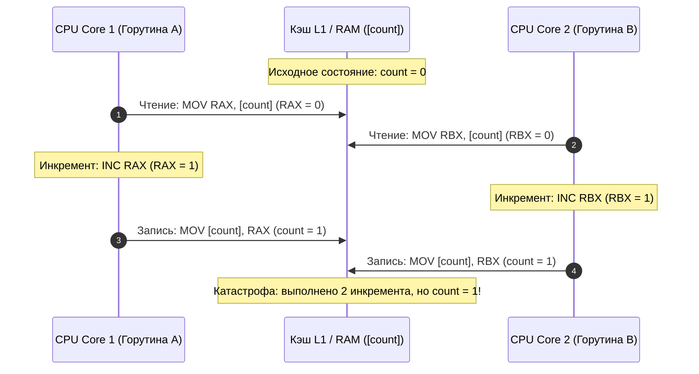

## Иллюзия атомарности

В предыдущей главе [[1. Тестирование конкурентного кода]] мы изучили дисциплину оркестрации горутин в тестах, научившись синхронизировать асинхронные цепочки через барьеры `sync.WaitGroup` и сигнальные каналы. Однако аккуратный запуск и корректное ожидание горутин не спасают от самого опасного порока многопоточного программирования — несинхронизированного доступа к разделяемому состоянию (Shared State).

Самый коварный, разрушительный и трудноуловимый дефект в конкурентном коде — это **Data Race (Состояние гонки по данным)**.

Коварство гонки данных заключается в том, что она способна месяцами незаметно дремать в продакшене, успешно проходя все юнит-тесты. Но стоит приложению столкнуться со специфическим профилем нагрузки на многоядерном сервере, как гонка проявляется в виде спорадических падений (`panic`), повреждения структур данных в памяти или скрытой порчи записей в базе. Попытка воспроизвести такой сбой локально под отладчиком почти всегда обречена на провал: само подключение отладчика меняет временные характеристики исполнения, заставляя гонку исчезнуть (эффект Гейзенбага).

В этой главе мы разберем физическую природу Data Race на уровне микроархитектуры процессора, развеем опасные мифы о «безопасных» гонках и освоим главное защитное оружие Go-инженера — **Race Detector**.

---

## Что такое Data Race?

Формальная спецификация модели памяти Go (Go Memory Model) дает строгое определение:

> **Data Race (Гонка данных)** возникает в том случае, когда две или более горутины одновременно обращаются к **одной и той же ячейке оперативной памяти**, причем:
> 1. Хотя бы одно из этих обращений является **операцией записи** (Write).
> 2. Между обращениями отсутствует отношение предшествования (**Happens-Before**), установленное явными примитивами синхронизации (мьютексами, каналами или операциями пакета `sync/atomic`).

Если эти условия сходятся, результирующее значение переменной становится недетерминированным, а программа скатывается в область неопределенного поведения (Undefined Behavior).

---

## Mechanical Sympathy: Взгляд со стороны железа

На технических собеседованиях кандидатам нередко предлагают взглянуть на элементарный фрагмент кода и ответить на вопрос: «Приведет ли этот код к гонке данных?»:

```go
package main

var count int

func main() {
    go func() { count++ }()
    go func() { count++ }()
    // Ожидание завершения опущено для наглядности
}
```

Человеческому глазу, привыкшему к высокоуровневому синтаксису, выражение `count++` кажется неделимой, атомарной операцией. Однако на уровне машинного кода архитектуры x86-64 или ARM64 единой команды «инкрементировать ячейку в RAM» в обычном коде не существует.

Для центрального процессора безобидная строка `count++` распадается на три самостоятельные микроинструкции цикла «чтение-модификация-запись» (Read-Modify-Write):
1. `MOV RAX, [count]` — считывание текущего 64-битного значения из оперативной памяти (или L1-кэша) в регистр `RAX` ядра CPU.
2. `INC RAX` — арифметическое увеличение значения в регистре на единицу.
3. `MOV [count], RAX` — сохранение обновленного значения из регистра обратно в память.

Процессорные ядра работают физически параллельно, а планировщик операционной системы и рантайм Go способны прервать выполнение горутины **между любыми из этих ассемблерных инструкций**:



> [!info] Под капотом: Кэши и Out-of-Order Execution
> На уровне кремния ситуация еще драматичнее. Современные CPU оснащены многоуровневой иерархией кэшей (L1, L2, L3) и буферами отложенной записи (**Store Buffers**). 
> 
> Когда Core 1 записывает байты, оно фиксирует их в своем локальном Store Buffer. Ядро Core 2 физически не увидит эти изменения на шине данных до тех пор, пока протокол когерентности кэшей (MESI или MOESI) не инвалидирует соответствующую кэш-линию (Cache Line) размером 64 байта.
> 
> Более того, и оптимизирующий компилятор Go, и суперскалярный конвейер самого процессора имеют право производить спекулятивное и внеочередное исполнение инструкций (**Out-of-Order Execution**), если между операциями нет явных аппаратных барьеров памяти (Memory Barriers). Без использования мьютексов или атомиков программист не имеет права рассчитывать даже на то, что операции записи станут видимы другим ядрам в том порядке, в котором они написаны в исходном коде!

---

## Ловушка: "Безопасные" гонки и повреждение памяти

Среди разработчиков, имеющих опыт работы с низкоуровневыми языками, порой циркулирует вредоносное заблуждение:  
*«Ну подумаешь, гонка на счетчике аналитики. Ну потеряем мы пару кликов из миллиона, зато сэкономим процессорные такты на блокировке мьютекса! Это же безобидная гонка (Benign Data Race)!»*

Запомните твердо: **в языке Go не существует понятия безопасной гонки данных.** Любая гонка ведет к неконтролируемой деградации структур рантайма.

Особую опасность гонки представляют в сочетании с так называемыми **толстыми указателями (Fat Pointers)**. В Go такие базовые типы, как интерфейсы, срезы (`slice`) и строки, состоят из нескольких машинных слов.

Взглянем на структуру любого интерфейса `any` (или `interface{}`) под капотом рантайма — структуру `eface`:
```go
type eface struct {
    _type *_type         // Указатель на метаданные типа (8 байт на x86-64)
    data  unsafe.Pointer // Указатель на физические данные в памяти (8 байт)
}
```

Присвоение значения переменной интерфейсного типа требует записи **16 байт**. На 64-битной архитектуре процессор за одну команду `MOV` способен атомарно записать не более 8 байт. Запись интерфейса распадается на две раздельные машинные инструкции!

Если горутина A пишет в интерфейс структуру строки, а горутина B одновременно пытается записать туда 64-битное число, третья горутина-читатель рискует прочитать ячейку памяти **ровно посередине между двумя `MOV` инструкциями**.

Она прочитает указатель `_type` от строки, а указатель `data` — от числа! При попытке вызвать метод или сделать приведение типа рантайм попытается разыменовать число как указатель на память, что мгновенно вызовет системный сигнал `SIGSEGV`, фатальную панику `panic: runtime error: invalid memory address` и аварийное падение всего процесса, которое **невозможно перехватить** стандартным блоком `recover()`.

> [!tip] Собеседование
> **Вопрос:** Почему при конкурентной записи в хэш-таблицу `map` рантайм Go немедленно аварийно завершает приложение с ошибкой `fatal error: concurrent map writes`, в то время как конкурентный `append` в `slice` паники не вызывает?
> 
> **Ответ:** Это осознанное архитектурное решение создателей языка. 
> 
> В структуру заголовка хэш-таблицы `hmap` встроен специальный флаг `hashWriting`. Перед началом любой мутации хэш-таблицы рантайм атомарно проверяет и выставляет этот флаг. Если при очередном обращении обнаруживается, что флаг уже поднят другой горутиной, среда исполнения немедленно производит аварийную остановку (`fatal error`). Это сделано умышленно: повреждение внутренних цепочек корзин (buckets) и структуры деревьев внутри `map` неизбежно приводит к зацикливанию поиска, утечкам памяти и чтению чужих областей памяти.
> 
> В срезах (`slice`) аналогичного защитного флага нет ради максимальной производительности базовых массивов. В результате конкурентный `append` тихо повреждает длину и емкость среза, перезаписывает чужие индексы и приводит к скрытой потере данных без явных ошибок.

---

## Инструмент спасения: go test -race

Обнаружить состояние гонки визуально при код-ревью невероятно сложно, а классические юнит-тесты пропускают гонки в 99% случаев из-за случайного совпадения таймингов. 

Для гарантированного выявления подобных аномалий в инструментарий Go встроен **Race Detector** (детектор гонок), созданный на базе алгоритмов ThreadSanitizer (TSan) от компании Google.

Инструмент активируется единым флагом `-race`:

```bash
go test -race ./...
```

При компиляции тестового бинарника с этим флагом компилятор переписывает абстрактное синтаксическое дерево (AST) вашей программы, оборачивая каждую операцию чтения и записи в памяти специальными регистрирующими вызовами рантайма.

---

### Как читать отчет Race Detector'а

Если во время прогона тестов происходит одновременный несинхронизированный доступ к ячейке памяти, тест завершается аварийно, выводя в терминал исчерпывающий диагностический отчет:

```
==================
WARNING: DATA RACE
Write at 0x00c0000a6010 by goroutine 7:
  yourproject/pkg.SaveAsync.func1()
      /path/to/project/pkg/logic.go:14 +0x3e

Previous read at 0x00c0000a6010 by goroutine 6:
  yourproject/pkg.SaveAsync.func2()
      /path/to/project/pkg/logic.go:20 +0x4b

Goroutine 7 (running) created at:
  yourproject/pkg.SaveAsync()
      /path/to/project/pkg/logic.go:13 +0x7a

Goroutine 6 (running) created at:
  yourproject/pkg.SaveAsync()
      /path/to/project/pkg/logic.go:12 +0x42
==================
```

Этот отчет содержит бесценную информацию для отладки:
1. **Физический адрес конфликтующей ячейки:** `0x00c0000a6010`.
2. **Стек вызовов горутины, совершившей запись (Write):** с точным указанием файла и номера строки.
3. **Стек вызовов горутины, читавшей (Read) или писавшей в эту же память ранее.**
4. **Место рождения обеих горутин:** стек родительских функций, запустивших ключевое слово `go`.

---

## Почему мы не используем -race в Production?

Флаг `-race` является строгим обязательным стандартом для запуска тестов в CI/CD пайплайнах (на каждом этапе проверки Pull Request). Однако компилировать с этим флагом бинарник для продакшена (`go build -race`) **категорически запрещено**.

Причина кроется в тяжелейших накладных расходах (Mechanical Sympathy):
- Race Detector работает не статически, а динамически в оперативной памяти. Для каждой 8-байтовой ячейки данных программы TSan выделяет дополнительные 32 байта так называемой **теневой памяти (Shadow Memory)**, где сохраняются векторные часы и идентификаторы последних горутин. В результате потребление оперативной памяти приложением возрастает в **5–10 раз**!
- На каждую ассемблерную операцию `MOV` накладывается вызов хука валидации теневой памяти, что увеличивает нагрузку на процессор и замедляет выполнение кода в **2–20 раз**.

> [!warning] Ловушка / Gotcha: Ложное чувство безопасности
> Race Detector способен зарегистрировать состояние гонки **исключительно в том случае, если она физически произошла во время исполнения теста**.
> 
> Если ваш юнит-тест покрывает только счастливый путь, а ошибочная ветка, содержащая конкурентную запись:
> ```go
> if err != nil {
>     sharedCounter++ // Конкурентная запись без мьютекса
> }
> ```
> ни разу не выполнилась во время тестов, флаг `go test -race` выдаст зеленый статус `PASS`!
> 
> Отсюда фундаментальный вывод: детектор гонок эффективен только тогда, когда ваши тесты намеренно и агрессивно создают конкурентную нагрузку на все ветви логики.

---

## Итог

1. **Data Race** — это одновременное обращение двух горутин к общей ячейке памяти без синхронизации, при котором хотя бы одно обращение является записью.
2. В Go **нет безопасных гонок**: из-за составной структуры строк, срезов и интерфейсов (Fat Pointers) любая гонка может привести к искажению указателей в куче и фатальному крушению рантайма.
3. Флаг **`go test -race`** — обязательный элемент любого CI-пайплайна. Он внедряет санитайзер потоков для мониторинга теневой памяти.
4. Детектор гонок выявляет только те конфликты, которые реально материализовались при выполнении. Ваши тесты обязаны провоцировать конкуренцию горутин.

Мы выяснили, как флаг `-race` спасает проекты от катастроф. Но как именно устроен этот механизм изнутри? Как компилятор инструментирует ассемблерный код, и как работают алгоритмы теневой памяти и векторных часов? В следующей главе мы разберем всю низкоуровневую кухню: [[3. go test -race под капотом]].