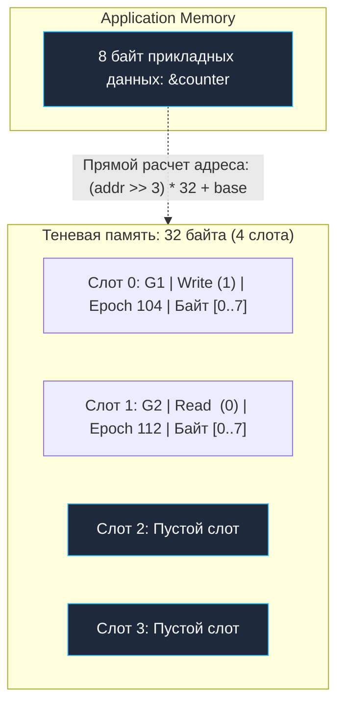

## Иллюзия магии: Как Go видит невидимое

В предыдущей главе [[2. Data race и race detector]] мы убедились, что гонка данных — это не просто абстрактная алгоритмическая ошибка, а хаотичное физическое переплетение машинных инструкций в кэшах L1/L2 многоядерного процессора, разрушающее структуры данных в памяти. Мы узнали, что флаг `-race` выступает безотказным щитом в CI-пайплайнах.

Однако у внимательного инженера неизбежно возникает закономерный вопрос: **как именно Go видит невидимое?**

Операционные системы семейства Linux не предоставляют аппаратных прерываний на чтение или запись каждого отдельного машинного слова. Процессор физически не сообщает ядру, что ячейка памяти была только что прочитана другой нитью. Каким же образом рантайм Go умудряется с точностью до наносекунды и конкретной строки исходного кода перехватывать микроскопические конфликты?

Никакой мистики здесь нет. Детектор гонок в Go — это сложнейший триумф системной инженерии, родившийся на стыке компилятора Go и модифицированной библиотеки **ThreadSanitizer (TSan)**, созданной инженерами Google для экосистемы LLVM и GCC.

Работа детектора делится на три взаимосвязанные фазы:
1. **Инструментирование кода на этапе компиляции (Compile-Time Instrumentation).**
2. **Отображение виртуального пространства в теневую память (Shadow Memory Mapping).**
3. **Анализ отношения предшествования через алгоритм векторных часов (Vector Clocks & Happens-Before).**

---

## Фаза 1: Инструментирование (Instrumentation)

Компилятор Go не может пассивно «подглядывать» за выполнением программы со стороны: ему требуется физически модифицировать структуру бинарного кода.

Когда вы передаете компилятору команду `go test -race`, на этапе генерации промежуточного SSA-представления (Static Single Assignment) компилятор выполняет обход синтаксического дерева и **переписывает каждое обращение к оперативной памяти**, внедряя перед ним специальные вызовы трассировочных хуков рантайма.

Представим простой инкремент глобальной переменной:
```go
// Исходный код разработчика
counter++
```

При сборке с флагом `-race` компилятор трансформирует этот код в следующую последовательность инструкций (псевдокод):

```go
// Модифицированный код, порожденный компилятором
runtime.raceread(unsafe.Pointer(&counter))  // Хук: горутина собирается выполнить чтение
tmp := counter                              // Физическая загрузка данных в регистр
tmp = tmp + 1                               // Арифметическая операция
runtime.racewrite(unsafe.Pointer(&counter)) // Хук: горутина собирается выполнить запись
counter = tmp                               // Физическое сохранение в память
```

> [!info] Под капотом: Ассемблер
> На уровне машинного кода функции `raceread` и `racewrite` не совершают медленных переходов через системные вызовы ядра ОС. 
> 
> Разработчики TSan реализовали сверхбыстрый путь (**Fast-Path**) на чистом ассемблере: он за считанные такты вычисляет адрес теневой ячейки и проверяет локальный кэш. Только в том случае, если обнаружен потенциальный конфликт или требуется обновить историю обращений, управление передается в тяжелый медленный путь (**Slow-Path**), написанный на C++, для математического анализа временных меток.

---

## Фаза 2: Теневая память (Shadow Memory)

Каким образом среда исполнения хранит историю того, какая именно горутина, когда и какую именно операцию совершила над переменной `counter`?

Для решения этой задачи используется концепция **Теневой памяти (Shadow Memory)**.

При старте скомпилированного с флагом `-race` процесса рантайм резервирует колоссальный диапазон виртуального адресного пространства операционной системы (десятки терабайт виртуальной памяти, которые физически материализуются в RAM ядром Linux по мере обращения через Page Faults).

Правило отображения строго детерминировано: **для каждых 8 байт реальной памяти вашего приложения (Application Memory) детектор выделяет 32 байта теневой памяти (Shadow Memory)**.

```
[Реальная память: 8 байт] ──(Битовый сдвиг адреса)──> [Теневая память: 32 байта]
                                                         ├── Слот 0 (8 байт: Shadow Word)
                                                         ├── Слот 1 (8 байт: Shadow Word)
                                                         ├── Слот 2 (8 байт: Shadow Word)
                                                         └── Слот 3 (8 байт: Shadow Word)
```

Эти 32 байта представляют собой кольцевой буфер из четырех 64-битных слотов (**Shadow Words**). Каждый слот кодирует подробный паспорт одного из четырех последних обращений к данной ячейке памяти:

* **Thread / Goroutine ID (16 бит):** уникальный идентификатор горутины, выполнившей доступ.
* **Epoch (42 бита):** скалярный логический счетчик времени (эпоха) данной горутины.
* **IsWrite (1 бит):** флаг операции: `1` — запись, `0` — чтение.
* **Position / Access Size (5 бит):** битовая маска, указывающая, какие именно байты из 8-байтового слова были затронуты.



**Mechanical Sympathy (Природа оверхеда):**  
Теперь становится кристально ясна физическая причина колоссального падения производительности под флагом `-race`. 

Вместо единственной процессорной инструкции `MOV`, которая мгновенно отрабатывает в L1-кэше данных, центральный процессор вынужден:
1. Вычислить адрес теневой ячейки по формуле битового сдвига.
2. Загрузить из оперативной памяти 32 байта теневых метаданных.
3. Выполнить побитовое сравнение и обновить слоты истории.
4. И лишь затем выполнить исходный `MOV`.

Это полностью разрушает локальность процессорных кэш-линий (Cache Lines 64B), вымывает полезные данные из L1/L2 кэша и провоцирует лавину Cache Misses.

---

## Фаза 3: Векторные часы и Happens-Before

Сам по себе факт того, что две горутины обратились к одной и той же переменной (и одна из них писала), еще не означает наличие гонки. Если горутины были строго упорядочены — например, одна передала данные через канал или отпустила мьютекс, а вторая захватила его, — доступ абсолютно легитимен.

Для математического доказательства порядка TSan использует фундаментальный алгоритм распределенных систем — **Векторные часы (Vector Clocks)**, восходящий к трудам Лесли Лэмпорта.

Каждая горутина обладает собственным локальным вектором логического времени. В момент взаимодействия горутин через примитивы синхронизации происходит **обмен и синхронизация временных векторов**:

1. Горутина `G1` выполняет запись переменной `A` на отметке своего времени `Epoch: 10`.
2. Горутина `G1` отправляет сигнал в канал: `ch <- struct{}{}`. Рантайм TSan перехватывает операцию и фиксирует вектор часов канала.
3. Горутина `G2` считывает сигнал из канала: `<-ch`. Детектор гонок обновляет часы `G2`, гарантируя, что её текущая эпоха строго превышает время отправки события из `G1`.
4. Горутина `G2` обращается к переменной `A` на отметке `Epoch: 15`.

Когда `G2` инициирует чтение переменной `A`, алгоритм детектора обращается к Теневой памяти:
- Последняя запись производилась горутиной `G1` в эпоху 10.
- Векторные часы `G2` свидетельствуют: события `G1` до эпохи 10 лежат строго в прошлом относительно текущей точки исполнения (`Happens-Before`).
- **Вердикт:** Операции упорядочены, состояние гонки отсутствует.

Если же канал или мьютекс отсутствовали, часы `G2` ничего не знают об эпохе `G1`. Детектор фиксирует конкурентные, несвязанные отношениями порядка часы и немедленно останавливает выполнение теста с паническим алертом: `WARNING: DATA RACE`.

> [!warning] Ловушка / Gotcha: Ложноотрицательные результаты (False Negatives)
> Поскольку теневая память для каждого 8-байтового блока ограничена **четырьмя слотами**, чисто теоретически существует вероятность ложноотрицательного исхода. 
> 
> Если между операцией записи горутины `G1` и несинхронизированным чтением горутины `G2` успеют произойти четыре независимых чтения от посторонних горутин `G3-G6`, историческая запись о мутации `G1` будет принудительно вытеснена из кольцевого буфера теневых слотов. 
> Когда `G2` прочитает ячейку, детектор сопоставит её лишь с оставшимися чтениями `G3-G6` и не заметит скрытого конфликта с `G1`. 
> На практике вероятность такого вытеснения в тестах микроскопически мала, однако архитектурно данный компромисс заложен в конструкцию алгоритма ради экономии оперативной памяти.

---

## Эволюция детектора: Снятие лимита 8192

На протяжении многих лет детектор гонок в Go содержал неприятное техническое ограничение, о котором часто спрашивали на квалификационных собеседованиях.

> [!tip] Собеседование
> **Вопрос:** С каким фатальным ограничением сталкивались разработчики при запуске `go test -race` на высоконагруженных тестах в версиях Go до 1.22?
> 
> **Ответ:** До релиза Go 1.22 движок ThreadSanitizer имел жестко захардкоженное архитектурное ограничение на **8128 (около 8192) одновременно активных горутин**. 
> 
> Поле Thread ID в 64-битном слоте теневой памяти исторически занимало всего 13 бит. Если масштабный интеграционный стресс-тест поднимал пул из 10 000 параллельных горутин, рантайм мгновенно завершался аварийной остановкой: `race: limit on 8128 simultaneously alive goroutines is exceeded`, даже если код был абсолютно корректен.
> 
> **Революция Go 1.22:** Инженеры обновили движок TSan до третьей версии (v3). Разрядность идентификатора потока была увеличена, а внутренняя таблица векторных часов переписана. Начиная с Go 1.22, этого жесткого лимита **больше не существует** — теперь под флагом `-race` можно тестировать приложения с сотнями тысяч горутин, пока не исчерпается физическая оперативная память машины.

---

## Итог

1. **ThreadSanitizer** — динамический инструмент времени выполнения: он перехватывает конфликты исключительно на тех путях исполнения, которые были фактически пройдены при прогоне тестов.
2. **Инструментирование** переписывает абстрактное синтаксическое дерево (AST), внедряя ассемблерные хуки `raceread` и `racewrite` перед каждой операцией обращения к памяти.
3. **Теневая память** поддерживает точный 32-байтовый аудит-лог для каждых 8 байт пользовательских данных, что объясняет 5–10-кратный рост потребления памяти и замедление работы CPU в 2–20 раз.
4. **Векторные часы** строго отслеживают математическое отношение *Happens-Before* через примитивы синхронизации (мьютексы, каналы, атомики).
5. Начиная с Go 1.22, исторический лимит в 8192 горутины полностью устранен.

Детектор гонок защищает нас от искажения данных в памяти. Однако многопоточный код таит в себе еще одну смертельную угрозу: что делать, если горутины не конфликтуют за память, а взаимно заблокировали друг друга в бесконечном ожидании? Детектор гонок здесь бессилен. В следующей главе мы разберем диагностику и предотвращение взаимоблокировок: [[4. Deadlock detection]].