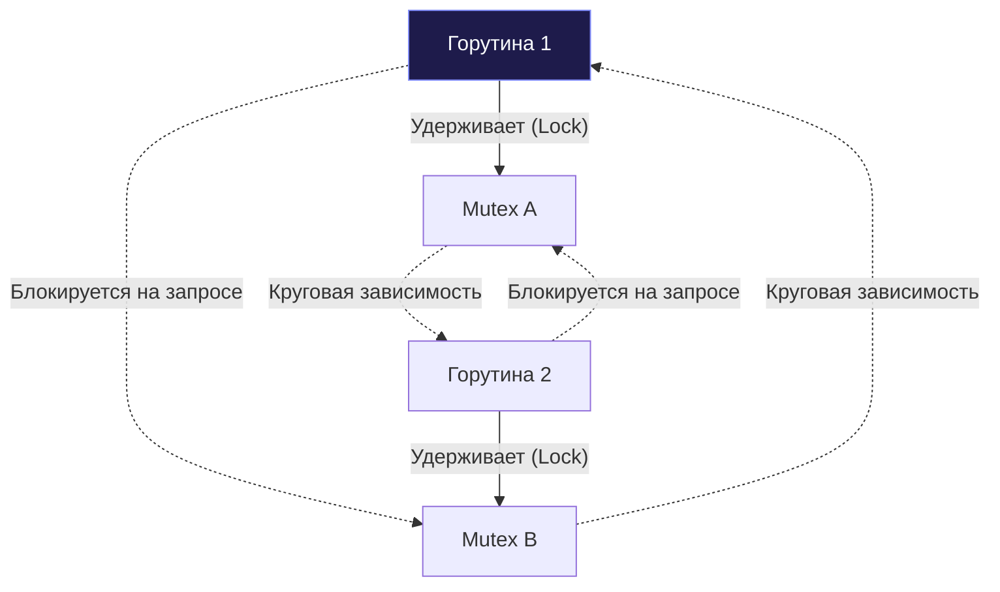

## Тишина в рантайме: Что такое Deadlock

В предыдущих статьях [[2. Data race и race detector]] мы исследовали состояние гонки — хаотичную энтропию, при которой горутины вслепую перезаписывают байты друг друга в оперативной памяти. Однако в многопоточном программировании существует и диаметрально противоположный порок. Это абсолютная, кладбищенская тишина: когда все участники вычислений замирают в вежливом ожидании ресурсов, и программа застывает навсегда. 

Это состояние называется **Взаимной блокировкой (Deadlock)**.

С точки зрения операционной системы и микроархитектуры процессора, Deadlock — это ситуация, когда два или более потоков переходят в статус ожидания ядра (`SLEEP`), оказываясь запаркованными планировщиком ОС в ожидании событий, которые должны были быть инициированы ими же самими по замкнутому кругу.

В классической теории информатики взаимная блокировка возникает при одновременном выполнении четырех условий Коффмана (Coffman conditions):
1. **Взаимное исключение (Mutual Exclusion):** ресурс неделим и может удерживаться только одним исполнителем.
2. **Удержание и ожидание (Hold and Wait):** горутина, захватившая один ресурс, запрашивает следующий, не отпуская предыдущий.
3. **Отсутствие вытеснения (No Preemption):** ресурс нельзя принудительно отобрать у горутины до добровольного освобождения.
4. **Круговое ожидание (Circular Wait):** возникает замкнутая цепочка, где Горутина 1 ждет ресурс, удерживаемый Горутиной 2, а Горутина 2 ждет ресурс Горутины 1.

В Go классический Deadlock чаще всего провоцируется нарушением порядка захвата примитивов `sync.Mutex` / `sync.RWMutex`, перекрестным чтением/записью в небуферизованные каналы или забытым вызовом `wg.Done()` в `sync.WaitGroup`.



---

## Глобальный Deadlock и магия рантайма

Каждый, кто начинал осваивать каналы в Go, сталкивался со знаменитым сообщением рантайма:
```
fatal error: all goroutines are asleep - deadlock!
```

В отличие от языков вроде C++ или C#, где заблокированная программа будет молча висеть неделями, сжигая память сервера, среда исполнения Go обладает встроенным интеллектом для перехвата таких аномалий на лету.

> [!info] Под капотом: Как Go определяет глобальный Deadlock
> В недрах рантайма Go трудится служебный системный поток — **sysmon** (System Monitor). Он запускается ядром ОС в обход планировщика Go и не привязан к логическим процессорам `P`. 
> 
> Когда планировщик распределяет потоки операционной системы `M` и обнаруживает, что все процессоры `P` простаивают, он вызывает системную функцию проверки `runtime.checkdead()`.
> 
> Рантайм проводит строгий математический аудит:
> 1. Сколько всего пользовательских горутин `G` существует в процессе?
> 2. Сколько горутин находятся в статусе ожидания `_Gwaiting` (запаркованы на мьютексах, системных вызовах или ожидают чтения из каналов)?
> 3. Активен ли сетевой поллер ядра (**Netpoller**) — есть ли хотя бы один ожидающий сокет epoll/kqueue?
> 4. Запланированы ли аппаратные таймеры в очереди таймеров?
> 
> Если среда видит, что **абсолютно все** пользовательские горутины перешли в статус `_Gwaiting`, на сокетах нет трафика, а таймеров не зарегистрировано, планировщик делает беспощадный вывод: внешних событий быть не может, пробуждать горутины некому. 
> 
> Процесс находится в терминальной стадии глобального дедлока. Чтобы спасти оператора от неведения, Go генерирует `panic` и завершает бинарник с подробным дампом стека всех горутин.

---

## Ловушка: Частичный Deadlock (Goroutine Leak)

Встроенный детектор рантайма великолепен, однако у него есть критическая ахиллесова пята: он способен реагировать **исключительно на глобальный Deadlock**, когда уснула абсолютно вся программа.

В реальном бэкенд-приложении такого идеального затишья не бывает почти никогда. В фоне непрерывно крутится сетевой сервер `http.ListenAndServe`, слушающий входящие TCP-соединения. Это означает, что Netpoller всегда активен, системные потоки `M` бодрствуют, и условие `runtime.checkdead()` не сработает никогда.

Если внутри фонового воркера две горутины взаимно заблокируют друг друга, рантайм **промолчит**. Приложение продолжит отдавать статические страницы, рапортовать о здоровье через health-check, в то время как заблокированные горутины навсегда зависнут в оперативной памяти ядра, удерживая открытые дескрипторы сокетов и блокировки таблиц базы данных.

Это явление называется **частичной взаимоблокировкой (Partial Deadlock)** или **утечкой горутин (Goroutine Leak)**.

Взглянем на незаметную ошибку в обработчике заказов:

```go
func processOrder(orderID string) {
	ch := make(chan string) // Небуферизованный канал!

	go func() {
		// Опасность: горутина пытается отправить данные в канал,
		// но если вызывающий код выйдет раньше по ошибке, читателя не будет!
		ch <- "результат" 
	}()

	if orderID == "" {
		// Ранний возврат при ошибке валидации
		return // Дочерняя горутина выше зависла на инструкции ch <- навсегда!
	}

	fmt.Println(<-ch)
}
```

При пустом `orderID` родительская функция выходит, а фоновая горутина навсегда зависает на попытке записи в небуферизованный канал. За миллион запросов сервер накопит миллион заблокированных горутин, что приведет к OOM-падению (Out of Memory).

---

## Стратегии тестирования Deadlock

Поскольку в интеграционных тестах падение рантайма через глобальную панику недопустимо (оно прерывает весь тестовый бинарник `go test`), инженер обязан применять специализированные шаблоны изоляции.

---

### 1. Жесткие таймауты (Fail-Fast)

Как мы сформулировали в главе [[1. Тестирование конкурентного кода]], любое асинхронное действие в тесте должно быть ограничено разумным дедлайном с помощью комбинации `select + time.After`. Если тестируемый блок попадает в состояние взаимной блокировки, тест должен прерываться за секунды, а не блокировать пайплайн CI на 10 минут.

Проверим устойчивость транзакционного перевода между счетами к нарушению порядка блокировок (Lock Ordering):

```go
func TestAccount_Transfer_DeadlockPrevention(t *testing.T) {
	t.Parallel()

	acc1 := NewAccount("A", 1000)
	acc2 := NewAccount("B", 1000)

	done := make(chan struct{})

	go func() {
		var wg sync.WaitGroup
		wg.Add(2)

		// Моделируем встречные переводы крест-накрест
		go func() {
			defer wg.Done()
			acc1.TransferTo(acc2, 100)
		}()

		go func() {
			defer wg.Done()
			acc2.TransferTo(acc1, 200)
		}()

		wg.Wait()
		close(done) // Если возник Deadlock, этот код не выполнится никогда
	}()

	select {
	case <-done:
		// Успех: взаимной блокировки не произошло
	case <-time.After(2 * time.Second):
		t.Fatal("Обнаружен Deadlock! Операции перевода заблокировали друг друга.")
	}
}
```

---

### 2. Детектирование утечек: uber-go/goleak

Страховочный таймаут защищает тест от вечного зависания, но он бессилен против частичных утечек горутин (когда основной поток теста завершился успешно, оставив за собой зависшие дочерние горутины, как в функции `processOrder`).

Индустриальным эталоном чистоты конкурентного кода выступает библиотека `go.uber.org/goleak` от компании Uber.

> [!info] Под капотом: Как работает goleak
> Библиотека `goleak` функционирует на базе прямого анализа рантайма: в момент проверки она считывает дамп всех активных горутин через системный вызов `runtime.Stack()`.
> 
> Детектор фильтрует известные системные горутины (фоновый сборщик мусора, сетевой поллер, горутину самого тестового раннера) и сверяет остаток. Если после завершения теста в памяти обнаруживается хотя бы одна неучтенная живая горутина — тест признается аварийным, а в консоль выводится полный стек вызовов зависшего потока с точным указанием заблокировавшей его инструкции.

Использование библиотеки максимально лаконично — через хук завершения `t.Cleanup` (или `defer`) для отдельного теста:

```go
package business_test

import (
	"testing"
	"go.uber.org/goleak"
)

func TestProcessOrder_NoGoroutineLeak(t *testing.T) {
	// Регистрируем обязательный аудит горутин при выходе из теста через t.Cleanup
	t.Cleanup(func() {
		goleak.VerifyNone(t)
	})

	// Act: вызываем функцию с ошибочными входными данными
	processOrder("")

	// Основной поток завершается успешно, но goleak просканирует рантайм,
	// обнаружит зависшую горутину на записи ch <- "результат"
	// и пометит тест как проваленный с детальным дампом!
}
```

Для тотальной защиты всех тестов пакета аудит выносят в функцию `TestMain`:
```go
func TestMain(m *testing.M) {
	goleak.VerifyTestMain(m)
}
```

---

### 3. Статический анализ (Lock Ordering)

Наиболее совершенный способ борьбы с блокировками мьютексов — их алгоритмическое предотвращение. Главная причина мьютексных дедлоков — отсутствие **иерархии захвата блокировок (Lock Hierarchy)**. Если поток 1 захватывает мьютекс A, а затем B, то ни один другой поток в системе не имеет права захватывать их в обратной последовательности (сначала B, затем A).

Стандартный тулчейн Go оснащен статическим анализатором `go vet`. Хотя он не строит полный граф иерархий, он мгновенно отлавливает главную причину случайных дедлоков среди начинающих разработчиков — **копирование мьютексов по значению**.

> [!warning] Ловушка / Gotcha: Копирование мьютекса
> В языке Go структуры передаются по значению (то есть копируются побайтово).
> 
> Если у вас объявлена структура:
> ```go
> type SafeCounter struct {
>     mu  sync.Mutex
>     val int
> }
> ```
> и вы передаете ее в функцию по значению: `func update(c SafeCounter)`, рантайм создает полную копию структуры в новом фрейме стека!
> 
> Если в момент копирования мьютекс находился в состоянии блокировки, его копия **также скопируется в заблокированном состоянии**. Когда метод внутри функции вызовет `c.mu.Lock()`, горутина мгновенно заблокирует сама себя (Self-Deadlock), поскольку разблокировать эту локальную копию некому: связь со статусом `unlocked` оригинала безвозвратно разорвана.
> 
> Правило: структуры, содержащие примитивы синхронизации, обязаны передаваться **строго по указателю**: `*SafeCounter`. 
> 
> Запуск анализатора `go vet -copylocks` выявляет эту ошибку за доли секунды до компиляции.

> [!tip] Собеседование
> **Вопрос:** Если две горутины одновременно вызывают метод `RLock()` структуры `sync.RWMutex`, могут ли они спровоцировать взаимную блокировку (Deadlock)?
> 
> **Ответ:** Сами по себе параллельные вызовы `RLock()` мьютекс не блокируют — чтение разделяемо. Однако Deadlock (или жесткое голодание писателя — Writer Starvation) гарантированно возникает при попытке **рекурсивного чтения при наличии ожидающего писателя**.
> 
> В реализации `sync.RWMutex` в Go, когда горутина-писатель вызывает `Lock()`, она блокируется в ожидании завершения текущих читателей. Но чтобы писатель не голодал вечно, `RWMutex` запрещает вход **новым** читателям.
> 
> Если горутина, уже удерживающая `RLock()`, попытается повторно вызвать `RLock()` (вложенный захват) в тот момент, когда в очередь встал писатель, она будет заблокирована до окончания писателя. Но сам писатель заблокирован в ожидании первого `RLock` этой же самой горутины! Возникает классический неразрешимый самодедлок (Self-Deadlock).

---

## Итог

1. **Глобальный Deadlock** автоматически отслеживается монитором рантайма (`sysmon` и `runtime.checkdead()`) и завершается фатальной паникой.
2. **Частичный Deadlock (утечка горутин)** не распознается стандартным рантаймом при живом сетевом поллере. Для его предотвращения в тестах критически важно использовать `select + time.After`.
3. Библиотека **`go.uber.org/goleak`** — фундаментальный инструмент аудита конкурентных тестов, гарантирующий, что фоновые горутины корректно сворачиваются.
4. Избегайте копирования мьютексов (контролируйте код через `go vet -copylocks`) и никогда не используйте рекурсивный `RLock()` в `sync.RWMutex`.

Мы научились бороться с блокировками на уровне мьютексов. Однако каноническая философия Go утверждает: «Не общайтесь, разделяя память; разделяйте память, общаясь». В следующей статье мы перейдем к тестированию главного средства коммуникации в Go — потокобезопасных очередей сообщений: [[5. Тестирование каналов]].