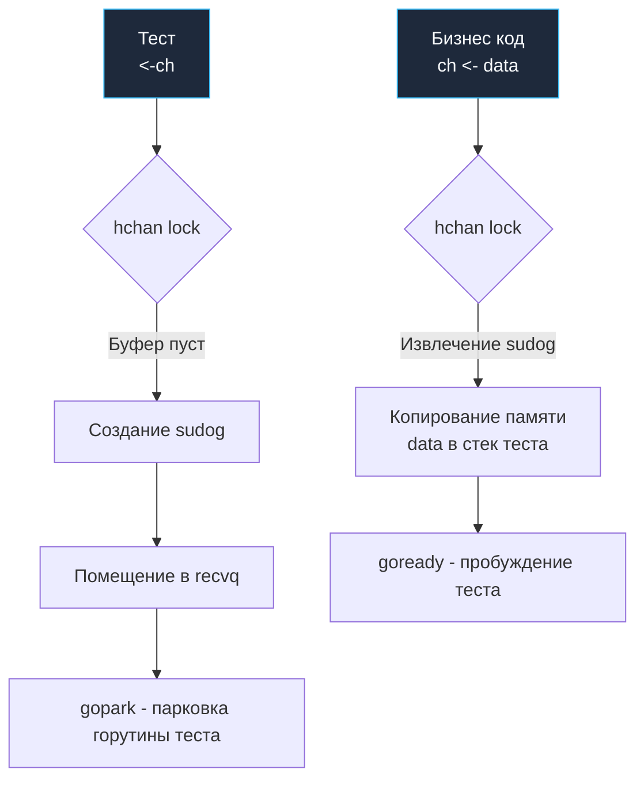

## Парадигма CSP в условиях изоляции

В философии Go красной нитью проходит знаменитое правило Роба Пайка: *"Не общайтесь через разделяемую память; разделяйте память через общение"* (*"Do not communicate by sharing memory; instead, share memory by communicating"*). Фундаментальной реализацией этой парадигмы — модели взаимодействующих последовательных процессов (CSP, Communicating Sequential Processes Тони Хоара) — в языке Go служат первоклассные каналы (`chan`).

Мы уже исследовали механизмы взаимных блокировок и утечек ресурсов в [[4. Deadlock detection]]. Однако тестирование программного кода, пронизанного каналами, бросает инженеру совершенно особый вызов. Канал в Go — это не бестелесная абстракция и не сетевой сокет; это строгий синхронизирующий примитив рантайма. Ошибка в организации взаимодействия с каналом внутри юнит-теста в лучшем сценарии обернется аварийным падением `go test` по таймауту, а в худшем — замаскирует коварный дефект многопоточности, породив зомби-горутины, незаметно сжирающие процессорное время и дескрипторы в продакшене.

В этой главе мы подробно разберем паттерны тестирования двух фундаментальных ролей: когда тестируемый компонент выступает **Продюсером** (порождает поток данных и возвращает канал) и когда он является **Консьюмером** (принимает канал и вычитывает задачи).

---

## Mechanical Sympathy: Что такое канал в памяти?

Чтобы безошибочно диагностировать зависания и падения тестов, необходимо снять покров тайны с внутренней механики рантайма и заглянуть в реализацию канала в исходных кодах Go.

> [!info] Под капотом: Структура hchan
> Когда вы выполняете аллокацию `make(chan int, 3)`, рантайм Go выделяет в куче (Heap) заголовочную структуру `hchan` (исходный код расположен в `runtime/chan.go`).
> Она содержит ключевые поля:
> 1. `buf`: Указатель на циклический буфер (Ring Buffer) в непрерывном массиве памяти для хранения переданных элементов (если канал создан буферизованным).
> 2. `sendq` и `recvq`: Двусвязные списки очередей ожидания (Wait Queues). Если горутина пытается прочитать из пустого канала (`<-ch`), планировщик не сжигает циклы CPU в спинлоке. Он аллоцирует структуру `sudog`, связывает ее с текущей горутиной `g`, помещает в хвост очереди `recvq` и переводит горутину вызовом `gopark` в состояние `Gwaiting` (паркует ее).
> 3. `lock`: Обычный спин-мьютекс `runtime.mutex`. **Каналы в Go не являются lock-free структурами!** Любая операция чтения, записи или закрытия канала монопольно захватывает этот внутренний мьютекс.
> 
> Когда ваш тест выполняет операцию `<-ch`, а тестируемый бизнес-код по причине бага ничего туда не пишет, горутина теста (`g_test`) заворачивается в `sudog`, становится в `recvq` и засыпает. Если бизнес-код завершился с ошибкой или вышел по `return`, так и не закрыв канал, тестовая горутина не проснется **никогда**. Это приводит к зависанию тестового бинарника и мучительному таймауту CI-пайплайна.

Взглянем на внутреннюю организацию структуры `hchan` в оперативной памяти:

```
                          Структура hchan (runtime/chan.go)
    +-------------------------------------------------------------------+
    | lock (runtime.mutex) | qcount: uint | dataqsiz: uint | elemsize   |
    +-------------------------------------------------------------------+
    | closed: uint32       | elemtype: *_type             | sendx/recvx |
    +-------------------------------------------------------------------+
    | buf (unsafe.Pointer) ----> [ Elem 0 ][ Elem 1 ][ Elem 2 ] (Ring)  |
    +-------------------------------------------------------------------+
    | recvq (waitq)        ----> sudog <-> sudog <-> sudog (Gwaiting)   |
    +-------------------------------------------------------------------+
    | sendq (waitq)        ----> sudog <-> sudog <-> sudog (Gwaiting)   |
    +-------------------------------------------------------------------+
```

Схема прохождения данных и синхронизации горутин через очереди ожидания наглядно демонстрирует эту механику:



Обратите внимание: рантайм оптимизирует передачу данных — если в `recvq` уже ждет спящая горутина, пишущая горутина копирует байты напрямую из своего стека в стек читателя через указатель в `sudog`, минуя промежуточный кольцевой буфер `buf`!

---

## Паттерн 1: Тестирование Продюсеров

Продюсер — это функция или метод, запускающий асинхронную обработку и возвращающий канал только для чтения (`<-chan T`). В инженерной практике этот подход чаще всего реализует паттерн «Генератор» (Generator) или конвейерную обработку (Pipeline).

**Главная дилемма:** Как верифицировать, что продюсер отправил строго ожидаемую последовательность элементов и корректно сигнализировал об окончании передачи, закрыв канал, не рискуя заморозить тестовый раннер навечно?

Рассмотрим типичный продюсер:

```go
// GenerateNumbers порождает последовательность чисел в отдельной горутине.
func GenerateNumbers(ctx context.Context, max int) <-chan int {
	out := make(chan int)
	go func() {
		// КРИТИЧЕСКИ ВАЖНО: defer close(out) гарантирует оповещение подписчиков
		// о завершении генерации даже при возникновении паники
		defer close(out)
		for i := 1; i <= max; i++ {
			select {
			case out <- i:
			case <-ctx.Done():
				return
			}
		}
	}()
	return out
}
```

### Идиоматичный тест продюсера

Для тестирования такого генератора применяется паттерн `for-select` с защитным таймером `time.NewTimer` и контролем флага валидности чтения (`ok`):

```go
package worker_test

import (
	"context"
	"testing"
	"time"

	"github.com/stretchr/testify/require"
	"yourproject/internal/worker"
)

func TestGenerateNumbers_Success(t *testing.T) {
	t.Parallel()

	ctx, cancel := context.WithCancel(context.Background())
	defer cancel() // Хороший инженерный тон — всегда освобождать ресурсы контекста

	ch := worker.GenerateNumbers(ctx, 3)

	var results []int
	
	// Создаем единый таймер на весь сценарий вычитки вместо вызова time.After
	// на каждой итерации, что предотвращает утечку ресурсов таймеров в рантайме.
	timeout := time.NewTimer(1 * time.Second)
	defer timeout.Stop()

loop:
	for {
		select {
		case val, ok := <-ch:
			if !ok {
				// Канал закрыт: продюсер полностью передал данные и выполнил close(ch)
				break loop
			}
			results = append(results, val)
		case <-timeout.C:
			t.Fatal("Таймаут: продюсер завис или не закрыл канал")
		}
	}

	require.Equal(t, []int{1, 2, 3}, results)
}
```

> [!tip] Собеседование
> **Вопрос:** Как неблокирующим образом проверить в тесте, закрыт ли канал, не зависая на пустом канале?
> **Ответ:** Применить конструкцию `select` с веткой `default`. Конструкция `select` попытается извлечь значение из канала. Если канал пуст, но открыт, сработает ветка `default`. Если же канал был закрыт через `close(ch)`, чтение вернет дефолтное значение типа и `ok == false`:
> ```go
> select {
> case val, ok := <-ch:
>     if !ok {
>         fmt.Println("Канал закрыт")
>     } else {
>         fmt.Println("Прочитали значение:", val)
>     }
> default:
>     fmt.Println("Канал пуст, но НЕ закрыт (или нет писателей)")
> }
> ```

---

## Паттерн 2: Тестирование Консьюмеров

Консьюмер — это функция или фоновый воркер, принимающий входной канал `<-chan T` и обрабатывающий поступающий поток сообщений.

**Подводный камень:** Инженеры нередко забывают закрыть входной канал *со стороны самого теста*. Если консьюмер считывает данные через идиоматичный цикл `for val := range ch`, он будет бесконечно заблокирован в ожидании следующей порции данных до тех пор, пока отправитель явно не выполнит закрытие канала. В результате горутина консьюмера зависает навсегда, вызывая утечку памяти (которую выявляет библиотека `goleak`, как мы рассматривали в предыдущих статьях).

Изучим тестируемый консьюмер:

```go
// ProcessTasks вычитывает задачи из канала, вычисляет сумму и завершается
func ProcessTasks(in <-chan int) int {
	sum := 0
	// Цикл range завершится ТОЛЬКО тогда, когда канал 'in' будет закрыт отправителем!
	for val := range in {
		sum += val
	}
	return sum
}
```

### Идиоматичный тест консьюмера

В тестовом сценарии мы обязаны инициализировать канал, заполнить его тестовыми данными, **обязательно закрыть его**, и лишь затем передать на обработку:

```go
func TestProcessTasks(t *testing.T) {
	t.Parallel()

	// 1. Arrange: Создаем буферизованный канал подходящей емкости.
	// Буфер защищает тест от взаимной блокировки (deadlock), позволяя
	// полностью заполнить канал данными до передачи его консьюмеру.
	inCh := make(chan int, 3)
	
	inCh <- 10
	inCh <- 20
	inCh <- 30
	
	// КРИТИЧЕСКИ ВАЖНО: Закрываем канал до передачи в синхронный консьюмер!
	// Если опустить close(inCh), цикл range в ProcessTasks зависнет навечно.
	close(inCh) 

	// 2. Act: Запускаем обработку
	result := worker.ProcessTasks(inCh)

	// 3. Assert: Сверяем накопительный результат
	require.Equal(t, 60, result)
}
```

> [!warning] Ловушка / Gotcha: Буферизованные vs Небуферизованные каналы в тестах
> Если бы мы в тесте выше создали синхронный канал без буфера через `make(chan int)` и попытались выполнить последовательную запись `inCh <- 10`, наш **тест мгновенно ушел бы в Deadlock** прямо на первой инструкции записи!
> 
> Согласно спецификации Go, операция отправки в небуферизованный канал паркует пишущую горутину до тех пор, пока читающая горутина не выполнит операцию приема. Но читатель (`ProcessTasks`) еще даже не получил управление, поскольку находится строкой ниже в том же самом потоке исполнения!
> 
> **Золотое правило:** Если в теле теста вы отправляете данные в канал *до* старта горутины-читателя в том же самом потоке, канал **обязан** быть буферизованным (`make(chan int, 3)`). Если же объем передаваемых данных заранее неизвестен или динамичен, запускайте писателя в отдельной горутине:
> ```go
> inCh := make(chan int)
> go func() {
>     defer close(inCh) // Гарантированно закрываем канал по окончании отправки
>     inCh <- 10
> }()
> // Теперь читатель может безопасно принимать данные синхронно
> ProcessTasks(inCh)
> ```

---

## Тестирование отмены контекста (Context Cancellation)

Любой надежный продакшен-код на Go, работающий с конкурентными каналами, обязан поддерживать прерывание по сигналам от `context.Context`. Мы обязаны покрывать тестами ситуации, когда отправка в канал не должна подвешивать горутину, если потребитель досрочно разорвал соединение или истек таймаут HTTP-запроса. Зависшая на записи горутина — это классический источник утечек памяти (Goroutine Leak) в микросервисах.

Рассмотрим продюсер с поддержкой контекстной отмены:

```go
// FlakyProducer демонстрирует безопасную отправку с обработкой ctx.Done()
func FlakyProducer(ctx context.Context, out chan<- int) {
	// Имитация полезной вычислительной нагрузки...
	result := 42
	
	select {
	case out <- result: // Успешная отправка, если читатель готов принять значение
	case <-ctx.Done():  // Немедленный выход без утечки, если контекст отменен
		return
	}
}
```

Тест на подтверждение корректной отмены:

```go
func TestFlakyProducer_ContextCancellation(t *testing.T) {
	t.Parallel()

	ctx, cancel := context.WithCancel(context.Background())
	out := make(chan int) // Небуферизованный канал: читателя нет, запись заблокируется

	// Запускаем продюсера в фоне. Он неизбежно заблокируется на select,
	// так как из канала 'out' никто не вычитывает.
	go worker.FlakyProducer(ctx, out)

	// Имитируем прерывание операции клиентом спустя 10 миллисекунд
	time.Sleep(10 * time.Millisecond)
	cancel()

	// Как верифицировать, что FlakyProducer реально завершился, а не остался висеть?
	// Интегрируем библиотеку goleak (как показано в предыдущих главах),
	// либо отслеживаем завершение через дополнительный сигнальный done-канал.
	// Если бы в коде отсутствовала ветка case <-ctx.Done(),
	// горутина продюсера зависла бы навсегда в recvq/sendq, и goleak зафиксировал бы сбой.
}
```

---

## Отлов паники: Запись в закрытый канал

Фундаментальная особенность архитектуры каналов в Go гласит: попытка записи в уже закрытый канал вызывает фатальную панику рантайма `panic: send on closed channel`. Попытка повторного закрытия закрытого канала аналогично инициирует `panic: close of closed channel`.

Чаще всего эта ошибка всплывает при некорректном управлении жизненным циклом каналов в архитектурах с несколькими параллельными отправителями (Multiple Writers). Если ваша внутренняя библиотека реализует потокобезопасный брокер сообщений или декоратор над каналами, перехватывающий подобные сбои через механизм `recover`, поведение необходимо строго валидировать с помощью инструмента `require.Panics`.

```go
func TestSafeSender_PanicsOnClosed(t *testing.T) {
	t.Parallel()

	ch := make(chan int)
	close(ch) // Канал предварительно закрыт!

	// Проверяем, что рантайм Go генерирует ожидаемую панику
	require.Panics(t, func() {
		ch <- 1 // Вызовет мгновенную панику на уровне рантайма (runtime/chan.go)
	}, "Ожидалась паника при записи в закрытый канал")
}
```

---

## Итог

Работа с каналами требует глубокого механического сочувствия к структурам данных рантайма:
1. **Каналы — это не магия, а мьютексы и списки ожидания.** Любое некорректное предположение об их состоянии в тестах переводит горутины в состояние `Gwaiting`, приводя к таймаутам.
2. При тестировании **Продюсеров** всегда оборачивайте чтение в конструкцию `for-select` с защитным таймером `time.NewTimer` и анализом флага закрытия `ok`, чтобы тест падал информативно и предсказуемо.
3. При тестировании **Консьюмеров** неукоснительно выполняйте `close(ch)` на стороне теста, иначе циклы `range` консьюмеров спровоцируют дедлок и утечку горутин.
4. Помните о семантике буфера: синхронная отправка `inCh <- 10` в небуферизованный канал `make(chan int)` без параллельного фонового читателя мгновенно парализует тестовый поток.

Каналы служат лишь транспортными артериями в модели CSP. Реальными же вычислительными акторами выступают сами горутины. Как проверить, что воркеры не плодятся бесконтрольно, как надежно тестировать паттерны пулов рабочих потоков (Worker Pool) и валидировать грациозное завершение (Graceful Shutdown)? Этим жизненно важным практикам посвящена следующая статья: [[6. Тестирование goroutines]].