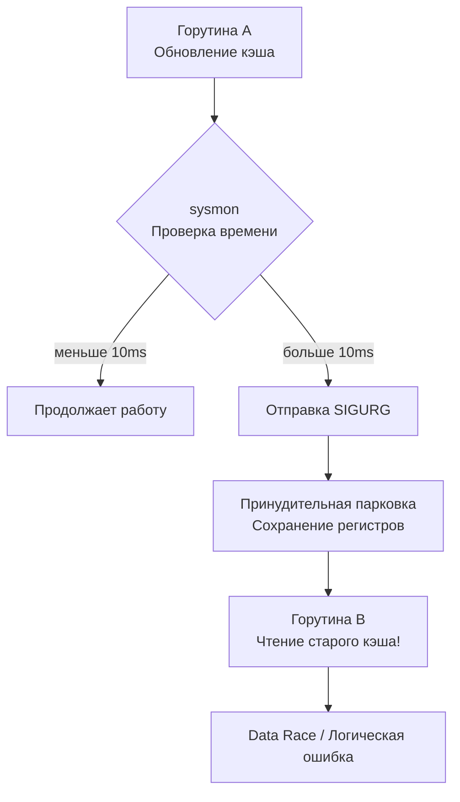

## Укрощение хаоса

Мы проделали фундаментальный путь в исследовании многопоточности и конкурентности в Go. Мы освоили базовые приемы синхронизации и координации в [[1. Тестирование конкурентного кода]], изучили физику скрытого повреждения памяти в [[2. Data race и race detector]], заглянули в теневую память и векторные часы рантайма в [[3. go test -race под капотом]] и научились диагностировать зависания и утечки горутин в [[4. Deadlock detection]].

Однако даже если ваш код безупречно очищен от Data Race и избавлен от взаимных блокировок (Deadlocks), над ним по-прежнему тяготеет главное проклятие распределенных и параллельных систем — **Недетерминированность** (Non-determinism).

Недетерминированность означает, что один и тот же программный бинарник с идентичными входными данными выдает разный результат в зависимости от миллисекундных колебаний загрузки процессора. Тест проходит зелёным 99 раз подряд на ноутбуке разработчика, но на 100-й раз (неизменно ночью в пятницу в перегруженном CI-пайплайне) с грохотом падает. Это классические *Flaky tests* («флакающие тесты»), которые подтачивают доверие команды к автоматизированному тестированию и вынуждают инженеров жать кнопку «Re-run job» вместо глубокого анализа бага.

Настоящее инженерное тестирование конкурентного кода обязано быть **детерминированным**. Наша задача — архитектурно лишить планировщик Go (Scheduler) возможности случайным образом перемешивать кванты времени, и заставить горутины маршировать в строго заданном порядке, воспроизводя тончайшие состояния гонки (Race Conditions) со 100% повторяемостью.

---

## Mechanical Sympathy: Почему порядок непредсказуем?

Чтобы обуздать планировщик, необходимо понимать физическую природу недетерминированности многопоточного кода на современном кремнии.

В ранних версиях Go (до версии 1.14) планировщик рантайма был исключительно **кооперативным**. Горутина добровольно уступала процессорное ядро только в строго определенных точках сотрудничества: при совершении системного вызова, аллокации памяти в куче, операциях с каналами или явном вызове `runtime.Gosched()`. Тесты в те времена были сравнительно предсказуемыми: плотный вычислительный цикл в горутине монопольно захватывал поток ОС.

> [!info] Под капотом: Асинхронная вытесняющая многозадачность
> Начиная с релиза Go 1.14, модель многозадачности стала **асинхронно вытесняющей** (Asynchronously Preemptible Concurrency). 
> В недрах рантайма непрерывно функционирует системный мониторный поток `sysmon`, не привязанный ни к одному логическому процессору `P`. Каждые несколько миллисекунд `sysmon` инспектирует состояние системы. Если он обнаруживает, что конкретная горутина непрерывно выполняется дольше 10 миллисекунд (удерживая контекст процессора `P`), `sysmon` посылает потоку операционной системы `M` низкоуровневый POSIX-сигнал **SIGURG** (на Unix/Linux-системах).
> 
> Обработчик сигнала в рантайме Go перехватывает управление, программно модифицирует регистр указателя команд (Instruction Pointer, `RIP` на x86-64 или `PC` на ARM64), сохраняет контекст регистров CPU горутины в память стека и принудительно снимает её с исполнения, возвращая в локальную или глобальную очередь запуска `RunQueue`.
> 
> **Неумолимый вывод:** Вы физически не способны предугадать, на какой конкретно строчке исходного кода или инструкции ассемблера ваша горутина будет вытеснена операционной системой.

Взглянем на схему возникновения коварного состояния гонки из-за асинхронного вытеснения:



---

## Стратегия 1: Инверсия времени (Time Mocking)

Заклятый враг стабильности и скорости тестов — стандартный пакет `time`. Всякий раз, когда бизнес-логика или тесты обращаются к `time.Sleep`, `time.After` или `time.Ticker`, вы вверяете судьбу своего теста капризам загрузки CPU и таймингам ОС.

> [!warning] Ловушка / Gotcha
> Если вы встречаете в тесте подобную конструкцию:
> ```go
> go worker()
> time.Sleep(10 * time.Millisecond) // Надеемся, что воркер успел запуститься
> assertSomething()
> ```
> Перед вами тяжелое преступление против детерминизма. На нагруженном CI-агенте или в виртуальной машине под троттлингом гипервизора эти 10 миллисекунд пройдут мгновенно, а ядро Linux даже не успеет выделить квант времени для создания потока и старта горутины воркера. Тест упадет ложноотрицательным срабатыванием.

**Архитектурное решение:** Инверсия управления временем. 
В зрелых проектах прямой вызов `time.Now()` изолируется за интерфейсом `Clock`. В продакшене внедряется реальное системное время, а в тестовом окружении — управляемый **MockClock**, ходом времени в котором повелевает сам инженер.

```go
package timeutil

import "time"

// Clock абстрагирует системные часы от бизнес-логики
type Clock interface {
	Now() time.Time
	After(d time.Duration) <-chan time.Time
}

// Реализация реального времени для Production
type RealClock struct{}

func (RealClock) Now() time.Time                         { return time.Now() }
func (RealClock) After(d time.Duration) <-chan time.Time { return time.After(d) }

// -- В тестовом пакете: управляемый детерминированный макет времени --

type MockClock struct {
	currentTime time.Time
	// Каналы для ручной активации таймеров
	triggers map[time.Duration]chan time.Time 
}

func NewMockClock(start time.Time) *MockClock {
	return &MockClock{
		currentTime: start,
		triggers:    make(map[time.Duration]chan time.Time),
	}
}

func (m *MockClock) Now() time.Time {
	return m.currentTime
}

func (m *MockClock) After(d time.Duration) <-chan time.Time {
	ch := make(chan time.Time, 1)
	m.triggers[d] = ch
	return ch
}

// Advance мгновенно перемещает виртуальное время вперед
func (m *MockClock) Advance(d time.Duration) {
	m.currentTime = m.currentTime.Add(d)
	// Активируем зарегистрированные таймеры без секундных задержек
	if ch, exists := m.triggers[d]; exists {
		ch <- m.currentTime
	}
}
```

С использованием `MockClock` вы способны «перемотать» время на 24 часа вперед за одну наносекунду процессорного времени, гарантированно спровоцировав срабатывание ночных крон-задач или вытеснение протухших записей из кэша — без пауз, без `time.Sleep` и с абсолютным детерминизмом.

*(Примечание для современных версий Go: начиная с Go 1.24, в стандартную библиотеку внедрен экспериментальный пакет `testing/synctest`, создающий синтетический «пузырь» виртуального времени и детерминированного планирования горутин, реализующий эту концепцию на уровне ядра самого рантайма).*

---

## Стратегия 2: Синхронизационные Хуки (Test Hooks)

Как надежно протестировать сложнейшее состояние гонки (Race Condition), которое воспроизводится только в узком окне в 2 наносекунды — когда Горутина А уже проверила условие в кэше, но еще не успела обновить данные, а Горутина Б вклинилась и прочитала устаревшее значение?

Полагаться на задержки бессмысленно. Единственный инженерный путь — **заморозить горутину** именно в той точке программы, где требуется инспекция. Для этого применяется паттерн **Test Hooks** (тестовые крючки / хуки синхронизации).

Мы проектируем бизнес-структуру таким образом, чтобы в критических точках она могла дергать опциональные колбэки:

```go
package cache

import "sync"

type ComplexCache struct {
	mu   sync.RWMutex
	data map[string]string

	// Хуки синхронизации: в production-коде они всегда равны nil и ничего не стоят
	beforeWriteHook func()
	afterWriteHook  func()
}

// Функциональная опция для конфигурации тестовых хуков
func WithTestHooks(before, after func()) func(*ComplexCache) {
	return func(c *ComplexCache) {
		c.beforeWriteHook = before
		c.afterWriteHook = after
	}
}

func (c *ComplexCache) Set(key, value string) {
	if c.beforeWriteHook != nil {
		c.beforeWriteHook() // Точка управляемой блокировки в тесте!
	}

	c.mu.Lock()
	c.data[key] = value
	c.mu.Unlock()

	if c.afterWriteHook != nil {
		c.afterWriteHook()
	}
}
```

Теперь мы можем срежиссировать абсолютно детерминированный тест, замораживающий параллельный поток прямо перед барьером памяти:

```go
func TestComplexCache_ConcurrentSet_Deterministic(t *testing.T) {
	t.Parallel()

	// Каналы-семафоры для пошаговой координации теста и воркера
	aboutToWrite := make(chan struct{})
	allowWrite := make(chan struct{})
	writeDone := make(chan struct{})

	// Инициализируем кэш с синхронизирующими хуками
	c := cache.NewComplexCache(cache.WithTestHooks(
		func() {
			close(aboutToWrite) // Оповещаем тест: мы подошли к критической секции
			<-allowWrite        // Замираем! Ждем явной отмашки от тестового потока
		},
		func() {
			close(writeDone) // Оповещаем тест: запись успешно завершена
		},
	))

	// Запускаем асинхронную операцию записи
	go c.Set("key1", "value1")

	// 1. Тест ждет, пока пишущая горутина гарантированно не дойдет до хука
	<-aboutToWrite

	// В ЭТОТ МОМЕНТ горутина c.Set ЗАМОРОЖЕНА прямо перед захватом мьютекса!
	// Мы детерминированно проверяем состояние системы в этот критический миг:
	val, err := c.Get("key1")
	require.ErrorIs(t, err, cache.ErrNotFound, "Данные не должны читаться до завершения записи")

	// 2. Отправляем сигнал горутине продолжить выполнение
	close(allowWrite)

	// 3. Дожидаемся полного завершения транзакции
	<-writeDone

	// Теперь значение обязано присутствовать в хранилище
	val, err = c.Get("key1")
	require.NoError(t, err)
	require.Equal(t, "value1", val)
}
```

Внедрение тестовых хуков требует дисциплины, однако в сложных алгоритмах репликации (Raft, Paxos, двухфазный коммит 2PC) — это единственный научно обоснованный метод верификации корректности состояний.

> [!tip] Собеседование
> **Вопрос:** Вы спроектировали конкурентный алгоритм. В тестах он стабильно успешен, но вы опасаетесь, что на продакшене многоядерная система с другим распределением очередей проявит скрытый баг. Как устроить стресс-тест планировщику (Chaos Engineering) штатными средствами Go?
> **Ответ:** Применяются два классических приема тулчейна Go:
> 1. **Варьирование ядер процессора:** запуск с параметром `go test -cpu=1,2,4,8,16`. Алгоритм планирования на одном логическом ядре существенно отличается от шестнадцатиядерного процессора, где вступают в действие локальные очереди процессоров `P` и алгоритм кражи задач (Work Stealing).
> 2. **Принудительное переключение контекста:** внедрение вызова `runtime.Gosched()` в критических точках тестируемых сценариев. `runtime.Gosched()` добровольно уступает текущий квант времени процессора, побуждая планировщик переключить контекст на другую горутину. Это моментально выявляет ложные предположения об атомарности операций.

---

## Стратегия 3: Стресс-тестирование (Stress Testing)

Если архитектура системы закрыта для внедрения хуков (например, при интеграции внешних закрытых библиотек), на помощь приходит метод статистического стресс-тестирования — многократный запуск конкурентного кода под давлением для провокации редких перестановок планировщика.

Для этого не требуется писать уродливые внешние скрипты или циклы на `100000` итераций в теле теста. Используется стандартный флаг `go test -count`.

```bash
# Прогнать конкурентный сценарий 1000 раз подряд на 8 ядрах под детектором гонок
go test -run=TestConcurrentLogic -count=1000 -cpu=8 -race
```

Если в логике присутствует недетерминированное состояние гонки, комбинация параметров `-count=1000`, `go test -cpu=1,2,4,8,16` и флага `-race` неизбежно поймает аномалию и предоставит исчерпывающий отчет о конфликтующих инструкциях.

---

## Итог раздела

Тестирование конкурентного кода — это вершина инженерного мастерства в экосистеме Go:
1. **Откажитесь от слепого ожидания:** Использование `time.Sleep` в тестах конкурентности разрушает детерминизм и замедляет CI.
2. **Владейте синхронизацией:** Управляйте параллелизмом через каналы, `sync.WaitGroup` ([[1. Тестирование конкурентного кода]]) и библиотеки оркестрации.
3. **Держите гонки под прицелом:** Регулярно валидируйте кодовую базу через `go test -race` ([[2. Data race и race detector]], [[3. go test -race под капотом]]).
4. **Искореняйте утечки акторов:** Контролируйте завершение горутин с помощью `goleak` ([[4. Deadlock detection]]).
5. **Подчиняйте время и порядок:** Внедряйте абстракции виртуального времени (`Clock`, `MockClock`) и синхронизационные хуки (Test Hooks) для заморозки системы в критических состояниях.

Мы завершили фундаментальный раздел по конкурентности в Go. Но ошибки в программных системах рождаются не только из-за того, *когда* и в каком порядке выполняется код, но и из-за того, *какие данные* передаются на вход функциям. Ручное написание тест-кейсов ограничено человеческой фантазией. 

Что, если поручить компилятору непрерывно генерировать миллионы хитроумных, мутированных и потенциально вредоносных входных данных, чтобы выявить глубоко скрытые паники и уязвимости переполнения?

В следующем подразделе мы открываем одну из самых захватывающих страниц современного обеспечения качества — встроенное фаззинг-тестирование.

Следующая глава: [[1. Встроенный fuzzing в Go]].