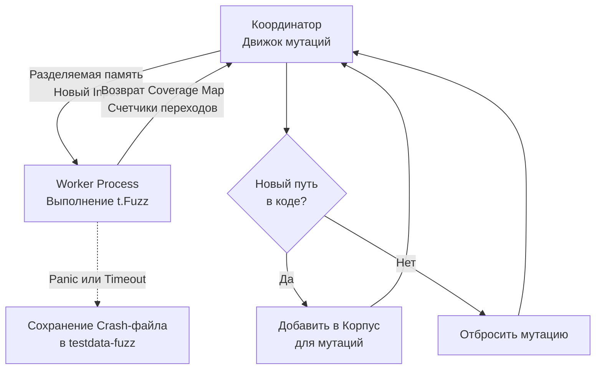

## Выход за пределы фантазии программиста

Классические модульные тесты (Unit Tests) страдают неустранимым психологическим изъяном — они проверяют ровно то, о чем подумал сам инженер в момент написания кода. Человеческому мышлению свойственно подтверждающее искажение (Confirmation Bias): мы проектируем идеальный «счастливый путь» (Happy Path), затем добавляем несколько банальных граничных условий (пустая строка, `nil`, отрицательное число) и приходим к ложному чувству абсолютной надежности. 

Однако суровая реальность продакшена — особенно когда ваш сервис обрабатывает внешние невалидированные потоки байтов из сети, парсит бинарные заголовки, декодирует JSON или распаковывает архивы — ежедневно сталкивается с аномалиями, которые невозможно вообразить заранее: искаженными байтовыми последовательностями, усеченными сетевыми пакетами, недопустимыми UTF-8 суррогатами и гигантскими полезными нагрузками (payloads).

**Fuzzing (Фаззинг / фазз-тестирование)** — это строгий метод автоматизированного исследования устойчивости программного обеспечения, при котором на вход функции подается непрерывный шквал псевдослучайных, мутированных и заведомо искаженных входных данных. Фундаментальная цель фаззера — любой ценой заставить код выбросить неуправляемую панику (`panic`), зациклиться в бесконечном цикле (Infinite Loop), исчерпать доступную оперативную память (OOM) или спровоцировать повреждение памяти и состояние гонки.

История фаззинга берет начало в классическом эксперименте профессора Бартона Миллера (1989 год), исследовавшего крахи Unix-утилит под воздействием случайного шума в терминале. В мире Go долгое время непререкаемым стандартом служил внешний инструмент `go-fuzz` авторства Дмитрия Вьюкова. А начиная с релиза Go 1.18, фаззинг стал полноправным гражданином стандартного тулчейна Go (`testing.F`). Вам больше не требуются тяжелые сторонние утилиты и патчи компилятора — эволюционный фаззинг работает прямо «из коробки».

---

## Под капотом: Coverage-Guided Fuzzing

Фаззер языка Go — это не примитивный генератор слепого случайного шума вроде чтения байтов из псевдоустройства `/dev/urandom`. Перед нами сложная эволюционная система, управляемая анализом графа покрытия кода (Coverage-Guided Fuzzing).

> [!info] Под капотом: Архитектура фаззера Go
> Когда инженер инициирует команду `go test -fuzz`, рантайм разворачивает многопроцессную архитектуру:
> 1. **Coordinator Process (Координатор):** Управляющий мастер-процесс. Он отвечает за планирование, применение генетических мутаций (перевороты битов, вставки чанков, удаление байтов) и ведение базы входных данных (Corpus).
> 2. **Worker Processes (Воркеры):** Координатор форкает несколько изолированных рабочих процессов (по числу доступных ядер CPU), внутри которых выполняется скомпилированный тестовый бинарник.
> 
> На этапе компиляции с флагом фаззинга компилятор Go инструментаризует машинный код: он внедряет в каждый базовый блок (Basic Block) и на каждое ребро графа потока управления (Control Flow Graph) ультралегковесные 8-битные счетчики переходов.
> 
> Координатор передает сгенерированные мутированные байты воркеру через высокоскоростную разделяемую память операционной системы (Shared Memory через системный вызов `mmap`), полностью исключая накладные расходы на сериализацию и межпроцессные сокеты IPC. 
> 
> Воркер исполняет целевую функцию и возвращает координатору карту покрытия (Coverage Map). Если мутационный сдвиг (например, инверсия байта `0x00` в `0xFF`) заставляет поток исполнения впервые зайти в ранее недостижимую ветку оператора `if`, координатор фиксирует расширение покрытия, помещает этот входной образец в «Корпус» (Corpus) и начинает производить последующие мутации уже на его основе. Фаззер целенаправленно прорубает путь в самые темные и запутанные лабиринты вашей бизнес-логики!

Взглянем на организацию разделяемой памяти и каналов взаимодействия между процессами:

```
               Архитектура Coverage-Guided Fuzzing в рантайме Go
               
  +-------------------------------------------------------------------------+
  | Координатор (Master Process)                                            |
  |  [ Корпус мутаций ] <--- Генетический движок (Bit Flips, Inserts, Dels) |
  +------------------------------------+------------------------------------+
                                       |
                mmap (Shared Memory)   | Передача входных байтов []byte
                                       v
  +-------------------------------------------------------------------------+
  | Воркеры (Worker Processes x NumCPU)                                     |
  |  +-------------------------------------------------------------------+  |
  |  | Тестовый код: func(t *testing.T, data []byte)                     |  |
  |  | [Инструментация компилятора: 8-битные счетчики ребер CFG]         |  |
  |  +-------------------------------------------------------------------+  |
  |  Карта покрытия (Coverage Map) -------> Оценка нового ребра в графе     |
  +------------------------------------+------------------------------------+
                                       |
                 Обратная связь        | Новое покрытие? -> Сохранить в корпус!
                                       v
  +-------------------------------------------------------------------------+
  | Аварийное завершение (Panic / OOM / Crash)                              |
  |  -----> Немедленная дампинг-запись в testdata/fuzz/FuzzName/crash-hash  |
  +-------------------------------------------------------------------------+
```

Логическая последовательность эволюции корпуса представлена на схеме:



---

## Анатомия Fuzz-теста

Фазз-тесты объявляются в тех же стандартных тестовых файлах `*_test.go`, рядом с привычными модульными тестами, однако сигнатура функции принимает объект `*testing.F` вместо привычного `*testing.T`.

Канонический фазз-тест состоит из трех четко разделенных фаз:
1. **Инициализация окружения (Arrange):** Настройка контекста, выделение буферов.
2. **Формирование затравочного корпуса (Seed Corpus):** Наполнение корпуса качественными примерами через вызовы `f.Add()`. Это отправные точки («хлебные крошки») для фаззера, показывающие структуру валидных данных, отталкиваясь от которых мутатор начнет портить байты.
3. **Запуск фаззинг-мишени (Fuzz Target):** Передача исполняемого замыкания в метод `f.Fuzz()`, куда рантайм на бешеной скорости будет передавать сгенерированные комбинации аргументов.

---

### Идиоматичный пример: Парсер бинарного протокола

Представим сетевой микросервис, обрабатывающий кастомный бинарный протокол. Спецификация заголовка: первые 2 байта кодируют размер полезной нагрузки (Big-Endian `uint16`), за которыми следует непосредственно срез данных.

Реализуем функцию парсинга:

```go
package protocol

import "encoding/binary"

// ParseHeader считывает заголовок, валидирует размер и извлекает payload
func ParseHeader(data []byte) []byte {
	if len(data) < 2 {
		return nil
	}
	
	// Извлекаем объявленную длину полезной нагрузки из первых двух байт
	length := binary.BigEndian.Uint16(data[:2])
	
	// ВНИМАНИЕ: Классическая скрытая уязвимость новичков!
	// Мы слепо доверяем заголовку и не проверяем, что data действительно содержит length байтов!
	payload := data[2 : 2+length] 
	
	return payload
}
```

Разработаем фазз-тест `FuzzParseHeader`, чтобы продемонстрировать, как фаззер мгновенно обнаружит эту брешь:

```go
package protocol_test

import (
	"testing"
	"yourproject/internal/protocol"
)

func FuzzParseHeader(f *testing.F) {
	// 1. Seed Corpus: Внедряем эталонные валидные и пограничные примеры.
	// Фаззер использует их как базис для построения мутаций.
	f.Add([]byte{0x00, 0x03, 'A', 'B', 'C'}) // Длина 3, в буфере ровно 3 байта полезной нагрузки
	f.Add([]byte{0x00, 0x00})                // Корректный пустой payload нулевой длины

	// 2. Fuzz Target: Тестовая мишень
	f.Fuzz(func(t *testing.T, input []byte) {
		// Фундаментальное правило фаззинга: функция обязана быть толерантной к любому мусору.
		// Никакой некорректный входящий срез не должен приводить к панике рантайма.
		// Если ParseHeader запаникует, execution worker зафиксирует сбой.
		_ = protocol.ParseHeader(input)
	})
}
```

---

## Выполнение и Жизненный цикл багов

Если запустить тулчейн стандартным образом через `go test`, функция `FuzzParseHeader` выполнится как ординарный юнит-тест ровно один раз, прогнав лишь те значения, которые были явно переданы в `f.Add()`.

Чтобы активировать полноценный механизм мутаций и задействовать все ядра CPU, требуется явный флаг `-fuzz`:

```bash
go test -fuzz=FuzzParseHeader -fuzztime=30s
```

Что происходит в недрах оперативной памяти?
1. Фаззер берет затравочный образец `[]byte{0x00, 0x03, 'A', 'B', 'C'}`.
2. Алгоритм мутаций инвертирует первые байты, получая входной массив `[]byte{0xFF, 0xFF, 'A'}`.
3. Функция `ParseHeader` считывает длину `length`, равную `65535` (`0xFFFF`).
4. Следующая инструкция пытается взять срез `data[2 : 2+65535]`. Поскольку физический срез содержит всего 3 байта, процессор наталкивается на нарушение границ среза, и рантайм выбрасывает фатальную панику:  
   `panic: runtime error: slice bounds out of range [:65537] with capacity 3`.

### Реакция инструментария Go на обнаруженный сбой (Crash)

1. **Мгновенная остановка:** Все рабочие воркеры фаззера немедленно замирают.
2. **Дамп и воспроизведение:** В стандартный вывод терминала печатается полный стек-трейс паники и точный срез байтов (reproducer), вызвавший катастрофу.
3. **Автоматическая фиксация в репозитории:** Рантайм Go материализует «ядовитые» входные данные на диске в виде текстового файла внутри директории `testdata/fuzz/FuzzParseHeader/`.

Это выдающееся архитектурное решение команды Go! Как только фаззер находит дефект, этот упавший инпут **навсегда становится частью вашего регрессионного набора тестов**. 

При любом последующем запуске обычного `go test` (даже на сервере CI без флага `-fuzz`) тестовый раннер Go автоматически сканирует каталог `testdata/fuzz`, считывает сохраненные файлы крэшей и прогоняет их через функцию-мишень. Вы просто коммитите папку `testdata/fuzz` в систему контроля версий вместе с исправлением кода, гарантируя, что этот баг никогда не вернется в кодовую базу.

> [!tip] Собеседование
> **Вопрос:** В чем фундаментальное концептуальное отличие между передачей данных в `f.Add(data)` в фаззинг-тестах и набором тест-кейсов `tc := []struct{...}` в классических Table-Driven тестах?
> **Ответ:** В Table-Driven тестировании инженер заранее знает и жестко фиксирует как входные данные, так и *ожидаемый точный результат* для каждого сценария по методологии Arrange-Act-Assert (`require.Equal(t, expected, actual)`).
> 
> В фаззинг-таргете мы оперируем бесконечным потоком случайных мутаций, для которых невозможно статически предугадать выходное значение. Поэтому в фаззинге проверяются **свойства и фундаментальные инварианты системы**:
> 1. Функция не должна паниковать ни при каких обстоятельствах (`panic-freedom`).
> 2. Функция не должна возвращать одновременно валидный результат и ошибку (`nil error`).
> 3. Симметрия кодирования/декодирования: сериализация с последующей десериализацией должна восстанавливать исходный объект (Round-Trip инвариант).

---

## Ограничения и Ловушки

> [!warning] Ловушка / Gotcha: Глобальное состояние и БД
> Категорически запрещено выполнять сетевые запросы, обращаться к реальным базам данных или мутировать несинхронизированное глобальное состояние внутри тела мишени `f.Fuzz(func(t *testing.T, data []byte))`.
> 
> **В чем опасность?** Воркеры фаззинга вызывают целевую функцию с интенсивностью сотни тысяч и даже миллионы раз в секунду на нескольких ядрах процессора. Если внутри фаззинг-итерации будет происходить открытие сетевого сокета или транзакции к СУБД, система мгновенно исчерпает пул локальных портов (Ephemeral Ports exhaustion), переполнит дескрипторы сокетов ядра и намертво положит тестовую базу данных за долю секунды.
> 
> Фаззинг спроектирован для **чистых функций** (Pure Functions), сложных парсеров протоколов, криптографических алгоритмов, кодеков и структур данных. Если требуется протестировать устойчивость интеграционного API, для этого применяются специализированные сетевые фаззеры на уровне сетевых шлюзов.

---

### Поддерживаемые типы данных

Движок мутаций Go не умеет напрямую работать с произвольными пользовательскими структурами (`struct`). Тулчейн Go поддерживает мутацию строго фиксированного набора базовых типов:
- Срезы байтов и строки: `[]byte`, `string`
- Булевы флаги: `bool`
- Символьные типы: `byte`, `rune`
- Числа с плавающей точкой: `float32`, `float64`
- Знаковые и беззнаковые целые числа: `int`, `int8`, `int16`, `int32`, `int64`, `uint`, `uint8`, `uint16`, `uint32`, `uint64`

Если ваша бизнес-логика оперирует сложной иерархической структурой (`struct`), канонический подход заключается в приеме среза `[]byte` в функции фаззинга с последующей распаковкой байтов через `json.Unmarshal`, protobuf или специализированный байтовый десериализатор.

---

## Итог

Встроенный инструмент фаззинга в Go совершил тихую революцию в обеспечении надежности:
1. **Выход за пределы эвристики человека:** Фаззинг выявляет коварные пограничные условия и переполнения, методично генерируя мутированные входные данные.
2. **Эволюционная обратная связь:** Алгоритм Coverage-Guided анализирует счетчики базовых блоков компилятора, исследуя самые труднодоступные ветки исполнения.
3. **Автоматическая защита от регрессий:** Любой найденный сбой автоматически фиксируется в папке `testdata/fuzz` и становится постоянным регрессионным юнит-тестом проекта.
4. **Фокус на инвариантах:** Главная цель базового фаззинга — подтвердить абсолютную защиту от непреднамеренных паник рантайма.

Фаззинг безупречно находит крахи и паники. Однако как гарантировать, что алгоритмически сложная функция (например, алгоритм сортировки, финансовый калькулятор или балансировщик нагрузки) при любых случайных входных воздействиях выдает не просто непадающий, а математически выверенный и корректный результат?

Для решения этой задачи фаззинг объединяют с мощной математической концепцией, заимствованной из мира функционального программирования. Этому посвящен наш следующий материал: [[2. Property based testing]].