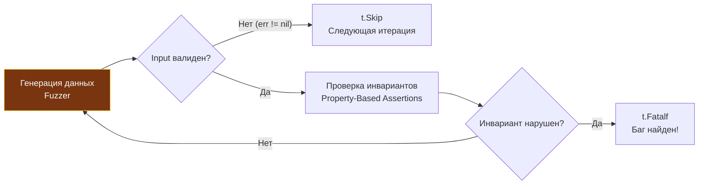

## Смена парадигмы: от Примеров к Свойствам

В предыдущей главе [[1. Встроенный fuzzing в Go]] мы познакомились с механикой фаззинга, непрерывно бомбардирующей тестируемую функцию потоком мутированных байтов в поисках аварийных паник (`panic`), утечек памяти и зависаний. Однако предотвращение паники — это лишь гигиенический минимум надежности. Функция может демонстрировать идеальную стабильность рантайма, но при этом возвращать грубо искаженный, математически некорректный результат.

Как с помощью фаззера строго доказать, что нетривиальная вычислительная логика работает *математически безупречно* для любых допустимых аргументов, если сами эти входные данные генерируются случайно? Мы лишены возможности написать классический ассерт `require.Equal(t, expected, actual)`, поскольку у нас попросту нет фиксированного эталона `expected`.

Здесь происходит фундаментальный концептуальный сдвиг — переход к методологии **Property-Based Testing (PBT, Тестирование на основе инвариантов и свойств)**.

Корни PBT уходят в классическую библиотеку QuickCheck, созданную Джоном Хьюзом и Коэном Классеном для функционального языка Haskell. Вместо того чтобы проверять разрозненные точечные сценарии (Example-Based Testing, воплощенный в [[4. Table driven tests]]), мы формулируем **фундаментальные алгебраические законы и инварианты предметной области**, которые обязаны сохранять истинность для *абсолютно любого* элемента множества допустимых входных значений.

Встроенный в Go фаззер (`testing.F`) выступает лишь высокопроизводительным исполнительным двигателем (генератором энтропии и мутаций). Методология Property-Based Testing определяет архитектуру и логику формулирования проверок внутри этого движка.

---

## Основные паттерны инвариантов

В фундаментальной программной инженерии выделяют четыре ключевых паттерна свойств, проверяемых через Property-Based Testing. Разберем их практическую реализацию на идиоматичном Go.

---

### 1. Round-Trip (Туда и обратно)

Наиболее широко распространенный и интуитивно понятный паттерн. Если входной объект сериализуется во внешнее представление, а затем подвергается обратному восстановлению, результат обязан быть эквивалентен исходному объекту. Это идеальная стратегия проверки алгоритмов кодирования/декодирования, сериализации JSON/Protobuf, парсеров AST, систем архивации и обратимого криптографического шифрования.

**Математическое свойство:** `Decode(Encode(x)) == x`

```go
func FuzzBase64EncodeDecode(f *testing.F) {
	// Seed Corpus: Базовые затравочные образцы
	f.Add([]byte("hello world"))
	f.Add([]byte(""))

	f.Fuzz(func(t *testing.T, orig []byte) {
		// 1. Кодируем псевдослучайные байты, синтезированные фаззером
		encoded := base64.StdEncoding.EncodeToString(orig)

		// 2. Декодируем текстовое представление обратно в бинарный срез
		decoded, err := base64.StdEncoding.DecodeString(encoded)
		
		// 3. Валидируем инварианты системы
		require.NoError(t, err, "Декодирование валидной строки Base64 не должно вызывать ошибку")
		require.Equal(t, orig, decoded, "Round-Trip инвариант нарушен: декодированные данные искажены")
	})
}
```

> [!info] Под капотом: State Space Explosion
> Почему бы просто не перебрать все возможные значения в детерминированном цикле `for` вместо стохастического фаззера?
> 
> Ответ кроется в явлении взрыва пространства состояний (State Space Explosion). Для среза байтов длиной всего в 10 элементов полное пространство комбинаций составляет $256^{10} \approx 1.2 \times 10^{24}$ вариантов. Даже если суперкомпьютер будет тестировать по миллиарду вариантов в секунду, полный перебор займет миллионы лет. 
> 
> Фаззер в Go (Coverage-Guided) не занимается слепым перебором. Он отслеживает инструментацию счетчиков базовых блоков компилятора: как только мутатор нащупывает байт, открывающий новую ветку `if` в коде парсера, этот вектор сохраняется в корпусе для последующих углубленных мутаций.

---

### 2. Test Oracle / Differential Testing (Оракул)

Этот паттерн незаменим при масштабном рефакторинге, низкоуровневых оптимизациях или внедрении SIMD-инструкций. Предположим, у вас есть старая, проверенная годами, но алгоритмически медленная реализация (Тестовый Оракул), и вы спроектировали сверхбыстрый, изощренный, но потенциально хрупкий параллельный алгоритм.

Вы направляете идентичный поток сгенерированных входных данных в обе реализации и сверяете эквивалентность результатов.

**Математическое свойство:** `OptimizedAlgo(x) == OracleAlgo(x)`

```go
func FuzzSortAlgorithms(f *testing.F) {
	// Стартовые образцы для мутаций
	f.Add([]byte{5, 2, 9, 1, 5, 6})

	f.Fuzz(func(t *testing.T, data []byte) {
		// Создаем изолированные копии, поскольку сортировка изменяет срез in-place
		dataForFast := make([]byte, len(data))
		copy(dataForFast, data)
		
		dataForOracle := make([]byte, len(data))
		copy(dataForOracle, data)

		// Вызываем оптимизированный алгоритм (например, параллельный Radix Sort)
		algorithms.FastRadixSort(dataForFast)

		// Вызываем эталонный алгоритм из стандартной библиотеки Go
		slices.Sort(dataForOracle)

		// Инвариант: результаты сортировки обязаны побайтово совпадать
		require.Equal(t, dataForOracle, dataForFast, 
			"Дифференциальный тест выявил расхождение: оптимизированный алгоритм выдал некорректный порядок")
	})
}
```

---

### 3. Idempotence (Идемпотентность)

Повторное применение операции к результату ее первичного выполнения не должно изменять итоговое состояние системы. Это базовый инвариант нормализаторов данных (приведение URL к каноническому виду, санитайзинг HTML, форматирование номеров телефонов), миграций баз данных и обработчиков распределенных HTTP-запросов (методы PUT и DELETE).

**Математическое свойство:** `Process(Process(x)) == Process(x)`

```go
func FuzzURLNormalizer(f *testing.F) {
	f.Add("https://example.com/path//to/file")

	f.Fuzz(func(t *testing.T, rawURL string) {
		// Первичная нормализация входящей строки
		normalized1 := NormalizeURL(rawURL)
		
		// Вторичная нормализация уже очищенного результата
		normalized2 := NormalizeURL(normalized1)

		// Инвариант: очищенная строка не должна мутировать при повторном прогоне
		require.Equal(t, normalized1, normalized2, 
			"Нарушена идемпотентность нормализатора: повторный вызов изменил данные")
	})
}
```

---

### 4. Граничные инварианты (Invariants Boundaries)

В ситуациях, когда невозможно предсказать точное дискретное значение функции, мы можем математически строго очертить границы допустимого диапазона значений (Boundaries) или метаморфические отношения:
* **Алгоритмы сжатия данных:** `len(Compress(x)) <= len(x) + HeaderSize` (размер сжатого блока с учетом заголовка не должен катастрофически раздуваться).
* **Поиск на графах:** `Cost(A, B) <= Cost(A, C) + Cost(C, B)` (Аксиома неравенства треугольника для метрических пространств).
* **Парсинг целых неотрицательных чисел:** `ParsePositiveInt(x) >= 0`.

---

## Игнорирование невалидных данных (t.Skip)

Фаззер непрерывно бомбардирует код неструктурированным мусором. Что предпринять, если тестируемый компонент *обоснованно и штатно* возвращает ошибку синтаксического анализа на поврежденные байты? Наша цель — проверять глубокие бизнес-инварианты исключительно на синтаксически корректных структурах данных.

В экосистеме Go для этой цели служит механизм раннего выхода `t.Skip()`.

```go
func FuzzJSONParser(f *testing.F) {
	// Добавляем минимальный валидный JSON в затравочный корпус
	f.Add(`{"name": "Gopher"}`)

	f.Fuzz(func(t *testing.T, jsonStr string) {
		var user User
		err := json.Unmarshal([]byte(jsonStr), &user)
		if err != nil {
			// Фаззер сгенерировал синтаксически невалидную строку JSON.
			// Это ожидаемый отказ валидации парсера. Мы прерываем данную итерацию
			// через t.Skip(), не помечая тест упавшим!
			t.Skip()
		}

		// Если выполнение достигло этой точки — JSON валиден!
		// Теперь проверяем доменные бизнес-свойства:
		require.NotEmpty(t, user.ID, "У валидного пользователя всегда обязан присутствовать инициализированный ID")
	})
}
```

> [!warning] Ловушка / Gotcha: Чрезмерный t.Skip
> Если предикат фильтрации в `t.Skip()` будет сформулирован чрезмерно строго (например, жесткая проверка схемы по 20 полям), фаззер начнет отбрасывать 99.9% мутаций. Генератор будет вхолостую молотить циклы процессора, создавая опасную иллюзию безупречного зеленого пайплайна.
> 
> **Инженерный принцип:** Всегда предоставляйте богатый стартовый корпус через `f.Add`, дающий фаззеру структурную подсказку, либо используйте структурированную генерацию данных.

Логика отсева мутаций и верификации свойств наглядно представлена на схеме:



---

## Mechanical Sympathy: Чистота функций (Pure Functions)

Методология Property-Based Testing накладывает строгие требования на архитектуру тестируемого кода.

> [!tip] Собеседование
> **Вопрос:** Почему при Property-Based тестировании с использованием `testing.F` бизнес-логика обязана быть представлена детерминированными «Чистыми функциями» (Pure Functions)?
> **Ответ:** Чистая функция математически строга: она не имеет внешних побочных эффектов (Side Effects) и возвращает результат, зависящий исключительно от переданных аргументов.
> 
> Воркеры фаззинга вызывают целевую функцию сотни тысяч раз в секунду параллельно на всех ядрах CPU. Если тестируемая функция обращается к глобальным переменным, системному времени (`time.Now()`), файловой системе или внешним СУБД, фазз-тест мгновенно потерпит крах из-за гонок данных (Data Race), взаимных блокировок или исчерпания дескрипторов. Для успешного фаззинга ядро алгоритма должно быть полностью изолировано от подсистемы ввода-вывода (I/O).

---

## Математические ловушки: Floating Point

PBT часто применяют для тестирования математических и финансово-учетных модулей. Однако здесь разработчиков подстерегает классическая ловушка машинной арифметики.

В школьной алгебре незыблем закон ассоциативности сложения:  
`(A + B) + C == A + (B + C)`.

Если вы наивно попытаетесь проверить этот инвариант в фазз-тесте Go на числах типа `float64`, **тест неизбежно упадет**!

В аппаратной архитектуре современных процессоров (стандарт IEEE 754) арифметика с плавающей точкой **не является строго ассоциативной**. Из-за конечного размера мантиссы (53 бита для double precision) сложение очень большого и бесконечно малого числа приводит к катастрофической потере младших разрядов (Cancellation Error). 

Для финансовых и биллинговых расчетов в Go категорически запрещено применять `float64` — архитектура требует применения чисел с фиксированной точкой (например, пакета `shopspring/decimal` или целочисленного хранения сумм в минимальных неделимых единицах, таких как копейки или центы в `int64`). Фаззинг мгновенно вскрывает подобные архитектурные иллюзии.

---

## Итог

Property-Based Testing переводит качество тестирования на уровень математической строгости:
1. **Фокус на законах, а не примерах:** Мы формулируем инварианты системы, истинные для любого аргумента.
2. **Движок фаззинга Go (`testing.F`):** Идеальный поставщик стрессовой энтропии для PBT.
3. **Классическая триада инвариантов:** **Round-Trip** (сериализация), **Oracle** (дифференциальное тестирование оптимизаций) и **Idempotence** (нормализация).
4. **Аккуратность с `t.Skip()`:** Отсекайте синтаксический брак, но не блокируйте фаззеру путь к новым веткам исполнения.

Мы научились верифицировать свойства алгоритмов на срезах байтов и примитивных числах. Однако в реальных сервисах функции принимают сложные доменные структуры (например, `UserRequest` с вложенными метаданными). Как превратить поток сырых мутаций фаззера в корректный граф бизнес-объектов? 

Этой задаче посвящена следующая глава: [[3. Генерация входных данных]].