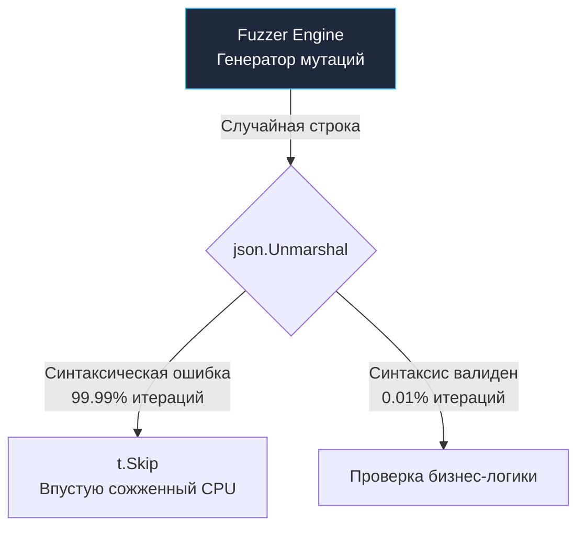

## Проблема сырой энтропии

В предыдущей статье [[2. Property based testing]] мы подробно рассмотрели методологию формулирования математических инвариантов и законов бизнес-логики. Однако до сих пор мы намеренно обходили стороной фундаментальное архитектурное противоречие между природой встроенного фаззера Go и потребностями реальных прикладных систем.

Встроенный в рантайм механизм фаззинга (`testing.F`) оперирует исключительно плоскими примитивными типами данных (`[]byte`, `string`, `int`, `float64`, `bool` и их машинными вариациями). Это сырая цифровая энтропия — неограниченный поток хаотических байтов.

При этом архитектурный сервисный слой современного Go-бэкенда практически никогда не принимает на вход сырые срезы байтов. Доменная логика оперирует высокоуровневыми сущностями предметной области (Entities, Value Objects, DTO), содержащими десятки валидированных полей, перечислений (Enums) и вложенных структур.

Перед инженером встает классическая дилемма: **Каким образом преобразовать поток сырых псевдослучайных байтов фаззера в семантически осмысленные бизнес-структуры данных, не задушив при этом производительность генератора?**

Существует три принципиальных инженерных подхода. Первый из них, инстинктивно избираемый новичками, представляет собой опаснейшую архитектурную ловушку.

---

## Антипаттерн: Десериализация (JSON Trap)

Первое, что приходит в голову неопытному инженеру — заставить фаззер генерировать сырую строку `string` или срез `[]byte`, а затем попытаться распаковать этот поток через стандартный `json.Unmarshal` в рабочую структуру:

```go
// АНТИПАТТЕРН: Наивная десериализация случайного текста
func FuzzProcessOrder_Naive(f *testing.F) {
	// Затравочный образец валидного JSON
	f.Add(`{"item_id": 123, "amount": 2, "status": "new"}`)

	f.Fuzz(func(t *testing.T, payload string) {
		var req OrderRequest
		// Пытаемся распарсить сгенерированную фаззером строку как валидный JSON
		if err := json.Unmarshal([]byte(payload), &req); err != nil {
			t.Skip() // Игнорируем синтаксически поврежденные строки
		}

		// Вызов доменной логики...
	})
}
```

> [!warning] Ловушка / Gotcha: Смерть от синтаксиса
> Движок фаззинга ничего не знает о формальной грамматике и синтаксисе JSON. Он оперирует низкоуровневыми битовыми мутациями: инвертирует биты (bit flipping), вырезает байтовые диапазоны и вставляет граничные значения (`0xFF`, `NaN`).
> 
> 1. Как только фаззер берет ваш валидный затравочный образец `{"amount": 2}` и мутирует в нем ровно один байт в `{"amount": 2A}`, синтаксический анализатор JSON мгновенно спотыкается о синтаксическую ошибку. Тест выполняет `t.Skip()`.
> 2. В **99.99% всех итераций** мутатор будет генерировать синтаксически невалидный мусор.
> 3. **Катастрофический итог:** Ваш фаззер вырождается в мучительно медленный тестер парсера `encoding/json` (который и без того тщательно протестирован создателями Go). Тест намертво застревает на синтаксическом кордоне и практически никогда не доходит до исследования веток вашего бизнес-кода. 
> 
> Более того: бесконечные циклы `Unmarshal` создают чудовищное давление на аллокатор кучи и сборщик мусора (GC), сжигая 99% тактов CPU на работу GC и парсинг строк вхолостую.

Накладные расходы наивного подхода иллюстрируются схемой:



---

## Идиоматичный подход 1: Прямой маппинг аргументов

Функция-мишень `f.Fuzz` в Go не ограничена одним параметром. Она способна принимать **произвольное число аргументов** поддерживаемых базовых типов: `f.Fuzz(func(..., arg1, arg2))`. Движок фаззинга инструментаризует и независимо мутирует каждый переданный аргумент.

Наиболее элегантный и производительный паттерн — поручить фаззеру генерацию набора скалярных примитивов, из которых в теле теста на стеке собирается целевая структура без единой аллокации в куче (0 байт нагрузки на GC).

```go
package order_test

import (
	"testing"

	"github.com/stretchr/testify/require"
	"yourproject/internal/domain"
)

func FuzzCalculateDiscount(f *testing.F) {
	// Формируем Seed Corpus. 
	// Типы и порядок аргументов в f.Add обязаны строго дублировать сигнатуру f.Fuzz
	f.Add(uint64(1), 100.50, true, "VIP")
	f.Add(uint64(2), 15.00, false, "REGULAR")

	// Фаззер мутирует каждое поле напрямую и независимо!
	f.Fuzz(func(t *testing.T, id uint64, total float64, hasPromo bool, tier string) {
		// Конструируем сущность на стеке: 0 аллокаций в Heap, нулевая нагрузка на GC
		order := domain.Order{
			ID:       id,
			Total:    total,
			HasPromo: hasPromo,
			Tier:     tier,
		}

		// Вызываем целевую логику: фаззер сосредоточен на алгоритме, а не на парсерах!
		discount, err := domain.CalculateDiscount(order)
		
		// Валидация инвариантов бизнес-домена
		if err == nil {
			require.LessOrEqual(t, discount, order.Total, "Размер скидки не может превышать сумму заказа")
			require.GreaterOrEqual(t, discount, 0.0, "Скидка не может выражаться отрицательным числом")
		}
	})
}
```

Этот подход феноменально эффективен: фаззер способен выполнять миллионы итераций в секунду на одном ядре. Мутатор будет целенаправленно подставлять предельные значения стандарта IEEE 754 (`NaN`, `+Inf`, `-Inf`) в поле `total`, граничные значения переполнения в целочисленный `id` и неожиданные символы в `tier`, моментально выявляя деление на ноль, отсутствие обязательных веток `default` в операторах `switch` и математические паники.

---

## Идиоматичный подход 2: Бинарное конструирование (Struct Packing)

Что предпринять, если доменная структура содержит 15–20 полей или включает динамические вложенные срезы? Раздувание сигнатуры `f.Fuzz` до двух десятков аргументов превращает код теста в нечитаемое нагромождение.

Для таких сценариев Senior-инженеры применяют технику **детерминированного бинарного распаковывания** (Struct Packing) с использованием пакета `encoding/binary`. Вся структура синтезируется из единственного плоского среза байтов `[]byte`.

> [!info] Под капотом: Ограничение энтропии через побитовые операции
> При конструировании сложных структур из сырых байтов часто требуется ограничить диапазон значений (например, статус маршрутизации должен принимать значения строго от 0 до 3).
> Использование целочисленного деления по модулю (`val % 4`) или побитовой маски (`val & 0x03`) — это операция стоимостью ровно в **1 такт процессора**. Она мгновенно проецирует бесконечный случайный шум фаззера в легальное подмножество доменных значений без необходимости обращаться к дорогостоящему `t.Skip()`.

```go
func FuzzComplexRouting(f *testing.F) {
	// Стартовый образец: ровно 8 байт для инициализации структуры
	f.Add([]byte{0x00, 0x01, 0xFF, 0x0A, 0x00, 0x00, 0x00, 0x05}) 

	f.Fuzz(func(t *testing.T, data []byte) {
		// Защита от выхода за границы среза: нам требуется как минимум 8 байт энтропии
		if len(data) < 8 {
			t.Skip()
		}

		// Детерминированно собираем сложную структуру с помощью срезов и binary
		req := routing.RouteRequest{
			// Берем 1 байт и модульной арифметикой сжимаем диапазон до 0..3 (тип enum)
			RouteType: routing.Type(data[0] % 4), 
			
			// Второй байт интерпретируем как булев флаг четности
			IsUrgent: data[1]%2 == 0,
			
			// Байты 2:4 считываем как беззнаковое 16-битное число в порядке Big-Endian
			Priority: binary.BigEndian.Uint16(data[2:4]),
			
			// Оставшийся хвост байтового среза передаем как произвольный payload
			Payload: data[4:], 
		}

		// Запускаем сложный алгоритм поиска маршрута
		_ = routing.BuildPath(req)
	})
}
```

Этот подход генерирует 100% синтаксически валидные структуры данных и исполняется на максимальной аппаратной скорости. Алгоритм фаззинга моментально обнаруживает, что изменение первого байта среза меняет направление ветвления внутри `BuildPath`, и целенаправленно сосредотачивает мутации на управляющих байтах.

---

## Высший пилотаж: gofuzz (Google)

Когда возникает необходимость фаззить гигантские, многократно вложенные иерархии DTO (например, спецификации манифестов Kubernetes или структуры облачных провайдеров), ручное бинарное конструирование становится чрезмерно трудоемким.

В экосистеме Go существует признанный эталон для решения этой задачи — открытая библиотека `github.com/google/gofuzz`, созданная инженерами Google. Она использует отражение типов (Reflection) для рекурсивного заполнения любых структур Go (включая приватные поля, карты и вложенные указатели) валидными случайными данными.

Ее можно бесшовно соединить со стандартным механизмом `testing.F`, скармливая библиотеке энтропию от нативного фаззера Go:

```go
package k8s_test

import (
	"testing"

	fuzz "github.com/google/gofuzz"
	"yourproject/internal/k8s"
)

func FuzzPodValidator(f *testing.F) {
	// Добавляем затравочную строку энтропии
	f.Add([]byte("seed-entropy-for-fuzzer"))

	f.Fuzz(func(t *testing.T, entropy []byte) {
		// Инициализируем генератор Google на основе потока байтов энтропии Go
		fuzzer := fuzz.NewFromGoFuzz(entropy)

		var pod k8s.PodDefinition
		
		// Рекурсивное наполнение дерева полей структуры псевдослучайными данными
		fuzzer.Fuzz(&pod)

		// Валидируем инвариант устойчивости:
		// Функция проверки манифеста ни при каких обстоятельствах не должна паниковать,
		// сколь бы экзотическими и противоречивыми ни были сгенерированные поля Pod
		err := k8s.ValidatePod(pod)
		_ = err 
	})
}
```

---

## Итог

Правильная генерация входных данных определяет успех фаззинг-тестирования:
1. **Категорически избегайте текстовых форматов (JSON/XML) в теле фаззера.** Иначе ваш процессор превратится в дорогой обогреватель помещения, а фаззер будет бесконечно отсеивать 99.99% мутаций на синтаксических ошибках.
2. **Прямой маппинг аргументов** `f.Fuzz(func(..., arg1, arg2))` — самый чистый, идиоматичный и высокоскоростной способ тестирования простых структур.
3. **Бинарная упаковка через `encoding/binary`** и модульную арифметику (`val % 4`) обеспечивает мгновенную проекцию хаотических байтов в легальные доменные сущности без аллокаций.
4. **Для монструозных иерархических структур** используйте библиотеку `github.com/google/gofuzz`, запитывая ее энтропией от встроенного `testing.F`.

Мы освоили теорию генерации и приемы проектирования фаззинг-мишеней. Теперь обратимся к реальной инженерной практике. С какими нетривиальными дефектами и уязвимостями сталкиваются высоконагруженные сервисы, и как фаззинг вскрывает ошибки, ускользающие от статического анализа и Code Review? 

Этому посвящен следующий материал: [[4. Найденные баги через fuzzing]].