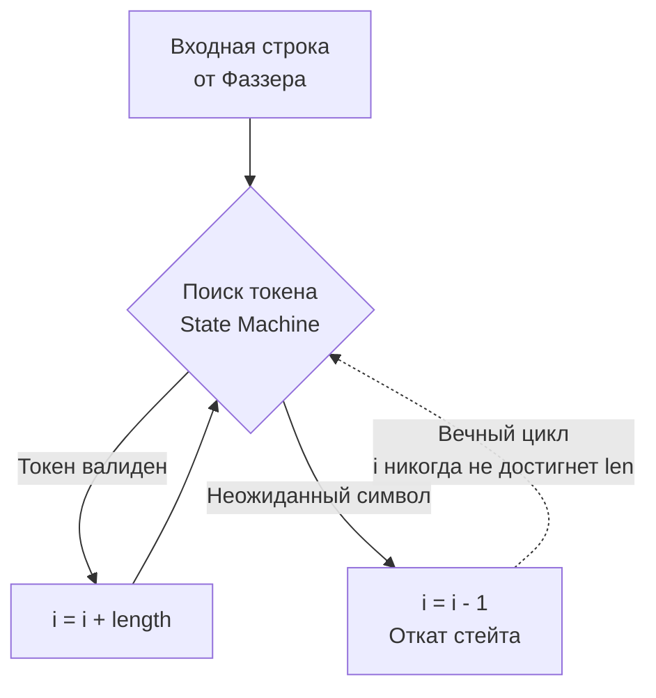

## Практика разрушения: Что фаззинг находит в дикой природе

В предшествующих главах мы обстоятельно изучили теоретический фундамент встроенного фаззинга ([[1. Встроенный fuzzing в Go]]), научились формулировать строгие математические законы и инварианты предметной области ([[2. Property based testing]]) и освоили технику высокоскоростной проекции сырой энтропии в доменные сущности ([[3. Генерация входных данных]]). 

Однако опытный инженер-прагматик неизменно задает трезвый вопрос: окупаются ли колоссальные затраты тактов CPU и времени сборки на фаззинг реальной инженерной пользой в продакшене?

Ответ дает статистика обнаружения критических уязвимостей (CVE). В экосистеме Go фаззинг регулярно вскрывает тяжелые дефекты даже в кодовой базе стандартной библиотеки: от математических сбоев в криптографическом пакете `crypto/elliptic` до тонких аномалий синтаксического анализа чанковых запросов в сетевом стеке `net/http`. 

В этой главе мы выполним детальное анатомическое вскрытие четырех классических категорий программных дефектов, которые практически невозможно обнаружить обычным Code Review или модульными тестами, но которые фаззер находит за первые секунды работы.

---

## 1. Смерть от короткого пакета (Index Out of Bounds)

Это наиболее распространенный класс уязвимостей в сетевых демонах, брокерах сообщений и парсерах бинарных протоколов. В языке Go попытка обращения за физические границы слайса инициирует фатальную панику рантайма `panic: runtime error: slice bounds out of range`.

> [!info] Под капотом: Bounds Checking
> В языках C и C++ обращение за границы массива приводит либо к чтению чужой памяти (знаменитая катастрофа OpenSSL Heartbleed), либо к Segmentation Fault. Компилятор Go генерирует безопасный машинный код, вставляя явные инструкции проверки границ (Bounds Checking) перед каждым взятием среза `data[i:j]`. Если индекс превышает длину среза (`j > len(data)`), генерируется безусловный переход к функции `runtime.panicIndex`. 
> 
> Если этот парсер выполняется в фоновой горутине пула соединений без защиты `defer recover()`, эта паника **мгновенно убивает весь процесс приложения**. Для злоумышленника это простейший и разрушительный вектор атаки типа Remote Denial of Service (DoS): один специально сформированный UDP-пакет размером в пару байтов роняет высоконагруженный кластер.

### Анатомия бага: TLV-парсер

Рассмотрим типичный бинарный парсер формата Type-Length-Value (TLV):

```go
func ParseTLV(data []byte) (typ byte, val []byte) {
	if len(data) < 2 {
		return 0, nil
	}
	
	typ = data[0]
	length := int(data[1]) // Считываем заявленную отправителем длину
	
	// СКРЫТАЯ УЯЗВИМОСТЬ: Мы слепо доверяем заголовку, не проверяя реальную длину data!
	val = data[2 : 2+length] 
	
	return typ, val
}
```

В классических модульных тестах программист добросовестно передает валидный массив `ParseTLV([]byte{0x01, 0x03, 'A', 'B', 'C'})`, и тест победно проходит. 

Однако фаззер в первую же миллисекунду работы синтезирует вредоносный срез `[]byte{0x01, 0xFF, 'A'}`. Пакет физически содержит всего 3 байта, но в заголовке заявлена длина `255` (`0xFF`). Инструкция среза пытается выполнить операцию `data[2:257]`, что мгновенно выбрасывает панику рантайма.

**Архитектурное исправление:** Бескомпромиссная валидация границ:
```go
if 2+length > len(data) {
    return 0, nil // Или явная ошибка ErrTruncatedPacket
}
```

---

## 2. Ловушка бесконечного цикла (CPU Starvation)

Фаззинг виртуозно выявляет алгоритмические ошибки в парсерах и лексерах, при которых программа не падает, а застревает в бесконечном цикле, сжигая 100% выделенного ядра процессора. Если атакующий направит несколько десятков таких пакетов, система исчерпает свободные потоки операционной системы (Goroutine Starvation), и сервис перестанет обслуживать легитимных пользователей.

### Анатомия бага: Парсер с разделителем

```go
// ExtractChunks разбивает строку на токены по запятым, 
// корректно обрабатывая экранированные символы с обратным слешем (\,).
func ExtractChunks(input string) []string {
	var chunks []string
	i := 0
	for i < len(input) {
		start := i
		// Поиск следующего неэкранированного разделителя
		for i < len(input) && input[i] != ',' {
			if input[i] == '\\' {
				i += 2 // Пропускаем обратный слеш и следующий за ним символ
				continue
			}
			i++
		}
		chunks = append(chunks, input[start:i])
		i++ // Сдвиг за найденную запятую для следующего токена
	}
	return chunks
}
```

Фаззер мгновенно найдет «ядовитую» входную строку, на которой этот алгоритм впадет в бесконечный цикл: строку, оканчивающуюся одиночным обратным слешем `\` (например, `"chunk1,\"` или ввод строки `"\""`).

Когда цикл встречает завершающий обратный слеш `\`, он выполняет инкремент `i += 2`. Индекс `i` выходит за границу строки (`i > len(input)`). Но условие внешнего цикла `i < len(input)` не проверяется немедленно, так как мы выходим из внутреннего цикла. Выполняется `chunks = append(...)` и дополнительный сдвиг `i++`. При вводе `"\""` внутренний цикл сделает `i = 2`, внешний сделает `i = 3`, но в более сложных конечных автоматах (State Machines), где при непредвиденном токене логика пытается откатить состояние через ветку `else` и декремент `i--`, индекс `i` застревает в бесконечной осцилляции.



**Как фаззер Go детектирует зависание?**  
В фаззинг-рантайм встроен сторожевой таймер (Watchdog). Если вызов `FuzzTarget` не возвращает управление в течение нескольких секунд, координатор фиксирует факт зависания (Hang), прерывает воркер и дампит входные данные как критический дефект.

---

## 3. Целочисленное переполнение и Аллокационные бомбы (OOM)

Язык Go гарантирует типобезопасность, однако он бессилен против архитектурных решений, заставляющих рантайм запросить у ядра Linux астрономический объем оперативной памяти.

> [!warning] Ловушка / Gotcha: OOM Killer
> Подсистема управления памятью ядра Linux реализует защитный механизм OOM Killer (Out Of Memory Killer). Если пользовательский процесс запрашивает больше виртуальной памяти, чем доступно физической памяти и swap, либо превышает лимиты `cgroups` в Kubernetes-поде, ядро Linux отправляет процессу безапелляционный сигнал `SIGKILL` (`kill -9`).
> 
> Процесс погибает в тот же такт процессора. Рантайм Go не успевает выбросить панику, не отрабатывают функции очистки `defer`, сокеты аварийно обрываются ядром, а в журнал событий не пишется ни строчки диагностического трейса.

### Анатомия бага: Массовая вставка

Представим сетевой обработчик команд пакетной записи в базу данных. В целях оптимизации аллокаций инженер решает заранее выделить слайс точного размера:

```go
func ParseBatchRequest(data []byte) (*Batch, error) {
	// Считываем 4 байта размера из заголовка пакета
	count := binary.BigEndian.Uint32(data[4:8])
	
	// ФАТАЛЬНЫЙ ДЕФЕКТ: Слепое доверие значению счетчика от внешнего клиента!
	records := make([]Record, count) 
	
	// ... наполнение слайса records ...
	return &Batch{Records: records}, nil
}
```

Разработчик тестировал функцию на разумных значениях: `count = 10` и `count = 1000`. 

Фаззер же мгновенно подставляет предельное 32-битное число `count = 4_294_967_295` (максимум для `uint32`). Если структура `Record` занимает всего 64 байта в памяти, инструкция `make([]Record, 4294967295)` потребует от аллокатора Go выделения порядка **274 Гигабайт** непрерывного адресного пространства! 

Рантайм мгновенно завершит работу с ошибкой `panic: runtime error: makeslice: len out of range`, либо сервис будет немедленно пристрелен OOM Killer-ом операционной системы.

**Архитектурное исправление:**
1. Жесткий лимит на уровне протокола: `if count > MaxBatchSize { return nil, ErrTooLarge }`.
2. Защита от аллокаций из недоверенных источников: отказ от преждевременного `make([]T, size)` в пользу потокового чтения частями или поэтапного `append`.

> [!tip] Собеседование
> **Вопрос:** Если мы заменим преждевременный `make([]T, size)` на динамический `append`, спасет ли это приложение от аллокационной бомбы?
> **Ответ:** Защитит от наиболее опасного класса атак. 
> 
> Если злоумышленник отправит крошечный пакет размером 10 байт, заявляющий гигантский счетчик `count = 4_000_000_000`:
> - В случае `make` сервис мгновенно упадет от OOM еще до чтения данных.
> - В случае с `append` программа прочитает реальные 10 байт, добавит один элемент в слайс, наткнется на конец буфера (`io.EOF`) и штатно вернет ошибку «Неожиданный конец потока», потребив минимум памяти.

---

## 4. Нарушение инвариантов бизнес-логики (Property Fails)

Наиболее изящный класс дефектов, выявляемых связкой фаззинга и Property-Based Testing ([[2. Property based testing]]), затрагивает тонкие математические нестыковки в бизнес-правилах.

### Анатомия бага: Финансовый балансировщик

Рассмотрим функцию распределения общей денежной суммы между пулом получателей согласно заданным весовым коэффициентам (типичная задача биллинга и сплитования платежей):

```go
// Инвариант: Суммарный результат долей обязан строго равняться исходной сумме (sum(result) == total)
func SplitPayment(total int64, weights []int) []int64 {
	sumWeights := 0
	for _, w := range weights {
		sumWeights += w
	}
	
	if sumWeights == 0 {
		return nil
	}

	result := make([]int64, len(weights))
	for i, w := range weights {
		// Расчет доли с целочисленным округлением вниз
		result[i] = total * int64(w) / int64(sumWeights) 
	}
	
	return result
}
```

В Unit-тестах вызов `SplitPayment(100, []int{1, 1})` предсказуемо возвращает срез `[50, 50]`. Проверка `50+50 == 100` блестяще сходится.

Однако фаззер, проверяющий математический инвариант `sum(result) == total`, мгновенно генерирует сценарий с тремя равноправными участниками: `SplitPayment(100, []int{1, 1, 1})`.

Смотрим на математику целочисленного деления:
- Суммарный вес: `sumWeights = 3`
- Доля первого получателя: `100 * 1 / 3 = 33`
- Доля второго получателя: `100 * 1 / 3 = 33`
- Доля третьего получателя: `100 * 1 / 3 = 33`
- Итоговая сумма распределения: `33 + 33 + 33 = 99`.

**Фаззер вскрывает потерю неделимой единицы (копейки/цента)!** Инвариант `sum(result) == total` нарушен: $99 \neq 100$. В финансовых системах такие накопленные погрешности ведут к кассовым разрывам и аудиторским блокировкам.

**Исправление:** Корректный алгоритм обязан вычислять остаток от деления и распределять недостающие копейки по алгоритму наибольшего остатка (Hare-Niemeyer method). Фаззер выявил этот неочевидный математический краевой эффект за миллисекунды.

---

## Итог

Фаззинг в руках Senior-инженера — это мощнейший инструмент проактивного поиска дефектов:
1. **Защита от DoS:** Выявление `Index Out of Bounds` паник в парсерах до их релиза в продакшен.
2. **Нейтрализация OOM:** Защита сервисов от аллокационных бомб и слепого доверия внешним параметрам длины.
3. **Предотвращение зависаний:** Детектирование бесконечных циклов в сложных лексерах и конечных автоматах.
4. **Математическая точность:** Поиск скрытых потерь округления и логических несоответствий в критических финансовых алгоритмах.

Мы убедились в колоссальной разрушительной силе фаззинга. Однако генерация мутаций требует значительных вычислительных ресурсов процессора. Следует ли покрывать фаззингом абсолютно каждый HTTP-хэндлер приложения? Где пролегает разумная граница между критической необходимостью и избыточными трудозатратами?

Ответам на эти вопросы посвящена заключительная глава нашего раздела: [[5. Когда fuzzing реально нужен]].