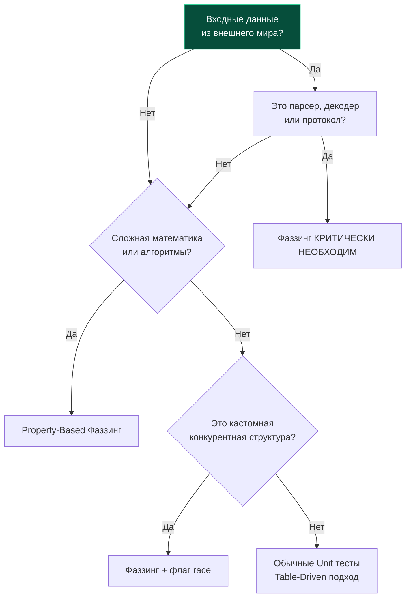

## Прагматика разрушения: Серебряных пуль не бывает

В классическом эссе Фредерика Брукса «Нет серебряной пули» звучит бессмертная истина: в программной инженерии не существует единственной универсальной технологии, способной волшебным образом решить все проблемы качества и архитектуры. Мы подробно исследовали механику фаззинга ([[1. Встроенный fuzzing в Go]]), научились применять строгий математический аппарат Property-Based Testing ([[2. Property based testing]]), освоили генерацию сложных доменных моделей ([[3. Генерация входных данных]]) и препарировали опаснейшие дефекты, выявляемые в продакшене ([[4. Найденные баги через fuzzing]]).

Теперь необходимо взглянуть на фаззинг трезвыми глазами Principal Architect и Senior-инженера.

Фаззинг — ресурсоемкий инструмент. Он беспощадно утилизирует вычислительные мощности процессоров (CPU time), требует филигранной формулировки доменных инвариантов и усложняет организацию конвейеров CI/CD. Если неопытная команда решит фаззить абсолютно каждый метод сервисного слоя или банальный CRUD-хэндлер, она потратит недели инженерного времени на тесты, которые никогда не вскроют реальных дефектов, но замедлят разработку и сделают сборку мучительно долгой.

Инженерное тестирование — это баланс инвестиций и отдачи (Return on Investment, ROI). Мы обязаны применять фаззинг точечно: там, где классические табличные тесты ([[4. Table driven tests]]) бессильны перед взрывом комбинаторных состояний, а цена необнаруженного сбоя катастрофична для бизнеса или безопасности.

---

## Когда фаззинг КРИТИЧЕСКИ необходим

Существуют три фундаментальных класса задач в бэкенд-разработке, где пренебрежение фаззингом считается прямой инженерной халатностью.

---

### 1. Парсеры и обработчики недоверенных данных

**Золотое правило архитектора:** Любой компонент системы, который принимает неструктурированный поток байтов из внешнего враждебного мира и пытается преобразовать его во внутренние структуры данных, **обязан быть покрыт фаззинг-тестами**.

* **Сетевые протоколы и бинарные форматы:** Парсеры пакетов TCP/UDP, бинарные заголовки, кастомные RPC-кодеки, протоколы Интернета вещей (MQTT, CoAP).
* **Собственные сериализаторы и декодеры:** Реализация кастомных парсеров CSV, JSON, XML, форматов медиафайлов (PNG, JPEG) или распаковщиков архивов (ZIP, Tar).
* **Криптографические структуры и сертификаты:** Разбор сертификатов X.509, структур ASN.1, контейнеров PEM и цифровых подписей.

> [!info] Под капотом: State Space Explosion
> Почему здесь фатально пасуют классические модульные тесты? 
> Синтаксические анализаторы проектируются как сложные конечные автоматы (State Machines) со множеством взаимосвязанных переходов, вложенных условий и циклов `for`. Количество уникальных путей исполнения (Execution Paths) в таком коде возрастает экспоненциально. 
> 
> Инженер может написать 50 эталонных табличных тестов, добившись впечатляющего покрытия строк (Line/Statement Coverage) на уровне 95%, но при этом покрыть лишь 3–5% реальных путей графа переходов (Path Coverage). 
> 
> Встроенный Coverage-Guided фаззер Go, опираясь на инструментацию счетчиков компилятора, находит в этом многомерном пространстве состояний те микроскопические «ядовитые» аномалии, которые загоняют автомат в непредвиденный тупик или бесконечный цикл.

---

### 2. Сложная алгоритмика и математика

Области, в которых бизнес-логика принимает многокритериальные решения на основе десятков входных переменных, а корректность расчетов невозможно верифицировать «на глаз»:

* **Финансовые и биллинговые транзакции:** Алгоритмы сплитования платежей, прогрессивные налоговые шкалы, расчет валютных курсов и плавающих комиссий.
* **Балансировка и топологическая маршрутизация:** Алгоритмы консистентного хеширования (Consistent Hashing), выбор шардов баз данных, маршрутизация пакетов на графах.
* **Санитайзинг и нормализация:** Очистка произвольного пользовательского HTML от векторов XSS-атак, синтаксический анализ адресов электронной почты и номеров телефонов.

В этих сценариях фаззинг раскрывается исключительно в связке с Property-Based Testing для непрерывной верификации математических инвариантов системы.

---

### 3. Конкурентные структуры данных

В [[2. Data race и race detector]] мы исследовали технологию выявления гонок данных с помощью `go test -race`. Однако детектор гонок рантайма Go способен зафиксировать коллизию только в том случае, если конфликтующие обращения к памяти произошли *физически одновременно во время прогона теста*.

При разработке низкоуровневых многопоточных примитивов (кастомных конкурентных кэшей, очередей Lock-Free, кольцевых буферов Ring Buffer или пулов воркеров) фаззинг применяется для хаотической оркестрации нагрузки:

```go
func FuzzConcurrentQueue(f *testing.F) {
	// Добавляем затравочные сценарии операций
	f.Add([]byte{0x01, 0x02, 0x01, 0x03})

	f.Fuzz(func(t *testing.T, opsData []byte) {
		// opsData интерпретируется как сценарий действий для параллельных горутин:
		// Байт 0x01 -> Enqueue (Запись), Байт 0x02 -> Dequeue (Чтение), Байт 0x03 -> Len()
		// Запускаем воркеры конкурентно в отдельных горутинах
	})
}
```

Запуск подобного фазз-теста в связке с флагом `go test -race` создает экстремально агрессивную среду исполнения, порождающую редчайшие перестановки квантов времени планировщика, с гарантией вскрывая дедлоки и Data Races, недостижимые в стерильных лабораторных тестах.

Наглядная матрица принятия решений представлена на схеме:



---

## Антипаттерны: Когда фаззинг бесполезен

Старший инженер обязан уметь вовремя остановиться. Применение фаззинга в следующих областях превращается в бессмысленную трату ресурсов:

1. **Типовые CRUD-операции и логика слоя UseCase / Service:**
   Если сервисный метод `CreateUser` осуществляет валидацию пары полей через оператор `if` и отправляет запрос `INSERT` в PostgreSQL, фаззить его абсолютно нерационально. Вы либо начнете фаззить внутренности драйвера базы данных, либо положите СУБД избыточным трафиком. Для этого слоя идеальны сквозные проверки через [[8. HTTP integration тесты]].
2. **Функции с тяжелым вводом-выводом (Диск, Сеть, IPC):**
   Ключевое условие эффективности фаззинга — колоссальная частота исполнения. Чтобы исследовать граф базовых блоков, целевая функция `Target Function` обязана выполняться со скоростью от 50 000 до 500 000 итераций в секунду на ядро. Если функция выполняет обращение к диску или сетевой вызов (даже локальный), производительность обрушится до сотен операций в секунду, сведя полезность Coverage-Guided алгоритма к нулю. Фаззинг спроектирован строго для чистых функций в памяти.
3. **Клей-код (Glue Code) и тривиальные DTO-мапперы:**
   Код, механически копирующий значения полей из доменной модели в ответ JSON, лишен развитого ветвления. Здесь фаззеру попросту нечего исследовать.

> [!warning] Ловушка / Gotcha: Мутация криптографических подписей
> Если вы попытаетесь запустить фаззинг веб-хэндлера, защищенного верификацией JWT-токена или криптографической HMAC-подписью, мутационный движок никогда не проникнет в глубины бизнес-логики. Фаззер будет бесконечно искажать байты криптографической сигнатуры, получая в ответ неизменный код `HTTP 401 Unauthorized`.
> 
> **Архитектурный рецепт:** Всегда отделяйте транспортную валидацию безопасности от доменного обработчика. Выносите чистую логику обработки структуры (Payload) в изолированную функцию и фаззьте ее напрямую.

---

## Фаззинг в CI/CD: Стратегия Senior-инженера

Одна из главных дилемм внедрения фаззинга — его теоретическая бесконечность. Команда `go test -fuzz` работает непрерывно до явной остановки оператором или до обнаружения первого падения. Как встроить этот процесс в конвейер непрерывной интеграции, не парализовав релизный цикл команды?

> [!tip] Собеседование
> **Вопрос:** Какова промышленная стратегия интеграции нативного фаззинга Go в пайплайн CI/CD? Допустимо ли запускать фаззинг на каждый Pull Request?
> **Ответ:** В высокозрелых инженерных командах применяется двухуровневая стратегия:
> 1. **Стадия Pull Request (PR Gatekeeper):** На каждый коммит запускается стандартная команда `go test ./...` **строго без флага `-fuzz`**. В этом режиме тестовый раннер Go выполняет фазз-тесты как мгновенные модульные тесты: он валидирует затравочные примеры из `f.Add` и прогоняет регрессионные крэш-кейсы, сохраненные в директории `testdata/fuzz/`. Это занимает доли секунды и на 100% страхует от повторения старых багов.
> 2. **Ночной фаззинг (Nightly / Continuous Fuzzing):** На выделенном сборочном сервере в фоновом режиме запускается глубокий фаззинг: `go test -fuzz=FuzzName -fuzztime=30m` (либо распределенный фаззинг в инфраструктуре OSS-Fuzz). При выявлении бага сборочный сервер генерирует алерт, а полученный артефакт падения коммитится в репозиторий.

---

## Итог раздела

Мы завершили масштабный подраздел, посвященный встроенному фаззингу в Go:
1. Мы изучили работу нативного **Coverage-Guided** движка фаззинга Go 1.18+, исследующего код на уровне базовых блоков компилятора ([[1. Встроенный fuzzing в Go]]).
2. Мы перешли от точечных тестов к математической строгости **Property-Based Testing**, сформулировав ключевые инварианты устойчивости ([[2. Property based testing]]).
3. Мы научились высокоскоростной трансформации сырой энтропии в типобезопасные доменные структуры ([[3. Генерация входных данных]]).
4. Мы препарировали опаснейшие уязвимости реального мира (паники Out of Bounds, аллокационные бомбы, зависания и кассовые разрывы округления), которые фаззер находит за секунды ([[4. Найденные баги через fuzzing]]).

Надежность и корректность — это несокрушимый фундамент. Однако в мире высоконагруженных распределенных сервисов код обязан быть не только безошибочным, но и предельно быстрым и экономным к ресурсам машины.

Сколько наносекунд тратит ваш алгоритм на одну операцию? Сколько байтов аллоцируется в куче, и не провоцирует ли функция чрезмерную активность сборщика мусора? Как строго доказать, что оптимизация действительно ускорила сервис, а не стала иллюзией компилятора?

Мы переходим к следующему фундаментальному блоку инженерного мастерства — исследованию производительности и профилированию.

Следующая глава: [[1. Benchmarking в Go]].