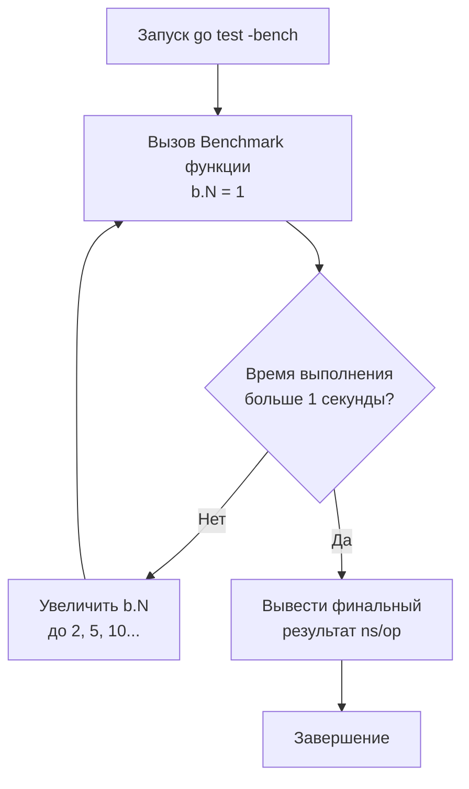

## Искусство измерения: Зачем нам Benchmarks

Лорд Кельвин однажды сформулировал фундаментальный принцип естествознания и инженерного дела: *"Если вы не можете измерить предмет своих размышлений и выразить его числом, значит, ваше знание скудно и неудовлетворительно"*. 

В предшествующих разделах мы обстоятельно изучили дисциплину функциональной корректности: от фундаментальных юнит-тестов до фаззинга и проверки граничных инвариантов. Мы доказали, что наш код функционирует **правильно**. Однако в мире распределенных высоконагруженных бэкендов логическая корректность — лишь половина пути. Программный компонент обязан работать **быстро**, экономно утилизировать процессорные такты кремния и не создавать разрушительного давления на сборщик мусора (Garbage Collector, GC).

Язык Go с первых дней проектировался в стенах Google с акцентом на предельный прагматизм и производительность. Именно поэтому инструментарий микропрофилирования и замеров производительности встроен непосредственно в ядро стандартной библиотеки и тулчейна `go test`. 

Вам больше не нужно гадать или полагаться на интуицию в вопросе о том, что эффективнее: наивная конкатенация строк через оператор `+` или буферизованный `strings.Builder`. Вы способны написать эталонный **Benchmark** за тридцать секунд и получить объективный, математически доказанный вердикт компилятора и рантайма.

---

## Базовый синтаксис и магия b.N

Бенчмарки в Go размещаются в тех же файлах с суффиксом `*_test.go`, бок о бок с модульными тестами. Однако вместо дескриптора `*testing.T` функция бенчмарка принимает указатель на управляющую структуру `*testing.B` из пакета `testing`.

Краеугольным элементом любого бенчмарка является канонический цикл `for i := 0; i < b.N; i++`.

```go
package performance_test

import (
	"strings"
	"testing"
)

// BenchmarkBuilder измеряет скорость агрегации строк через strings.Builder
func BenchmarkBuilder(b *testing.B) {
	// Подготовительный этап (выполняется однократно до старта замеров)
	words := []string{"Go", "is", "awesome", "and", "fast"}

	// Сбрасываем показания таймера, чтобы подготовка данных не искажала результат
	b.ResetTimer()

	// Измерительный цикл: тело цикла выполняется строго b.N раз
	for i := 0; i < b.N; i++ {
		var builder strings.Builder
		for _, w := range words {
			builder.WriteString(w)
		}
		_ = builder.String()
	}
}
```

Для запуска бенчмарков используется специализированный флаг `-bench`:

```bash
# Запустить все бенчмарки текущего пакета с выводом статистики аллокаций.
# Точка — это регулярное выражение, сопоставляющееся со всеми функциями Benchmark*
go test -bench=. -benchmem
```

> [!info] Под капотом: Как рантайм подбирает b.N
> Инженеры, пришедшие из сред Python, PHP или Node.js, часто по привычке пишут замеры времени в жестко заданном цикле: `for i := 0; i < 10000`. В системном программировании это порочный подход: если измеряемая микрооперация занимает 2 наносекунды, 10 000 итераций завершатся всего за 20 микросекунд. Любое прерывание ОС, планировщика ядра Linux или аппаратный опрос сетевой карты внесет 500% погрешности в итоговое число.
> 
> В Go счетчик `b.N` является **адаптивно-динамическим**. Фреймворк `testing` запускает функцию бенчмарка многократно итерационными сериями:
> 1. На первой итерации рантайм выставляет `b.N = 1`.
> 2. Если запуск завершается быстрее целевого интервала `benchtime` (по умолчанию составляет 1 секунду), рантайм экспоненциально масштабирует значение `b.N` по геометрической шкале: $1, 2, 5, 10, 20, 50, 100, 200 \dots$
> 3. Цикл повторяется до тех пор, пока совокупное время прогона не достигнет статистически достоверного плато, нивелирующего шум переключения контекстов процессора. Итоговый результат усредняется и выводится в наносекундах на операцию (`ns/op`).

Механизм калибровки показан на схеме:



---

## Управление таймером (Timer Management)

В реальных бенчмарках перед тестированием алгоритма нередко требуется провести тяжелую инициализацию: сгенерировать псевдослучайный срез на 100 000 элементов, загрузить структуру из файла или подготовить буферы. Если не исключить эти затраты, итоговая метрика задержки (Latency) будет катастрофически искажена.

Для прецизионного контроля времени рантайм Go предоставляет три ключевых метода: `b.ResetTimer()`, `b.StopTimer()` и `b.StartTimer()`.

> [!tip] Собеседование
> **Вопрос:** В чем фатальная ошибка вызова `b.ResetTimer()` непосредственно внутри тела измерительного цикла `for i := 0; i < b.N; i++`?
> **Ответ:** Это грубейшая ошибка, полностью обесценивающая бенчмарк. 
> 
> Если вызывать `b.ResetTimer()` на каждой итерации, вы обнулите всю накопленную статистику предыдущих шагов и замерите время исключительно последней итерации цикла (когда `i == b.N - 1`). 
> 
> Кроме того, сам вызов `b.ResetTimer()` совершает системные обращения к таймеру процессора (инструкция `RDTSC` на x86 или чтение виртуального счетчика ARM), добавляя паразитный оверхед в десятки наносекунд. 
> 
> Таймер разрешено останавливать (`b.StopTimer()`) и возобновлять (`b.StartTimer()`) только вокруг тяжелой фазы подготовки данных, но идеальный паттерн — выносить любую генерацию за пределы измерительного цикла.

### Канонический паттерн сложной подготовки данных

```go
func BenchmarkComplexSort(b *testing.B) {
	for i := 0; i < b.N; i++ {
		b.StopTimer() // Временно останавливаем прецизионный секундомер
		
		// Генерируем новый несортированный массив на 100 000 элементов 
		// (тяжелая операция выделения памяти и генерации случайных чисел)
		data := generateRandomData(100000) 
		
		b.StartTimer() // Вновь активируем измерительный таймер

		// Измеряем исключительно чистую скорость работы алгоритма сортировки!
		algorithms.Sort(data)
	}
}
```

---

## Ловушка: Компилятор умнее вас (Dead-code elimination)

Современный компилятор Go (`gc`) оснащен продвинутым оптимизатором на основе SSA (Static Single Assignment). Если компилятор в процессе оптимизации обнаруживает, что результат вычислений нигде далее не используется и не имеет побочных эффектов, он безжалостно вырезает весь блок кода (Dead-Code Elimination, DCE).

```go
// АНТИПАТТЕРН: Иллюзия сверхбыстрого кода
func BenchmarkAddBad(b *testing.B) {
	for i := 0; i < b.N; i++ {
		// Оптимизатор SSA видит, что результат сложения отбрасывается пустым идентификатором.
		// Компилятор полностью удаляет сложение из генерируемого машинного ассемблера!
		_ = 1 + 2 
	}
}
```

В результате в консоли появляется обманчивая цифра вроде `0.3 ns/op` — процессор просто прокрутил пустой цикл без единой инструкции сложения.

**Идиоматичное решение:** Сохранение локального результата в глобальную переменную уровня пакета:

```go
// Глобальная переменная уровня пакета предотвращает удаление мертвого кода
var Result int 

func BenchmarkAddGood(b *testing.B) {
	var r int
	for i := 0; i < b.N; i++ {
		r = 1 + 2
	}
	// Присваивание локальной переменной в глобальную Result
	// заставляет компилятор гарантированно сгенерировать инструкцию ADD,
	// так как компилятор не может доказать, что другое место программы не прочитает Result.
	Result = r
}
```

---

## Бенчмаркинг Аллокаций (Mechanical Sympathy)

Узким местом производительности бэкенд-систем на Go чаще всего служат не арифметические операции CPU, а аллокации в динамической памяти. Выделение объекта в куче (Heap) требует поиска свободного блока в спанах TCMalloc, синхронизации кэшей процессора и, главное, неминуемо нагружает сборщик мусора (GC), приводя к микропаузам (STW) и отвлечению ядер CPU на ассистирование маркировки (Mark Assist).

Для детального учета аллокаций применяется флаг консоли `-benchmem` либо явный программный вызов `b.ReportAllocs()`.

```go
func BenchmarkStringConcat(b *testing.B) {
	b.ReportAllocs() // Эквивалентно запуску с флагом -benchmem в CLI
	var s string
	for i := 0; i < b.N; i++ {
		// Конкатенация через оператор + принуждает Escape Analysis аллоцировать строку в Heap
		s = "hello" + " " + "world"
	}
	GlobalStr = s
}
```

Отчет в терминале содержит исчерпывающую картину:
```
BenchmarkStringConcat-8   50000000    25.5 ns/op    16 B/op    1 allocs/op
```
Это означает:
* На одну итерацию затрачено `25.5` наносекунд (`ns/op`).
* Выделено `16` байт в куче (`B/op`).
* Произведена ровно `1` аллокация (`allocs/op`). 

Снижение показателя `allocs/op` до нуля — святой Грааль микрооптимизации в Go.

> [!warning] Ловушка / Gotcha: Escape Analysis в Бенчмарках
> Будьте предельно внимательны при передаче конкретных типов в интерфейсные методы в бенчмарках (например, интерфейс `io.Writer` или `any`). 
> Если локальная переменная передается в функцию вроде `fmt.Fprintf(&buf, ...)`, механизм Escape Analysis почти гарантированно отправит ее в кучу (Escapes to Heap) из-за упаковки значения в интерфейсную структуру `iface/eface`. 
> 
> Ваш бенчмарк может показать ложные аллокации, которые полностью отсутствуют в реальном продакшене при прямом использовании конкретных структур и агрессивном инлайнинге компилятора.

---

## Конкурентные Бенчмарки: b.RunParallel

В реальном продакшене код веб-сервисов выполняется конкурентно сотнями параллельных горутин. Чтобы исследовать масштабируемость ваших примитивов синхронизации (например, замерить contention вокруг `sync.RWMutex`, эффективность пула `sync.Pool` или атомарных счетчиков), в Go предусмотрен метод `b.RunParallel()`.

```go
func BenchmarkAtomicStore(b *testing.B) {
	var val int64
	
	// RunParallel разворачивает пул горутин (по умолчанию равный runtime.GOMAXPROCS)
	// и автоматически шардирует общий объем итераций b.N между ними.
	b.RunParallel(func(pb *testing.PB) {
		// pb.Next() возвращает true до тех пор, пока для текущей горутины есть доступные кванты итераций
		for pb.Next() {
			atomic.AddInt64(&val, 1)
		}
	})
}
```

Если требуется смоделировать высококонкурентную стрессовую нагрузку, кратно превосходящую физическое число ядер CPU, перед вызовом `RunParallel` задают коэффициент параллелизма через `b.SetParallelism(10)` (что поднимет $10 \times \text{GOMAXPROCS}$ горутин) или устанавливают расчет пропускной способности данных в секунду через `b.SetBytes`. Это провоцирует острую конкуренцию за кэш-линии процессора (False Sharing) и борьбу за мьютексы.

---

## Эффекты Кэша L1/L2 (Cache Warming)

Бенчмарки — это лабораторные измерения в искусственно стерильных условиях. Процессорное «железо» способно сыграть с инженером злую шутку из-за эффекта прогрева аппаратных кэшей (Cache Warming).

Если в бенчмарке вы миллион раз подряд сортируете компактный срез на 100 элементов, эти данные намертво оседают в сверхбыстром кэше L1 процессора (латентность ~1 наносекунда). В отчете вы увидите фантастическую скорость.

Однако в реальном продакшене этот же код обрабатывает входящие запросы вперемешку с гигабайтами других данных. Кэш-линии L1/L2 непрерывно вытесняются (Cache Miss), и процессору приходится считывать данные из медленной оперативной памяти (RAM) с задержкой в 50–100 наносекунд. Производительность на реальном сервере может оказаться в 50 раз хуже, чем в локальном бенчмарке!

Чтобы нивелировать эффект прогрева кэшей, в продвинутых бенчмарках итерируются по массивам случайных данных, суммарный размер которых гарантированно превышает объем кэша L3 процессора (например, выделяя буфер на 64–128 МБ).

---

## Итог

Бенчмаркинг в Go — это строгая научная дисциплина:
1. **Динамический `b.N`** исключает погрешности системного планировщика ОС, обеспечивая статистическую устойчивость.
2. **Управление таймером (`b.ResetTimer`)** отделяет тяжелую фазу подготовки тестового стенда от исследуемого кода.
3. **Борьба с DCE:** Всегда сохраняйте результаты вычислений в глобальные переменные, чтобы компилятор не оптимизировал «в ноль» измерительный цикл.
4. **Приоритет аллокаций:** Число `allocs/op` из флага `-benchmem` часто говорит о здоровье архитектуры больше, чем сырое время `ns/op`.
5. **Параллельные замеры:** Используйте `b.RunParallel()` для исследования деградации кода при конкурентной борьбе за ресурсы.

Вы запустили бенчмарк и зафиксировали задержку в 2500 ns/op и 12 allocs/op. Это много или мало? А главное — **в каких конкретно строках кода** тратятся эти драгоценные наносекунды и память?

Чтобы препарировать внутреннюю динамику выполнения, мы переходим к профилированию. 

Следующая глава: [[2. Profiling внутри тестов]].