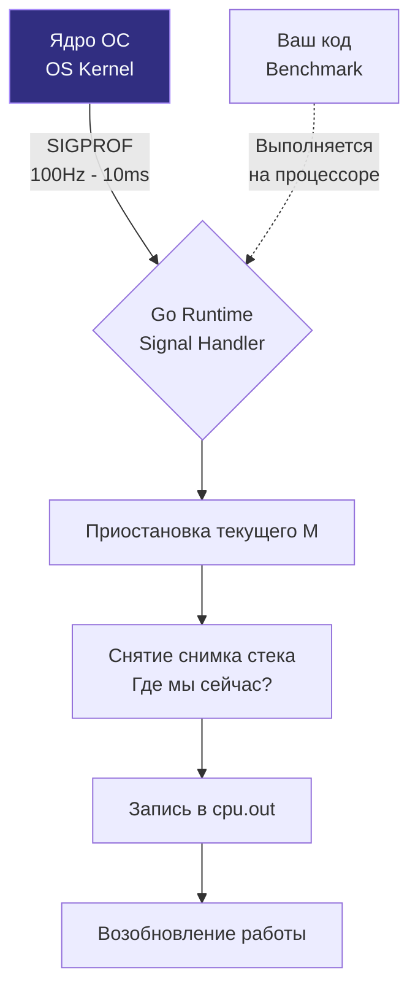

## От диагноза к лечению: Зачем нужен профайлинг

В предыдущей главе [[1. Benchmarking в Go]] мы освоили технику измерения скорости работы алгоритмов с математической строгостью. Бенчмарк беспристрастно констатирует факт: целевая функция `ProcessData` выполняется за 2 миллисекунды и совершает 45 аллокаций в куче. Однако бенчмарк **никогда не ответит на главный вопрос инженера**: какая конкретно строчка кода сжигает такты процессора, в какой ветке происходит блокировка и какой именно объект неправомерно утекает в кучу (Heap)?

Если бенчмарк — это термометр, фиксирующий наличие жара у пациента, то профайлинг — это прецизионное магнитно-резонансное сканирование (МРТ), послойно визуализирующее внутреннюю анатомию исполняемого бинарника.

Язык Go поставляется с первоклассным, глубоко интегрированным в рантайм инструментом профилирования — подсистемой `pprof`. В этой статье мы исследуем физику работы профилировщика на стыке рантайма Go и ядра операционной системы, а также научимся генерировать кристально чистые срезы производительности прямо во время выполнения тестов.

---

## Флаги тестирования: Профайлинг из коробки

Наиболее прямолинейный и идиоматичный способ снять профиль производительности — задействовать стандартные флаги утилиты `go test`. Вам не потребуется модифицировать ни единой строчки прикладного кода сервиса или менять логику существующих бенчмарков.

```bash
# Запускаем бенчмарк с прецизионным сбором профилей CPU и памяти
go test -bench=^BenchmarkProcessData$ -cpuprofile=cpu.out -memprofile=mem.out
```

> [!warning] Ловушка / Gotcha: Профайлинг обычных тестов
> Начинающие разработчики нередко пытаются снять профиль обычного модульного теста без указания флага `-bench`:
> `go test -cpuprofile=cpu.out`.
> 
> Результат подобного замера практически бесполезен. Юнит-тесты отрабатывают за доли миллисекунды. Профилировщик просто физически не успевает накопить статистически значимый массив выборок (Samples), и на выходе вы получите полупустой отчет, где 90% времени займет внутренняя инфраструктура инициализации пакета `testing`.
> 
> **Железное правило:** Профилирование всегда выполняется поверх долгоиграющих бенчмарков, где рантайм автоматически подбирает итератор `b.N`, гарантируя длительное и равномерное прогревание процессора.

В результате выполнения команды на диске материализуются бинарные файлы с расширением `.out`: `cpu.out` и `mem.out`. Это упакованные структуры данных в формате Protocol Buffers, содержащие срезы стеков вызовов и значения аппаратных счетчиков.

---

## Mechanical Sympathy: Как работает pprof под капотом

Профайлер в Go — это не непрерывный трассировщик, протоколирующий каждый машинный шаг. Подобный подход создал бы катастрофический оверхед, замедлив выполнение программы в сотни раз. Вместо этого `pprof` опирается на принципы **статистического семплирования (Sampling)**.

Чтобы безошибочно интерпретировать отчеты, необходимо понимать низкоуровневую механику сбора данных.

---

### 1. CPU Profiling (Профилирование процессора)

Когда вы активируете флаг `-cpuprofile`, рантайм Go конфигурирует системный интервальный таймер операционной системы (системный вызов `setitimer` в Linux).

1. Ядро операционной системы начинает посылать процессу Go специализированный POSIX-сигнал `SIGPROF` со строго заданной частотой — **100 раз в секунду** (каждые 10 миллисекунд).
2. Когда системный поток операционной системы (M) получает сигнал `SIGPROF`, ядро временно прерывает выполнение текущей горутины (G).
3. Обработчик сигнала в рантайме Go перехватывает контекст, делает моментальный слепок (Snapshot) текущего стека вызовов, фиксирует адреса возврата инструкций и инкрементирует счетчик нахождения процессора в этой функции.
4. Управление возвращается горутине до прихода следующего прерывания.

Механика дискретного сбора показана на схеме:



**Инженерный вывод:** Если ультракороткая вспомогательная функция выполняется за 5 наносекунд и вызывается редко, она с высокой вероятностью вообще ни разу не попадет под отсечку таймера `SIGPROF`. Профиль CPU демонстрирует не абсолютное время работы функций, а **вероятностное распределение времени пребывания процессора** в различных ветвях графа вызовов.

---

### 2. Memory Profiling (Профилирование памяти)

Профайлер динамической памяти работает по принципиально иной схеме. Он не зависит от системных таймеров ОС. Логика профилирования встроена непосредственно в центральный аллокатор рантайма Go — функцию `mallocgc` (файл `src/runtime/malloc.go`).

По умолчанию рантайм сохраняет стек вызовов **на каждые выделенные 512 Килобайт** памяти в куче (Heap):
* Если в цикле создаются миллионы крошечных объектов по 16 байт, профайлер зафиксирует стек вызова только для одного объекта из каждых 32 768 аллокаций.
* Если же код единовременно выделяет массив на 2 Мегабайта, профайлер гарантированно запишет этот факт в сэмпл с соответствующим весовым коэффициентом.

> [!tip] Собеседование
> **Вопрос:** Мы запустили бенчмарк с флагом `-memprofile` и обнаружили, что суммарный объем памяти в отчете pprof заметно меньше, чем показатель RSS (Resident Set Size) процесса в системном мониторе ОС. В чем причина такого расхождения?
> **Ответ:** Здесь действуют два фундаментальных фактора:
> 1. **Область видимости:** Профиль `memprofile` протоколирует исключительно аллокации в динамической куче Go (Heap). Он принципиально не учитывает память, выделенную под стеки тысяч горутин, структуры метаданных самого рантайма (`mheap`, `mcentral`), код загруженных библиотек и виртуальные страницы операционной системы, удерживаемые аллокатором про запас.
> 2. **Вероятностное семплирование:** В силу порога семплирования (1 сэмпл на 512 КБ) мелкие кратковременные объекты могут ускользать из статистики. Если для прецизионной отладки утечек требуется протоколировать абсолютно каждое выделение памяти, порог можно изменить через вызов `runtime.MemProfileRate = 1`, однако это на порядки замедлит исполнение из-за колоссального оверхеда на фиксацию стеков.

---

## Эффект наблюдателя (Observer Effect)

В фундаментальной физике попытка замера микрочастицы искажает её квантовое состояние. В системной инженерии этот феномен известен как **Observer Effect (Оверхед профилирования)**.

Процесс снятия снимков стека при получении `SIGPROF` отнимает такты ядер и кэш-линии процессора, замедляя выполнение программы на 1–3%. Сбор профиля аллокаций нагружает менеджер кучи дополнительными атомарными операциями.

> [!warning] Ловушка / Gotcha: Смешивание профилей
> Категорически не рекомендуется собирать CPU и Memory профили одновременно в рамках одного запуска, если ваша цель — эталонная чистота измерений.
> 
> Дополнительные накладные расходы внутри функции `mallocgc` при формировании профиля памяти неизбежно исказят картину потребления тактов CPU. Процессор потратит лишнее время на обслуживание подсистемы `memprofile`, и эти паразитные циклы отразятся в файле `cpu.out`.
> 
> **Канонический подход:** Всегда выполняйте два независимых, изолированных прогона `go test`:
> 1. `go test -bench . -cpuprofile cpu.out`
> 2. `go test -bench . -memprofile mem.out`

---

## Хирургический профайлинг внутри кода

Стандартные флаги CLI инструмента `go test` активируют сбор профиля на **все время жизни процесса**, включая фазы предварительной генерации данных и финализации. Как мы уже выяснили, метод `b.ResetTimer()` сбрасывает секундомер бенчмарка, но он **бессилен остановить системный таймер CPU-профайлера**! Прерывания `SIGPROF` продолжают непрерывно бомбардировать процесс, захватывая в итоговый срез нерелевантные вспомогательные вызовы.

Если фаза подготовки данных массивна, профиль окажется «загрязнен» шумом. В таких ситуациях Senior-инженеры применяют хирургическое программное управление профилировщиком через пакет `runtime/pprof`:

```go
package performance_test

import (
	"os"
	"runtime/pprof"
	"testing"
	"yourproject/internal/heavy"
)

func BenchmarkSurgicalProfile(b *testing.B) {
	// 1. Тяжелая генерация фиктивных данных (НЕ попадет в профиль)
	data := heavy.GenerateHugeDataset(1000000)

	// 2. Инициализация файла для выгрузки профиля
	f, err := os.Create("surgical_cpu.out")
	if err != nil {
		b.Fatal(err)
	}
	defer f.Close()

	b.ResetTimer()

	// 3. Активируем CPU-профайлер ТОЛЬКО для исследуемого критического участка
	if err := pprof.StartCPUProfile(f); err != nil {
		b.Fatal(err)
	}

	// Измерительный цикл: под прицелом профилировщика только вызовы heavy.ProcessDataset
	for i := 0; i < b.N; i++ {
		heavy.ProcessDataset(data)
	}

	// 4. Немедленно останавливаем сборщик профиля
	pprof.StopCPUProfile()
}
```

Полученный артефакт `surgical_cpu.out` будет кристально чистым, содержащим исключительно вызовы алгоритма внутри рабочего цикла `for i < b.N`.

---

## Другие виды профилей

Хотя CPU и память представляют базовый интерес при оптимизациях, тулчейн Go предоставляет два специализированных профиля для исследования многопоточных коллизий:

* **`-blockprofile=block.out`**: Протоколирует события блокировок горутин при ожидании в каналах, системных мьютексах и операторах `select`. Этот профиль незаменим при поиске «бутылочных горлышек» в конвейерных очередях и пулах обработчиков.
* **`-mutexprofile=mutex.out`**: Сосредоточен на анализе конкурентной борьбы за мьютексы `sync.Mutex` и `sync.RWMutex`. Он наглядно демонстрирует, на каких именно строках кода горутины простаивают в ожидании освобождения блокировок (Lock Contention) при параллельном тестировании через `b.RunParallel`.

---

## Итог

Профилирование превращает оптимизацию из шаманства в строгую доказательную науку:
1. **Связка с бенчмарками:** Всегда собирайте профили через флаги `go test -bench`, избегая коротких юнит-тестов без цикла `b.N`.
2. **Физика семплирования:** Профайлер опирается на статистику (сигналы `SIGPROF` на частоте 100 Гц и хуки аллокатора памяти `mallocgc` на каждые 512 КБ).
3. **Разделение измерений:** Изолируйте запуски `cpuprofile` и `memprofile`, чтобы избежать взаимного влияния эффекта наблюдателя.
4. **Хирургическая точность:** Управляйте границами записи через методы пакета `runtime/pprof` при наличии тяжелых фаз подготовки данных.

Мы сгенерировали бинарные файлы `.out`. Они надежно сохранены на диске, но в текстовом редакторе представляют собой нечитаемый массив сырых байтов Protocol Buffers. 

Как визуализировать эти данные, трансформировав их в интерактивные графы вызовов (Call Graphs), Flame-графики и построчный ассемблерный листинг? Для этого существует главный инструмент инженера по производительности — утилита `go tool pprof`.

Этому посвящен наш следующий материал: [[3. CPU и memory profiling]].