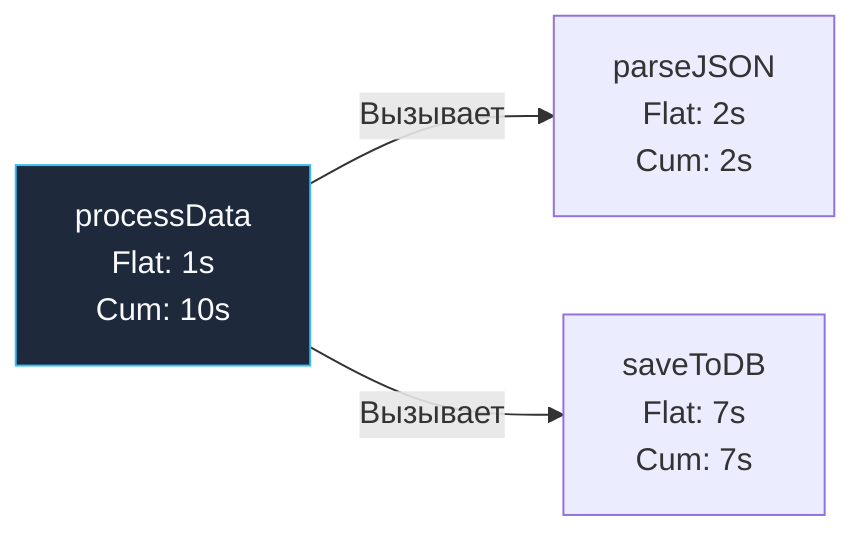

## Вскрытие черного ящика: Анализ с помощью pprof

В предыдущей главе [[2. Profiling внутри тестов]] мы сгенерировали бинарные файлы профилей: `cpu.out` и `mem.out`. Сами по себе они — лишь сжатые бинарные структуры данных в формате Protocol Buffers, содержащие сырые снимки стеков вызовов и статистику прерываний. Чтобы трансформировать эти сырые байты в глубокие инженерные инсайты, способные ускорить сервис на порядки, требуется специализированный аналитический инструмент.

В экосистему Go интегрирована мощнейшая утилита для визуализации, статистической декомпозиции и исследования профилей — `go tool pprof`.

Существуют два взаимодополняющих режима взаимодействия с `pprof`: современный визуальный веб-интерфейс (Web UI) и классическая интерактивная консольная оболочка (CLI). Опытный инженер виртуозно владеет обоими инструментами, выбирая подходящий под конкретную диагностическую задачу.

---

## Современный подход: Web UI и Флейм-графы

Забудьте на минуту про консольные простыни текста. Самый продуктивный способ моментально локализовать узкое место (Bottleneck) в архитектуре высоконагруженного сервиса — это визуализация. Запустите утилиту с флагом `-http`:

```bash
go tool pprof -http=:8080 cpu.out
```

Команда поднимает локальный HTTP-сервер и открывает интерфейс в браузере. По умолчанию отображается **Граф вызовов (Call Graph)**, где прямоугольные узлы представляют функции, а направленные стрелки — переходы вызовов. Чем массивнее прямоугольник и чем шире соединительная стрелка, тем больше процессорных ресурсов потребляет соответствующая ветвь исполнения.

Однако наиболее выразительный инструмент сокрыт в выпадающем меню: `View -> Flame Graph`.

---

### Как читать Flame Graph (Граф пламени)

Флейм-граф (концепция, популяризированная легендарным Бренданом Греггом) — это общепризнанный золотой стандарт индустрии для исследования профилей производительности:

* **Горизонтальная ось X (Ширина блока):** Отражает совокупную долю времени процессора (или объем памяти), затраченную на исполнение данной функции во всех сэмплах. Чем шире блок, тем больше машинных ресурсов он потребил. Порядок следования блоков по горизонтали алфавитный и не имеет отношения к хронологическому времени выполнения — это чистая статистическая агрегация.
* **Вертикальная ось Y (Высота стека):** Отражает глубину стека вызовов (Stack Depth). Функция наверху вызывает функции, расположенные под ней (или наоборот, в зависимости от ориентации графика).

Главное правило оптимизатора: **ищите широкое плато без «детей»**. Если вы видите массивный широкий блок, под которым нет дочерних вызовов, перед вами идеальная мишень для микрооптимизации: программа сжигает львиную долю процессорных тактов непосредственно внутри тела этой функции!

> [!info] Под капотом: Куда пропадают функции? (Inlining)
> Вы открываете Flame Graph и тщетно пытаетесь отыскать компактную вспомогательную функцию `calculateDiscount()`, хотя абсолютно уверены, что она вызывается миллионы раз в секунду. Куда она исчезла?
> 
> Виновником выступает компилятор Go и его механизм агрессивного **инлайнинга (Inlining)**. Если функция достаточно проста, компилятор не генерирует дорогостоящую ассемблерную инструкцию вызова `CALL` с созданием стекового кадра. Он бесшовно «впаивает» тело функции прямо в точку вызова родительского метода. 
> 
> Профилировщик `pprof` анализирует уже скомпилированный бинарный код, поэтому заинлайненные функции визуально «растворяются» внутри родительского блока. Чтобы отключить инлайнинг ради чистоты исследовательского эксперимента, бенчмарк запускают с флагом отключения оптимизаций: `go test -gcflags="-l"`.

---

## Терминология: Flat vs Cum (Плоское vs Накопленное)

Переключившись в режим таблицы `View -> Top`, вы увидите ранжированный список функций. Для начинающих разработчиков интерпретация этих столбцов нередко вызывает путаницу. Каждая строка содержит два принципиальных показателя: **Flat** (собственное время) и **Cum** (накопленное кумулятивное время).

Разберем эту математику на прозрачной модели:

```go
func main() {
    processData() // Совокупно выполнялась 10 секунд
}

func processData() {
    // Собственные операции функции (1 секунда)
    parseJSON()   // Выполнялась 2 секунды
    saveToDB()    // Выполнялась 7 секунд
}
```

* **Flat (Плоское время):** Время, проведенное процессором **исключительно внутри инструкций самой функции**, исключая время исполнения любых дочерних функций, которые она вызывала.
  * Для нашей модели: `Flat(processData)` = 1 секунда.
* **Cum (Накопленное кумулятивное время):** Время, затраченное внутри инструкций функции **вместе со временем всех порожденных ею дочерних вызовов**.
  * Для нашей модели: `Cum(processData)` = 1 + 2 + 7 = 10 секунд.

Взаимосвязь метрик наглядно иллюстрируется схемой:



### Практическое применение метрик

* **Сортировка по столбцу Flat** выявляет чистых потребителей тактов CPU: математические расчеты, сжатие данных, криптографию, конкатенацию строк и прямые системные вызовы ядра `syscall`.
* **Сортировка по столбцу Cum** выявляет архитектурных «дирижеров»: высокоуровневые обработчики запросов и методы очередей, которые сами по себе легки, но инициируют тяжелые каскады обработки.

---

## Хирургическое вмешательство: Режим CLI и команда list

Веб-интерфейс идеален для макроанализа. Однако когда виновная функция найдена, инженеру требуется препарировать ее код построчно. Для этой задачи незаменима интерактивная консольная оболочка:

```bash
go tool pprof cpu.out
```

Терминал отобразит приглашение командной строки `(pprof)`.
Команда `top` (или `top 10`) выведет десятку наиболее ресурсоемких функций по показателю Flat.

Предположим, в лидерах отчета оказалась тяжелая сервисная функция `yourproject/pkg.ProcessBatch`. Чтобы препарировать её построчно, вызывается специализированная команда `list <func_name>`:

```text
(pprof) list ProcessBatch

Total: 5s
ROUTINE ======================== yourproject/pkg.ProcessBatch
     100ms         5s (flat, cum)  2.0% of Total
         .          .     42: func ProcessBatch(data []byte) {
         .          .     43:    var result []string
      50ms       50ms     44:    parts := bytes.Split(data, []byte("\n"))
         .          .     45:    for _, p := range parts {
      40ms        4s      46:        parsed := json.Unmarshal(p, &obj) // <--- УЗКОЕ МЕСТО! (Cum: 4s)
      10ms      950ms     47:        result = append(result, parsed.ID)
         .          .     48:    }
         .          .     49: }
```

Утилита `pprof` выводит аннотированный исходный код, сопоставляя каждой инструкции точное время Flat и Cum. В нашем примере мгновенно вскрывается истина: вызов `json.Unmarshal` сжигает 80% всего времени функции (4 секунды из 5), а непрерывные аллокации в `append` отнимают еще около секунды!

---

## Профилирование памяти (Memory Profiling)

Анализ профиля динамической памяти (`mem.out`) требует совершенно иного диагностического мышления. Проблемы с оперативной памятью в Go подразделяются на два принципиальных вектора: **Утечки памяти (Memory Leaks)** и **Давление на сборщик мусора (GC Pressure)**.

В утилите `pprof` предусмотрены четыре режима проекции профиля. В веб-интерфейсе они переключаются через селектор `Sample`, а в командной строке — прямым указанием флага:

1. **`alloc_objects`**: Суммарное число объектов, выделенных в куче за весь период теста.
2. **`alloc_space`**: Суммарный объем байтов, запрошенный у аллокатора за весь период теста.
3. **`inuse_objects`**: Количество живых объектов, удерживаемых в памяти на момент фиксации профиля.
4. **`inuse_space`**: Фактический объем оперативной памяти в байтах, занятый живыми объектами прямо сейчас.

> [!tip] Собеседование
> **Вопрос:** Серверный процесс на Go утилизирует 100% ядер CPU. В профиле `cpu.out` видно, что свыше 40% тактов поглощают системные функции `runtime.mallocgc` и `runtime.gcBgMarkWorker`. Какова первопричина проблемы и где искать источник аномалии?
> **Ответ:** Это классический симптом **GC Pressure (давления на сборщик мусора)**. 
> 
> Сервис генерирует временные объекты в динамической куче с такой колоссальной скоростью, что сборщик мусора вынужден работать непрерывно, отнимая ядра у бизнес-логики и привлекая горутины к процессу маркировки (Mark Assist).
> 
> Чтобы локализовать дефект, необходимо открыть профиль памяти `mem.out` строго в режиме **`alloc_space`** (или `alloc_objects`). Режим `inuse` покажет ложное благополучие: текущее потребление RAM может быть минимальным, так как GC успевает оперативно уничтожать объекты. Проблема заключается не в удержании памяти, а в циклопическом объеме кратковременного «мусора», требующего оптимизации через пулы объектов (`sync.Pool`) или отказ от аллокаций.

---

### Поиск утечек (inuse_space)

Если график потребления памяти сервиса в Grafana неуклонно ползет вверх и не возвращается к исходному уровню после циклов GC, вы сталкиваетесь с реальной утечкой памяти. 

Для поиска виновника используется срез **`inuse_space`**. Запустив профилирование под нагрузкой, вы увидите глобальные структуры данных, фоновые кэши без политики вытеснения по времени (`TTL`), либо брошенные заблокированные горутины, удерживающие ссылки на гигантские массивы данных и запрещающие сборщику мусора освобождать страницы памяти.

---

## Итог

Инструмент `pprof` — незаменимый скальпель для тонкой настройки производительности:
1. **Визуализация через Web UI (`go tool pprof -http=:8080`)** и анализ Flame Graph позволяют за минуты локализовать архитектурные узкие места.
2. **Разделение метрик:** Столбец Flat обнажает вычислительные алгоритмы, а Cum подсвечивает координирующие методы верхнего уровня.
3. **Хирургическая команда `list`** связывает абстрактные наносекунды с конкретными строками вашего Go-кода.
4. **Анализ памяти:** Режим `alloc_space` побеждает перегрузку GC тактами CPU, а режим `inuse_space` вскрывает опасные утечки невысвобожденных ресурсов.

Мы научились оптимизировать код на микроуровне: в рамках отдельных функций и структур данных. Однако как поведет себя сервис целиком, когда на него обрушится реальный многотысячный поток пользовательских запросов по сети? Как оценить пределы пропускной способности всей системы под боевой нагрузкой?

Этому посвящена следующая глава: [[4. Load testing]].
