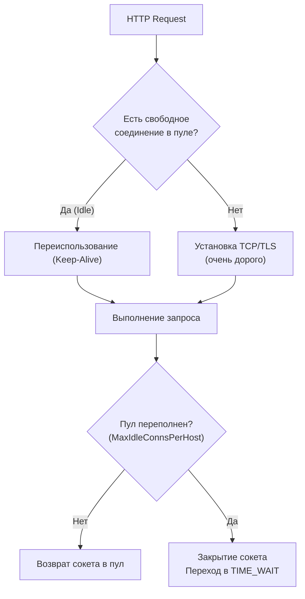

## Выход в реальный мир: Зачем нужно нагрузочное тестирование

В предшествующих главах мы обстоятельно исследовали микроуровень производительности: микро-бенчмарки (`go test -bench`), снятие профилей CPU и детальный анализ динамической памяти. Мы довели до кремниевого совершенства алгоритмы обработки данных, исключили аллокации и устранили паразитные вызовы.

Однако в реальном продакшене внешние клиенты никогда не вызывают ваши функции Go напрямую в памяти процесса. Запрос пользователя проделывает тернистый путь: он преодолевает глобальную сеть, поступает на балансировщик нагрузки (Nginx или Envoy), транслируется в сетевой стек Linux, попадает в мультиплексор HTTP-сервера Go, проходит сквозь цепочку мидлварей, логику доменных сервисов и, наконец, обращается к пулу соединений с базой данных PostgreSQL (`sql.DB`) или удаленному микросервису по gRPC.

Никакой лабораторный микро-бенчмарк не покажет вам, что настроенный пул соединений к СУБД внезапно исчерпан. Он не предупредит, что ядро операционной системы начало обрывать сетевые сокеты из-за нехватки дескрипторов файлов.

**Нагрузочное тестирование (Load Testing)** — это дисциплина симуляции реального, пикового или стрессового потока сетевого трафика на полностью собранную, изолированную и запущенную систему.

---

## Главные метрики: Почему "Среднее время" — это ложь

Прежде чем обрушивать на сервис искусственный трафик, необходимо выработать верную культуру метрик. Настоящий Senior-инженер никогда не оценивает качество работы распределенного API по показателю «среднего времени ответа» (Mean / Average Latency).

> [!warning] Ловушка / Gotcha: Иллюзия среднего значения (Average Latency)
> Представьте сценарий: 99 входящих запросов обработались молниеносно за 10 миллисекунд, а сотый запрос нарвался на микропаузу сборщика мусора (GC) или завис на блокировке мьютекса, выполняясь 1000 миллисекунд.
> 
> Среднеарифметическое время отклика составит около ~20 миллисекунд. Менеджер или неопытный разработчик посмотрит на красивую цифру «20 мс» в отчете и решит, что сервис работает идеально. Но один из сотни ваших реальных живых клиентов был вынужден ждать целую секунду, столкнулся с таймаутом интерфейса и ушел к конкурентам!

Индустриальным стандартом оценки латентности служат **Перцентили (Percentiles)**:
* **p50 (Медиана):** 50% всех запросов выполнились быстрее этого порога. Метрика описывает ощущения самого типичного, среднестатистического пользователя.
* **p95:** 95% запросов обработаны быстрее указанного времени.
* **p99 (Tail Latency — хвостовая задержка):** 99% запросов завершились в пределах этого значения. Это ключевой показатель стабильности бэкенда. Именно в «длинном хвосте» p99 скрываются фатальные паузы GC, борьба за блокировки (Lock Contention) и просадки сетевых буферов.

Инженерия производительности в распределенных системах — это прежде всего битва за укрощение и снижение **p99**.

---

## Инструменты экосистемы Go

На рынке корпоративного ПО исторически доминируют тяжеловесные платформы вроде Apache JMeter или Gatling. Однако в экосистеме Go принято использовать компактные, молниеносные утилиты, созданные на самом языке Go: благодаря легковесности горутин они способны генерировать колоссальный сетевой напор при минимальном потреблении локальной памяти.

---

### 1. Vegeta (Для HTTP)

Общепризнанный индустриальный стандарт для нагрузочного тестирования веб-сервисов на Go. Главное достоинство утилиты — поддержание строго фиксированного темпа генерации запросов (Constant Request Rate, RPS), независимо от того, насколько сильно деградирует время отклика тестируемого бэкенда (в отличие от классических утилит `ab` или `wrk`, темп генерации в которых жестко ограничен фиксированным числом открытых соединений).

Запуск генерации из консоли предельно лаконичен:

```bash
echo "GET http://localhost:8080/api/v1/users" | vegeta attack -rate=1000 -duration=10s | vegeta report
```

Кроме того, Vegeta поставляется в виде Go-библиотеки, что позволяет встраивать нагрузочные сценарии непосредственно в тестовый набор для автоматизированного контроля SLA (Service Level Agreement):

```go
package load_test

import (
	"testing"
	"time"

	vegeta "github.com/tsenart/vegeta/v12/lib"
	"github.com/stretchr/testify/require"
)

func TestAPI_LoadSLA(t *testing.T) {
	// Подготавливаем статический таргет (сервис запущен локально или в Testcontainers)
	targeter := vegeta.NewStaticTargeter(vegeta.Target{
		Method: "GET",
		URL:    "http://localhost:8080/api/users",
	})

	// Конфигурируем нагрузочную атаку: 500 запросов в секунду на протяжении 5 секунд
	attacker := vegeta.NewAttacker()
	rate := vegeta.Rate{Freq: 500, Per: time.Second}
	duration := 5 * time.Second

	var metrics vegeta.Metrics
	for res := range attacker.Attack(targeter, rate, duration, "API SLA Test") {
		metrics.Add(res)
	}
	metrics.Close()

	// Валидируем соблюдение контрактных обязательств SLA
	require.Equal(t, 1.0, metrics.Success, "Доля успешных ответов HTTP 200 OK обязана составлять ровно 100%")
	require.Less(t, metrics.Latencies.P99, 50*time.Millisecond, "Хвостовая задержка p99 Latency обязана быть ниже 50мс")
}
```

---

### 2. ghz (Для gRPC)

Если целевая архитектура опирается на межсервисное взаимодействие по gRPC (которое мы детально исследовали в [[5. Тестирование gRPC]]), генераторы HTTP/1.1 бесполезны. Требуется утилита, полноценно поддерживающая мультиплексирование потоков HTTP/2 и бинарную схему Protobuf.

Индустриальным эталоном выступает утилита `ghz`:

```bash
ghz --insecure \
  --proto ./helloworld.proto \
  --call helloworld.Greeter.SayHello \
  -d '{"name":"Gopher"}' \
  -c 50 -n 10000 \
  localhost:50051
```

---

### 3. k6 (Для сложных сценариев)

Когда требуется эмулировать не однотипные запросы, а комплексный пользовательский сценарий (авторизоваться, сохранить сессионный JWT-токен, запросить каталог товаров, выдержать реалистичную паузу в 2 секунды и отправить транзакцию оформления заказа), стандартом выступает инструмент **k6** от Grafana Labs. Движок инструмента написан на Go, а сценарии описываются на чистом JavaScript.

---

## Mechanical Sympathy: Ограничения операционной системы

Когда вы попытаетесь сгенерировать шквал в 10 000 RPS на локальный Go-сервер, процесс с высокой вероятностью рухнет. Однако причиной катастрофы станет не ошибка в коде Go, а аппаратные и системные лимиты операционной системы (OS Limits).

---

### Проблема 1: Исчерпание файловых дескрипторов (ulimit)

В архитектуре Unix/Linux абсолютно все сущности представлены дескрипторами файлов: файлы, сокеты, каналы IPC. Каждое входящее TCP-соединение требует выделения одного дескриптора. 

По умолчанию большинство дистрибутивов Linux ограничивают лимит процесса значением в 1024 дескриптора. При входящем потоке в 2000 RPS сервер моментально исчерпает лимит и начнет отвечать фатальной системной ошибкой `socket: too many open files`.

**Решение:** Тюнинг системных лимитов ядра: команда `ulimit -n 65535` для локальных тестов либо директива `LimitNOFILE` в конфигурациях systemd и лимитах Docker-контейнеров.

---

### Проблема 2: Эфемерные порты и TIME_WAIT

Когда клиентская сторона (генератор нагрузки или ваш сервис, обращающийся к PostgreSQL) закрывает TCP-соединение, сокет не уничтожается мгновенно. Он переводится ядром ОС в защитное состояние `TIME_WAIT` (продолжительностью обычно 60 секунд) для гарантии того, что задержавшиеся пакеты не повредят новое соединение.

Количество клиентских эфемерных портов ограничено диапазоном ядра (обычно около 28 000 портов). При интенсивной генерации сокеты в состоянии `TIME_WAIT` исчерпают весь диапазон портов (Port Exhaustion), породив системную ошибку `bind: address already in use`.

**Архитектурное решение в Go:** Грамотная настройка пулов соединений (Connection Pooling).

В стандартной библиотеке Go структуры `http.Client` и драйвер `sql.DB` снабжены внутренними пулами соединений. Однако стандартная конфигурация `http.Client` исторически спроектирована под редкие запросы веб-браузера, а не под нужды высоконагруженных микросервисов!

```go
// ПРАВИЛЬНАЯ конфигурация http.Client для микросервисной нагрузки
t := http.DefaultTransport.(*http.Transport).Clone()
t.MaxIdleConns = 100            // Максимальный совокупный пул неактивных открытых соединений
t.MaxIdleConnsPerHost = 100     // КРИТИЧЕСКИ ВАЖНО! По умолчанию всего 2! 
                                // При 1000 RPS к одному хосту 998 соединений будут закрываться 
                                // и падать в TIME_WAIT каждую секунду!
t.IdleConnTimeout = 90 * time.Second

client := &http.Client{
	Transport: t,
	Timeout:   10 * time.Second,
}
```

Динамика жизненного цикла сокетов в пуле представлена на схеме:



---

## Главное правило: Изоляция генератора

> [!warning] Ловушка / Gotcha: Эффект наблюдателя 2.0 (Co-location interference)
> Категорически запрещено запускать генератор нагрузки (Vegeta или k6) и сам тестируемый веб-сервис на одной физической машине или рабочей станции, направляя трафик на `localhost`.
> 
> Генерация потока в 10 000 RPS сама по себе поглощает гигантские ресурсы CPU, перегружая планировщик ОС. Генератор и сервер начинают ожесточенно конкурировать за кэш L3 процессора, память и loopback-интерфейс ядра. Результаты замеров окажутся в 2–3 раза хуже реальных.
> 
> **Промышленный стандарт:** Генератор нагрузки размещается на выделенной сборочной машине, тестируемый сервис — на изолированном сервере, объединенных высокоскоростным сетевым каналом (10–100 Gbps).

---

## Синергия: Load Testing + pprof

Нагрузочное тестирование констатирует внешние симптомы («система держит 3000 RPS с хвостовой задержкой p99 = 350ms»). Но чтобы устранить корневую причину деградации, необходимо объединить нагрузочный стресс-тест с профилированием, освоенным в [[3. CPU и memory profiling]].

В стандартной библиотеке Go предусмотрен пакет `net/http/pprof`. Он позволяет безопасно снимать профили прямо с работающего под боевой нагрузкой сервера:

1. Подключите анонимный импорт `_ "net/http/pprof"` в корневой файл `main.go`. Это автоматически зарегистрирует эндпоинты профилирования на стандартном мультиплексоре `DefaultServeMux`.
2. Запустите сервис на тестовом стенде.
3. Подайте стабильную нагрузку через Vegeta или k6 на 3–5 минут, прогрев кэши, наполнив пулы соединений и активировав работу GC.
4. Прямо **в момент пиковой нагрузки** снимите 30-секундный профиль CPU удаленной командой:
   ```bash
   go tool pprof -http=:8080 http://your-server:8080/debug/pprof/profile?seconds=30
   ```

Только профиль, снятый под реальным сетевым напором, обнажит истинные бутылочные горлышки: борьбу за мьютексы (Lock Contention), холостые аллокации в парсерах или задержки сетевых сокетов ядра.

---

## Итог всего блока (Тестирование и Производительность)

Мы завершили фундаментальное исследование классического нагрузочного тестирования сервисов:
1. **Перцентили превыше всего:** Забудьте о среднем времени; оптимизируйте хвостовую задержку **p99**.
2. **Инструментальный арсенал:** Используйте Vegeta для фиксированного RPS в HTTP, `ghz` для gRPC и k6 для сложных пользовательских сценариев.
3. **Механическое сочувствие к ОС:** Контролируйте дескрипторы `ulimit` и предотвращайте шторм сокетов `TIME_WAIT` через настройку `MaxIdleConnsPerHost`.
4. **Синергия с `pprof`:** Снимайте профили непосредственно под нагрузкой для выявления узких мест.

Нагрузочное тестирование моделирует штатный трафик. Однако что произойдет, когда нагрузка выйдет далеко за расчетные рамки? Как верифицировать поведение сервиса на грани катастрофы и найти предел прочности системы?

Этим экстремальным практикам посвящена следующая статья: [[5. Stress testing]].