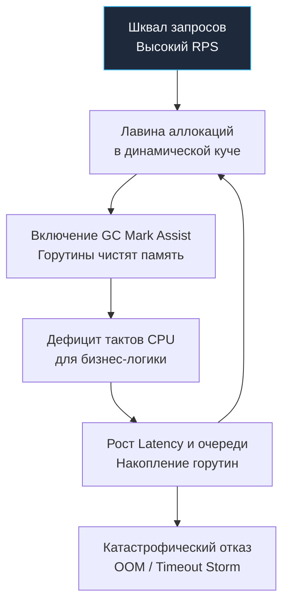

## За пределом прочности: Разрушение во имя надежности

В предшествующей главе [[4. Load testing]] мы исследовали классическое нагрузочное тестирование. Мы моделировали *ожидаемый*, прогнозируемый рабочий трафик, чтобы гарантировать соблюдение формальных условий соглашения об уровне сервиса (SLA, например, $p99 < 50\text{ мс}$ при расчетных 1000 RPS).

Однако распределенные системы редко живут в тепличных условиях. Что произойдет, если вирусная публикация или маркетинговый шторм внезапно взвинтят входящий поток не до расчетных 1000, а до 50 000 RPS за считанные секунды? Что случится при масштабной распределенной атаке типа DDoS?

Если классическое нагрузочное тестирование отвечает на вопрос: *«Справится ли сервис со своими штатными обязанностями?»*, то **Стресс-тестирование (Stress Testing)** ставит перед инженером предельно жесткие, разрушительные вопросы:
1. *«При какой именно критической нагрузке система потерпит катастрофический крах (Breaking Point)?»*
2. *«Как именно умрет рантайм Go (симптоматика и первопричина отказа)?»*
3. *«Способен ли сервис самостоятельно восстановиться и войти в нормальный ритм, когда шторм нагрузки стихнет?»*

В этой главе мы препарируем поведение рантайма Go за гранью физических возможностей железа и научимся проектировать сценарии управляемого стрессового отказа.

---

## Анатомия смерти Go-приложения (Mechanical Sympathy)

Чтобы сконструировать информативный стресс-тест, необходимо глубоко понимать механику исчерпания системных ресурсов в рантайме Go. В отличие от традиционных серверов на Java или C++ с фиксированным пулом потоков ОС (Worker Thread Pool), стандартный HTTP-сервер Go исторически реализует модель **создания новой горутины на каждое входящее TCP-соединение**.

При экстремальном напоре трафика приложение практически всегда гибнет по одному из трех классических сценариев:

---

### 1. Goroutine Explosion (Взрыв горутин) и OOM

Представьте, что база данных PostgreSQL или внешний микросервис под нагрузкой начали деградировать: время ответа СУБД подскочило с 10 миллисекунд до 2 секунд. 

Входящий трафик продолжает непрерывно поступать со скоростью 10 000 RPS. Поскольку существующие запросы заблокированы в ожидании сокетов базы данных, стандартный сервер `net/http` непрерывно аллоцирует новые горутины для приема очередных клиентов. 

За пару секунд в оперативной памяти скапливаются сотни тысяч заблокированных горутин. Каждая горутина удерживает стартовый стек размером минимум в 2 КБ, который при росте локальных переменных и буферов запроса расширяется до десятков килобайт. 

**Катастрофический финал:** Потребление оперативной памяти пробивает потолок лимитов контейнера, и подсистема ядра Linux безжалостно уничтожает процесс сигналом `SIGKILL` через механизм **OOM Killer**.

---

### 2. GC Death Spiral (Спираль смерти Garbage Collector'а)

Если бизнес-логика активно выделяет временные объекты в динамической куче (Heap), при шквале запросов частота аллокаций взлетает по экспоненте. Сборщик мусора Go (GC) фиксирует стремительное заполнение кучи и форсирует агрессивный цикл маркировки.

В нормальном состоянии рантайм Go выделяет на работу фонового GC до 25% ресурсов доступных ядер CPU. Однако в условиях стрессового дефицита памяти рантайм активирует механизм **Mark Assist**: горутины, пытающиеся аллоцировать память, принудительно привлекаются к сборке мусора.

Бизнес-логика лишается процессорных квантов времени $\rightarrow$ запросы обрабатываются еще медленнее $\rightarrow$ накапливается лавина ожидающих соединений $\rightarrow$ GC молотит еще агрессивнее, поглощая до 100% процессора.

**Катастрофический финал:** Сервис формально жив, но показатель $p99$ улетает в бесконечность (десятки секунд), клиенты массово отваливаются по сетевым таймаутам, а система превращается в «зомби».

Взглянем на этот замкнутый порочный круг:



---

### 3. Исчерпание файловых дескрипторов (File Descriptor Starvation)

Если при шквале входящих сетевых соединений сервис обращается к внешним СУБД без строгой конфигурации пулов сокетов, процесс моментально упирается в лимиты ядра операционной системы (`ulimit`). 

**Катастрофический финал:** Любая последующая попытка установить соединение или прочитать файл на диске немедленно завершается системной ошибкой ядра `socket: too many open files`.

---

## Паттерны Стресс-тестирования

Если при нагрузочном тестировании мы подавали монотонный поток запросов с фиксированной частотой, то стресс-тестирование опирается на динамические профили нагрузки. Признанным эталоном для таких сценариев выступает утилита **k6**, позволяющая декларативно программировать фазы стресса (Stages).

---

### Паттерн 1: Step Load (Ступенчатая нагрузка)

Нагрузка наращивается дискретными ступенями до тех пор, пока система не перейдет в режим деградации. Это позволяет точно локализовать границу предельной пропускной способности (Capacity Point).

*Пример декларативного сценария k6 (script.js):*
```javascript
import http from 'k6/http';
import { check } from 'k6';

export const options = {
  stages: [
    { duration: '1m', target: 1000 },  // Ступень 1: разгон до 1 000 RPS
    { duration: '2m', target: 1000 },  // Фиксация плато
    { duration: '1m', target: 5000 },  // Ступень 2: скачок до 5 000 RPS
    { duration: '2m', target: 5000 },  // Фиксация плато
    { duration: '1m', target: 15000 }, // Экстремальный стресс: 15 000 RPS
    { duration: '2m', target: 15000 },
  ],
};

export default function () {
  const res = http.get('http://api.yourdomain.com/v1/heavy-endpoint');
  check(res, { 'status is 200': (r) => r.status === 200 });
}
```

**Цель наблюдения:** Зафиксировать момент, когда кривая времени ответа резко взмывает вверх («график хоккейной клюшки» — Hockey Stick Graph), а доля успешных ответов падает ниже 99%.

---

### Паттерн 2: Spike Testing (Тестирование всплесков)

Моделирует экстремальный импульсный всплеск трафика: старт маркетинговой распродажи или внезапную атаку. Сервис удерживается на фоновой нагрузке, затем за секунды получает удар десятикратным трафиком, после чего нагрузка мгновенно спадает до базового уровня:

```javascript
export const options = {
  stages: [
    { duration: '3m', target: 500 },    // Фоновый штатный трафик
    { duration: '10s', target: 20000 }, // Импульсный всплеск в 20 000 RPS!
    { duration: '3m', target: 500 },    // Мгновенный возврат к фону
  ],
};
```

**Цель наблюдения:** Способность к самовосстановлению (Resilience). Если после падения нагрузки обратно до 500 RPS показатели задержки не возвращаются к нормальным значениям, в кодовой базе присутствует утечка ресурсов: зависшие мьютексы, сломанные пулы соединений или зомби-горутины.

---

## Защита от стресса: Graceful Degradation

Стресс-тестирование теряет всякий практический смысл, если система не оснащена механизмами самозащиты. Приложение не имеет права слепо умирать от OOM. Архитектура обязана демонстрировать **Изящную деградацию (Graceful Degradation)**: осознанно отбрасывать избыточный трафик на периферии, гарантируя выживание критического ядра.

> [!tip] Собеседование
> **Вопрос:** Как защитить HTTP-сервис на Go от падения по OOM при внезапном скачке входящего трафика с 1 000 до 100 000 RPS?
> **Ответ:** Стандартная функция `http.ListenAndServe` не накладывает лимитов на число создаваемых горутин. Для надежной защиты разворачивается эшелонированная оборона:
> 1. **Сетевые таймауты ядра:** Обязательная настройка параметров `ReadTimeout` и `WriteTimeout` на экземпляре структуры `http.Server`.
> 2. **Сквозная отмена через Context:** Вся цепочка вызовов (включая SQL-драйверы и gRPC-клиенты) обязана принимать `context.Context` от входящего запроса. Если клиент разорвал соединение или истек лимит времени, работа немедленно прерывается.
> 3. **Rate Limiting (Ограничение частоты):** Внедрение алгоритма Token Bucket (пакет `golang.org/x/time/rate`) на уровне мидлварей, мгновенно отвечающего статусом `429 Too Many Requests` на аномальные всплески.
> 4. **Circuit Breaker:** Защита зависимых баз данных и внешних API от добивания шквалом повторных запросов при замедлении их работы.

---

### Пример защиты: Bounded Concurrency на уровне хэндлера

Если конкретный эндпоинт выполняет ресурсоемкую операцию (тяжелую криптографию или генерацию отчетов), параллелизм жестко ограничивается семафором на базе буферизованного канала Go:

```go
package api

import (
	"net/http"
)

// Семафор Bounded Concurrency: разрешаем не более 100 одновременных тяжелых вычислений
var heavyLoadSemaphore = make(chan struct{}, 100)

func HeavyProcessingHandler(w http.ResponseWriter, r *http.Request) {
	// Неблокирующая попытка занять слот в семафоре
	select {
	case heavyLoadSemaphore <- struct{}{}:
		// Слот успешно захвачен: гарантированно освобождаем его при выходе из функции
		defer func() { <-heavyLoadSemaphore }() 
	default:
		// Все 100 слотов заняты! Мгновенно отсекаем избыточный запрос без аллокаций.
		// Это спасает процесс от дефицита памяти и взрыва горутин.
		http.Error(w, "Service Overloaded", http.StatusServiceUnavailable)
		return
	}

	// ... Здесь безопасно исполняется ресурсоемкая доменная логика ...
}
```

Под стресс-тестом такой хэндлер демонстрирует безупречную устойчивость: ровно 100 активных клиентов обрабатываются в пределах установленного SLA, а избыточные 99 900 запросов мгновенно получают ответ `503 Service Unavailable`. Сервер остается стабильным, GC спокоен, а соседние легкие эндпоинты продолжают функционировать без задержек.

---

## Chaos Engineering: Тестирование отказов

Стресс распределенной системы порождается не только сетевым шквалом извне, но и внезапными авариями внутренней инфраструктуры.

Методология Chaos Engineering (инспирированная инструментарием Chaos Monkey от Netflix) предписывает индуцировать сбои непосредственно во время нагрузочного стресс-теста:
1. Запустите стабильный фоновый поток трафика через утилиту `vegeta`.
2. В разгар теста искусственно остановите мастер-ноду PostgreSQL, спровоцировав процедуру Failover на реплику.
3. Внесите искусственную деградацию сетевых пакетов и латентность на сетевом интерфейсе (с помощью команды ядра `tc qdisc` или прокси-эмулятора Toxiproxy).
4. **Анализ устойчивости:** Корректно ли горутины прерывают ожидание по таймаутам `context.WithTimeout`? Не уходит ли пул соединений в состояние дедлока? Возвращается ли система в строй после восстановления сетевой связности?

---

## Итог раздела и всего модуля QA & Testing

Стресс-тестирование — это высшая аттестация зрелости бэкенд-архитектуры:
* Мы научились разделять штатную нагрузку (Load Testing) и разрушительное стресс-тестирование (Stress Testing).
* Мы исследовали механику системного отказа Go под капотом (Goroutine Explosion, GC Death Spiral, File Descriptor Starvation).
* Мы освоили паттерны ступенчатой (Step Load) и импульсной (Spike) нагрузки в `k6`.
* Мы внедрили принципы Graceful Degradation через семафоры каналов, `Rate Limiting` и контекстную отмену.

**Фундаментальный путь инженера по обеспечению качества завершен.** 

Вы прошли грандиозный путь: от элементарных проверок `if got != want` в модульных тестах до контрактного тестирования микросервисов, охоты за Data Race в теневой памяти рантайма, математических инвариантов в Property-Based фаззинге и стрессовой вивисекции сервисов под напором в 50 000 RPS.

Но как прецизионно измерять задержку отдельных сетевых вызовов в микросекундах и строить надежные графики латентности? Этому посвящен наш следующий практический материал: [[6. Тестирование latency]].