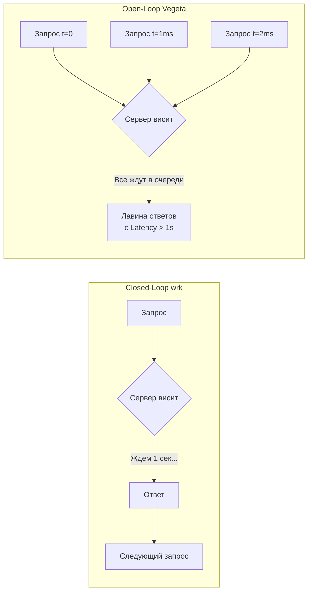

## Время — деньги: Анатомия задержек

В предыдущей главе [[4. Load testing]] мы коснулись метрики $p99$ и доказали, что «среднее время ответа» — это опасная статистическая фикция. Нагрузочное тестирование показывает **пропускную способность** системы (Throughput, RPS) — какой объем входящих запросов способен переварить сервер в единицу времени. Тестирование задержек (Latency Testing) отвечает на принципиально иной, куда более чувствительный вопрос: **как долго каждый конкретный живой человек ждет ответа от вашего сервиса?**

Высокая пропускная способность вовсе не гарантирует низкую задержку. Сервис может бодро рапортовать о 10 000 обработанных запросов в секунду, но если каждый запрос проводит в очередях по 2–3 секунды, пользователи сочтут систему безнадежно сломанной.

В современной микросервисной архитектуре эта проблема многократно обостряется эффектом усиления хвостовой задержки (**Tail Latency Amplification**). Если обработка входящего клиентского запроса требует параллельного веерного обращения к десяти зависимым микросервисам (Fan-Out = 10), то задержка $p99$ самого медленного бэкенда математически превращается в задержку $p90$ или $p50$ для конечного пользователя ($1 - (0.99)^{10} \approx 9.5\%$, а при 100 зависимостях — уже свыше $63\%$).

В этой главе мы разберем главный математический парадокс тестирования производительности — явление Coordinated Omission — и освоим инструмент, позволяющий увидеть ход времени глазами планировщика Go.

---

## Главная ловушка: Coordinated Omission

Концепция, сформулированная легендарным исследователем производительности Гилом Тене (Gil Tene), вскрывает причину, по которой до 90% нагрузочных тестов в индустрии показывают заниженные, ложно-оптимистичные результаты. На собеседованиях уровня Staff / Principal вопрос о **Coordinated Omission (Скоординированном упущении)** служит безошибочным маркером зрелости инженера.

Представьте, что вы тестируете HTTP-сервер с помощью широко распространенных утилит `ab` (Apache Bench) или `wrk`, сконфигурировав запуск: *«Держать 100 параллельных потоков»*.

> [!warning] Ловушка / Gotcha: Closed-Loop генераторы
> Генераторы вроде `wrk` или `ab` функционируют по модели замкнутого цикла (Closed-Loop). Рабочий поток инструмента отправляет запрос, **терпеливо ожидает сетевого ответа**, и только после получения последнего байта отправляет следующий.
> 
> **Модель катастрофы:** Сервер работает штатно, отвечая за 1 миллисекунду. Внезапно в рантайме Go запускается цикл сборки мусора (GC) или зависает запрос к БД, и сервис "замирает" ровно на 1 секунду (1000 мс).
> 
> В реальном интернете пользователи не знают о проблемах сервера: они продолжают кликать. За эту секунду на бэкенд обрушивается еще 1000 реальных запросов. Они скапливаются в системных очередях ядра, и их истинное время ожидания составит 1000 мс, 999 мс, 998 мс...
> 
> Что в этот же момент делает генератор `wrk`? Его 100 потоков отправили запросы, уперлись в зависший сервер и... **замолчали на целую секунду**, послушно ожидая ответа. Генератор скоординированно «упустил» и не отправил ту тысячу запросов, которая должна была поступить в эту секунду!
> 
> В итоговом отчете `wrk` зафиксирует всего 100 медленных ответов (по 1000 мс). А затем, когда сервер отвиснет, за доли секунды нагенерирует еще 10 000 быстрых запросов (по 1 мс). В итоговой выборке сотня медленных запросов растворится в массе быстрых, и перцентиль p99 покажет благополучные 2 мс. Вы получите ложное спокойствие, пока реальные пользователи страдают от таймаутов.

### Архитектурное решение: Open-Loop генераторы

Для достоверного тестирования задержек допустимо использовать исключительно генераторы открытого цикла (Open-Loop), такие как `Vegeta` или `k6`. 

Генератор открытого цикла независим от состояния сервера: если в конфигурации `vegeta` задан темп в `1000` RPS, утилита будет отправлять запросы строго по расписанию через каждый квант времени, даже если сервер перестал отвечать вовсе. Запросы начнут лавинообразно скапливаться в сетевых сокетах, и `Vegeta` честно и беспощадно зафиксирует взрыв хвостовой задержки.

Принципиальная разница подходов наглядно показана на схеме:



---

## Инструмент последней надежды: go tool trace

В [[3. CPU и memory profiling]] мы использовали `pprof`. Профайлер `pprof` отвечает на вопрос: *«На какие инструкции тратятся такты процессора?»*.

Однако при исследовании задержек процессор часто **простаивает**! Аномальная Latency возникает не потому, что функция выполняет тяжелые математические вычисления, а потому, что горутина **чего-то ждет**: ответа от сокета СУБД, освобождения `sync.Mutex`, очереди планировщика Go или завершения маркировки GC.

В ситуациях, когда процессор свободен, а задержка зашкаливает, `pprof` слеп. Здесь в игру вступает инструмент высшего пилотажа — **Execution Tracer (`go tool trace`)**.

Трейсер фиксирует хронологию событий рантайма с наносекундной детализацией: переключение состояний горутин, задержки в сетевом поллере (Netpoller), системные вызовы ядра и квантование времени между логическими процессорами `P`.

---

### Как собрать трейс в тесте

```go
package latency_test

import (
	"os"
	"runtime/trace"
	"testing"
)

func BenchmarkLatencyCriticalPath(b *testing.B) {
	// Создаем бинарный файл для сбора событий трейса
	f, err := os.Create("trace.out")
	if err != nil {
		b.Fatal(err)
	}
	defer f.Close()

	// Активируем сбор событий рантайма
	if err := trace.Start(f); err != nil {
		b.Fatal(err)
	}
	defer trace.Stop()

	b.ResetTimer()
	for i := 0; i < b.N; i++ {
		// Исследуемая доменная операция
		processOrder()
	}
}
```

Визуализатор запускается стандартной командой тулчейна:

```bash
go tool trace trace.out
```

---

### Как читать интерфейс Trace

Интерфейс трейсера (открывающийся в браузере) представляет собой интерактивную многодорожечную кардиограмму исполнения системы во времени.

Ключевые панели внимания Senior-инженера:

1. **Goroutine analysis:** Отображает время нахождения горутины в фундаментальных состояниях рантайма:
   * `Running`: горутина реально исполняет инструкции на аппаратном ядре CPU.
   * `Runnable`: горутина готова к исполнению, но простаивает в очереди `RunQueue`, ожидая освобождения логического процессора `P`. Высокий показатель `Runnable` сигнализирует о чрезмерном количестве горутин и задержках планировщика (Scheduler Latency).
   * `Waiting`: горутина принудительно припаркована (ждет ответа сетевого сокета, таймера или канала).
2. **Network blocking profile:** Граф ожидания сетевых пакетов из ядра Linux через netpoller.
3. **Synchronization blocking profile:** Наглядно выявляет мьютексы `sync.Mutex` и каналы, вызывающие затяжные паузы блокировок.

> [!tip] Собеседование
> **Вопрос:** В отчете `go tool trace` вы наблюдаете пустые пробелы на временной шкале `PROCS` (ядра процессора простаивают без нагрузки), однако хвостовая задержка P99 ваших HTTP-запросов катастрофически высока. Приложение активно работает с базой данных. В чем корневая причина аномалии?
> **Ответ:** Это классическое проявление **I/O-затора и исчерпания пула соединений (Connection Pool Starvation)**. 
> 
> Горутины пытаются извлечь активное соединение из пула драйвера базы данных (`sql.DB`), однако лимит открытых сокетов `MaxOpenConns` исчерпан. Горутины переводятся планировщиком в режим глубокого сна (`Waiting`), добровольно освобождая процессор. Процессорные ядра `PROCS` простаивают, так как очереди задач пусты, но для клиентской стороны счетчик времени (Latency) продолжает тикать. 
> 
> В `go tool trace` эта коллизия отчетливо видна в профиле Synchronization blocking как затяжное ожидание на внутреннем семафоре пула `sql.DB`.

---

## Mechanical Sympathy: Борьба с Garbage Collector

Главный генератор непредсказуемых всплесков хвостовой задержки (Tail Latency) в Go — это сборщик мусора. Хотя паузы Stop-The-World в современном Go оптимизированы до долей миллисекунды, конкурентная фаза маркировки графа объектов поглощает до **25% мощности процессора**, вызывая кратковременные просадки скорости бизнес-логики.

Рантайм Go предоставляет инженеру два мощных рычага калибровки поведения GC под строгие требования к задержкам:

---

### GOGC (Trade-off: Память vs CPU)

Переменная окружения `GOGC` (по умолчанию равна 100) определяет триггер запуска сборки: *«Инициировать сборку мусора, когда объем вновь выделенной памяти составит 100% от размера выживших данных предыдущего цикла»*.

Если сервер располагает избытком оперативной памяти, но критически чувствителен к задержкам, значение масштабируют вверх: например, `GOGC=500`. Сборщик мусора будет просыпаться в 5 раз реже, высвобождая драгоценные циклы CPU для бизнес-логики, ценой пятикратного роста потребления RAM.

---

### Soft Memory Limit (GOMEMLIMIT)

> [!info] Под капотом: Магия Go 1.19+
> Исторически высокий тюнинг `GOGC` нес в себе смертельную угрозу: при внезапном скачке аллокаций приложение могло пробить лимит RAM Docker-контейнера и быть мгновенно убито OOM Killer'ом.
> 
> Начиная с релиза Go 1.19, в рантайм внедрен мягкий лимит памяти **`GOMEMLIMIT`**, кардинально изменивший парадигму настройки высоконагруженных систем. 
> 
> Инженер может задать экстремальную конфигурацию:
> * `GOGC=off` (или `GOGC=1000`)
> * `GOMEMLIMIT=900MiB` (для контейнера с лимитом 1 ГБ).
> 
> Рантайм перестает инициировать циклы GC по процентной ставке, сводя хвостовые задержки к абсолютному минимуму, пока куча не приблизится к порогу в 900 Мегабайт. Лишь при приближении к границе лимита GC активирует очистку. Это идеальный тюнинг для задержко-критичных сервисов.

---

## Как интегрировать тестирование Latency в CI

Тесты производительности должны защищать проект от деградации так же надежно, как и функциональные юнит-тесты. Нарушение лимитов SLA обязано приводить к падению сборочного пайплайна (Fail the Build).

Идиоматичный подход к проверке перцентилей задержки внутри Go-теста:

```go
func TestCriticalPathLatencySLA(t *testing.T) {
	if testing.Short() {
		t.Skip("Пропускаем тяжелый тест задержек")
	}

	const totalRequests = 10000
	const maxP99 = 50 * time.Millisecond

	latencies := make([]time.Duration, totalRequests)
	
	// Используем WaitGroup для координации конкурентного потока запросов
	var wg sync.WaitGroup
	wg.Add(totalRequests)

	for i := 0; i < totalRequests; i++ {
		i := i
		go func() {
			defer wg.Done()
			
			start := time.Now()
			processOrder() // Исследуемая операция
			latencies[i] = time.Since(start)
		}()
	}

	wg.Wait()

	// Сортируем срез задержек для прецизионного расчета перцентилей
	slices.Sort(latencies)
	
	// Индекс 99-го перцентиля (9900-й элемент из 10 000)
	p99Index := int(float64(totalRequests) * 0.99)
	p99 := latencies[p99Index]

	t.Logf("Фактическая P99 Latency: %v", p99)

	if p99 > maxP99 {
		t.Fatalf("SLA Нарушен! P99 latency: %v превышает допустимый лимит: %v", p99, maxP99)
	}
}
```

---

## Итог

Тестирование и контроль задержек требуют бескомпромиссного внимания к деталям:
1. **Перцентили вместо средних:** Никогда не оценивайте здоровье распределенной системы по Average Latency; держите под контролем хвост $p99$.
2. **Борьба с Coordinated Omission:** Применяйте исключительно Open-Loop генераторы (`Vegeta`, `k6`), не позволяя зависшему серверу искажать замеры.
3. **Глубокий анализ через `go tool trace`:** Если процессор свободен, а задержка зашкаливает, ищите заторы в очереди планировщика (`Runnable`) или блокировки пулов соединений (`Waiting`).
4. **Тюнинг подсистемы GC:** Комбинируйте `GOMEMLIMIT` и высокие значения `GOGC` для минимизации активности сборщика мусора в горячих путях.

Мы научились измерять и оптимизировать задержки. Но как правильно собирать, агрегировать и интерпретировать статистические ряды перцентилей в промышленном мониторинге? Каковы математические свойства гистограмм и почему перцентили нельзя усреднять между серверами?

Этой фундаментальной теме посвящена заключительная глава нашего раздела: [[7. p95, p99 и метрики]].