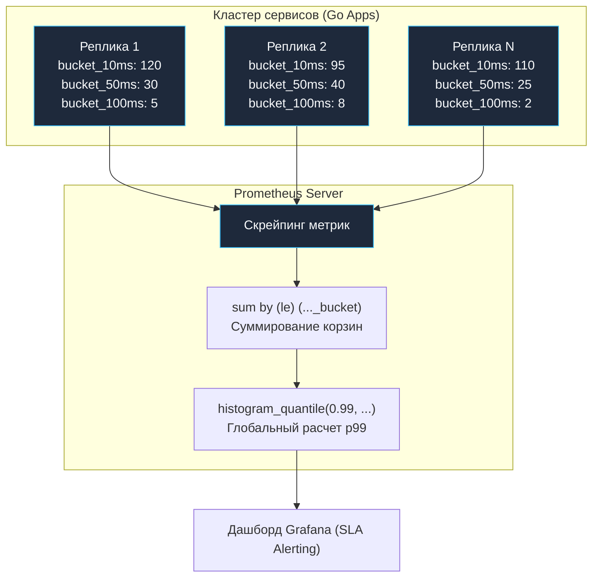

## Анатомия задержек: Почему среднее значение вам врет

В предшествующих статьях о нагрузочном тестировании ([[4. Load testing]], [[6. Тестирование latency]]) мы неоднократно подчеркивали: упование на среднее арифметическое время ответа (Average Latency) — это прямая дорога к архитектурной катастрофе в продакшене. Пришло время детально разобрать математическую теорию задержек и исследовать метрики, на фундаменте которых строятся промышленные соглашения об уровне обслуживания (SLA) высоконагруженных систем.

Рассмотрим наглядную жизненную модель. Представьте, что вы управляете кофейней. За утренний час к вам пришли 100 посетителей. 99 из них получили свой эспрессо ровно за 1 минуту. А у сотого клиента сломалась кофемолка, и он в ярости ждал свой напиток целых 100 минут.

Каково **среднее** время обслуживания клиентов?

$$\frac{99 \times 1 + 100}{100} = 1.99\text{ минуты}$$

Взглянув на сводный отчет со значением *«Среднее время: менее 2 минут»*, наивный владелец самодовольно заключит: *«Наш сервис работает молниеносно!»*. 

Однако тот самый сотый посетитель больше никогда не переступит порог заведения и оставит разгромный отзыв. В масштабах современного цифрового сервиса этот сотый клиент — это **1% всего вашего трафика**. При нагрузке в 10 000 RPS вы теряете и озлобляете **100 реальных пользователей каждую секунду**, пока красивый инженерный дашборд усыпляет бдительность руководства безупречными «средними» цифрами.

Чтобы видеть истинную картину пользовательского опыта, инженеры оперируют **Перцентилями (Percentiles)**.

---

## Что такое p50, p95 и p99?

Перцентиль ранга $P$ — это такое пороговое значение метрики, ниже которого укладывается ровно $P$ процентов всех произведенных наблюдений.

Математически расчет перцентиля тривиален: необходимо взять весь массив замеров времени за исследуемый интервал, **отсортировать значения по возрастанию** и взять элемент под соответствующим порядковым индексом.

* **p50 (Медиана):** Значение, делящее отсортированный ряд ровно пополам. Ровно половина запросов обслужилась быстрее этого времени, а вторая половина — медленнее. Это истинный портрет задержки «типичного» пользователя.
* **p95:** 95% всех запросов уложились в это время.
* **p99 (Tail Latency):** 99% запросов завершились быстрее указанного порога. Эта метрика отражает задержку «хвоста» распределения — тех самых запросов, которым не повезло попасть на Stop-The-World паузу Garbage Collector'а, блокировку мьютекса или задержку сетевого пакета.
* **p99.9 («Три девятки»):** Экстремальная метрика для критических платформ (финтех, биржевые торговые шлюзы, платежные процессоры).

---

### Tail Latency Amplification (Усиление хвостовых задержек)

Почему контроль $p99$ возведен в культ в компаниях уровня Google, Netflix и Amazon? Причина кроется в законах теории вероятностей применительно к распределенным микросервисам — эффекте **Tail Latency Amplification**.

Представьте современную веб-страницу или мобильное приложение: чтобы отрендерить главный экран, агрегатор (BFF) выполняет параллельные сетевые вызовы к 10 независимым микросервисам. Предположим, каждый из этих сервисов спроектирован безупречно: его задержка $p99 = 1\text{ секунда}$ (то есть лишь 1% запросов испытывает секундное замедление).

Какова вероятность того, что конечный пользователь на своем экране столкнется с раздражающей секундной задержкой?

Для этого вычислим вероятность противоположного события — что *хотя бы один* из десяти микросервисов угодит в свой неудачный однопроцентный хвост:

$$P(\text{slow}) = 1 - (1 - 0.01)^{10} = 1 - (0.99)^{10} \approx 0.0956 \quad (\mathbf{9.56\%})$$

Почти **каждый десятый запрос пользователя** будет мучительно тормозить! 

А если сложная страница обращается к 50 микросервисам:

$$P(\text{slow}) = 1 - (0.99)^{50} \approx 0.395 \quad (\mathbf{39.5\%})$$

Почти **40% пользователей** столкнутся с деградацией интерфейса! Именно поэтому битва за миллисекунды в $p99$ и $p99.9$ — это вопрос прямого выживания цифрового бизнеса.

---

## Как считать перцентили в Go?

---

### 1. Наивный подход (Сортировка в памяти)

Если вы пишете локальный нагрузочный сценарий или интеграционный тест с ограниченным объемом выборок, перцентили вычисляются канонической сортировкой массива:

```go
package metrics_test

import (
	"fmt"
	"slices"
	"time"
)

func ExampleCalculatePercentiles() {
	// Срез замеров времени обработки запросов
	latencies := []time.Duration{
		10 * time.Millisecond, 12 * time.Millisecond, 11 * time.Millisecond,
		// ... массив из 96 штатных замеров ...
		800 * time.Millisecond, // Спорадический всплеск из-за паузы GC
	}

	// 1. Обязательная сортировка среза по возрастанию
	slices.Sort(latencies)

	// 2. Прецизионное вычисление порядковых индексов
	total := len(latencies)
	p50 := latencies[int(float64(total)*0.50)]
	p95 := latencies[int(float64(total)*0.95)]
	p99 := latencies[int(float64(total)*0.99)]

	fmt.Printf("p50: %v, p95: %v, p99: %v\n", p50, p95, p99)
}
```

---

### 2. Проблема Production (Streaming Percentiles)

Наивный алгоритм элегантен в тестах на 10 000 элементов. Но как рассчитывать перцентили в реальном продакшене под нагрузкой в 25 000 RPS? 

Вы физически не можете сохранять каждый объект `time.Duration` в динамический массив и ежесекундно сортировать миллионы чисел. Аллокатор Go мгновенно исчерпает оперативную память (OOM), а сортировка $O(N \log N)$ заблокирует процессорные ядра.

Для расчета перцентилей в режиме реального времени на бесконечных потоках данных (Streaming) применяются алгоритмы приближенной аппроксимации:
1. **HDR Histogram (High Dynamic Range):** Разработанная Гилом Тене структура данных, упаковывающая замеры задержек в логарифмически масштабируемые корзины (Buckets). Потребляет строго фиксированный, предсказуемый объем RAM при сохранении наносекундной точности.
2. **T-Digest:** Вероятностный алгоритм динамической кластеризации числовых рядов Теда Даннинга, обеспечивающий исключительную точность аппроксимации на экстремальных квантилях ($p99.9$).

---

## Метрики в реальном мире: Prometheus

Общепризнанным индустриальным стандартом сбора телеметрии в экосистеме Go является Prometheus. На собеседованиях уровня Senior / Lead инженеру неизменно задают фундаментальный вопрос об архитектуре метрик задержки.

> [!tip] Собеседование
> **Вопрос:** В библиотеке Prometheus представлены два типа метрик для измерения задержек: `Summary` и `Histogram`. Какой примитив вы выберете для мониторинга времени отклика на кластере из 20 реплик микросервиса и почему?
> **Ответ:** Единственно верный архитектурный выбор для кластера — **`Histogram`**.
> 
> Тип `Summary` вычисляет скользящие перцентили локально прямо внутри процесса Go с помощью стриминговых алгоритмов. Фатальная проблема заключается в том, что **перцентили категорически нельзя подвергать математическому усреднению!** Если у вас работают 20 независимых реплик пода, и каждая отдала свое локальное значение $p99$, вы не имеете права сложить эти 20 чисел и разделить на 20 — полученное среднее арифметическое не имеет никакого математического смысла и замаскирует перегрузку отдельных нод.
> 
> Тип `Histogram` действует принципиально иначе: он не считает перцентили на стороне клиента, а просто инкрементирует счетчики попадания задержки в заранее очерченные корзины (Buckets): например, `bucket_10ms`, `bucket_50ms`, `bucket_100ms`. 
> 
> Сервер Prometheus скрейпит сырые корзины со всех 20 реплик, выполняет сложение счетчиков идентичных корзин по всему кластеру и вычисляет единый математически корректный перцентиль $p99$ с помощью встроенной функции `histogram_quantile()`.

Архитектура агрегации корзин гистограммы представлена на схеме:



---

### Идиоматичный код для Prometheus Histogram

```go
package monitoring

import (
	"net/http"
	"time"

	"github.com/prometheus/client_golang/prometheus"
	"github.com/prometheus/client_golang/prometheus/promauto"
)

// Инициализируем векторную гистограмму на уровне пакета
var requestLatency = promauto.NewHistogramVec(
	prometheus.HistogramOpts{
		Name: "http_request_duration_seconds",
		Help: "Задержка обработки входящих HTTP запросов в секундах",
		// КРИТИЧЕСКИ ВАЖНО: Тщательно настроить границы корзин под требования вашего SLA!
		Buckets: []float64{0.005, 0.01, 0.025, 0.05, 0.1, 0.25, 0.5, 1.0, 2.5, 5.0}, 
	},
	[]string{"endpoint", "method", "status"},
)

// Middleware для прозрачного сбора метрик задержки
func MetricsMiddleware(next http.Handler) http.Handler {
	return http.HandlerFunc(func(w http.ResponseWriter, r *http.Request) {
		start := time.Now()
		
		// Передаем управление дальше по цепочке хэндлеров
		next.ServeHTTP(w, r)
		
		// Фиксируем затраченное время в секундах
		duration := time.Since(start).Seconds()
		requestLatency.WithLabelValues(r.URL.Path, r.Method, "200").Observe(duration)
	})
}
```

В интерфейсе Grafana для расчета общекластерного значения $p99$ формируется запрос PromQL:

```promql
histogram_quantile(0.99, sum(rate(http_request_duration_seconds_bucket[5m])) by (le, endpoint))
```

---

## Итог

Метрики задержки — это зеркало реального пользовательского опыта в распределенных системах:
1. **Забудьте об Average Latency:** Среднее арифметическое скрывает катастрофы. Оптимизируйте медиану $p50$ для общей массы пользователей и бескомпромиссно снижайте хвостовой перцентиль $p99$.
2. **Tail Latency Amplification:** Помните, что в микросервисной топологии с веерными вызовами даже скромный 1% медленных запросов на периферии превращается в 10–40% задержек для клиентских приложений.
3. **Алгоритмы потоковой обработки:** Для потокового мониторинга в продакшене используйте логарифмические гистограммы (HDR Histogram, T-Digest).
4. **Стандарт Prometheus:** Всегда используйте тип `Histogram` вместо `Summary` для кластерных сервисов, вычисляя перцентили централизованно через `histogram_quantile()`.

Мы полностью завершили раздел, посвященный производительности, бенчмаркингу и анализу задержек в Go. Теперь у нас есть полный арсенал инструментов для создания быстрых и надежных сервисов. 

Как организовать этот колоссальный массив тестов в единую гармоничную пирамиду тестирования реального продакшен-репозитория и автоматизировать их запуск в конвейерах CI/CD?

Этим завершающим практическим вопросам посвящен финальный подраздел Модуля 15: [[1. Test Pyramid в Go]].