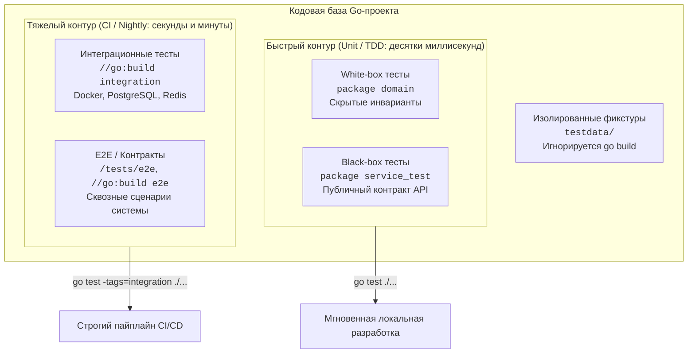

## Архитектура порядка: Как не утонуть в собственных тестах

Программы начинаются скромно: пара десятков функций, один пакет, уютный файл `main_test.go`. Но по мере взросления кодовой базы энтропия берёт своё. Проект разрастается до сотен тысяч строк, обрастает моками, интеграционными сценариями, сетевыми запросами к базам данных и бенчмарками. В какой-то момент наивная команда `go test ./...` превращается в пятиминутную медитацию: процессор раскручивает кулеры, в фоне стартуют контейнеры Docker, а рядовой юнит-тест парсера дат падает из-за сетевого таймаута к не поднявшейся Postgres.

Разработчики перестают запускать тесты локально перед коммитом («всё равно CI проверит»), пайплайн становится «красным» и ненадежным, а тестовые утилиты и фикстуры копируются методом copy-paste в пяти разных директориях.

Организация тестовой базы — это не вопрос эстетики, а вопрос инженерной гигиены и масштабируемости команды. В этой главе мы разберём канонический подход к структурированию тестов в языке Go: изоляцию пакетов, разделение быстрых и медленных тестов с помощью компилятора, секреты специальной папки `testdata` и анатомию правильных хелперов.



---

## 1. Пакетная принадлежность: Black-box vs White-box

В отличие от многих других языков, где тесты принято прятать в зеркальное параллельное дерево каталогов вроде `src/test/java`, в Go тестовые файлы `*_test.go` живут **в той же директории, бок о бок с боевым кодом** (например, рядом с `handler.go` лежит `handler_test.go`). Но компилятор Go даёт вам выбор: объявить внутри `handler_test.go` то же самое имя пакета или добавить к нему суффикс `_test`.

### White-box тестирование (package mypkg)

Если файл теста объявляет `package domain` (то же имя, что и у продакшен-кода в этой папке), компилятор компилирует боевые и тестовые файлы в единый общий пакет. Тест получает полный доступ ко всем неэкспортируемым (приватным) переменным, структурам, полям и функциям с маленькой буквы.

```go
// Файл: user.go
package domain

import "time"

// calculateAge — приватная функция, скрытая от внешних потребителей пакета
func calculateAge(birthDate time.Time) int {
	now := time.Now()
	years := now.Year() - birthDate.Year()
	if now.YearDay() < birthDate.YearDay() {
		years--
	}
	return years
}

// Файл: user_test.go
package domain

import (
	"testing"
	"time"
)

func TestCalculateAge(t *testing.T) {
	// Тест находится внутри пакета domain и имеет прямой доступ к calculateAge
	dob := time.Date(2000, time.January, 1, 0, 0, 0, 0, time.UTC)
	age := calculateAge(dob)
	if age < 20 {
		t.Fatalf("некорректный возраст: получено %d", age)
	}
}
```

**Когда использовать:**
- Для низкоуровневых алгоритмических ядер, конечных автоматов, хэш-таблиц и сложных структур данных, где нужно проверить скрытые внутренние инварианты, не раздувая публичный интерфейс пакета.

---

### Black-box тестирование (package mypkg_test)

Если добавить к имени пакета суффикс `_test` (например, `package api_test`), компилятор создаёт отдельный виртуальный пакет. Тест больше не видит внутренности модуля: он вынужден явно импортировать тестируемый пакет (`yourproject/internal/api`) и может вызывать **только экспортируемые (публичные) идентификаторы**.

```go
// Файл: api_test.go
package api_test // <-- Виртуальный внешний пакет!

import (
	"testing"

	"yourproject/internal/api" // Приходится импортировать тестируемый пакет как внешнюю библиотеку
)

func TestUserAPI(t *testing.T) {
	// Доступ открыт только к публичному контракту:
	handler := api.NewHandler()
	var resp api.UserResponse

	_ = handler
	_ = resp
}
```

**Когда использовать:**
- Это **золотой стандарт** индустрии для тестирования сервисных слоёв, HTTP-хэндлеров, контроллеров и репозиториев.
- Black-box тесты защищают вас от главной беды рефакторинга — «хрупких тестов» (Fragile Tests). Вы проверяете поведение и контракт («что делает система»), а не реализацию («как названа вспомогательная приватная переменная»). Если вы полностью перепишете внутренности метода, не меняя его сигнатуру и поведение, black-box тест продолжит работать.

> [!tip] Собеседование
> **Вопрос:** Если тесты лежат в `mypkg_test`, как протестировать приватный метод или замокать приватную переменную пакета `mypkg`?
> **Ответ:** По умолчанию вы вообще не должны этого делать в Black-box тесте. Если приватная логика настолько сложна, что требует отдельного мокирования, это архитектурный симптом нарушения Single Responsibility Principle (SRP). Эту логику следует вынести в отдельный независимый компонент.
> 
> Однако, если вам критически необходимо протестировать скрытую внутренность из black-box пакета или подменить глобальный генератор времени, в стандартной библиотеке Go (например, в `net/http`) применяется идиома **`export_test.go`**:
> 1. В папке пакета создаётся файл `export_test.go` с `package mypkg`.
> 2. В нём создаются экспортируемые алиасы: `var ExportCalculateAge = calculateAge`.
> 3. Этот файл компилируется компилятором `go test`, но полностью игнорируется при обычной сборке `go build`! Black-box тест `package mypkg_test` может обращаться к `mypkg.ExportCalculateAge`.

---

## 2. Изоляция интеграционных тестов

Главная причина деградации скорости обратной связи в разработке — медленные тесты, требующие сетевого взаимодействия, поднятия СУБД в Docker или обращения к внешним веб-сервисам. Если разработчик ждет результат `go test` дольше 10–15 секунд, он теряет состояние потока.

Существует три способа изолировать медленные тесты.

### Способ A: Флаг t.Short()

В стандартном пакете `testing` предусмотрен встроенный механизм короткого прогона:

```bash
go test -short ./...
```

В коде теста ставится проверка флага `testing.Short()`:

```go
func TestUserRepository_Integration(t *testing.T) {
	if testing.Short() {
		t.Skip("Пропуск интеграционного теста в коротком режиме")
	}

	// Поднимаем базу данных, делаем реальные SQL-запросы...
}
```

- **Плюсы:** Работает «из коробки» без дополнительных настроек.
- **Минусы:** Двоичный выбор (только быстрый/долгий). Если у вас есть градация тестов (Unit, Integration, E2E, Smoke, Flaky, Performance), флага `-short` становится недостаточно.

---

### Способ B: Переменные окружения (Environment Variables)

Тесты можно фильтровать по переменным окружения операционной системы:

```go
func TestPaymentGateway(t *testing.T) {
	if os.Getenv("RUN_E2E") == "" {
		t.Skip("Установите RUN_E2E=1 для запуска E2E тестов")
	}
}
```

- **Плюсы:** Легко конфигурировать в CI/CD матрицах.
- **Минусы:** Тестовые бинарники всё равно компилируются, тратя ресурсы CPU, даже если все содержащиеся в них тесты будут пропущены через `t.Skip`.

---

### Способ C: Теги сборки (Build Tags) — Стандарт индустрии

Самый чистый и производительный подход: **исключить тяжелые тесты из процесса компиляции** при обычном локальном запуске с помощью директивы `//go:build`.

В самом начале файла теста (до строки `package`) объявляется условие сборки:

```go
//go:build integration

package repository_test

import "testing"

func TestDatabaseConn(t *testing.T) {
	// Тест скомпилируется и запустится ТОЛЬКО если сборщику явно передан тег integration
}
```

> [!NOTE] Синтаксис go:build
> Начиная с Go 1.17, устаревший синтаксис `// +build integration` заменён на булевы выражения `//go:build integration`. Директива обязательно должна отделяться от последующего `package` пустой строкой.

**Как запускаются такие тесты:**
- **Обычный запуск (Unit):** `go test ./...`  
  Компилятор видит тег `//go:build integration`, понимает, что условие не выполнено, и даже не тратит такты на компиляцию этих файлов. Прогон выполняется за миллисекунды.
- **Интеграционный запуск:** `go test -tags=integration ./...`  
  Компилятор включает помеченные файлы в процесс сборки и выполняет тесты.
- **Комбинации тегов:** можно объединять теги логическими операторами, например `//go:build integration && !smoke`.

---

## 3. Директория testdata: Магия компилятора

Для полноценного тестирования требуются фикстуры: дампы JSON, бинарные протоколы, SQL-миграции, дампы полезной нагрузки, тестовые SSL-сертификаты или эталонные «золотые файлы» (Golden Files).

В Go для этого предусмотрена зарезервированная директория — `testdata`.

> [!info] Под капотом
> Директория с именем `testdata` имеет особый статус в рантайме инструментария Go. Компилятор (`go build`), упаковщик модулей (`go mod vendor`), сборщик (`go run`) и утилиты `go vet` / `go get` **полностью игнорируют** всё содержимое каталогов `testdata`. Вы можете положить туда сломанный `.go` файл с синтаксическими ошибками, гигабайтный бинарный дамп или файл с недопустимыми символами — они никогда не попадут в скомпилированный бинарник вашего сервиса.

```text
internal/
  parser/
    parser.go
    parser_test.go
    testdata/
      valid_payload.json
      malformed.json
      expected_output.golden
```

При выполнении команды `go test` утилита сборки автоматически устанавливает текущую рабочую директорию (CWD — Current Working Directory) в ту папку, где расположен выполняемый файл теста. Поэтому обращение к `testdata` всегда идёт через лаконичный относительный путь:

```go
func TestParseJSON(t *testing.T) {
	// Путь гарантированно резолвится относительно директории internal/parser/
	data, err := os.ReadFile("testdata/valid_payload.json")
	require.NoError(t, err)

	// Передаем data в тестируемый парсер...
	_ = data
}
```

---

## 4. Глобальная структура папок в проекте

Где именно должны физически лежать различные категории проверок в зрелом Go-репозитории?

1. **Unit и компонентные тесты:** Всегда располагаются рядом с кодом в директориях `/internal/...` и `/pkg/...`. Применяют Black-box подход (`package mypkg_test`).
2. **Интеграционные тесты слоёв (Repository, External Clients):** Располагаются рядом с кодом (например, `internal/repository/user_pg_test.go` или `pg_test.go`), но изолируются тегом `//go:build integration`.
3. **End-to-End (E2E) и контрактные тесты:** Так как эти тесты проверяют систему целиком (импортируют множество пакетов, поднимают `httptest.Server` на уровне `main` или запускают сценарии в Docker), их выносят в отдельный каталог в корне проекта `/tests`.

Типичный канонический layout enterprise-сервиса:

```text
my-backend/
├── cmd/
│   └── api/
│       └── main.go
├── internal/
│   ├── handlers/
│   │   ├── auth.go
│   │   ├── auth_test.go        # Unit (Black-box: package handlers_test)
│   │   └── testdata/           # Фикстуры HTTP-запросов
│   ├── repository/
│   │   ├── pg.go
│   │   └── pg_test.go          # Integration (go:build integration)
│   └── testutil/               # Общие тестовые фабрики и хелперы
│       └── db.go
├── pkg/                        # Публичные переиспользуемые библиотеки
├── tests/                      # Внешний сквозной контур
│   ├── e2e/
│   │   └── checkout_test.go    # Поднимает приложение целиком (go:build e2e)
│   └── contract/               # Проверка контрактов Pact/OpenAPI (go:build contract)
└── testdata/                   # Глобальные тестовые данные (сертификаты TLS, дампы)
```

---

## 5. Тестовые утилиты и t.Helper()

По мере разрастания тестов возникает потребность в общих вспомогательных функциях: генераторах тестовых сущностей, фабриках данных, генераторах JWT-токенов или инициализаторах баз данных. Их выносят либо в локальные функции, либо в пакет `internal/testutil`.

Однако при написании вспомогательных функций возникает классическая ловушка.

> [!warning] Ловушка / Gotcha: Стек-трейс хелперов
> Если ваша вспомогательная функция проверяет ошибку через `require.NoError(t, err)`, и проверка проваливается, фреймворк `testing` по умолчанию напечатает в консоли номер строки **внутри самой функции-хелпера**.
> Если этот хелпер вызывается в пятидесяти разных тестах, отчёт о падении сообщит лишь: `db.go:42: error not nil`. Какой конкретно тест из пятидесяти упал и в каком месте — останется загадкой до тех пор, пока вы не начнёте мучительно разматывать логи.

Для решения этой проблемы существует метод `t.Helper()`.

### Механика работы t.Helper()

Вызов `t.Helper()` помечает текущую функцию во внутреннем реестре рантайма `testing`. Когда тест вызывает `t.Errorf`, `t.Fatalf` или падает в ассерте `testify/require`, стек вызовов инспектируется через `runtime.Caller()`. Все фреймы, помеченные как хелперы, автоматически исключаются из отчёта об ошибке. Отчёт указывает прямо на строку в вызывающем тесте!

```go
package testutil

import (
	"testing"

	"github.com/stretchr/testify/require"
	"yourproject/internal/domain"
)

// GenerateTestUser создаёт валидного пользователя для тестового окружения
func GenerateTestUser(t *testing.T, email string) domain.User {
	t.Helper() // КРИТИЧЕСКИ ВАЖНО: исключает эту функцию из отчёта об ошибке

	u, err := domain.NewUser(email)

	// Если NewUser вернёт ошибку, лог тестирования укажет не на строку 200,
	// а на точную строку в файле TestXXX_yyy.go, откуда вызвали GenerateTestUser!
	require.NoError(t, err)

	return u
}
```

---

## Итог

1. **Разделяйте доступ:** Используйте **Black-box тестирование** (`package mypkg_test`) как стиль по умолчанию для всех слоёв системы. White-box (`package mypkg`) оставляйте для инспекции сложной внутренней алгоритмики.
2. **Используйте `export_test.go`:** Если для black-box теста необходим доступ к скрытым константам или замене генератора времени, используйте стандартный паттерн экспорта времени тестирования.
3. **Изолируйте тяжелые тесты через `//go:build integration`:** Обычный `go test ./...` должен выполняться мгновенно. Тяжелые базы и сети должны запускаться явно через флаг `-tags`.
4. **Храните фикстуры в `testdata`:** Компилятор и линтер гарантированно не включат файлы из каталогов `testdata` в production-бинарники сервиса.
5. **Всегда вызывайте `t.Helper()`:** Любая вспомогательная функция, принимающая `*testing.T` или `testing.TB`, обязана первой строчкой звать `t.Helper()` для чистоты логов при авариях.
