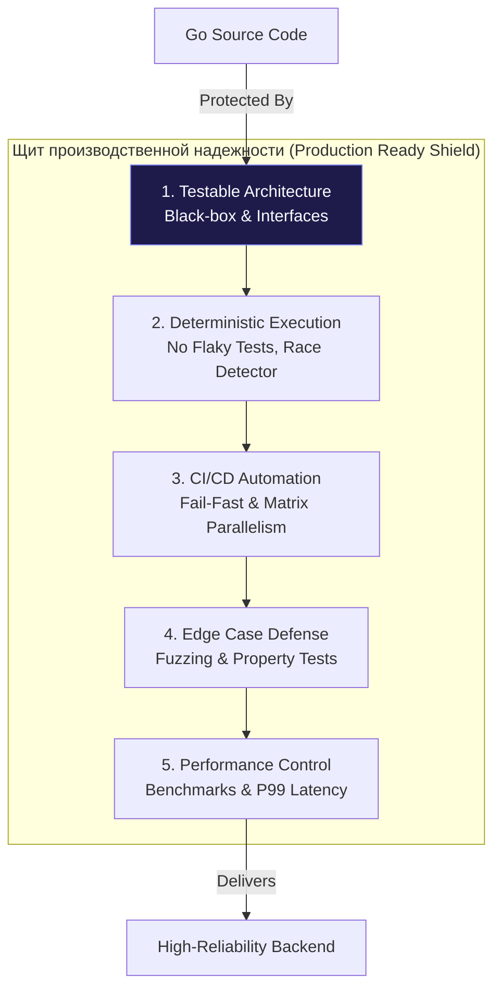

## Итоги раздела: Философия Production-Ready Тестирования

Мы завершили масштабное инженерное путешествие. Модуль **«Тестирование в Go (QA & Testing)»** начался со скромного вызова `t.Error()` в простом юнит-тесте и провёл нас через все слои обеспечения качества: генерацию моков, изоляцию баз данных в Testcontainers, исследование теневой памяти ThreadSanitizer, мутационный фаззинг, препарирование профилей в `pprof`, калибровку хвостовой задержки p99 и построение параллельных CI-матриц.

Написание тестов — это не повинность, не налог на разработку и не формальная бюрократия ради галочки в отчёте. В суровом мире серверного бэкенда, где сервисы непрерывно обрабатывают миллионы транзакций, финансовые потоки и персональные данные, **тесты — это единственный надёжный экзоскелет инженера**. Именно они дают право рефакторить монолиты, обновлять зависимости, кардинально менять структуры данных и со спокойной душой отправлять Pull Request'ы в production в пятницу вечером.

> *«Простота — это не цель сама по себе. Простота — это результат глубокого понимания задачи и безжалостного устранения случайной сложности.»*  
> — Брайан В. Керниган

Но далеко не всякий тест приносит пользу. Небрежные, хрупкие и избыточные тесты способны парализовать разработку сильнее, чем полное их отсутствие. В этой заключительной главе мы сведем воедино пройденный опыт и сформулируем стандарт **Production-Ready Тестирования** — инженерную философию, отличающую зрелые системы от любительских поделок.

---

## 5 Столпов Production-Ready Тестирования

Если проект формально покрыт тестами на 100%, но билд в CI мерцает через раз, а пользователи в production регулярно натыкаются на критические баги, такой подход не имеет ничего общего с надежностью. Истинное качество опирается на пять фундаментальных инженерных столпов.

```mermaid
flowchart LR
    classDef process  fill:#1e293b,stroke:#38bdf8,stroke-width:1px,color:#f8fafc
    classDef success  fill:#064e3b,stroke:#34d399,stroke-width:1px,color:#f8fafc
    classDef error    fill:#7f1d1d,stroke:#f87171,stroke-width:1px,color:#f8fafc
    classDef warning  fill:#78350f,stroke:#fbbf24,stroke-width:1px,color:#f8fafc
    classDef entry    fill:#1e3a5f,stroke:#38bdf8,stroke-width:2px,color:#f8fafc
    classDef aux      fill:#334155,stroke:#64748b,stroke-width:1px,color:#f8fafc
    classDef system   fill:#312e81,stroke:#a78bfa,stroke-width:1px,color:#f8fafc
    classDef data     fill:#132d29,stroke:#2dd4bf,stroke-width:1px,color:#f8fafc
    classDef network  fill:#881337,stroke:#fb7185,stroke-width:1px,color:#f8fafc
    classDef accent   fill:#1e1b4b,stroke:#818cf8,stroke-width:1px,color:#f8fafc
    P1["1. Архитектура<br/>Loose Coupling, Black-box"] --- P2["2. Детерминизм<br/>-race, без time.Sleep"]
    P2 --- P3["3. Инварианты<br/>Fuzzing, Property-Based"]
    P3 --- P4["4. Производительность<br/>p95/p99, allocs/op, pprof"]
    P4 --- P5["5. Прагматичный CI<br/>Fail-Fast, Coverage Gates"]
```

### 1. Архитектура и Изоляция (Дизайн для тестов)

Тестируемость кода закладывается на этапе проектирования интерфейсов, а не после написания реализации:
- **Black-box подход:** Использование внешних тестовых пакетов с суффиксом `_test` для проверки публичных контрактов API, а не внутренних деталей реализации. Рефакторинг приватных функций не должен ломать спецификацию.
- **Table-Driven Tests:** Матричный подход к описанию сценариев, где добавление новой проверки сводится к добавлению одной строки в слайс структур, исключая копирование шаблонного кода.
- **Слабая связность (Loose Coupling):** Опора на узкие интерфейсы потребителя и генерация моков (`gomock`), позволяющая изолированно верифицировать доменные сервисы без поднятия реальных инстансов PostgreSQL или брокеров Kafka.

### 2. Контроль Хаоса (Конкурентность и Детерминизм)

Язык Go создавался для высококонкурентных систем, и недетерминизм — главный враг стабильности:
- **Race Detector:** Флаг `-race` включен по умолчанию во всех тестовых шагах CI. Любое предупреждение детектора гонок приравнивается к критическому инциденту.
- **Борьба с Flaky-тестами:** Полный запрет на использование хрупкого `time.Sleep` в пользу детерминированной синхронизации через каналы, `sync.WaitGroup`, контексты или утилиты активного ожидания вроде `testify/require.Eventually`.
- **Изоляция параллелизма:** Тесты, помеченные `t.Parallel()`, не разделяют глобальное изменяемое состояние, не конфликтуют за порты и оперируют уникальными схемами баз данных.

### 3. Инварианты вместо Примеров (Fuzzing)

Тестирование примерами проверяет лишь то, о чем догадался подумать разработчик. Тестирование инвариантов исследует бесконечное пространство состояний:
- **Property-Based Testing:** Проверка не конкретных частных примеров (`2+2=4`), а фундаментальных математических законов системы (симметрия операций, обратимость Round-Trip сериализации, идемпотентность повторных вызовов).
- **Go Fuzzing:** Использование встроенного движка `testing.F` для непрерывной мутации входных байтов, целенаправленно ищущего переполнения буферов, OOM-бомбы, зависания и фатальные паники `panic: slice bounds out of range` в парсерах протоколов.

### 4. Метрики реального мира (Производительность)

Быстрый код с неверным результатом бесполезен. Корректный код с неприемлемой задержкой мёртв для бизнеса:
- **Микро-оптимизации:** Регулярный запуск `go test -bench` с анализом показателя `allocs/op` для минимизации нагрузки на Garbage Collector на критических путях обработки данных.
- **Инструментальная глубина:** Препарирование профилей `go tool pprof` (CPU и Memory) и трассировок `go tool trace` для устранения конкуренции за мьютексы и блокировок в рантайме.
- **Метрики задержки:** Фокус на хвостовых квантилях **p95/p99 (Tail Latency)** вместо обманчивого среднего времени ответа, а также использование Open-Loop нагрузочных генераторов (`Vegeta`, `k6`) для честной оценки пропускной способности.

### 5. Прагматичный CI/CD (Культура качества)

Тесты обязаны экономить время команды, а не превращаться в утомительную рутину:
- **Fail-Fast пайплайн:** Статический анализ $\rightarrow$ Юнит-тесты $\rightarrow$ Интеграция $\rightarrow$ Сборка артефактов. Пайплайн падает на самом дешёвом этапе за секунды.
- **Сдвиг влево (Shift-Left):** Максимальное приближение проверок к рабочему месту инженера (линтеры в pre-commit, быстрые юнит-тесты в локальном цикле TDD).
- **Минимальный Достаточный Coverage (MSC):** Прагматичный порог 70–80% покрытия с защитой от деградации (Coverage Delta) и Risk-Based приоритизацией критического ядра системы.

---

## Чек-лист: Готов ли ваш проект к Production?

Используйте этот инженерный чек-лист перед каждым ответственным релизом:

- [ ] **Организация:** Файлы тестов лежат рядом с кодом. Имена пакетов, файлов и функций строго следуют `Naming Conventions`.
- [ ] **Скорость CI:** Быстрый контур юнит-тестов с детектором гонок отрабатывает быстрее 2–3 минут.
- [ ] **Изоляция инфраструктуры:** Интеграционные тесты с базами данных изолированы тегом компилятора `//go:build integration` и не тормозят локальную разработку.
- [ ] **Детерминизм:** В коде тестов полностью искоренены вызовы `time.Sleep`. Конкурентные тесты с `t.Parallel()` изолированы. Flaky-тесты немедленно изолируются и устраняются.
- [ ] **Безопасность API:** Все публичные парсеры форматов и обработчики внешних данных защищены Fuzz-тестами.
- [ ] **Мониторинг падений:** Вместо `fmt.Println` используется потокобезопасный `t.Logf`. При сбоях сетевых тестов в отчёт сбрасывается подробный дамп HTTP-запроса (`httputil.DumpRequest`).
- [ ] **Контроль деградации:** Пайплайн CI оснащён Coverage Gate, блокирующим слияние pull request при снижении общего уровня покрытия.

---

## Эпилог: Код — это ответственность

В классической книге «Чистый код» сформулирована фундаментальная истина: *«Код без тестов — это legacy-код в момент его написания»*.

Разработка на Go — это прежде всего системная инженерия. На Go создаются сетевые протоколы, распределённые хранилища, планировщики контейнеров и финансовые процессинги. В этих областях цена незамеченного дефекта измеряется миллионными убытками и потерянной репутацией.

Теперь вы владеете целостным, законченным арсеналом обеспечения качества. Вы умеете заставлять компилятор проверять гипотезы за вас, препарировать аллокации памяти в ассемблере и доказывать бизнесу математическую надёжность созданной архитектуры.

Применяйте эти знания осознанно и прагматично. Не превращайте тестирование в слепой карго-культ, но и никогда не оставляйте свои системы без надежной защиты!