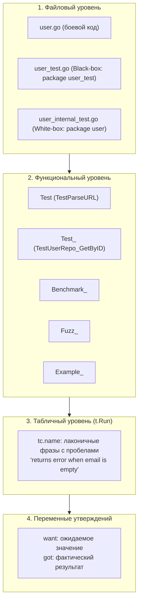

## Анатомия имен: Как называть тесты, чтобы вас понимали

В предыдущей статье [[1. Организация тестов в проекте]] мы заложили фундамент архитектуры: определили границы пакетов, освоили теги компилятора `//go:build` и выделили каталоги `testdata`. Мы научились раскладывать компоненты по правильным ячейкам.

Но когда разработчик открывает файл `*_test.go`, он сталкивается с вопросом языка общения: как назвать тестовую функцию, локальную переменную или вложенный сабтест, чтобы коллега (или вы сами спустя полгода) мгновенно считал суть проверяемого сценария без необходимости построчно дебажить исходник?

В языке Go нет громоздких поведенческих фреймворков вроде RSpec (Ruby) или BDD-конструкций с многословными цепочками `describe` и `it`. Вся выразительность и строгость инструментария Go опираются на **канонические соглашения об именовании (Naming Conventions)**. Следование этим соглашениям — верный признак зрелого Go-инженера, понимающего внутреннее устройство рантайма и утилиты `go test`.



---

## 1. Именование файлов: Зеркальное отражение

Базовое правило, заложенное в рантайм `go build` и `go test`: любые тестовые файлы обязаны иметь суффикс `_test.go`. Но в инженерной культуре принято строгое правило **зеркального отражения (Mirroring)**.

Если бизнес-логика сосредоточена в файле `user.go`, её тесты должны располагаться исключительно в `user_test.go`. Аналогично для `router.go` тесты живут в `router_test.go`. Не превращайте проект в свалку, ссыпая сотни тестов из разных доменов в гигантский монолитный `repository_test.go`. Зеркальная раскладка позволяет мгновенно сопоставить реализацию и её спецификацию.

> [!tip] Собеседование
> **Вопрос:** У нас есть файл `auth.go`. Мы написали для него Black-box тесты в `auth_test.go` (в пакете `auth_test`). Теперь нам нужно протестировать сложную приватную функцию хэширования из `auth.go` (White-box). Как назвать файл для этих тестов?
> **Ответ:** Идиоматичный подход — создать файл `auth_internal_test.go` (объявив в нём пакет `auth`). Суффикс `_internal_test` (или `_whitebox_test`) сразу даёт понять всей команде и ревьюерам, что этот файл намеренно тестирует закрытую реализацию и приватные инварианты, в то время как основной `auth_test.go` тестирует публичный контракт API.

---

## 2. Именование функций: Строгий контракт

Утилита `go test` не использует сложную внешнюю конфигурацию: она сканирует AST-дерево скомпилированных файлов и с помощью рефлексии ищет функции, строго соответствующие сигнатуре: `func TestXxx(*testing.T)`.

Здесь `Xxx` — любая непустая строка, начинающаяся с заглавной буквы (или символа юникода, не являющегося строчной буквой).

> [!warning] Ловушка / Gotcha: Регистр первой буквы
> Это классическая оплошность, способная отнять часы отладки: если назвать функцию `TestcalculateAge(t *testing.T)` (с маленькой буквы `c`), **раннер Go молча проигнорирует её**. 
> Правило парсера `go test`: символ, непосредственно следующий за префиксом `Test`, **не может быть строчной буквой**. Функция `Testcalculate` будет воспринята как обычная вспомогательная функция и никогда не запустится. Корректное имя: `TestCalculateAge`.

### Тестирование обычных функций

Если вы тестируете чистую функцию `ParseURL`, тестовая функция должна называться зеркально: `TestParseURL`. Если тестируется функция `Reverse`, пишем `TestReverse`.

### Тестирование методов структур (Method Convention)

В Go отсутствуют классы, но структуры наделяются методами через ресиверы. Если мы тестируем метод `Save` структуры `UserRepository` или метод `GetByID` структуры `UserRepo`, как отразить это в имени?

Общепринятый стандарт индустрии — использование символа подчёркивания `_` для разграничения типа и метода:

```go
// Тестируем метод GetByID у структуры UserRepo
func TestUserRepo_GetByID(t *testing.T) { ... }

// Тестируем метод Validate у структуры Order
func TestOrder_Validate(t *testing.T) { ... }
```

Такой формат невероятно удобен при запуске конкретных тестов из консоли:
`go test -run=^TestUserRepo_` запустит тесты всех методов структуры `UserRepo`.
Для запуска конкретного метода можно передать полный паттерн: `go test -v -run=^TestUserRepo_GetByID$ ./...`.

---

## 3. Именование Table-Driven сабтестов (t.Run)

В главе [[4. Table driven tests]] мы использовали `t.Run(tc.name, ...)` для запуска сабтестов. Именование этих сценариев — это то, где многие ломают копья.

В поле `tc.name` **не нужно** писать искусственные конструкции вроде `TestUserValidation_EmptyEmail`, `case1` или `err_not_found`. Используйте **человекочитаемые предложения на английском языке с пробелами**, описывающие ожидаемое поведение при конкретных входных условиях:

```go
// Плохо:
name: "TestUserValidation_EmptyEmail"
name: "err_not_found"
name: "case1"

// Идиоматично и безупречно:
name: "successful creation of premium user"
name: "returns error when email is empty"
name: "conflict when user already exists"
```

> [!info] Под капотом: Санитизация имен раннером
> Инструмент `go test` при выводе результатов сабтестов автоматически заменяет пробелы в `tc.name` на символы подчёркивания `_`. Если упадет сценарий `"returns error when email is empty"`, в выводе вы увидите:
> `FAIL: TestUserRepo_Create/returns_error_when_email_is_empty`
> Это позволяет скопировать полученный путь прямо в аргумент флага: `go test -run=TestUserRepo_Create/returns_error_when_email_is_empty`.

---

## 4. Переменные want и got: Священная корова Go

В экосистемах Java (JUnit), C# (NUnit) или JavaScript (Jest) исторически укоренились длинные абстрактные термины `expected` (ожидаемое) и `actual` (фактическое):

```java
// Java JUnit
assertEquals(expected, actual);
```

В культуре языка Go сложилась собственная лаконичная традиция, заложенная авторами стандартной библиотеки Кеном Томпсоном, Робом Пайком и Рассом Коксом. В Go повсеместно используются короткие, ясные англосаксонские слова:
- **`want`** — то, что мы хотим получить согласно спецификации;
- **`got`** — то, что фактически вернул тестируемый код.

```go
// НЕ ИДИОМАТИЧНО (с тяжелым акцентом Java/C#):
func TestCalculate(t *testing.T) {
	expected := 42
	actual := Calculate()
	require.Equal(t, expected, actual)
}

// ИДИОМАТИЧНО (чистый стиль Go):
func TestCalculate(t *testing.T) {
	want := 42
	got := Calculate()
	require.Equal(t, want, got)
}
```

Почему именно `want` и `got`?
1. **Компактность и выразительность:** 4 буквы против 8 и 6. Код тестов избавляется от визуального шума.
2. **Идеальное визуальное выравнивание:** моноширинный шрифт делает сопоставление очевидным:
   ```text
   want: 42
   got:  43
   ```
3. **Стандарт в таблицах:** в структуре `testCase` используйте `want` и `wantErr`:

```go
type testCase struct {
	name    string
	input   string
	want    int  // вместо expected
	wantErr bool // вместо expectsError
}
```

---

## 5. Именование Benchmarks, Fuzz и Examples

Правила именования для тестов производительности, фаззеров и живой документации следуют той же строгой логике префиксов.

- **Benchmarks:** `Benchmark<Type>_<Method>`.  
  Пример: `BenchmarkRouter_ServeHTTP(b *testing.B)`
- **Fuzzing:** `Fuzz<Type>_<Method>`.  
  Пример: `FuzzParseTLV(f *testing.F)`

### Особый случай: Примеры (Examples как документация)

В Go реализован элегантный механизм живых примеров: функции `ExampleXxx()`. Они одновременно служат автоматическими тестами, а утилита `go doc` и веб-портал `pkg.go.dev` автоматически связывают их с документацией вашей функции.

- `func ExampleParse()` — привязывается к публичной функции `Parse`.
- `func ExampleUser_Save()` — привязывается к методу `Save` структуры `User`.
- `func ExampleUser_Save_withTimeout()` — создаёт отдельную именованную вкладку примера (с суффиксом `withTimeout`).

```go
func ExampleReverse() {
	fmt.Println(Reverse("hello"))
	// Output: olleh
}
```

> [!NOTE] Как раннер проверяет примеры
> Если тело функции `ExampleXxx` содержит завершающий комментарий `// Output: ...`, раннер `go test` перехватывает вывод в `os.Stdout`, сравнивает его с текстом после комментария и при несовпадении роняет тест! Если комментария `// Output:` нет, функция просто компилируется для документации, но не проверяется на совпадение вывода.

---

## 6. Именование тестовых двойников (Mocks/Stubs)

При проектировании подставных объектов (Test Doubles) следуйте единым префиксам, отражающим их ответственность:

- **`Mock`** (например, `MockUserRepository`): умный объект, созданный вручную или через кодогенераторы `gomock` / `mockery`. Отслеживает факт вызова методов, число обращений и переданные аргументы, проверяя поведение вызывающей стороны.
- **`Stub`** (например, `StubUserRepository`): пассивная заглушка, возвращающая захардкоженные константные значения без инспекции входящих параметров.
- **`Fake`** (например, `FakeUserRepository` или `InMemoryUserRepository`): полностью функциональная, но упрощённая реализация контракта (например, хранилище в оперативной памяти на базе `sync.Map` вместо реальной СУБД).

---

## Итог

1. **Файлы:** строго отражают боевой код (`router_test.go` для `router.go`). Для приватных инвариантов используйте суффикс `_internal_test.go`.
2. **Функции:** `Test<FuncName>` и `Test<Type>_<Method>`. Помните о регистре: строчная буква после слова `Test` приведёт к тихому пропуску теста.
3. **Сабтесты:** пишите лаконичные, понятные английские предложения с пробелами. Раннер сам преобразует их в читаемые пути.
4. **Переменные:** навсегда откажитесь от `expected/actual` в пользу идиоматичных **`want` и `got`**.
5. **Документация:** используйте `ExampleXxx` с комментарием `// Output:` — это одновременно тест и интерактивный пример в документации.

Теперь, когда код тестов говорит на чистом и понятном языке Go, мы готовы автоматизировать процесс их запуска в распределённых пайплайнах сборки. В следующей статье мы переходим к автоматизации: [[3. Настройка CI (GitHub Actions, GitLab CI)]].