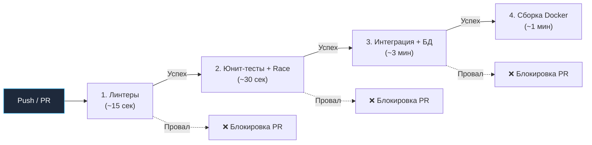

## Автоматизация доверия: Тестирование в CI/CD

В предыдущих статьях мы навели порядок в файловой структуре ([[1. Организация тестов в проекте]]) и закрепили канонические соглашения об именовании ([[2. Naming conventions]]). Но какими бы безупречными ни были ваши тесты, пока они запускаются только локально на рабочей машине инженера, они не дают гарантий стабильности системы. Фраза *«У меня на машине всё работает»* — старейший и опаснейший самообман в истории программирования.

Окружение разработчика неповторимо: специфичные версии локальных библиотек, забытые экспорты переменных окружения, разница между macOS Darwin и Linux, разная производительность ядер CPU. Continuous Integration (CI) — это беспристрастный и автоматизированный арбитр. Ему чужды человеческая усталость, спешка перед дедлайном и надежда на «авось». Он не забудет запустить линтер, скомпилировать бинарник под целевую архитектуру и прогнать сотни итераций под детектором гонок.

В этой статье мы спроектируем отказоустойчивый CI-пайплайн для Go-сервиса, разберём физику кэширования компилятора и реализуем готовые конфигурации для GitHub Actions и GitLab CI.

---

## Архитектура Pipeline: Паттерн Fail-Fast

Главная инженерная метрика эффективности CI — **время цикла обратной связи (Feedback Loop Time)**. Если пайплайн проверки pull request выполняется 40 минут, разработчик неизбежно переключает контекст: берёт другую задачу или уходит на обед. Если через 40 минут пайплайн падает из-за лишнего пробела или опечатки в линтере, инженер тратит драгоценное время на повторное погружение в контекст задачи.

Чтобы минимизировать задержку обратной связи, пайплайны проектируются по принципу **Fail-Fast (Падай быстро)**: самые быстрые, дешёвые и строгие проверки выполняются первыми, отсекая 90% тривиальных ошибок в первые секунды.



Этапы пайплайна:
1. **Линтинг:** Статический анализ кода через `golangci-lint`. Ловит синтаксические дефекты, утечки ресурсов, горутины без `defer` и неиспользуемые переменные за считанные секунды.
2. **Юнит-тесты:** Запуск `go test -short -race ./...`. Здесь выполняются быстрые изолированные тесты бизнес-логики без обращений к сети и внешним дискам. Флаг `-race` **критически обязателен** уже на этом этапе.
3. **Интеграционные тесты:** Запуск через `go test -tags=integration -count=1 ./...` с поднятием реальных баз данных (через Testcontainers или Docker Compose).
4. **Сборка:** Финальная проверка компиляции (`go build`) под целевую операционную систему и процессорную архитектуру (например, `GOOS=linux GOARCH=amd64`), гарантирующая отсутствие конфликтов линковки.

---

## Mechanical Sympathy: Кэширование в Go

В отличие от рабочей станции, где компилятор сохраняет промежуточные результаты между запусками, агенты CI (CI Runners) обычно стартуют в одноразовых («ephemeral») контейнерах или виртуальных машинах. Без явно настроенного кэша утилита `go` будет при каждом коммите заново скачивать по сети сотни мегабайт внешних модулей и перекомпилировать исходный код стандартной библиотеки с нуля.

Рантайм Go разделяет кэш на две изолированные подсистемы:

1. **`GOMODCACHE`** (по умолчанию `~/go/pkg/mod`): хранилище скачанных архивов внешних зависимостей. Кэшируется на основе контрольной суммы файла `go.sum`.
2. **`GOCACHE`** (по умолчанию `~/.cache/go-build`): кэш компилятора, хранящий скомпилированные объектные файлы (`.o`) и метаданные пакетов. Компилятор вычисляет хэш от содержимого исходных файлов, флагов компиляции и версии тулчейна (Action ID). Если хэш не изменился, Go мгновенно подставляет готовый `.o` файл вместо повторной сборки.

> [!warning] Ловушка / Gotcha: Инвалидация кэша
> Если вы кэшируете директорию `GOCACHE` в CI, ваши тесты могут проходить *слишком* быстро. Если Go видит, что ни исходный код теста, ни код тестируемого пакета не менялись, раннер выведет плашку `(cached)` и **вообще не будет выполнять тестовые функции**!
> 
> Для детерминированных юнит-тестов это благо. Но если у вас запущены интеграционные или сквозные тесты, зависящие от внешнего API, сетевых сервисов или реальной БД (состояние которых могло измениться во внешнем контуре), кэшированный результат создаст ложное ощущение благополучия.
> 
> **Решение:** Для интеграционных, E2E и flaky-тестов всегда передавайте флаг `go test -count=1`. Этот флаг принудительно отключает чтение сохранённых результатов тестов из `GOCACHE`, гарантируя их реальное исполнение процессором.

---

## Реализация 1: GitHub Actions

GitHub Actions — доминирующее решение для открытого исходного кода и современных облачных стартапов. Официальный экшен `actions/setup-go` (версии v4/v5) умеет автоматически восстанавливать и сохранять `GOMODCACHE` и `GOCACHE`.

Файл конфигурации: `.github/workflows/ci.yml`

```yaml
name: Go CI
on:
  push:
    branches: [ "main" ]
  pull_request:
    branches: [ "main" ]

jobs:
  lint:
    name: Lint
    runs-on: ubuntu-latest
    steps:
      - uses: actions/checkout@v4
      - uses: actions/setup-go@v5
        with:
          go-version: '1.22'
          cache: false # golangci-lint управляет кэшем сам
      
      # Используем официальный action линтера
      - name: golangci-lint
        uses: golangci/golangci-lint-action@v4
        with:
          version: v1.56.2

  test-unit:
    name: Unit Tests
    needs: lint # Запускаем только если линтер прошел (Fail-Fast)
    runs-on: ubuntu-latest
    steps:
      - uses: actions/checkout@v4
      - uses: actions/setup-go@v5
        with:
          go-version: '1.22'
          # Кэш включен по умолчанию

      - name: Run Unit Tests with Race Detector
        # Запускаем только быстрые тесты, включаем детектор гонок
        # Собираем профиль покрытия (coverage)
        run: go test -short -race -coverprofile=coverage.out ./...

      - name: Upload Coverage
        # Сохраняем артефакт, чтобы потом отправить в SonarQube или Codecov
        uses: actions/upload-artifact@v4
        with:
          name: go-coverage
          path: coverage.out

  test-integration:
    name: Integration Tests
    needs: test-unit
    runs-on: ubuntu-latest
    steps:
      - uses: actions/checkout@v4
      - uses: actions/setup-go@v5
        with:
          go-version: '1.22'

      - name: Run Integration Tests
        # Включаем теги интеграции, отключаем кэш результатов теста
        run: go test -tags=integration -count=1 ./internal/repository/...
```

---

## Реализация 2: GitLab CI

В корпоративном enterprise-сегменте стандартом остаётся self-hosted GitLab CI. Здесь управление каталогами кэша ложится на инженера.

Файл конфигурации: `.gitlab-ci.yml`

```yaml
image: golang:1.22-alpine

# Настройка кэша для ускорения сборок
variables:
  GOPATH: $CI_PROJECT_DIR/.go
  GOCACHE: $CI_PROJECT_DIR/.go/build-cache
  GOMODCACHE: $CI_PROJECT_DIR/.go/pkg/mod

cache:
  paths:
    - .go/build-cache
    - .go/pkg/mod

stages:
  - lint
  - test
  - integration

lint:
  stage: lint
  image: golangci/golangci-lint:v1.56.2
  script:
    - golangci-lint run -v

unit_tests:
  stage: test
  # Альпайн не имеет CGO по умолчанию, а -race требует CGO и gcc!
  before_script:
    - apk add --no-cache gcc musl-dev
  script:
    - go test -short -race -coverprofile=coverage.out ./...
  artifacts:
    paths:
      - coverage.out

integration_tests:
  stage: integration
  # Если используете Testcontainers, нужен docker-in-docker (dind)
  services:
    - docker:24-dind
  variables:
    DOCKER_HOST: tcp://docker:2375
  script:
    - go test -tags=integration -count=1 ./...
```

> [!NOTE] CGO и Musl libc под Alpine
> Обратите внимание на директиву `before_script: apk add --no-cache gcc musl-dev` в образе Alpine Linux. Детектор гонок (`-race`) реализован на базе библиотеки ThreadSanitizer от Google (LLVM TSAN), скомпилированной на C++. Поэтому флаг `-race` принудительно требует активации `CGO_ENABLED=1` и наличия установленного компилятора `gcc` в системе.

---

## Контроль качества: Coverage Gates (Гейты покрытия)

Многие команды совершают ошибку, превращая процент покрытия кода тестами (Code Coverage) в самоцель, требуя 100% покрытия. Это приводит к так называемым «тестам без утверждений» (Assertion-Free Tests): разработчики просто вызывают методы с фиктивными данными ради зелёной шкалы отчёта, не проверяя корректность бизнес-инвариантов.

> [!tip] Собеседование
> **Вопрос:** Какой процент покрытия (Coverage) считается хорошим, и как заблокировать слияние PR, если покрытие падает?
> **Ответ:** Золотым стандартом зрелых систем считается диапазон **70–80%**. Гнаться за 100% экономически нецелесообразно (затраты растут экспоненциально, а маржинальная польза стремится к нулю). Ключевое правило качества — **отсутствие деградации (Coverage Delta Gate)**: если в ветке `main` покрытие составляло 78%, а в новом pull request оно падает до 74%, пайплайн CI обязан заблокировать слияние до написания тестов на новый функционал.

В Go генерация профиля покрытия встроена в утилиту `go test`. Скрипт проверки порога покрытия:

```bash
# 1. Генерируем профиль
go test -coverprofile=coverage.out ./...

# 2. Выводим результат в консоль и проверяем порог (например, 80%)
# go tool cover возвращает код ошибки, если покрытие ниже порога!
go tool cover -func=coverage.out | grep total | awk '{print substr($3, 1, length($3)-1)}' | awk '{if ($1 < 80.0) {print "Coverage failed: " $1 "%"; exit 1}}'
```

*Примечание:* Вышеуказанный bash-пайплайн удобен для понимания механики парсинга отчёта. В промышленном production рекомендуется использовать специализированные утилиты вроде `go-test-coverage` (https://github.com/vladopajic/go-test-coverage), которые парсят `coverage.out`, поддерживают раздельные пороги для разных пакетов сервиса и возвращают код завершения `exit 1` при несоблюдении SLA.

---

## Flaky Tests: Болезнь распределенных систем

Если пайплайн время от времени падает с ошибкой, но при нажатии кнопки «Re-run failed jobs» без изменений в коде завершается успешно — в проекте завелись **Flaky Tests (мерцающие тесты)**.

Мерцающие тесты разрушают культуру разработки: инженеры перестают изучать причины сбоев, бездумно нажимая кнопку перезапуска. Именно в этот момент катастрофический баг конкурентности незаметно просачивается в production.

**Главные источники Flaky-тестов в Go:**
1. **Data Races:** В CI забыли указать флаг `-race`, либо конфликт памяти происходит на 1 прогоне из 10 000.
2. **Зависимость от физического времени:** Использование хрупкого `time.Sleep` вместо детерминированной координации через каналы, `sync.WaitGroup` или контекст (см. [[1. Тестирование конкурентного кода]]). На нагруженном раннере CI процессорный квант выделяется с задержкой, и `sleep(10ms)` просыпается слишком поздно.
3. **Неопределённый порядок обхода коллекций:** Итерация по `map` в Go намеренно рандомизирована рантаймом. Аналогично, запросы к реляционным базам данных без явного `ORDER BY` могут возвращать строки в случайном порядке.
4. **Утечки состояния (State Leaks):** Тест создал запись в тестовой БД или изменил глобальную переменную `var`, не позаботившись об изоляции через `t.Cleanup()`. Следующий тест, выполняющийся параллельно (`t.Parallel()`), падает из-за грязного окружения.

### Как отлавливать и локализовывать Flaky-тесты

Если вы обнаружили мерцающий тест, немедленно изолируйте его через `t.Skip("Flaky: ticket-123")`, чтобы не парализовать работу команды. 

Для локального воспроизведения используйте комбинацию флагов `-count`, `-cpu` и `-race`:

```bash
# Запустить тест 1000 раз подряд в 8 потоков с разным квантованием горутин.
# Если в коде есть race condition или зависимость от порядка, детектор поймает её:
go test -run=TestFlakyEndpoint -count=1000 -cpu=1,4,8 -race
```

---

## Итог всего модуля QA & Testing

На этом мы завершаем фундаментальный блок тем, посвящённый тестированию, качеству и производительности в языке Go.

Вы прошли путь от базовых концепций до архитектуры уровня Principal Engineer:
1. **Фундамент:** Освоили интерфейс `testing`, Table-Driven подход и работу с моками.
2. **Конкурентность:** Научились тестировать горутины, ловить дедлоки и гонки данных в теневой памяти.
3. **Безопасность и Инварианты:** Внедрили Fuzzing и Property-Based тестирование, чтобы ловить OOM-уязвимости и логические бреши.
4. **Производительность:** Разобрали Benchmarks, Flame-графы (`pprof`) и поняли, почему средняя задержка (Average Latency) вам врет.
5. **Инфраструктура:** Упорядочили проект, стандартизировали имена и закрепили всё это железобетонным CI/CD пайплайном.

Код, спроектированный с соблюдением этих инженерных принципов, перестаёт быть хрупким набором инструкций. Он превращается в надёжный, предсказуемый и масштабируемый программный комплекс, готовый к высоким нагрузкам и годам непрерывной промышленной эксплуатации.