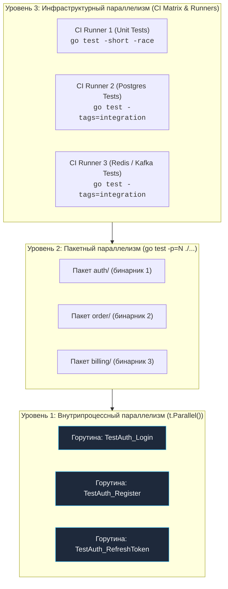

## Битва за время: Как заставить CI работать на вас

В предыдущей главе [[3. Тестирование в CI CD]] мы возвели фундамент автоматизации: построили пайплайн по принципу Fail-Fast, внедрили статический анализ, детектор гонок, интеграционные проверки и пороги покрытия кода.

Но с ростом кодовой базы неизбежно наступает кризис масштабирования: время прогона тестов стремительно растёт. Если тестовый набор выполняется 15–20 минут, рабочий ритм команды разрушается. Инженеры переключают контекст: идут пить чай, открывают социальные сети или берутся за другую задачу. Когда через 20 минут в слаке всплывает уведомление о красном билде, возвращение к исходной мыслительной модели требует колоссальных когнитивных усилий.

**Время обратной связи (Feedback Loop) в качественном CI не должно превышать 3–5 минут.** Единственный способ удержать эту планку на крупном монолите или микросервисе высокой сложности — агрессивный, многоуровневый параллелизм.

В Go параллелизм тестов разворачивается сразу на трёх фундаментальных уровнях: от микроуровня отдельных горутин до макроуровня распределённых облачных раннеров.



---

## Уровень 1: Внутрипроцессный параллелизм (t.Parallel)

Самый низкий и гранулярный уровень — распараллеливание выполнения тестов внутри одного скомпилированного Go-пакета. Для этого в начале тела тестовой функции или сабтеста (внутри `t.Run`) вызывается метод `t.Parallel()`:

```go
func TestProcessData(t *testing.T) {
	t.Parallel() // Маркируем тест как параллельный
	// ...
}
```

> [!info] Под капотом: Как работает t.Parallel()
> Когда раннер `go test` встречает вызов `t.Parallel()`, он **приостанавливает** выполнение текущего теста: горутина теста блокируется на внутреннем семафоре рантайма `testing.T`, а сам тест перемещается в очередь параллельных задач.
> 
> Сначала Go последовательно выполняет все синхронные (непараллельные) тесты пакета один за другим. Как только они завершаются, раннер разблокирует семафор и одновременно запускает накопившиеся параллельные тесты в пуле отдельных горутин.
> 
> Количество одновременно выполняемых параллельных тестов ограничено флагом `-parallel` (по умолчанию равно значению `GOMAXPROCS`, то есть числу доступных ядер CPU).

### Ловушки t.Parallel()

Параллелизм безжалостно обнажает любые скрытые дефекты архитектуры и зависимости от глобального состояния:

1. **Глобальное состояние (Global State):** Если тесты изменяют общие переменные модуля (например, мутируют синглтон `logger`, флаги конфигурации или вызывают `os.Setenv`), одновременное исполнение через `t.Parallel()` немедленно породит Data Race или случайные логические падения. Параллельные тесты обязаны быть абсолютно чистыми функциями (Pure Tests), оперирующими изолированными структурами.
2. **Конфликты сетевых портов (Shared Resources):** Если два параллельных теста поднимают тестовый веб-сервер через `httptest.Server` или `net.Listen` на жёстко заданном порту `:8080`, второй тест неминуемо упадёт с ошибкой системного вызова `bind: address already in use`. Для устранения конфликта всегда используйте порт `:0` — в этом случае ядро операционной системы автоматически выделит свободный эфемерный порт (Ephemeral Port).

---

## Уровень 2: Пакетный параллелизм (go test ./...)

Команда запуска тестов по всему репозиторию `go test ./...` **параллельна по своей природе**.

Инструмент сборки `go` компилирует каждый пакет проекта в независимый исполняемый бинарный файл, после чего запускает эти бинарники параллельно в отдельных процессах операционной системы!

> [!warning] Ловушка / Gotcha: Mechanical Sympathy и лимиты CI
> По умолчанию утилита `go test` компилирует и запускает параллельно количество пакетов, равное `GOMAXPROCS`.
> 
> Стандартный бесплатный виртуальный раннер в GitHub Actions (типа `ubuntu-latest`) предоставляет всего **2 vCPU** (виртуальных ядра) и 7 ГБ оперативной памяти.
> 
> Если в репозитории 50 пакетов, и многие из них активно аллоцируют память, поднимают фоновые горутины или локальные моки, одновременный запуск десятков тяжелых пакетов вызовет катастрофический **Lock Contention** (борьбу за кванты планировщика CPU), промахи кэша L3 и контекстные переключения в ядре Linux. В итоге тесты выполняются *дольше*, чем при последовательном запуске, а часть из них падает по необъяснимым таймаутам.
> 
> **Решение:** Явно контролируйте число параллельных пакетов флагом `-p`. На 2-ядерных CI-машинах запуск `go test -p=2 ./...` или даже `-p=1` отрабатывает быстрее, холоднее и на 100% стабильнее, полностью исключая мерцающие отказы по таймауту.

---

## Уровень 3: Инфраструктурный параллелизм (CI Matrix & Sharding)

Когда все внутренние оптимизации исчерпаны, а время прогона полного набора тестов всё ещё превышает желаемые 5 минут, мы упираемся в физический потолок одной машины. Единственное решение — горизонтальное масштабирование: распределение тестов между несколькими независимыми агентами CI.

### Паттерн 1: Матрица задач (Matrix Strategy)

Современные системы CI позволяют развернуть параллельную матрицу раннеров по декларативному списку. Матрицу применяют не только для проверки разных версий компилятора Go, но и для физической изоляции различных категорий тестов.

Конфигурация для **GitHub Actions**:

```yaml
test:
  runs-on: ubuntu-latest
  strategy:
    # Fail-fast: если падает один job из матрицы, остальные отменяются
    fail-fast: true 
    matrix:
      # Разбиваем тесты на логические блоки, каждый запустится на СВОЕЙ виртуалке
      test-suite: 
        - name: "Unit Tests"
          command: "go test -short -race ./..."
        - name: "Integration DB"
          command: "go test -tags=integration ./internal/repository/postgres/..."
        - name: "Integration Redis"
          command: "go test -tags=integration ./internal/repository/redis/..."

  name: ${{ matrix.test-suite.name }}
  steps:
    - uses: actions/checkout@v4
    - uses: actions/setup-go@v5
      with:
        go-version: '1.22'
    
    # Запускаем команду из матрицы
    - name: Run Tests
      run: ${{ matrix.test-suite.command }}
```

**Результат:** Тесты выполняются параллельно на трёх независимых серверах. Тяжёлые запросы к Postgres не отбирают такты процессора у тестов Redis, а общее время пайплайна сокращается до длительности самой медленной задачи.

---

### Паттерн 2: Test Sharding (Шардирование тестов)

Что предпринять, если в проекте есть один огромный набор сквозных E2E-тестов, который даже в изоляции выполняется 15 минут?

Ответ — **шардирование (разрезание) тестов внутри пакета** между $N$ машинами:

Инструмент `testing` позволяет фильтровать функции по регулярному выражению через аргумент `-run`. В промышленных CI-пайплайнах используют утилиты-оркестраторы (например, `gotestsum` или кастомные скрипты шардирования), которые хэшируют имена тестов и разбивают их на равномерные корзины (Buckets).

В самом Go или внешних раннерах применяется концепция шардирования по флагам `-shard` или буквенным диапазонам:

- **Job 1 (раннер A):** `go test -run=^Test[A-M] ./tests/e2e/...`
- **Job 2 (раннер B):** `go test -run=^Test[N-Z] ./tests/e2e/...`

Два раннера выполняют тесты параллельно, вдвое сокращая общее время ожидания для команды.

---

## Финальный босс: Параллелизм интеграционных тестов

Распараллелить чистые юнит-тесты тривиально: у них нет разделяемой памяти. Настоящий вызов мастерству инженера — запустить с `t.Parallel()` интеграционные тесты, работающие с реальной реляционной СУБД (PostgreSQL / MySQL).

Если параллельный Тест А выполняет `INSERT user`, а работающий на том же инстансе Тест Б в эту же миллисекунду выполняет `DELETE FROM users`, оба теста рухнут с недетерминированным результатом.

В арсенале опытных Go-инженеров есть 3 классические стратегии изоляции данных (от молниеносных к тяжеловесным):

### Стратегия 1: Транзакционный откат (Savepoints)

Перед запуском тела теста открывается изолированная транзакция БД. По завершении проверки в обработчике `t.Cleanup()` вызывается `tx.Rollback()`. СУБД мгновенно откатывает все изменённые строки, возвращая таблицы в первозданное состояние.

- **Преимущества:** Молниеносная скорость (миллисекунды). Десятки тестов работают параллельно на одном инстансе БД.
- **Ограничения:** Не подходит, если тестируемый бизнес-метод сам управляет транзакциями (вызывает `tx.Commit()`). Вложенные транзакции поверх существующей требуют реализации через точки сохранения (PostgreSQL `SAVEPOINT`).

### Стратегия 2: Уникальные схемы/таблицы (Schema-per-Test)

Вспомогательная функция `setupTestDB()` генерирует уникальный идентификатор (например, UUID) и создаёт для теста отдельную схему `SCHEMA` в Postgres (или отдельную базу `DATABASE` в MySQL). После прогона тестов в `t.Cleanup` выполняется удаление схемы (`DROP SCHEMA ... CASCADE`).

- **Преимущества:** Абсолютная изоляция данных. Тесты свободно коммитят собственные транзакции и могут выполняться через `t.Parallel()`.
- **Оптимизация скорости:** Накатывание миграций на каждую схему с нуля требует времени. Для ускорения можно подготовить эталонную базу-шаблон (Template DB) с уже применёнными миграциями и клонировать её за миллисекунды системной командой:
  ```sql
  CREATE DATABASE db_test_xyz TEMPLATE db_master;
  ```

### Стратегия 3: Изолированные контейнеры (Testcontainers)

Каждый тестовый сценарий или пакет поднимает собственный эфемерный Docker-контейнер с базой через библиотеку `testcontainers-go`.

- **Преимущества:** Эталонная надёжность и 100% повторение production-конфигурации.
- **Ограничения:** Старт контейнера занимает от 2 до 5 секунд и потребляет сотни мегабайт памяти. Запуск десятков независимых контейнеров на слабом CI-раннере исчерпает лимиты RAM. Паттерн рекомендуется применять на уровне пакета в функции `TestMain`, выполняя тесты внутри пакета последовательно либо изолируя их через схемы.

---

## Итог

1. **Внутрипроцессный параллелизм (`t.Parallel`):** Ускоряет юнит-тесты внутри пакета. Требует строгой архитектурной изоляции и отсутствия глобального состояния.
2. **Пакетный параллелизм:** Включён в Go по умолчанию (`go test ./...`). Внимательно контролируйте флаг `-p` на слабых облачных виртуалках во избежание просадки производительности из-за переключения контекстов.
3. **Инфраструктурный параллелизм (Matrix & Sharding):** Масштабируйте медленные тесты горизонтально по независимым CI-раннерам.
4. **Изоляция хранилищ данных:** Интеграционные тесты с реальными СУБД требуют строгих барьеров изоляции (транзакционные откаты с `SAVEPOINT`, уникальные `SCHEMA` или клонирование баз через `TEMPLATE`).

Построение быстрого и предсказуемого пайплайна — это высший пилотаж инженерной дисциплины. Когда полный прогон тестов занимает 3 минуты вместо 25, разработчики получают радость от тестирования, а релизы выходят в production непрерывно и без страха.