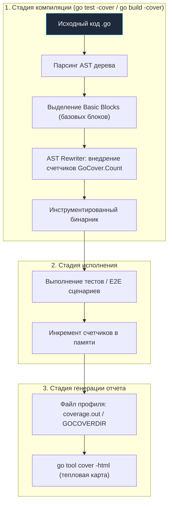
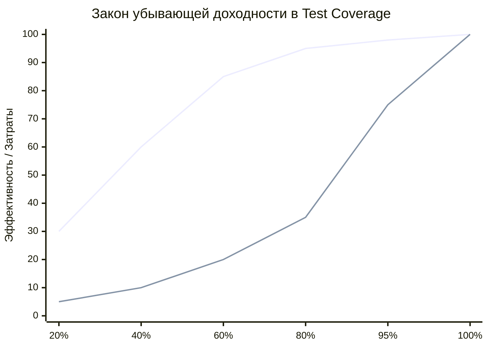

## Иллюзия безопасности: Вся правда о Test Coverage

Вы внедрили статические анализаторы, настроили многоуровневый параллельный CI, написали свойства в фаззерах и бенчмарки на горячие участки. И вот на очередном архитектурном комитете менеджер или технический директор просит вас повесить в файл `README.md` красивый зелёный бейдж: **Coverage 100%**.

Метрика покрытия кода тестами (Code Coverage) — это самый популярный и одновременно самый превратно понимаемый инструмент в арсенале обеспечения качества. Коварство этой метрики заключается в том, что она дарит коллективу **ложное чувство абсолютной безопасности (False Sense of Security)**.

> *«Тестирование может показать наличие ошибок, но никогда не докажет их отсутствия.»*  
> — Эдсгер В. Дейкстра

В этой главе мы заглянем под капот компилятора Go и разберём, как именно рантайм вычисляет процент покрытия, почему требование 100% часто губит архитектуру, как работает интеграционное профилирование, появившееся в Go 1.20, и как использовать покрытие не ради галочки в отчёте, а для выявления критических слепых зон.



---

## Mechanical Sympathy: Как Go считает покрытие

В виртуальных машинах вроде Java (с инструментом JaCoCo) покрытие обычно вычисляется путём динамической модификации скомпилированного байт-кода в памяти JVM. В языках C/C++ применяются встроенные флаги компилятора вроде `gcov`.

Создатели Go пошли совершенно иным, прямолинейным и элегантным путём: **Модификация исходного кода на уровне AST (AST Rewriting)**.

Когда вы запускаете команду `go test -cover`, инструментарий Go выполняет следующие шаги:
1. Исходные файлы `.go` парсятся в абстрактное синтаксическое дерево (AST).
2. Анализатор разбивает функции на **базовые блоки (Basic Blocks)** — неделимые последовательности инструкций, не содержащие внутренних ветвлений (`if`, `switch`, `for`, `select`, ранних `return`). Если поток управления вошёл в базовый блок, гарантируется, что он выполнит все его строки.
3. До этапа компиляции Go автоматически переписывает AST, внедряя в начало каждого базового блока скрытые счётчики.

Взглянем на исходный код функции:

```go
func IsValid(age int) bool {
	if age >= 18 {
		return true
	}
	return false
}
```

Вот в какой код компилятор превращает функцию за кулисами перед сборкой тестового бинарника:

```go
var GoCover = struct { Count [2]uint32 }{}

func IsValid(age int) bool {
	if age >= 18 {
		GoCover.Count[0]++ // Скрытый счетчик базового блока A
		return true
	}
	GoCover.Count[1]++     // Скрытый счетчик базового блока B
	return false
}
```

> [!NOTE] Режимы подсчета (-covermode)
> Go поддерживает три режима инструментирования базовых блоков:
> - `set` (по умолчанию): фиксирует лишь факт исполнения блока (булев флаг). Минимальный оверхед.
> - `count`: считает точное число выполнений каждого блока.
> - `atomic`: использует потокобезопасные атомарные инструкции (`sync/atomic.AddUint32`). Этот режим **строго обязателен**, если вы запускаете тесты параллельно (`t.Parallel()`) или с включённым флагом `-race`, иначе сами счётчики покрытия создадут гонку данных (Data Race)!

По завершении прогона выгрузка результатов (`-coverprofile=coverage.out`) представляет собой снимок этих счётчиков, привязанных к строкам и колонкам исходных файлов.

---

## Ловушка 1: Assertion-Free Tests (Тесты-пустышки)

Главное преступление против качества кода, порождаемое слепым требованием менеджмента «покрыть код на 100%» — это тесты без утверждений.

Покрытие кода измеряет исключительно одно свойство: **были ли эти строки кода выполнены процессором во время выполнения программы?**  
Оно **НЕ измеряет**, проверили ли вы корректность результата работы этого кода!

```go
// Бизнес-логика (с критическим багом: расчет всегда возвращает 0)
func CalculateTax(amount int) int {
	tax := amount * 0.20
	_ = tax
	return 0 // Oops! Фатальная ошибка в расчете налогов
}

// Тест-преступник (Assertion-Free Test):
func TestCalculateTax(t *testing.T) {
	CalculateTax(100) // Мы вызвали функцию!
	// Нет require.Equal(t, 20, got). Нет ассертов.
}
```

При запуске `go test -cover` отчёт бодро рапортует: **100% покрытия функции CalculateTax**. Каждая строчка исполнилась, счётчики базового блока инкрементировались. Но тест не несёт нулевой ценности: он не проверяет контракт, пропустит очевиднейший дефект в production и при этом создаст видимость абсолютного благополучия.

**Как бороться:**
- Внедрять специализированные линтеры (например, `testifylint`), которые автоматически ругаются на тестовые функции, не содержащие вызовов `assert` / `require` или методов `t.Error` / `t.Fatal`.
- Строгий инженерный Code Review: ревьюер обязан проверять семантику проверяемых инвариантов, а не просто смотреть на зелёный диф покрытия.

---

## Ловушка 2: Фетиш 100% и Закон убывающей доходности

Стремление достичь заветных 100% покрытия в реальных бэкенд-сервисах — это нерациональная трата инженерных ресурсов компании. Зависимость между процентом покрытия и количеством предотвращённых инцидентов строго подчиняется **закону убывающей доходности (Diminishing Returns)**.

- **0% $\rightarrow$ 60%:** Достигается быстро и с удовольствием. Покрываются основные сценарии успеха (Happy Paths) и базовые краевые случаи доменной логики. Максимальный возврат инвестиций (ROI).
- **60% $\rightarrow$ 80%:** Требует вдумчивой работы с моками, табличными тестами (Table-Driven) и граничными значениями (Edge Cases). Высокий ROI.
- **80% $\rightarrow$ 100%:** Инженерный ад. Вы тратите дни на то, чтобы смоделировать ошибку `rows.Scan()` из закрытого сокета БД или сбой `json.Marshal` на валидной структуре. Маржинальная польза стремится к нулю.



> [!warning] Ловушка / Gotcha: Тестирование `if err != nil`
> В идиоматичном Go-коде существенная часть строк — это обработка ошибок:
> ```go
> data, err := json.Marshal(user)
> if err != nil { // Как гарантированно вызвать ошибку, если структура валидна?
>     return fmt.Errorf("failed to marshal: %w", err)
> }
> ```
> Чтобы заставить `json.Marshal(user)` вернуть ошибку, инженеру приходится прибегать к противоестественным трюкам: создавать структуры с циклическими указателями или внедрять моки на стандартную библиотеку. Это делает код тестов хрупким, нечитаемым и сложным в поддержке. Прагматичный подход: оставьте системные guard-clauses непокрытыми, сосредоточившись на доменной логике.

**Золотой стандарт индустрии:**
- **70–80%** общего покрытия для бизнес-сервисов и API.
- **90%+** для критических узлов: расчёта балансов, биллинга, криптографии, низкоуровневых протоколов и публичных библиотек общего назначения.

---

## Ловушка 3: Statement vs Branch Coverage

На технических собеседованиях Senior-разработчиков часто просят объяснить принципиальную разницу между Statement Coverage (покрытием выражений/строк) и Branch Coverage (покрытием логических ветвей).

**Инструментарий Go из коробки поддерживает только Statement Coverage.**

Рассмотрим классический пример:

```go
func Process(a, b bool) {
	if a && b {
		fmt.Println("Success")
	}
}
```

Если мы напишем один-единственный тест, передающий аргументы `Process(true, true)`, утилита `go test -cover` покажет **100% покрытия**. Обе строки были исполнены!

Однако с точки зрения формальной логики и ветвлений (Branch / Condition Coverage), функция имеет 4 возможных состояния таблицы истинности:
1. `true, true` — проверено тестом;
2. `true, false` — **не проверено**;
3. `false, true` — **не проверено**;
4. `false, false` — **не проверено**.

Если внутри выражения появится сложная побочная логика или ленивые вычисления, непроверенные ветви станут источником скрытых сбоев.

**Как бороться:** Используйте фаззинг (Fuzzing) и параметризованные Table-Driven тесты с полной матрицей граничных состояний. Никогда не доверяйте цифре 100% слепо.

---

## Эволюция: Интеграционное покрытие (Go 1.20+)

Исторически в Go существовало фундаментальное ограничение: флаг `go test -cover` работал исключительно внутри тестовых бинарников, запускаемых через функции `TestXxx`.

Если вы собирали боевой бинарник микросервиса, запускали его в тестовом контуре и прогоняли сквозные интеграционные тесты извне (через Postman, сценарии на Python, k6 или Cypress), итоговый отчёт показывал **0% покрытия**. Скомпилированный бинарник просто не умел собирать и выгружать статистику.

**Начиная с Go 1.20 ситуация кардинально изменилась:** теперь компилятор умеет инструментировать сам исполняемый файл приложения!

```bash
# 1. Собираем боевой бинарник со встроенными счётчиками покрытия
go build -cover -o myapp ./cmd/api

# 2. Задаём директорию, куда приложение сбросит счётчики при завершении
export GOCOVERDIR=/tmp/covdata
mkdir -p /tmp/covdata

# 3. Запускаем сервис в фоне
./myapp &
PID=$!

# 4. Выполняем внешние сквозные тесты (Postman, k6, Cypress, curl)...

# 5. Останавливаем сервис штатным сигналом (Graceful Shutdown обязателен!)
kill -SIGINT $PID 
wait $PID

# 6. Преобразуем бинарные данные покрытия в стандартный текстовый профиль
go tool covdata textfmt -i=/tmp/covdata -o profile.out

# 7. Генерируем визуальный HTML-отчёт
go tool cover -html=profile.out
```

Этот механизм позволяет объединять в едином отчёте результаты быстрых юнит-тестов и тяжёлых E2E-сценариев.

---

## Как использовать Coverage как профессионал

Если проценты могут вводить в заблуждение, зачем вообще измерять покрытие?

Опытный инженер воспринимает покрытие не как бюрократический KPI, а как **тепловую карту (Heatmap) для обнаружения белых пятен в коде**.

```bash
go test -coverprofile=c.out ./...
go tool cover -html=c.out
```

Команда генерирует интерактивный отчёт и открывает его в браузере:
- **Зелёный цвет:** базовый блок исполнялся хотя бы раз.
- **Красный цвет:** блок остался нетронутым.
- **Серый цвет:** неисполняемые декларации (интерфейсы, структуры, объявления типов).

**Инженерный алгоритм инспекции на Code Review:**
1. Откройте `go tool cover -html`.
2. Обращайте внимание не на общий процент, а на **красные зоны в критической бизнес-логике**.
3. Если целая ветвь `switch/case`, логика пересчёта скидок или сценарий отката транзакции подсвечены красным — Pull Request не готов к слиянию. Допишите тесты именно на эти сценарии.

### Исключение сгенерированного кода

Красные блоки в автогенерированных файлах (структуры Protobuf `*.pb.go`, автосгенерированные моки `mock_*.go`, клиенты Swagger) искусственно занижают общую статистику репозитория.

В CI-пайплайне (о котором мы говорили в [[3. Тестирование в CI CD]]) отчёт предварительно фильтруют утилитой `grep`:

```bash
go test -coverprofile=c.out ./...

# Удаляем из профиля сгенерированные файлы моков и protobuf
grep -v -E "mock_.*\.go|\.pb\.go" c.out > c_clean.out

# Выводим объективную статистику по рукописному коду
go tool cover -func=c_clean.out
```

---

## Итоги модуля "Тестирование и QA в Go"

Поздравляю! Вы завершили один из самых глубоких, фундаментальных и практико-ориентированных модулей инженерной энциклопедии.

Оглянемся на путь, который мы проделали:
1. **Фундамент:** Мы оставили позади примитивную отладку принтами (`fmt.Println`), освоили мощь интерфейса `testing` и параметризованных Table-Driven тестов. Мы научились проектировать чистые интерфейсы и генерировать моки (`gomock`), исключая жёсткую привязку к внешним зависимостям.
2. **Защита памяти:** Мы осознали, что конкурентность в Go — это минное поле с гонками данных и взаимоблокировками, и вооружились встроенным детектором `go test -race` и теневой памятью TSAN.
3. **Высший пилотаж:** Мы внедрили Fuzzing и Property-Based тестирование, научив компилятор самостоятельно находить разрушительные граничные условия и утечки памяти.
4. **Скорость:** Мы научились писать воспроизводимые Benchmarks, препарировать CPU и память в `pprof` и оценивать хвостовые задержки (Tail Latency), не доверяя обманчивым средним значениям.
5. **Культура:** Мы выстроили чистую структуру пакетов, автоматизировали запуск в CI/CD, внедрили многоуровневый параллелизм и выработали зрелое, прагматичное отношение к Test Coverage.

Код, написанный и проверенный по этим канонам, перестаёт быть зыбкой конструкцией. Он становится надёжным инженерным сооружением, готовым выдержать любые штормы в production.