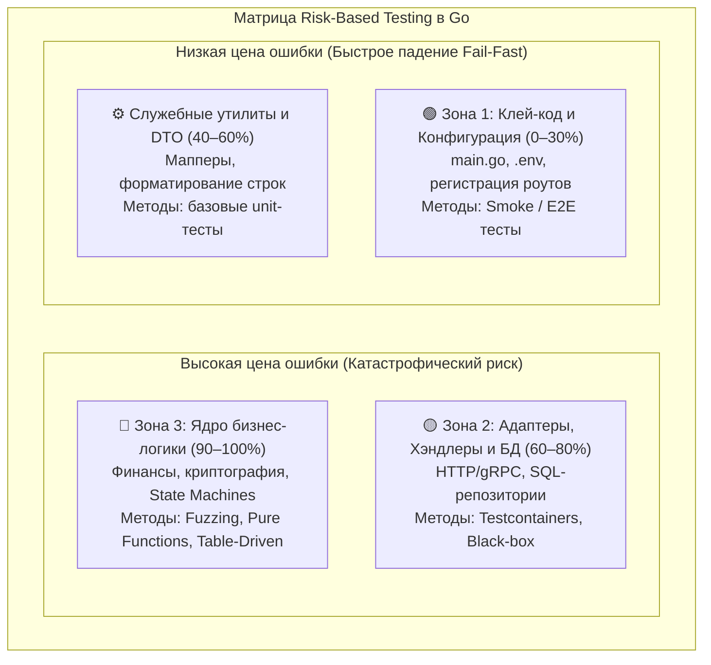
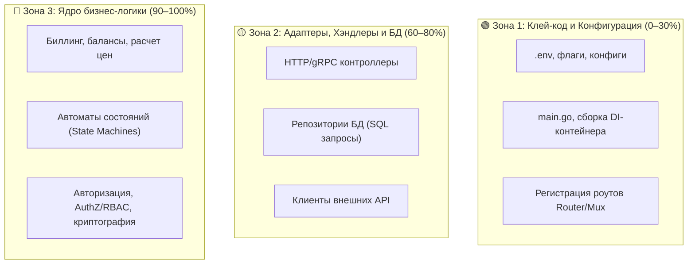

## Прагматика качества: Искусство вовремя остановиться

В предыдущей главе [[5. Test coverage и его ловушки]] мы разрушили опасный миф о стопроцентном покрытии кода тестами. Мы увидели, как слепая административная погоня за красивым отчётом в CI порождает бессмысленные тесты-пустышки (Assertion-Free Tests) и хрупкие фикстуры, сковывающие руки при любом рефакторинге.

Если 100% — это опасный фетиш и признак архитектурного нездоровья, то где находится точка инженерного оптимума? В какой момент Senior-разработчик смотрит на реализацию и с чистой совестью говорит: *«Этого достаточно, выкатываем в production»*?

Ответ лежит не в абстрактном математическом идеале, а в суровой инженерной экономике. Написание и последующая поддержка тестов — это прямая инвестиция времени и бюджета компании. **Минимальный достаточный coverage (Minimum Sufficient Coverage, MSC)** — это точка равновесия, в которой стоимость написания и поддержки следующего теста начинает превышать вероятный финансовый ущерб от бага, который этот тест мог бы предотвратить.

В этой статье мы освоим практическую методологию **Risk-Based Testing (Тестирование на основе рисков)**, научимся аргументированно защищать инженерные оценки перед бизнесом и писать тесты, обеспечивающие максимальную отдачу на каждую вложенную строку кода.

---

## Закон убывающей доходности (Diminishing Returns)

Инженерия тестирования подчиняется классическому принципу Парето: первые 20% усилий приносят 80% надежности системы и вылавливают 90% критических ошибок.

- **Путь от 0% до 60%:** Вы покрываете основные положительные сценарии («Happy Paths») публичных API-хэндлеров и доменных сервисов. Тесты пишутся быстро, проверяют реальные бизнес-инварианты и находят баги десятками. Огромный возврат инвестиций (ROI — Return on Investment).
- **Путь от 60% до 80%:** Вы покрываете негативные сценарии (ошибки валидации входных данных, нехватка прав доступа, пустые выборки из базы). Вы пишете Table-Driven тесты для сложной алгоритмики. ROI остаётся высоким и оправданным.
- **Путь от 80% до 100%:** Вы попадаете в зону инженерного абсурда. Чтобы покрыть оставшиеся 20% строк, вам приходится искусственно моделировать обрыв TCP-сокета прямо посреди чтения HTTP-тела ответа, эмулировать ошибку сериализации `json.Marshal` на валидной структуре и закрывать 50 строк шаблонной обработки `if err != nil` от системных вызовов `os.ReadFile`. Вы тратите дни, создавая громоздкие моки, которые сломаются при малейшем изменении сигнатур. ROI падает ниже нуля: тесты требуют постоянных затрат на поддержание жизни, не находя ни одного реального бага.

Show me the visualization

---

## Risk-Based Testing: Карта покрытия

Чтобы достичь минимального достаточного покрытия, необходимо отказаться от иллюзии равноправия кода. Разные модули несут несопоставимые риски для бизнеса. **Risk-Based Testing (Тестирование на основе рисков)** разделяет кодовую базу на три чёткие зоны ответственности.

### 🟢 Зона 1: Клей-код и Конфигурации (Target Coverage: 0–30%)

- **Что это:** Чтение файлов конфигурации `.env`, инициализация логгера, регистрация роутов (`Router/Mux`), сборка графа зависимостей в `main.go`.
- **Риск:** Минимальный. Если здесь допущена ошибка (например, опечатка в имени переменной окружения), приложение просто **не запустится** (Fail Fast). Ошибка мгновенно обнаружится на этапе первого запуска в CI или при деплое на dev-стенд. Конечные пользователи её никогда не увидят.
- **Стратегия:** Не тратьте время на юнит-тесты этой зоны. Этот код автоматически покрывается дымовым (Smoke) или сквозным E2E-тестом, запускающим сервер целиком.

### 🟡 Зона 2: Адаптеры, Хэндлеры и БД (Target Coverage: 60–80%)

- **Что это:** Транспортные контроллеры (HTTP/gRPC), слой репозиториев (вызовы SQL), адаптеры брокеров сообщений и внешних HTTP-клиентов.
- **Риск:** Средний. Ошибка может привести к отдаче `500 Internal Server Error`, ошибке валидации JSON или замедлению ответа, но обычно не разрушает фундамент данных.
- **Стратегия:** Интеграционные тесты с реальной инфраструктурой. Не пытайтесь заменять базу данных самодельными структурами в памяти! Поднимайте реальную СУБД через `Testcontainers`, проверяйте корректность SQL-запросов и обработку ожидаемых ошибок (например, `sql.ErrNoRows`). Игнорируйте маловероятные системные сбои (вроде `driver: bad connection`).

### 🔴 Зона 3: Ядро бизнес-логики (Target Coverage: 90–100%)

- **Что это:** Финансовые расчёты, процессинг транзакций, алгоритмы формирования цен и скидок, конечные автоматы заказов (State Machines), политики доступа (AuthZ/RBAC), алгоритмы криптографии.
- **Риск:** Катастрофический. Баг в ядре означает прямые финансовые убытки компании, утечку персональных данных или компрометацию безопасности.
- **Стратегия:** Максимальная глубина и паранойя. Здесь применяются **Фаззинг (Fuzzing)**, **Property-Based Testing** и развёрнутые табличные тесты с сотнями граничных комбинаций. Этот код обязан проектироваться в виде **чистых функций (Pure Functions)**, не знающих об HTTP, базах данных и сетевых протоколах, чтобы выполняться за миллионные доли секунды без моков.

> [!tip] Собеседование
> **Вопрос:** Если мы решили не тестировать `if err != nil` для маловероятных системных ошибок, как мы узнаем, что приложение не упадет в панику, когда эта ошибка реально произойдет?
> **Ответ:** Наша задача — не поймать эту ошибку в юнит-тесте (мы всё равно не сможем написать адекватный мок для сбоящего диска), а убедиться, что система **в целом** реагирует адекватно. Для этого мы:
> 1. Строго оборачиваем контекст ошибок через `fmt.Errorf("failed to read: %w", err)` или `errors.Wrap`, гарантируя, что цепочка причин долетит до верхнего уровня (HTTP-хэндлера).
> 2. Внедряем глобальный Recovery Middleware, который перехватывает возможные паники и отдаёт клиенту контролируемый ответ `500 Internal Server Error` с Correlation ID в логах.
> 3. Настраиваем Chaos Engineering на интеграционном стенде (инжектируем сетевые задержки и падения БД) и проверяем, что сервис демонстрирует изящную деградацию (Graceful Degradation), а не падает лавинообразно.

---

## Как настроить CI/CD для поддержания достаточного покрытия

Как лидеру разработки выстроить процесс так, чтобы команда не скатывалась в анархию без тестов, но и не тратила рабочие часы на штурм 100%?

### 1. Глобальный гейт (Global Coverage Gate)

В пайплайне CI задаётся разумный базовый порог качества: **70% или 75%** для бэкенда на Go. Если общий показатель падает ниже этой границы, пайплайн блокирует слияние изменений.

### 2. Защита от деградации (Coverage Delta)

Гораздо более продуктивный подход — контроль **дельты покрытия**.

Если текущее покрытие ветки `main` составляет 78.4%, а новый Pull Request снижает его до 78.2% — слияние автоматически блокируется. Разработчик обязан покрыть тестами *свой собственный добавленный код* как минимум на уровне общего стандарта проекта. Метрика покрытия растёт органически при каждом релизе.

### 3. Файлы исключений (Ignore Files)

Удалите из профиля покрытия файлы, искажающие объективную картину:
- Автогенерированный код (`*_mock.go`, `*.pb.go`).
- Файлы SQL-миграций.
- Декларативные DTO и структуры конфигурации.

В Go это реализуется лаконичной фильтрацией файла `coverage.out` утилитой `grep -v` перед передачей анализатору `golangci-lint` или утилите `go tool cover`.

---

## Истинные метрики качества (Beyond Coverage)

Если процент покрытия — метрика поверхностная, на что должен опираться Senior Engineer для честной оценки зрелости своего тестирования?

1. **Defect Escape Rate (Коэффициент ускользания дефектов):**  
   Отношение количества багов, найденных пользователями на production, к числу дефектов, перехваченных в CI на этапе тестов. Если ваш сервис имеет 95% покрытия, но каждую неделю в production всплывают критические логические ошибки — ваши тесты проверяют форму, а не содержание.
2. **MTTR (Mean Time To Recovery):**  
   Среднее время восстановления работоспособности. Когда дефект неизбежно прорывается в production, насколько быстро тестовый комплект позволяет локализовать причину, воспроизвести её в виде регрессионного теста (Regression Test), проверить фикс и выкатить обновление? Зрелая тестовая база сокращает этот цикл до 15 минут. Хрупкая — превращает инцидент в ночную отладку логов.
3. **Уверенность при рефакторинге (Refactoring Confidence):**  
   Самый честный эмоциональный индикатор качества. Если вам поручают оптимизировать ядро модуля расчёта платежей, испытываете ли вы страх? Если инженеры боятся прикасаться к коду без ручного тестирования целой команды QA — система тестов не выполняет свою задачу. Если вы спокойно переписываете реализацию, запускаете `go test ./...` и идёте на обед, зная, что тесты защитят систему — вы достигли истинной инженерной зрелости.

---

## Финальное напутствие: Конец пути

На этом мы официально завершаем глобальный блок **"Тестирование в Go (QA & Testing)"**.

Мы начали путь с простого пакета `testing` и базовой функции `t.Error()`. Мы исследовали архитектуру Table-Driven тестов, покорили хаос конкурентности с детектором гонок (`-race`), научились изолировать микросервисы через моки gRPC, заставили рантайм ломать код с помощью Fuzzing-а и препарировали профили нагрузки в `pprof`.

**Тестирование — это не отдельная профессия и не налог на разработку.** Это надёжный экзоскелет программиста. Это то, что позволяет проектировать масштабируемые, высококонкурентные и распределённые системы на Go, сохраняя спокойствие и уверенность перед каждым пятничным релизом.

Пишите тесты прагматично. Проверяйте поведение, а не реализацию. Защищайте критическое ядро и цените рабочее время команды!