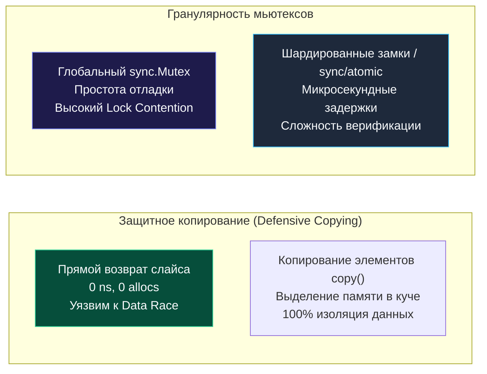

## Баланс над пропастью: Скорость против Надежности

В программной инженерии не существует абсолютных истин — существуют только компромиссы (Trade-offs). Скорость и надёжность часто представляют как непримиримых врагов: кажется, что чем выше требования к устойчивости системы, тем медленнее становится разработка, и наоборот.

Каждый инженер мечтает о пайплайне CI, который отрабатывает за пару секунд и при этом на 100% гарантирует отсутствие дефектов в production. Однако законы физики, архитектуры процессоров и теории вероятностей диктуют свои правила. На практике мы непрерывно балансируем между двумя полюсами: **скоростью обратной связи (Feedback Loop Speed)** и **глубиной уверенности в коде (Reliability)**.

В этой главе мы исследуем, как зрелые инженерные команды находят оптимум на этом канате, почему антипаттерн «рожка мороженого» убивает доверие к тестам и как парадигма Shift-Left позволяет делать код надёжнее без потери темпа поставки.

```mermaid
flowchart TD
    classDef process  fill:#1e293b,stroke:#38bdf8,stroke-width:1px,color:#f8fafc
    classDef success  fill:#064e3b,stroke:#34d399,stroke-width:1px,color:#f8fafc
    classDef error    fill:#7f1d1d,stroke:#f87171,stroke-width:1px,color:#f8fafc
    classDef warning  fill:#78350f,stroke:#fbbf24,stroke-width:1px,color:#f8fafc
    classDef entry    fill:#1e3a5f,stroke:#38bdf8,stroke-width:2px,color:#f8fafc
    classDef aux      fill:#334155,stroke:#64748b,stroke-width:1px,color:#f8fafc
    classDef system   fill:#312e81,stroke:#a78bfa,stroke-width:1px,color:#f8fafc
    classDef data     fill:#132d29,stroke:#2dd4bf,stroke-width:1px,color:#f8fafc
    classDef network  fill:#881337,stroke:#fb7185,stroke-width:1px,color:#f8fafc
    classDef accent   fill:#1e1b4b,stroke:#818cf8,stroke-width:1px,color:#f8fafc
    subgraph Pyramid["Каноническая пирамида тестирования"]
        U["70-80% Unit-тесты<br/>Память CPU, микросекунды, детерминизм"]:::system
        I["15-20% Интеграционные тесты<br/>Testcontainers, сокеты, миллисекунды"]:::process
        E["5-10% Сквозные E2E тесты<br/>Критические пути, браузеры, минуты"]:::error
        U --> I --> E
    end
    subgraph Cone["Антипаттерн: Рожок мороженого (Ice Cream Cone)"]
        CE["Сотни медленных и хрупких E2E тестов"]:::process
        CI["Случайные интеграционные сценарии"]:::process
        CU["Горстка забытых юнит-тестов"]:::process
        CU --> CI --> CE
    end
```

---

## Измерение 1: Пирамида тестирования и Feedback Loop

Главный нерв инженерного процесса — это время цикла обратной связи (Feedback Loop):

- **Тесты выполняются 10–30 секунд:** инженер запускает их локально перед каждым коммитом. Мыслительный поток не прерывается.
- **Тесты выполняются 5–15 минут:** инженер перестаёт запускать их на ноутбуке и пушит коммит «вслепую», перекладывая валидацию на плечи CI.
- **Пайплайн CI выполняется 40 минут:** разработчик вынужден переключать контекст на другую задачу. Когда через час приходит отчёт о падении теста, возвращение к исходному коду требует в разы больше времени и сил.

Почему тесты становятся мучительно медленными? В подавляющем большинстве случаев причина кроется в разрушении **Пирамиды тестирования**.

В наивной попытке добиться максимальной надёжности (Reliability) команды начинают покрывать каждый шаг сценария тяжеловесными сквозными проверками (End-to-End / E2E). Они разворачивают целые окружения: браузеры в Selenium/Playwright, реальные СУБД, кластеры Kafka и микросервисы.

> [!warning] Ловушка / Gotcha: Антипаттерн "Рожок мороженого" (Ice Cream Cone)
> Если в репозитории мало быстрых юнит-тестов, среднее количество интеграционных тестов и сотни раздутых E2E-тестов — пирамида переворачивается вверх дном.
> 
> 1. **Катастрофическая задержка:** сборка и прогон занимают часы процессорного времени.
> 2. **Эрозия доверия (Flaky Tests):** сквозные проверки неизбежно начинают мерцать из-за случайных сетевых джиттеров, таймаутов браузерных движков или задержек репликации в Kafka.
> 
> Итог парадоксален: команда, стремившаяся к идеальной надёжности, получает пайплайн, результаты которого все игнорируют, нажимая «Restart job».

### Баланс Senior-инженера

Прагматичный подход заключается в строгом соблюдении пропорций пирамиды:

- **80% Unit-тесты:** проверяют бизнес-логику в оперативной памяти за микросекунды. Не содержат сетевых сокетов и файлов.
- **15% Integration тесты:** проверяют реальные SQL-запросы к БД в `Testcontainers` и протоколы интеграции (сотни миллисекунд).
- **5% E2E тесты:** проверяют исключительно критические сквозные сценарии бизнеса (Critical Paths) — например, процесс регистрации, оформления и оплаты заказа.

---

## Измерение 2: Скорость Инструментария (The Tooling Tax)

Каждый инструмент верификации в экосистеме Go имеет свою вычислительную цену (The Tooling Tax).

### 1. Детектор гонок (Race Detector: `-race`)

Команда `go test -race` — непревзойдённый инструмент поиска гонок данных (Data Races). Однако под капотом он использует теневую память ThreadSanitizer:
- Каждое обращение к памяти перехватывается и проверяется.
- Выполнение кода замедляется в **10–20 раз**.
- Потребление оперативной памяти возрастает в 5–10 раз.

- *Уклон в слепую надёжность:* запустить бинарник с флагом `-race` в production. **Никогда так не делайте!** Это приведёт к деградации пропускной способности сервиса и гигантским расходам на серверы.
- *Уклон в безответственную скорость:* не использовать `-race` вообще. Вы гарантированно получите скрытые повреждения памяти под реальной нагрузкой.
- *Инженерный баланс:* обязательный запуск `-race` на этапе Unit и Integration тестов в CI, а также локально при проектировании конкурентных структур.

### 2. Непрерывный фаззинг (Fuzzing)

Фаззинг способен выявить редчайшие паники и OOM-дефекты. Но эффективная генерация мутаций требует миллионов итераций и часов процессорного времени.

- *Инженерный баланс:* в обычных pull request тесты фаззинга выполняются только на сохранённом стабильном Seed-корпусе (занимает доли секунды). Непрерывный мутационный фаззинг выносится в ночные сборки (Nightly Builds) или на выделенные фоновые раннеры.

---

## Измерение 3: Производительность кода vs Безопасность

Компромисс между скоростью и надёжностью заложен в саму архитектуру программ на Go.

### Защитное копирование (Defensive Copying)

Представьте кэш, отдающий слайс строк конфигурации: `[]string`.

- **Максимальная скорость:** метод `GetConfig()` возвращает внутренний слайс напрямую. 0 аллокаций, время выполнения — доли наносекунды. Но если вызывающий код выполнит `config[0] = "hack"`, он незаметно испортит состояние кэша для всех параллельных горутин сервиса (Data Race).
- **Максимальная надёжность:** метод выделяет новый слайс через `make()`, копирует данные вызовом `copy()` и отдаёт изолированную копию. Это порождает аллокацию в куче и нагружает GC.
- *Решение Senior-инженера:* изоляция на уровне публичного API. Либо возвращается защитная копия (если безопасность важнее наносекунд), либо структуры проектируются с неэкспортируемыми полями и методами чтения только нужных элементов.

### Гранулярность блокировок (Lock Granularity)

- **Надёжность:** единый глобальный `sync.Mutex` на весь объект. Исключает состояние гонки, код тривиально читать и тестировать.
- **Скорость:** при высокой нагрузке (тысячи RPS) горутины выстраиваются в очередь, ядра CPU простаивают в ожидании замка (Lock Contention). Переход на шардированные мьютексы или неблокирующие алгоритмы (`sync/atomic`) ускоряет систему в разы, но экспоненциально усложняет написание тестов и поиск тонких багов когерентности памяти.

---

## Парадигма Shift-Left

Главный вывод современной индустрии из противостояния скорости и надёжности формулируется принципом **Shift-Left (Сдвиг влево)**.

Стоимость обнаружения и устранения дефекта возрастает экспоненциально по мере его продвижения по конвейеру поставки:

```mermaid
flowchart LR
    classDef process  fill:#1e293b,stroke:#38bdf8,stroke-width:1px,color:#f8fafc
    classDef success  fill:#064e3b,stroke:#34d399,stroke-width:1px,color:#f8fafc
    classDef error    fill:#7f1d1d,stroke:#f87171,stroke-width:1px,color:#f8fafc
    classDef warning  fill:#78350f,stroke:#fbbf24,stroke-width:1px,color:#f8fafc
    classDef entry    fill:#1e3a5f,stroke:#38bdf8,stroke-width:2px,color:#f8fafc
    classDef aux      fill:#334155,stroke:#64748b,stroke-width:1px,color:#f8fafc
    classDef system   fill:#312e81,stroke:#a78bfa,stroke-width:1px,color:#f8fafc
    classDef data     fill:#132d29,stroke:#2dd4bf,stroke-width:1px,color:#f8fafc
    classDef network  fill:#881337,stroke:#fb7185,stroke-width:1px,color:#f8fafc
    classDef accent   fill:#1e1b4b,stroke:#818cf8,stroke-width:1px,color:#f8fafc
    IDE["1. IDE / Линтер<br>Затраты: 0 мин"]:::process --> Unit["2. Локальный Unit-тест<br>Затраты: 1 мин"]
    Unit --> CI["3. CI Пайплайн<br>Затраты: 10 мин"]
    CI --> Staging["4. Staging стенд<br>Затраты: часы"]
    Staging --> Prod["5. Production сбой<br>Затраты: репутация, деньги"]
```

1. **Ошибка найдена в IDE (линтером):** цена устранения — секунды.
2. **Ошибка найдена локальным юнит-тестом:** цена — 1 минута.
3. **Ошибка найдена в CI (E2E тест):** цена — 10 минут плюс перезапуск пайплайна.
4. **Ошибка найдена на Staging (QA-инженером):** цена — часы (переоткрытие тикета, возврат контекста).
5. **Ошибка найдена в Production пользователем:** цена — репутация компании, простои бизнеса и бессонные ночи дежурных.

**Суть «сдвига влево»:** перемещайте все возможные проверки качества на максимально ранний этап!

- Заменяйте тяжёлые интеграционные тесты с базой данных на быстрые модульные тесты доменной логики.
- Заменяйте сквозные проверки межсервисного общения сверхбыстрым контрактным тестированием (**Contract Testing**).
- Настраивайте статический анализ `golangci-lint` в `pre-commit` хуки Git, чтобы дефекты отсекались ещё до отправки коммита в сеть.

---

## Итог

1. **Соблюдайте пирамиду:** 80% юнит-тестов, 15% интеграционных, 5% E2E. Перевёрнутый «рожок мороженого» убивает скорость и веру в автоматизацию.
2. **Учитывайте цену инструментов (Tooling Tax):** используйте `-race` в CI для юнит- и интеграционных тестов, но никогда не тащите его в боевой бинарник.
3. **Разделяйте фаззинг:** быстрый прогон по Seed-корпусу в PR, глубокий мутационный поиск — в асинхронных ночных пайплайнах.
4. **Сдвигайте проверки влево (Shift-Left):** находите дефекты на уровне линтеров и локальных тестов. Чем раньше пойман баг, тем дешевле обходится его исправление.