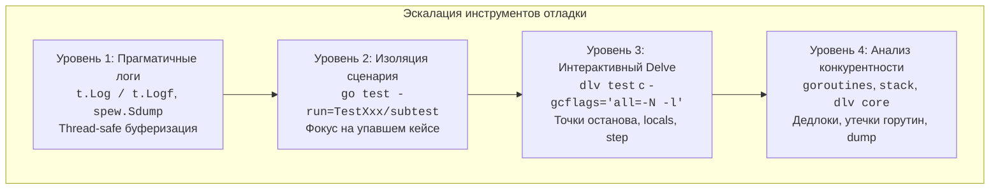
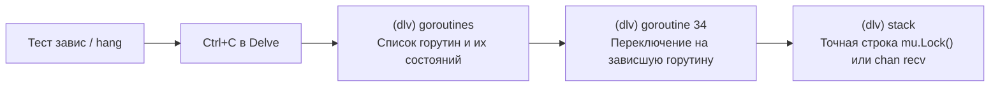

## Анатомия ошибки: Искусство дебага тестов

Ваш пайплайн CI внезапно окрасился в красный цвет. Вы открываете журнал сборки и видите лаконичную строку:
`Error: Not equal. expected: 42, actual: 0`.

Хороший тест всегда точно скажет вам, *что* именно пошло не так. Но он почти никогда не объяснит, *почему*. Когда беглый осмотр кода глазами заходит в тупик, а бизнес-логика скрыта за слоями абстракций, моков, интерфейсов и асинхронных каналов, наступает время хирургической локализации проблемы — отладки (Debugging).

> *«Отладка кода вдвое сложнее, чем его написание. Поэтому, если вы пишете код настолько умно, насколько способны, вы по определению недостаточно сообразительны, чтобы его отладить.»*  
> — Брайан В. Керниган

В экосистеме Go отладка имеет свои уникальные особенности, продиктованные легковесными горутинами со сплит-стеками, кооперативным планировщиком рантайма и агрессивными оптимизациями компилятора. В этой главе мы выстроим строгую лестницу отладочных инструментов: от прагматичного вывода в буфер теста до исследования многопоточных зависаний через Delve и посмертного анализа дампов памяти (Core Dumps).



---

## Уровень 1: Print-Driven Development (Прагматичный подход)

Давайте признаем честно: в 90% повседневных ситуаций разработчики диагностируют код простым выводом переменных в консоль. Это быстро, не требует настройки внешнего окружения и одинаково хорошо работает на рабочей машине и удалённом сервере. Но в Go эту технику необходимо применять идиоматично.

> [!warning] Ловушка / Gotcha: `fmt.Println` в параллельных тестах
> Если ваши тесты используют конкурентный запуск через `t.Parallel()` (как мы рекомендовали в [[4. Параллелизм в CI]]), применение стандартного `fmt.Println` превратит терминал в беспорядочный поток символов. Логи от десятков одновременно выполняющихся горутин перемешаются в `os.Stdout`, и вы потеряете возможность понять, к какому именно сабтесту относилась напечатанная строка.

### Идиоматичное решение: `t.Log` и `t.Logf`

Вместо прямых обращений к стандартному потоку вывода всегда используйте методы тестового контекста `t.Log` и `t.Logf`:

1. **Изолированная буферизация:** Рантайм `testing` перехватывает вывод каждого теста в отдельный внутренний буфер и чётко связывает его с конкретным именем сценария или `t.Run`.
2. **Чистота вывода:** Сообщения печатаются в терминал **только в том случае, если тест упал**, либо если раннер запущен с флагом подробного вывода: `go test -v`. При успешном прохождении тестов логи не засоряют консоль разработчика.

```go
func TestComplexLogic(t *testing.T) {
	t.Parallel()

	state := processInternalState()

	// Сообщение отобразится с именем теста и только при падении:
	t.Logf("Current state at step 2: %+v", state)

	require.NotEmpty(t, state.Items)
}
```

> [!TIP] Совет по глубокой инспекции структур
> Для глубоко вложенных структур и графов объектов стандартного форматирования `%+v` часто недостаточно: оно выводит лишь шестнадцатеричные адреса указателей. В сложных случаях на помощь приходит библиотека `github.com/davecgh/go-spew/spew`, умеющая рекурсивно разворачивать структуры данных с типами, адресами и отступами:
> ```go
> t.Log(spew.Sdump(state))
> ```

---

## Уровень 2: Delve (Официальный отладчик Go)

Инженеры, пришедшие в Go из мира C или C++, по привычке пытаются применить классический `gdb`. **Забудьте про использование `gdb` для Go-приложений.**

Рантайм Go фундаментально отличается от C-рантайма: горутины не соответствуют потокам ОС один к одному, их стеки динамически перемещаются в памяти при росте (Stack Splitting), а ABI внутренних вызовов и структуры интерфейсов непонятны стандартным отладчикам.

Для Go создан специализированный отладчик — **Delve (`dlv`)**. Он глубоко интегрирован в рантайм Go, умеет читать метаданные DWARF, отслеживать стек горутин и встроен в графические среды разработки GoLand и VS Code. Однако навык работы с Delve в терминале незаменим при расследовании падений на CI-раннерах или в Docker.

### Запуск Delve для тестов

Для запуска интерактивной сессии отладки тестового пакета выполните:

```bash
# Компилирует тесты без оптимизаций и запускает сессию dlv
dlv test ./internal/repository/
```

Процесс переходит в командную строку отладчика `(dlv)`. Базовый сценарий сессии:

1. **Установка точки останова (Breakpoint):**
   ```text
   (dlv) break my_file_test.go:45
   ```
2. **Запуск или продолжение исполнения:**
   ```text
   (dlv) continue
   ```
3. **Инспекция локального контекста (после остановки):**
   - `locals` — распечатать значения всех локальных переменных текущего фрейма стека.
   - `print myVar` — вывести конкретную переменную.
   - `print mySlice[0].Name` — вычислить значение поля структуры.
4. **Пошаговое выполнение:**
   - `next` (или `n`) — выполнить текущую строку и остановиться на следующей (Step Over).
   - `step` (или `s`) — войти внутрь вызываемой функции (Step Into).
   - `stepout` — завершить выполнение текущей функции и вернуться в вызывающий фрейм.

---

## Уровень 3: Специфика Table-Driven тестов

В главе [[4. Table driven tests]] мы проектировали параметризованные таблицы с десятками сценариев. Что делать, если из пятидесяти кейсов падает один конкретный — сорок второй?

Если установить стандартный breakpoint внутри цикла `for _, tc := range cases`, отладчик будет намертво перехватывать управление на каждом валидном кейсе, заставляя вас 41 раз нажимать `continue`.

### Решение 1: Фильтрация при запуске (Изоляция кейса)

Самый быстрый путь — запустить отладчик исключительно для проблемного сабтеста. Благодаря каноническим соглашениям об именовании ([[2. Naming conventions]]), сабтест изолируется регулярным выражением флага `-run`:

```bash
# Запуск конкретного сабтеста
go test -run=^TestCalculateDiscount$/^user_with_expired_promo$ -v
```

В IDE достаточно кликнуть зеленую иконку Debug напротив конкретного вложенного вызова `t.Run`.

### Решение 2: Условные Breakpoints (Conditional Breakpoints)

В Delve и современных IDE можно задать логическое условие для точки останова. Процесс остановится только тогда, когда предикат вернёт `true`:

- В консоли Delve:
  ```text
  condition <breakpoint_id> tc.name == "user_with_expired_promo"
  ```
- В GoLand / VS Code: правый клик по красной точке останова $\rightarrow$ ввод условия `tc.name == "user_with_expired_promo"`.

---

## Уровень 4: Дебаг конкурентности и Дедлоков

Отладка последовательного кода линейна. Настоящий вызов наступает тогда, когда тест зависает («Hang») или завершается по таймауту из-за скрытой взаимной блокировки каналов или мьютексов.

Как мы разбирали в [[4. Deadlock detection]], встроенный в рантайм механизм обнаружения дедлоков способен бросить `panic: deadlock` только тогда, когда заблокированы **абсолютно все** горутины в процессе. Если в фоне продолжает тикать хотя бы один вспомогательный таймер или системный netpoller, рантайм считает систему живой, и тест молча висит вечно.



### Дебаг зависаний в реальном времени

Если тест завис во время сессии `dlv test`:
1. Нажмите комбинацию `Ctrl+C`. Это не завершит процесс, а приостановит исполнение всех потоков и вернёт вас в командную строку Delve.
2. Выполните команду `goroutines`. Она выведет реестр всех существующих горутин с их идентификаторами и статусами ожидания (например, `chan receive` или `semacquire`).
3. Определите горутину, застрявшую в ожидании ресурса, и переключите контекст на неё:
   ```text
   (dlv) goroutine 34
   ```
4. Изучите стек вызовов:
   ```text
   (dlv) stack
   ```
Вы увидите точный номер строки, вызов `mu.Lock()` или чтение из канала, на котором заблокировался поток управления.

### Дебаг через Core Dumps

Если редкий сбой воспроизводится только на удалённом CI-раннере, настройте генерацию дампа оперативной памяти (Core Dump) операционной системой Linux при аварийном завершении (`SIGABRT` / `SIGSEGV`).

Полученный дамп скачивается на рабочую станцию и открывается в Delve для детального посмертного анализа:

```bash
dlv core ./test_binary ./core_dump_file
```

Вы получаете полную картину состояния памяти, переменных и стеков горутин в момент крушения процесса.

---

## Ловушка оптимизатора: "Variable optimized away"

Иногда при попытке распечатать переменную (`print x`) отладчик выдаёт обескураживающий ответ: `Variable optimized away`.

> [!info] Под капотом: Агрессивный инлайнинг
> Компилятор Go проектировался для генерации максимально быстрого машинного кода: он удаляет переменные, чьи значения можно вычислить заранее, встраивает (inline) тела функций в места вызова и переупорядочивает инструкции под конвейер процессора. Из-за этого скомпилированный бинарник перестаёт строго соответствовать строкам исходного текста, а регистры процессора переиспользуются под другие нужды.

Для отключения оптимизаций при сборке отладочного кода используются специальные флаги компилятора:

```bash
-gcflags="all=-N -l"
```

- `-N` полностью отключает оптимизации компилятора.
- `-l` отключает инлайнинг функций.

Утилита `dlv test` и графические IDE передают эти флаги автоматически. Однако если вы пытаетесь подключиться отладчиком к боевому оптимизированному бинарнику, часть переменных будет недоступна для чтения.

---

## Итог

1. **Логирование:** Для быстрого дебага используйте `t.Log/t.Logf` вместо `fmt.Println` для thread-safe вывода.
2. **Delve:** Забудьте про `gdb`. Ваш основной инструмент для глубокого анализа — `dlv test`.
3. **Изоляция:** Никогда не дебажте весь массив `test cases`. Используйте фильтры `go test -run` или Conditional Breakpoints, чтобы остановить выполнение только на сломанном сценарии.
4. **Горутины:** При зависаниях ставьте отладчик на паузу и изучайте стеки ожидающих горутин (`goroutines` -> `goroutine X` -> `stack`).