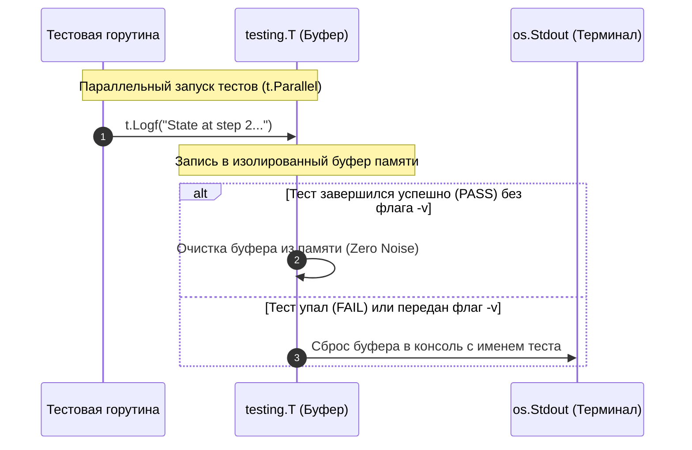
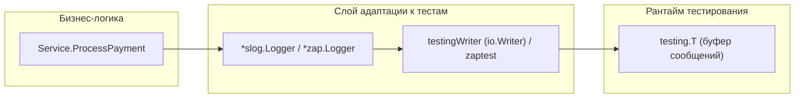

## Сигнал сквозь шум: Зачем отдельное логирование в тестах?

В предыдущей главе [[8. Debugging тестов]] мы убедились, что прямолинейный вызов `fmt.Println` в конкурентных тестах порождает трудночитаемую кашу в консоли, и сформулировали базовое правило перехода на методы `t.Log` и `t.Logf`. Однако логирование в процессе тестирования — это не просто временная подпорка при отладке. Это полноценная система наблюдаемости (Observability) вашего тестового контура.

> *«Самым эффективным инструментом отладки по-прежнему остаётся ясное мышление в сочетании с разумно расставленными вызовами печати.»*  
> — Брайан В. Керниган

Когда пайплайн CI падает в полночь на удалённом изолированном раннере, у инженера нет возможности подключить интерактивный отладчик Delve. Единственный след, который оставляет после себя упавший процесс — это текстовый журнал (Log Stream). Если тесты непрерывно «спамят» в консоль десятками тысяч служебных сообщений, извлечь полезный сигнал из океана белого шума становится невозможно.

В этой статье мы спроектируем культуру чистого логирования в Go: разберём механику буферизации `testing.T`, научимся бесшовно интегрировать production-логгеры (Uber Zap и `log/slog`) в тестовый рантайм и освоим паттерны аварийного сброса контекста (Dump on Failure).



---

## 1. Фундамент: Механика t.Log и t.Logf

Ключевое архитектурное свойство методов семейства `t.Log` — **потокобезопасная буферизация на уровне экземпляра теста**.

При прямом вызове `fmt.Println` или `os.Stdout.WriteString()` байты немедленно отправляются в файловый дескриптор 1 (`os.Stdout`). Если в рантайме одновременно работают 16 параллельных тестов, фрагменты их строк перемешаются на уровне ядра операционной системы. Разобрать, какой ответ сервера к какому запросу относится, становится физически невозможно.

Когда вы вызываете `t.Log` или `t.Logf`, рантайм `testing` перехватывает сообщение и аппендит его во внутренний байтовый срез, защищённый мьютексом и строго привязанный к конкретному экземпляру `*testing.T` (или вложенному сабтесту `t.Run`).

> [!info] Под капотом: Правила вывода буфера
> Раннер `go test` выводит накопленное содержимое буфера `t.Log` в терминал **строго в двух ситуациях**:
> 1. Тест завершился аварийно или с ошибкой (вызовы `t.Fail`, `t.Error`, `t.Fatal`, паника, либо провал ассерта `require.NoError`).
> 2. Фреймворк запущен с флагом подробного протоколирования: `go test -v`.
> 
> Если тест завершился успехом (`PASS`), а флаг `-v` не передан, накопленный буфер просто освобождается сборщиком мусора. Это инженерное решение гарантирует идеальную чистоту консоли (**Zero Noise**): пока система работает стабильно, разработчик видит лишь лаконичный зелёный прогресс.

---

## 2. Интеграция Production-логгеров

Здесь возникает классическая архитектурная дилемма: чистая бизнес-логика не должна зависеть от тестовых пакетов и ничего не знает о структуре `*testing.T`. Сервисы принимают абстракции или конкретные типы структурированных логгеров — например, `*zap.Logger` или стандартный `*slog.Logger`.

```go
// Бизнес-логика сервиса платежей:
func ProcessPayment(amount int, logger *zap.Logger) error {
	logger.Info("starting payment processing", zap.Int("amount", amount))
	// ... проведение транзакции ...
	if err != nil {
		logger.Error("payment failed", zap.Error(err))
		return err
	}
	return nil
}
```

Если передать в этот метод обычный экземпляр, созданный через `zap.NewProduction()` или `slog.Default()`, логгер начнёт писать JSON-строки напрямую в `os.Stdout` или `os.Stderr`. Вся магия буферизации `go test` испарится: при параллельном прогоне консоль вновь утонет в мусоре.



### Решение для Uber Zap: zaptest

Авторы высокопроизводительной библиотеки `go.uber.org/zap` предусмотрели эту потребность и создали пакет `zaptest`. Он создаёт специальный логгер, который перехватывает все вызовы `Info/Error` и перенаправляет их под капот прямо в `t.Log`:

```go
package payment_test

import (
	"testing"

	"go.uber.org/zap/zaptest"
	"yourproject/internal/payment"
)

func TestProcessPayment(t *testing.T) {
	// Создаем логгер, неразрывно привязанный к жизненному циклу данного теста:
	logger := zaptest.NewLogger(t)

	// Передаем его в доменную логику:
	err := payment.ProcessPayment(100, logger)

	// Если ProcessPayment упадет, мы увидим структурированные Zap-логи,
	// отформатированные и привязанные строго к данному упавшему сценарию!
	_ = err
}
```

---

### Решение для slog (Go 1.21+)

Начиная с Go 1.21, стандартным инструментом структурированного логирования стал пакет `log/slog`. Его обработчики (Handlers) принимают интерфейс `io.Writer`.

Поскольку структура `*testing.T` напрямую не реализует метод `Write([]byte) (int, error)`, нам достаточно реализовать компактный адаптер (Adapter Pattern):

```go
package testutil

import (
	"bytes"
	"log/slog"
	"testing"
)

// testingWriter адаптирует *testing.T под стандартный контракт io.Writer
type testingWriter struct {
	t *testing.T
}

func (w testingWriter) Write(p []byte) (n int, err error) {
	// bytes.TrimRight исключает дублирование символов перевода строки,
	// так как метод t.Logf автоматически форматирует завершение строки.
	w.t.Logf("%s", bytes.TrimRight(p, "\n"))
	return len(p), nil
}

// NewSlogLogger создает slog логгер для тестов
func NewSlogLogger(t *testing.T) *slog.Logger {
	t.Helper()

	writer := testingWriter{t: t}

	// Настраиваем TextHandler или JSONHandler с детализацией Debug:
	handler := slog.NewTextHandler(writer, &slog.HandlerOptions{
		Level: slog.LevelDebug, // В тестах мы хотим видеть максимальный контекст
	})

	return slog.New(handler)
}
```

Теперь в любом тесте достаточно написать `logger := testutil.NewSlogLogger(t)` и пробросить его в тестируемые структуры.

---

## 3. Что логировать при падении (Test Observability)

Типичное сообщение об ошибке начинающего разработчика выглядит так:
`Error: expected 200, got 500`.

Такая диагностика бессильна. Почему сервер вернул код 500? Какой URL был запрошен? Какие заголовки переданы? Что содержало тело ответа? 

Инженеры высокой квалификации внедряют в интеграционные тесты паттерн **Dump on Failure** (аварийный сброс контекста).

### Паттерн: HTTP Dump

При тестировании HTTP-хэндлеров и сквозных API-маршрутов с использованием `httptest.Server` сохраняйте полный дамп протокола через пакет `net/http/httputil`:

```go
func TestAPI_CreateUser(t *testing.T) {
	// ... Инициализация тестового сервера ts := httptest.NewServer(handler) ...

	req, _ := http.NewRequest(http.MethodPost, ts.URL+"/users", body)
	resp, err := http.DefaultClient.Do(req)
	require.NoError(t, err)

	// Читаем тело ответа для последующих проверок:
	respBody, _ := io.ReadAll(resp.Body)
	resp.Body.Close()

	if resp.StatusCode != http.StatusCreated {
		// ТЕСТ УПАЛ!
		// Сбрасываем весь контекст сетевого взаимодействия в буфер t.Log:
		reqDump, _ := httputil.DumpRequestOut(req, true)
		t.Logf("--- DUMP REQUEST ---\n%s\n--------------------", string(reqDump))

		t.Logf("--- DUMP RESPONSE BODY ---\n%s\n-----------------------", string(respBody))

		t.Fatalf("Expected 201 Created, got %d", resp.StatusCode)
	}
}
```

### Паттерн: State Dump (Сброс состояния БД)

Если интеграционный тест репозитория падает из-за конфликта ключей или неожиданного количества строк, сбросьте текущий снимок таблицы:

```go
	if err != nil {
		// Выполняем диагностический SELECT строго для вывода в журнал падения:
		rows, _ := db.Query("SELECT id, status FROM users")
		// ... форматируем выборку в строку dbStateString ...
		t.Logf("DB State at failure:\n%s", dbStateString)
		t.Fatal(err)
	}
```

> [!warning] Ловушка / Gotcha: Логирование секретов
> Журналы упавших тестов сохраняются в виде артефактов и логов сборки GitHub Actions, GitLab CI или TeamCity. Если интеграционный тест взаимодействует со сторонними сервисами (Stripe, банковские шлюзы, токены JWT), сырой дамп запроса рискует опубликовать секретные ключи авторизации. Перед вызовом `t.Log` всегда пропускайте дампы через маскировщик (Sanitizer), заменяющий заголовки `Authorization: Bearer ...` на `***REDACTED***`.

---

## 4. Этапы жизненного цикла теста

Сложные интеграционные тесты, длящиеся более 10–15 секунд, сложно читать в консоли, если они падают по таймауту. В таких сценариях рекомендуется структурировать лог по фазам классического шаблона **Arrange-Act-Assert**:

```go
func TestComplexIntegration(t *testing.T) {
	t.Log("[SETUP] Initializing test database...")
	db := setupDB(t)

	t.Log("[SETUP] Seeding 10,000 test users...")
	seedUsers(t, db)

	t.Log("[ACT] Running migration background worker...")
	runWorker()

	t.Log("[ASSERT] Verifying user statuses...")
	// ... проверки инвариантов ...
}
```

Если сценарий неожиданно зависнет на 30-й секунде, последний префикс `[ACT]` в журнале сразу подскажет дежурному инженеру, какая именно фоновая операция заблокировала процесс.

---

## Итог

1. **Никакого `fmt.Println` в тестах.** Используйте исключительно `t.Log` и `t.Logf` для потокобезопасного, буферизованного вывода без засорения терминала.
2. **Адаптеры логгеров:** Никогда не оставляйте production-логгеры писать напрямую в `os.Stdout` или `os.Stderr` во время тестов. Оборачивайте `go.uber.org/zap` через `zaptest.NewLogger(t)`, а `log/slog` — через кастомный адаптер `io.Writer`.
3. **Богатый контекст падений:** Логируйте дампы HTTP-запросов (`httputil.DumpRequest` / `httputil.DumpRequestOut`), тела ответов и срезы состояния БД при срабатывании ассертов.
4. **Разметка этапов:** В длинных сквозных сценариях явно маркируйте переходы между фазами Arrange, Act и Assert.

Грамотно выстроенная культура логирования тестов превращает красный статус пайплайна в CI из повода для растерянности в точную, исчерпывающую инструкцию по локализации и исправлению дефекта.